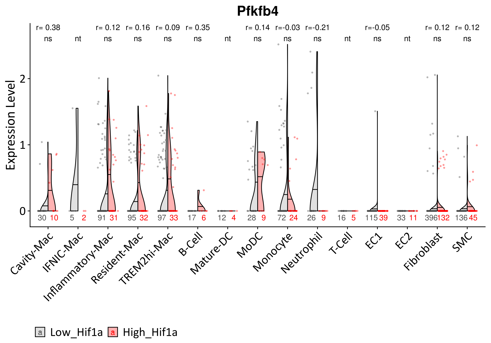

Analysis invivo PFKFB3 - plaque cells from LDLrlysMCRE mice model
================
Javier Perales-Patón - <javier.perales@bioquant.uni-heidelberg.de> -
ORCID: 0000-0003-0780-6683

## Setup

We define a random seed number for reproducibility, file structure for
the output, and load essential libraries

### Environment

``` r
# Seed number
set.seed(1234)
# Output directory
OUTDIR <- "./LDLrlysMCRE-mice/"
if(!dir.exists(OUTDIR)) dir.create(OUTDIR);

# Figures
FIGDIR <- paste0(OUTDIR, "/figures/")
knitr::opts_chunk$set(fig.path=FIGDIR)
knitr::opts_chunk$set(dev=c('png','tiff'))
knitr::opts_chunk$set(dpi=300)
# Data
DATADIR <- paste0(OUTDIR, "/data/")
if(!dir.exists(DATADIR)) dir.create(DATADIR);
```

### Load libraries

``` r
suppressPackageStartupMessages(require(Seurat))
suppressPackageStartupMessages(require(cowplot))
suppressPackageStartupMessages(require(ggplot2))
suppressPackageStartupMessages(require(purrr))
suppressPackageStartupMessages(require(dplyr))
suppressPackageStartupMessages(require(viper))
suppressPackageStartupMessages(require(rcompanion))
source("../src/graphics.R")
```

    ## Loading required package: extrafont

    ## Registering fonts with R

``` r
source("../src/seurat_fx.R")
source("../src/wilcox_fx.R")
```

## Load data

Read the Seurat Object from the in-vivo analysis. We use the same
annotation

``` r
readSeuratObject <- function(sobj) {
    # Read 
    if(file.exists(sobj)) {
        S <- readRDS(sobj)
    } else {
        stop("ERROR: Seurat object does not exist.")
    }
    return(S)
}
```

Read the SeuratObject with all plaque cells

``` r
# Input data : from prev
S <- readSeuratObject("../LDLrlysMCRE_clustering/02_identity_output/data/S.rds")
S$Annotation.Level.1 <- Idents(S)
```

Read the subset of myeloid cells which were re-cluster in another
iteration, annotated
afterwards.

``` r
M <- readSeuratObject("../LDLrlysMCRE_clustering/03_myeloidlineage_output/data/M.rds")
M$Annotation.Level.2<- Idents(M)
```

## Subsetting data

Since the latter is contained in the former, we use the same criteria
for dropping out the cells from the latter in the former: Discard Lyz2+
from whole tissue.

``` r
myeloid <- c("Megakaryocyte", "Thrombocyte", "Erythrocyte", "Mast cell",
         "Basophil", "Neutrophil", "Eosinophil", "Monocyte", "Macrophage")
grep(paste(myeloid, collapse="|"), levels(S), value=TRUE)
```

    ## [1] "Macrophage"                    "Mixed_Neutrophil-DC-Monocytes"

``` r
S <- S[, !Idents(S) %in% c("Mixed_Neutrophil-DC-Monocytes", "Macrophage", "n.a.")]
```

Finally we have two subsets of the cells: - Lyz2- cells: including
fibroblasts, SMC, EC, T-cell and B-cell

``` r
# Classes
levels(S)
```

    ## [1] "Fibroblast" "EC1"        "SMC"        "EC2"        "B-Cell"    
    ## [6] "T-Cell"

``` r
# Cell numbers
table(S$Annotation.Level.1)
```

    ## 
    ##                    Fibroblast                    Macrophage 
    ##                           808                             0 
    ##                           EC1 Mixed_Neutrophil-DC-Monocytes 
    ##                           355                             0 
    ##                           SMC                           EC2 
    ##                           255                            99 
    ##                        B-Cell                        T-Cell 
    ##                            70                            64 
    ##                          n.a. 
    ##                             0

  - Lyz2+ cells: Myeloid leukocytes.

<!-- end list -->

``` r
# Classes
levels(M)
```

    ## [1] "Cavity-Mac"       "IFNIC-Mac"        "Inflammatory-Mac"
    ## [4] "Resident-Mac"     "TREM2hi-Mac"      "Mature-DC"       
    ## [7] "MoDC"             "Monocyte"         "Neutrophil"

``` r
# Cell numbers
table(M$Annotation.Level.2)
```

    ## 
    ##       Cavity-Mac        IFNIC-Mac Inflammatory-Mac     Resident-Mac 
    ##               69               15              200              245 
    ##      TREM2hi-Mac        Mature-DC             MoDC         Monocyte 
    ##              212               21               60              160 
    ##       Neutrophil 
    ##               64

Note, doing so two clusters of cells are dropping from the analysis: - A
small cluster with double marker expression of myeloid cells called
“n.a.” (not assigned). Potentially those are doublets, but I couldn’t
identify them with regular methods because they are very poor
represented. - Myeloid proliferating cells (mixed of many cell types).

In addition, we subset the data by condition. Actually the data contains
two conditions, WT (control) mice and myeloid-PHD2cKO mice. We are
mainly interested in the control since that PHD2cKO perturbation was
profiled for other study. Thus we are reusing the control here.

``` r
WT <- merge(subset(S, stim=="WT"), subset(M, stim=="WT"))
WT$is_myeloid <- ifelse(is.na(WT$Annotation.Level.2), FALSE, TRUE)
```

``` r
# Sort them by, 1st Macrophages, then the rest, finally the odd ones
last_ids<- c("EC1", "EC2", "Fibroblast", "SMC")
ids <- c(sort(grep("-Mac", levels(WT), value=TRUE)),
     setdiff(sort(grep("-Mac", levels(WT), value=TRUE, invert=TRUE)),
         last_ids),
     last_ids)
Idents(WT) <- factor(as.character(Idents(WT)),
              levels=ids)
# We show the total number of cells
ncol(WT)
```

    ## [1] 1561

``` r
# And the sample size of each group
table(Idents(WT))
```

    ## 
    ##       Cavity-Mac        IFNIC-Mac Inflammatory-Mac     Resident-Mac 
    ##               40                7              122              127 
    ##      TREM2hi-Mac           B-Cell        Mature-DC             MoDC 
    ##              130               23               16               37 
    ##         Monocyte       Neutrophil           T-Cell              EC1 
    ##               96               35               21              154 
    ##              EC2       Fibroblast              SMC 
    ##               44              528              181

``` r
DefaultAssay(WT) <- "RNA"
plotVln(SeuratObject = WT, gene="Lyz2", meta=NULL,
    stats=NULL,
    vlnsplit = FALSE, fontTXT,  nCell.y=-0.3, pt.alpha=0.7) +
        NoLegend()
```

<!-- -->

We repeat same plot but w/o dots (observations)

``` r
DefaultAssay(WT) <- "RNA"
plotVln(SeuratObject = WT, gene="Lyz2", meta=NULL,
    stats=NULL,
    vlnsplit = FALSE, fontTXT,  nCell.y=-0.3, pt.alpha=0) +
        NoLegend()
```

<!-- -->

## UMAP

We have subset the data so we do a selection of variables, scaling etc
for umap

``` r
DefaultAssay(WT) <- "RNA"
# WT <- NormalizeData(WT, verbose=FALSE)
WT <- ScaleData(WT, verbose=FALSE)
WT <- FindVariableFeatures(WT, 
               selection.method = "vst",
               nfeatures = 2000, verbose = FALSE)
WT <- RunPCA(WT, npcs = 30, verbose = FALSE)
# ElbowPlot(M.i)
WT <- RunUMAP(WT, reduction = "pca", dims = 1:15)
```

    ## Warning: The default method for RunUMAP has changed from calling Python UMAP via reticulate to the R-native UWOT using the cosine metric
    ## To use Python UMAP via reticulate, set umap.method to 'umap-learn' and metric to 'correlation'
    ## This message will be shown once per session

    ## 11:17:48 UMAP embedding parameters a = 0.9922 b = 1.112

    ## 11:17:48 Read 1561 rows and found 15 numeric columns

    ## 11:17:48 Using Annoy for neighbor search, n_neighbors = 30

    ## 11:17:48 Building Annoy index with metric = cosine, n_trees = 50

    ## 0%   10   20   30   40   50   60   70   80   90   100%

    ## [----|----|----|----|----|----|----|----|----|----|

    ## **************************************************|
    ## 11:17:48 Writing NN index file to temp file /tmp/Rtmp8U9Z1L/file19914bb3592
    ## 11:17:48 Searching Annoy index using 1 thread, search_k = 3000
    ## 11:17:49 Annoy recall = 100%
    ## 11:17:49 Commencing smooth kNN distance calibration using 1 thread
    ## 11:17:49 Initializing from normalized Laplacian + noise
    ## 11:17:49 Commencing optimization for 500 epochs, with 58350 positive edges
    ## 11:17:52 Optimization finished

``` r
p1 <- DimPlot(WT, label=TRUE, repel = TRUE)
```

    ## Warning: Using `as.character()` on a quosure is deprecated as of rlang 0.3.0.
    ## Please use `as_label()` or `as_name()` instead.
    ## This warning is displayed once per session.

``` r
print(p1)
```

<!-- -->
\#\# Dissection of hypoxia response

### Dorothea focused on Hif1a

We calculate Hif1a transcription factor activities using dorothea.

``` r
# load regulons
df2regulon <- function(df, regulator_name="tf") {
  regulon = df %>% split(.[regulator_name]) %>% map(function(dat) {
    targets = setNames(dat$mor, dat$target)
    likelihood = dat$likelihood
    list(tfmode = targets, likelihood = likelihood)
  })
  return(regulon)
}

regulon.df <- read.table("../data/Prior/dorothea_regulon_mouse_v1.csv", sep=",", 
             header=TRUE, stringsAsFactors = FALSE)
regul <- df2regulon(df=regulon.df)

# Calculate TF activities
TF <- viper(eset = as.matrix(WT@assays$RNA@data), regulon = regul,
              nes = T, minsize = 4,
              eset.filter = F, adaptive.size = F,
          verbose=FALSE)
  
# Add them as metadata
stopifnot(colnames(WT) == colnames(TF))
WT$Hif1a_activity <- TF["Hif1a",]
rm(TF)
```

``` r
WT$Hif1a_strata <- NA
for(cell in levels(WT)) {
    idx <- WhichCells(WT, idents=cell)
    Q3 <- quantile(WT$Hif1a_activity[idx], probs=0.75)
    WT$Hif1a_strata[idx] <- ifelse(WT$Hif1a_activity[idx] > Q3,
                     "High_Hif1a", "Low_Hif1a")
}
WT$Hif1a_strata <- factor(WT$Hif1a_strata, levels=c("Low_Hif1a", "High_Hif1a"))
```

### PROGENy focused on hypoxia response

We calculate a score of hypoxia response using progeny as well.

``` r
### Progeny ####
progeny.mat <- read.table("../data/Prior/progeny_matrix_mouse_v1.txt",sep=",",header=TRUE)
rownames(progeny.mat) <- progeny.mat$X
progeny.mat <- progeny.mat[which(colnames(progeny.mat)!="X")]
progeny.mat <- as.matrix(progeny.mat)

common <- intersect(rownames(WT), rownames(progeny.mat))
  
prog <- t(as.matrix(WT@assays$RNA@data[common,])) %*% progeny.mat[common,]
rn <- rownames(prog)
prog <- apply(prog,2,scale)
rownames(prog) <- rn
prog <- t(prog)
  
stopifnot(colnames(WT) == colnames(prog))
WT$Hypoxia_response <- prog["Hypoxia",]
rm(common,prog)
```

``` r
WT$Hypoxia_scaled <- NA
for(cell in levels(WT)) {
    idx <- WhichCells(WT, idents=cell)
    WT$Hypoxia_scaled[idx] <- scale(WT$Hypoxia_response[idx])
}
```

``` r
WT$Hypoxia_strata <- NA
for(cell in levels(WT)) {
    idx <- WhichCells(WT, idents=cell)
    Q3 <- quantile(WT$Hypoxia_response[idx], probs=0.75)
    WT$Hypoxia_strata[idx] <- ifelse(WT$Hypoxia_response[idx] > Q3,
                     "High_hypoxia", "Low_hypoxia")
}
WT$Hypoxia_strata<- factor(WT$Hypoxia_strata, levels=c("Low_hypoxia", "High_hypoxia"))
```

## Results

``` r
gene <- "Pfkfb3"
genes <- paste0("Pfkfb",1:4) 
```

### Pfkfb3

``` r
p2 <- FeaturePlot(WT, features=gene, pt.size = 0.3)
print(p2)
```

<!-- -->

``` r
plot_grid(p1,p2, rel_widths = c(0.55,0.45))
```

<!-- -->

``` r
DotPlot(WT, features=gene) + 
    xlab("") + ylab("Cell type")
```

<!-- -->

``` r
# VlnPlot(WT, features=gene, pt.size=0.7) + NoLegend()
plotVln(SeuratObject = WT, gene="Pfkfb3", meta=NULL,
    stats=NULL,
    vlnsplit = FALSE, fontTXT,  nCell.y=-0.1, pt.alpha=0.8) +
        NoLegend()
```

<!-- -->

### Pfkfb isoforms

``` r
p2 <- FeaturePlot(WT, features=genes, pt.size = 0.3)
print(p2)
```

<!-- -->

``` r
plot_grid(p1,p2, rel_widths = c(0.53,0.47))
```

<!-- -->

``` r
DotPlot(WT, features=genes) + 
    xlab("Pfkfb isoforms") + ylab("Cell type")
```

<!-- -->

``` r
# VlnPlot(WT, features=genes, ncol=length(genes)/2, pt.size=0.7)
plot_grid(plotlist=sapply(genes,function(z) {
        plotVln(SeuratObject = WT, gene=z, meta=NULL,
          stats=NULL,
          vlnsplit = FALSE, fontTXT,  nCell.y=-0.1, pt.alpha=0.8) +
              theme(axis.text.x=element_text(size=16)) + 
              NoLegend()
         }, simplify=FALSE), ncol = length(genes)/2)
```

<!-- -->

### Pfkfb3 High Hypoxia/Hif1a

#### Hypoxia

``` r
WT$stim <- WT$Hypoxia_strata
wPfkfb3_stats <- t(sapply(levels(WT), function(cell) {
                   cellIds <- WhichCells(WT, idents=cell)
                   # The test
                   wilcox.test_stats(xy=WT@assays$RNA@data["Pfkfb3", cellIds],
                             gr=WT$stim[cellIds])
               }))
```

    ## Warning in wilcox.test.default(x = c(AAGGCAGGTTGCCTCT_1 = 0,
    ## ACTGAGTGTTGCGTTA_1 = 0.708283489176488, : cannot compute exact p-value with
    ## ties

    ## [WARN] : Not enough sample size for wilcox test

    ## Warning in wilcox.test.default(x = c(AAACCTGCAGGGCATA_1 = 0,
    ## AAAGATGCAGAGCCAA_1 = 0, : cannot compute exact p-value with ties

    ## [WARN] : Not enough sample size for wilcox test

    ## Warning in wilcox.test.default(x = c(AAGTCTGTCGGAAATA_1 = 0,
    ## ACCTTTACAAACGCGA_1 = 0, : cannot compute exact p-value with ties

    ## Warning in wilcox.test.default(x = c(AAACCTGTCTACCAGA_1 = 0,
    ## AACGTTGCAAACAACA_1 = 1.41872547216899, : cannot compute exact p-value with
    ## ties

    ## Warning in wilcox.test.default(x = c(ACATACGGTCGAGTTT_1 = 0,
    ## ACCCACTTCCTCATTA_1 = 0, : cannot compute exact p-value with ties

    ## Warning in wilcox.test.default(x = c(AAACCTGGTAACGTTC_1 = 0,
    ## AAAGCAAGTGTGGTTT_1 = 0, : cannot compute exact p-value with ties

``` r
wPfkfb3_stats <- as.data.frame(wPfkfb3_stats)
wPfkfb3_stats$adjpval <- p.adjust(wPfkfb3_stats$pvalue, method="fdr")
wPfkfb3_stats$significance <- tagSignif(wPfkfb3_stats$adjpval)
print(wPfkfb3_stats)
```

    ##                        W     pvalue       r   adjpval significance
    ## Cavity-Mac         120.5 0.14486625  0.2340 0.2690373           ns
    ## IFNIC-Mac             NA         NA      NA        NA           nt
    ## Inflammatory-Mac  1442.0 0.62659966 -0.0447 0.7405269           ns
    ## Resident-Mac      1588.0 0.46012322 -0.0660 0.6646224           ns
    ## TREM2hi-Mac       1589.0 0.90296923  0.0111 0.9029692           ns
    ## B-Cell              42.5 0.11314001  0.3500 0.2451367           ns
    ## Mature-DC             NA         NA      NA        NA           nt
    ## MoDC               137.0 0.56255527 -0.0998 0.7313218           ns
    ## Monocyte           820.5 0.44783043  0.0784 0.6646224           ns
    ## Neutrophil         114.0 0.84594914  0.0394 0.9029692           ns
    ## T-Cell              32.0 0.09353251  0.3910 0.2451367           ns
    ## EC1               2055.5 0.02081647  0.1870 0.2014235           ns
    ## EC2                155.0 0.10684411  0.2470 0.2451367           ns
    ## Fibroblast       24518.0 0.03098824  0.0940 0.2014235           ns
    ## SMC               2790.0 0.07241308  0.1340 0.2451367           ns

``` r
RES <- wPfkfb3_stats[, c("r", "significance")]
RES$r <- format(round(RES$r, 2), nsmall=2)
colnames(RES)[ncol(RES)] <- ""
```

``` r
plotVln(SeuratObject = WT, gene="Pfkfb3", meta=NULL,
    stats=RES,
    vlnsplit = TRUE, fontTXT,  nCell.y=-0.1, pt.alpha=0.4) +
      guides(fill= guide_legend(nrow=1, byrow=TRUE)) 
```

<!-- -->

#### Hif1a

``` r
WT$stim <- WT$Hif1a_strata
wPfkfb3_stats <- t(sapply(levels(WT), function(cell) {
                   cellIds <- WhichCells(WT, idents=cell)
                   # The test
                   wilcox.test_stats(xy=WT@assays$RNA@data["Pfkfb3", cellIds],
                             gr=WT$stim[cellIds])
               }))
```

    ## Warning in wilcox.test.default(x = c(AAGGCAGGTCGCGTGT_1 = 0,
    ## ACTTGTTTCTTGTTTG_1 = 0, : cannot compute exact p-value with ties

    ## [WARN] : Not enough sample size for wilcox test

    ## Warning in wilcox.test.default(x = c(AAACCTGCAGGGCATA_1 = 0,
    ## AAAGATGCAGAGCCAA_1 = 0, : cannot compute exact p-value with ties

    ## [WARN] : Not enough sample size for wilcox test

    ## Warning in wilcox.test.default(x = c(ACACCAACAGACAGGT_1 = 0,
    ## ACGCCAGTCCCAAGTA_1 = 0, : cannot compute exact p-value with ties

    ## Warning in wilcox.test.default(x = c(AAACCTGTCTACCAGA_1 = 0,
    ## ACTTACTTCATGTGGT_1 = 0, : cannot compute exact p-value with ties

    ## Warning in wilcox.test.default(x = c(ACATACGGTCGAGTTT_1 = 0,
    ## ACTGTCCTCTCGTATT_1 = 0, : cannot compute exact p-value with ties

    ## Warning in wilcox.test.default(x = c(AAACCTGGTAACGTTC_1 = 0,
    ## AAAGCAAGTGTGGTTT_1 = 0, : cannot compute exact p-value with ties

``` r
wPfkfb3_stats <- as.data.frame(wPfkfb3_stats)
wPfkfb3_stats$adjpval <- p.adjust(wPfkfb3_stats$pvalue, method="fdr")
wPfkfb3_stats$significance <- tagSignif(wPfkfb3_stats$adjpval)
print(wPfkfb3_stats)
```

    ##                        W      pvalue        r    adjpval significance
    ## Cavity-Mac         121.5 0.159239443  0.22600 0.34501879           ns
    ## IFNIC-Mac             NA          NA       NA         NA           nt
    ## Inflammatory-Mac  1385.5 0.700603094  0.03550 0.82798547           ns
    ## Resident-Mac      1515.0 0.960725699  0.00485 0.96072570           ns
    ## TREM2hi-Mac       1530.0 0.437867387  0.06850 0.71153450           ns
    ## B-Cell              42.5 0.113140008  0.35000 0.34501879           ns
    ## Mature-DC             NA          NA       NA         NA           nt
    ## MoDC               117.0 0.639244793  0.08150 0.82798547           ns
    ## Monocyte           818.5 0.426996920  0.08200 0.71153450           ns
    ## Neutrophil          96.5 0.120108902  0.26900 0.34501879           ns
    ## T-Cell              42.5 0.654720846 -0.12200 0.82798547           ns
    ## EC1               2359.5 0.148799200 -0.11700 0.34501879           ns
    ## EC2                177.0 0.804069927  0.04210 0.87107575           ns
    ## Fibroblast       23771.0 0.001613358  0.13700 0.02097365            *
    ## SMC               2629.0 0.004107921  0.21300 0.02670148            *

``` r
RES <- wPfkfb3_stats[, c("r", "significance")]
RES$r <- format(round(RES$r, 2), nsmall=2)
colnames(RES)[ncol(RES)] <- ""
```

``` r
plotVln(SeuratObject = WT, gene="Pfkfb3", meta=NULL,
    stats=RES,
    vlnsplit = TRUE, fontTXT,  nCell.y=-0.1, pt.alpha=0.4) +
      guides(fill= guide_legend(nrow=1, byrow=TRUE))
```

<!-- -->

### Pfkfb4 High Hypoxia/Hif1a

#### Hypoxia

``` r
WT$stim <- WT$Hypoxia_strata
wPfkfb4_stats <- t(sapply(levels(WT), function(cell) {
                   cellIds <- WhichCells(WT, idents=cell)
                   # The test
                   wilcox.test_stats(xy=WT@assays$RNA@data["Pfkfb4", cellIds],
                             gr=WT$stim[cellIds])
               }))
```

    ## Warning in wilcox.test.default(x = c(AAGGCAGGTTGCCTCT_1 = 0,
    ## ACTGAGTGTTGCGTTA_1 = 0, : cannot compute exact p-value with ties

    ## [WARN] : Not enough sample size for wilcox test

    ## Warning in wilcox.test.default(x = c(AAACCTGCAGGGCATA_1 = 0,
    ## AAAGATGCAGAGCCAA_1 = 0, : cannot compute exact p-value with ties

    ## [WARN] : Not enough sample size for wilcox test

    ## Warning in wilcox.test.default(x = c(AAGTCTGTCGGAAATA_1 = 0,
    ## ACCTTTACAAACGCGA_1 = 0.706093994767943, : cannot compute exact p-value with
    ## ties

    ## Warning in wilcox.test.default(x = c(AAACCTGTCTACCAGA_1 =
    ## 2.40841590775559, : cannot compute exact p-value with ties

    ## Warning in wilcox.test.default(x = c(ACATACGGTCGAGTTT_1 = 0,
    ## ACCCACTTCCTCATTA_1 = 0, : cannot compute exact p-value with ties

    ## Warning in wilcox.test.default(x = c(AAACCTGGTAACGTTC_1 = 0,
    ## AAAGCAAGTGTGGTTT_1 = 0, : cannot compute exact p-value with ties

``` r
wPfkfb4_stats <- as.data.frame(wPfkfb4_stats)
wPfkfb4_stats$adjpval <- p.adjust(wPfkfb4_stats$pvalue, method="fdr")
wPfkfb4_stats$significance <- tagSignif(wPfkfb4_stats$adjpval)
print(wPfkfb4_stats)
```

    ##                        W     pvalue        r   adjpval significance
    ## Cavity-Mac         104.0 0.02217217  0.36500 0.2438939           ns
    ## IFNIC-Mac             NA         NA       NA        NA           nt
    ## Inflammatory-Mac  1238.0 0.21373759  0.11300 0.4314134           ns
    ## Resident-Mac      1377.0 0.28177438  0.09580 0.4427883           ns
    ## TREM2hi-Mac       1413.0 0.23531639  0.10400 0.4314134           ns
    ## B-Cell              54.0 0.62054805 -0.12400 0.6826029           ns
    ## Mature-DC             NA         NA       NA        NA           nt
    ## MoDC               101.0 0.33743005  0.16100 0.4639663           ns
    ## Monocyte           731.0 0.11424508  0.16200 0.4188986           ns
    ## Neutrophil         135.0 0.23195540 -0.20800 0.4314134           ns
    ## T-Cell              40.0        NaN      NaN       NaN           nt
    ## EC1               2262.0 0.57043088 -0.04690 0.6826029           ns
    ## EC2                181.5        NaN      NaN       NaN           nt
    ## Fibroblast       26080.0 0.90978627  0.00496 0.9097863           ns
    ## SMC               2883.0 0.10378956  0.12100 0.4188986           ns

``` r
RES <- wPfkfb4_stats[, c("r", "significance")]
RES$r <- format(round(RES$r, 2), nsmall=2)
colnames(RES)[ncol(RES)] <- ""
```

``` r
plotVln(SeuratObject = WT, gene="Pfkfb4", meta=NULL,
    stats=RES,
    vlnsplit = TRUE, fontTXT,  nCell.y=-0.1, pt.alpha=0.4) +
      guides(fill= guide_legend(nrow=1, byrow=TRUE)) 
```

<!-- -->

#### Hif1a

``` r
WT$stim <- WT$Hif1a_strata
wPfkfb4_stats <- t(sapply(levels(WT), function(cell) {
                   cellIds <- WhichCells(WT, idents=cell)
                   # The test
                   wilcox.test_stats(xy=WT@assays$RNA@data["Pfkfb4", cellIds],
                             gr=WT$stim[cellIds])
               }))
```

    ## Warning in wilcox.test.default(x = c(AAGGCAGGTCGCGTGT_1 = 0,
    ## ACTTGTTTCTTGTTTG_1 = 0, : cannot compute exact p-value with ties

    ## [WARN] : Not enough sample size for wilcox test

    ## Warning in wilcox.test.default(x = c(AAACCTGCAGGGCATA_1 = 0,
    ## AAAGATGCAGAGCCAA_1 = 0, : cannot compute exact p-value with ties

    ## [WARN] : Not enough sample size for wilcox test

    ## Warning in wilcox.test.default(x = c(ACACCAACAGACAGGT_1 =
    ## 1.35141006662396, : cannot compute exact p-value with ties

    ## Warning in wilcox.test.default(x = c(AAACCTGTCTACCAGA_1 =
    ## 2.40841590775559, : cannot compute exact p-value with ties

    ## Warning in wilcox.test.default(x = c(ACATACGGTCGAGTTT_1 = 0,
    ## ACTGTCCTCTCGTATT_1 = 0, : cannot compute exact p-value with ties

    ## Warning in wilcox.test.default(x = c(AAACCTGGTAACGTTC_1 = 0,
    ## AAAGCAAGTGTGGTTT_1 = 0, : cannot compute exact p-value with ties

``` r
wPfkfb4_stats <- as.data.frame(wPfkfb4_stats)
wPfkfb4_stats$adjpval <- p.adjust(wPfkfb4_stats$pvalue, method="fdr")
wPfkfb4_stats$significance <- tagSignif(wPfkfb4_stats$adjpval)
print(wPfkfb4_stats)
```

    ##                        W      pvalue       r    adjpval significance
    ## Cavity-Mac         102.0 0.016942614  0.3810 0.09318437           ns
    ## IFNIC-Mac             NA          NA      NA         NA           nt
    ## Inflammatory-Mac  1223.0 0.176443941  0.1230 0.32348056           ns
    ## Resident-Mac      1286.5 0.078422490  0.1560 0.24890802           ns
    ## TREM2hi-Mac       1447.5 0.333132016  0.0852 0.45805652           ns
    ## B-Cell              42.5 0.113140008  0.3500 0.24890802           ns
    ## Mature-DC             NA          NA      NA         NA           nt
    ## MoDC               105.0 0.422181479  0.1350 0.51599959           ns
    ## Monocyte           890.5 0.756622275 -0.0323 0.75662227           ns
    ## Neutrophil         135.0 0.231955401 -0.2080 0.36450134           ns
    ## T-Cell              40.0         NaN     NaN        NaN           nt
    ## EC1               2262.0 0.570430876 -0.0469 0.62747396           ns
    ## EC2                181.5         NaN     NaN        NaN           nt
    ## Fibroblast       24768.0 0.005240414  0.1210 0.05764455           ns
    ## SMC               2882.0 0.101845919  0.1220 0.24890802           ns

``` r
RES <- wPfkfb4_stats[, c("r", "significance")]
RES$r <- format(round(RES$r, 2), nsmall=2)
colnames(RES)[ncol(RES)] <- ""
```

``` r
plotVln(SeuratObject = WT, gene="Pfkfb4", meta=NULL,
    stats=RES,
    vlnsplit = TRUE, fontTXT,  nCell.y=-0.1, pt.alpha=0.4) +
      guides(fill= guide_legend(nrow=1, byrow=TRUE)) 
```

<!-- -->

## Conclusion

> PFKFB1/2 is not expressed in plaque cells. PFKFB3 is expressed mainly
> by Mature-DC in atherosclerotic plaques. PFKFB4 is expressed mainly by
> Inflammatory and trem2-foamy Macrophages and MoDC. However no
> differences in PFKFB3/4 expression are observed between cells
> undergoing high vs low hypoxia response (stratified by the 3rd
> quartile of hypoxia response), IFNIC-Mac and Mature-DC not tested
> because low number of cells).

## Save the Seurat Object

``` r
saveRDS(WT, paste0(DATADIR,"/M.rds"));
```

## SessionInfo

``` r
sessionInfo()
```

    ## R version 3.6.1 (2019-07-05)
    ## Platform: x86_64-pc-linux-gnu (64-bit)
    ## Running under: Ubuntu 18.04.3 LTS
    ## 
    ## Matrix products: default
    ## BLAS:   /usr/lib/x86_64-linux-gnu/blas/libblas.so.3.7.1
    ## LAPACK: /usr/lib/x86_64-linux-gnu/lapack/liblapack.so.3.7.1
    ## 
    ## locale:
    ##  [1] LC_CTYPE=en_US.UTF-8       LC_NUMERIC=C              
    ##  [3] LC_TIME=en_GB.UTF-8        LC_COLLATE=en_US.UTF-8    
    ##  [5] LC_MONETARY=en_GB.UTF-8    LC_MESSAGES=en_US.UTF-8   
    ##  [7] LC_PAPER=en_GB.UTF-8       LC_NAME=C                 
    ##  [9] LC_ADDRESS=C               LC_TELEPHONE=C            
    ## [11] LC_MEASUREMENT=en_GB.UTF-8 LC_IDENTIFICATION=C       
    ## 
    ## attached base packages:
    ## [1] parallel  stats     graphics  grDevices utils     datasets  methods  
    ## [8] base     
    ## 
    ## other attached packages:
    ##  [1] extrafont_0.17      rcompanion_2.3.26   viper_1.18.1       
    ##  [4] Biobase_2.44.0      BiocGenerics_0.30.0 dplyr_0.8.3        
    ##  [7] purrr_0.3.2         ggplot2_3.3.3       cowplot_1.0.0      
    ## [10] Seurat_3.1.0        rmarkdown_1.15      nvimcom_0.9-82     
    ## 
    ## loaded via a namespace (and not attached):
    ##   [1] TH.data_1.0-10      Rtsne_0.15          colorspace_1.4-1   
    ##   [4] modeltools_0.2-23   class_7.3-15        ggridges_0.5.1     
    ##   [7] gld_2.6.2           rstudioapi_0.10     leiden_0.3.1       
    ##  [10] listenv_0.7.0       npsurv_0.4-0        ggrepel_0.8.1      
    ##  [13] RSpectra_0.15-0     mvtnorm_1.0-11      coin_1.3-1         
    ##  [16] codetools_0.2-16    splines_3.6.1       R.methodsS3_1.7.1  
    ##  [19] rootSolve_1.8.2.1   lsei_1.2-0          libcoin_1.0-6      
    ##  [22] knitr_1.24          zeallot_0.1.0       jsonlite_1.6       
    ##  [25] Rttf2pt1_1.3.8      ica_1.0-2           cluster_2.1.0      
    ##  [28] png_0.1-7           R.oo_1.22.0         uwot_0.1.4         
    ##  [31] sctransform_0.2.0   compiler_3.6.1      httr_1.4.1         
    ##  [34] backports_1.1.4     assertthat_0.2.1    Matrix_1.2-17      
    ##  [37] lazyeval_0.2.2      htmltools_0.3.6     tools_3.6.1        
    ##  [40] rsvd_1.0.2          igraph_1.2.4.1      gtable_0.3.0       
    ##  [43] glue_1.3.1          lmom_2.8            RANN_2.6.1         
    ##  [46] reshape2_1.4.3      Rcpp_1.0.2          vctrs_0.2.0        
    ##  [49] gdata_2.18.0        ape_5.3             nlme_3.1-141       
    ##  [52] extrafontdb_1.0     gbRd_0.4-11         lmtest_0.9-37      
    ##  [55] xfun_0.9            stringr_1.4.0       globals_0.12.4     
    ##  [58] lifecycle_0.1.0     irlba_2.3.3         gtools_3.8.1       
    ##  [61] future_1.14.0       MASS_7.3-51.4       zoo_1.8-6          
    ##  [64] scales_1.0.0        sandwich_2.5-1      expm_0.999-4       
    ##  [67] RColorBrewer_1.1-2  yaml_2.2.0          Exact_2.1          
    ##  [70] reticulate_1.13     pbapply_1.4-2       gridExtra_2.3      
    ##  [73] EMT_1.1             segmented_1.0-0     stringi_1.4.3      
    ##  [76] nortest_1.0-4       e1071_1.7-2         caTools_1.17.1.2   
    ##  [79] boot_1.3-23         bibtex_0.4.2        matrixStats_0.55.0 
    ##  [82] Rdpack_0.11-0       SDMTools_1.1-221.1  rlang_0.4.0        
    ##  [85] pkgconfig_2.0.3     bitops_1.0-6        evaluate_0.14      
    ##  [88] lattice_0.20-38     ROCR_1.0-7          labeling_0.3       
    ##  [91] htmlwidgets_1.3     tidyselect_0.2.5    RcppAnnoy_0.0.13   
    ##  [94] plyr_1.8.4          magrittr_1.5        R6_2.4.0           
    ##  [97] multcompView_0.1-8  gplots_3.0.1.1      DescTools_0.99.39  
    ## [100] multcomp_1.4-12     pillar_1.4.2        withr_2.1.2        
    ## [103] fitdistrplus_1.0-14 mixtools_1.1.0      survival_2.44-1.1  
    ## [106] tibble_2.1.3        future.apply_1.3.0  tsne_0.1-3         
    ## [109] crayon_1.3.4        KernSmooth_2.23-16  plotly_4.9.0       
    ## [112] grid_3.6.1          data.table_1.12.8   metap_1.1          
    ## [115] digest_0.6.21       tidyr_1.0.0         R.utils_2.9.0      
    ## [118] stats4_3.6.1        RcppParallel_4.4.3  munsell_0.5.0      
    ## [121] viridisLite_0.3.0

``` r
{                                                                                                                                                                                                           
sink(file=paste0(OUTDIR,"/sessionInfo.txt"))
print(sessionInfo())
sink()
}
```
