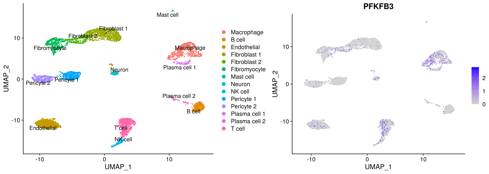

Analysis invivo PFKFB3 - human plaque cells from Wirka et al 2019
================
Javier Perales-Patón - <javier.perales@bioquant.uni-heidelberg.de> -
ORCID: 0000-0003-0780-6683

## Setup

We define a random seed number for reproducibility, file structure for
the output, and load essential libraries

### Environment

``` r
# Seed number
set.seed(1234)
# Output directory
OUTDIR <- "./Wirka2019/"
if(!dir.exists(OUTDIR)) dir.create(OUTDIR);

# Figures
FIGDIR <- paste0(OUTDIR, "/figures/")
knitr::opts_chunk$set(fig.path=FIGDIR)
knitr::opts_chunk$set(dev=c('png','tiff'))
knitr::opts_chunk$set(dpi=300)
# Data
DATADIR <- paste0(OUTDIR, "/data/")
if(!dir.exists(DATADIR)) dir.create(DATADIR);
```

### Load libraries

``` r
suppressPackageStartupMessages(require(Seurat))
suppressPackageStartupMessages(require(cowplot))
suppressPackageStartupMessages(require(ggplot2))
suppressPackageStartupMessages(require(purrr))
suppressPackageStartupMessages(require(dplyr))
suppressPackageStartupMessages(require(viper))
suppressPackageStartupMessages(require(rcompanion))
source("../src/graphics.R")
```

    ## Loading required package: extrafont

    ## Registering fonts with R

``` r
source("../src/seurat_fx.R")
source("../src/wilcox_fx.R")
```

We start with the processed data downloaded from GEO and the metadata
information.

``` r
cnt_file <- gzfile("../data/Wirka_etal/GSE131778_human_coronary_scRNAseq_wirka_et_al_GEO.txt.gz", "rt")
mat <- read.table(cnt_file, sep="\t", header=TRUE, stringsAsFactors = FALSE)
meta <- read.table("../data/Wirka_etal/Wirka_metadata.csv", sep=",", header=TRUE, stringsAsFactors = FALSE)

stopifnot(all(meta$X %in% colnames(mat)))

#NOTE: Standarization : add PFKFB1
if("PFKFB1" %in% rownames(mat)) {
    warning("WARN : Virtually added 'PFKFB1' gene as zero expression\n")
    mat <- rbind(mat, "PFKFB1"=rep(0, ncol(mat)))
}

## Reformat
rownames(meta) <- meta$X
meta <- meta[,colnames(meta)!="X"]
# Add sample
meta$orig <- sapply(rownames(meta), function(z) strsplit(z,split="\\.")[[1]][2])
```

``` r
S <- CreateSeuratObject(counts=as.matrix(mat), project="Wirka_Human_8n",
            assay = "RNA", min.cells =3, min.features = 500,
            meta.data=meta)
Idents(S) <- S@meta.data$ident
table(Idents(S))
```

    ## 
    ## Plasma cell 1 Plasma cell 2           SMC            22    Pericyte 2 
    ##           139           127           532            23           535 
    ##        T cell  Fibromyocyte            18  Fibroblast 1            14 
    ##           925           678           195          1275           187 
    ##    Macrophage    Pericyte 1       NK cell  Fibroblast 2        B cell 
    ##           900           642           217           359           484 
    ##            21   Endothelial            11        Neuron            12 
    ##           187          1230           188           215           229 
    ##            10     Mast cell 
    ##           326            45

``` r
rm(mat, meta)
```

## Normalize data

``` r
S <- NormalizeData(S)
S <- ScaleData(S)
```

    ## Centering and scaling data matrix

Standarization as our own data

``` r
# Remove odd clusters named as numbers
S <- S[, grepl("[a-z]",Idents(S))]
S$Annotation.Level.2 <- Idents(S)
# All are WT
WT <- S
# Myeloids
myeloid <- c("Megakaryocyte", "Thrombocyte", "Erythrocyte", "Mast cell",
         "Basophil", "Neutrophil", "Eosinophil", "Monocyte", "Macrophage")
myeloid_IN <- grep(paste(myeloid, collapse="|"), levels(WT), value=TRUE)

WT$is_myeloid <- sapply(Idents(WT), function(z) ifelse(z%in%myeloid_IN, TRUE, FALSE))
WT$stim <- "WT"
rm(S)
```

``` r
# Sort them by, 1st Macrophages, then the rest, finally the odd ones
ids <- c(sort(grep("-?Mac", levels(WT), value=TRUE)),
     sort(grep("-?Mac", levels(WT), value=TRUE, invert=TRUE)))
Idents(WT) <- factor(as.character(Idents(WT)),
              levels=ids)
# We show the total number of cells
ncol(WT)
```

    ## [1] 7771

``` r
# And the sample size of each group
table(Idents(WT))
```

    ## 
    ##    Macrophage        B cell   Endothelial  Fibroblast 1  Fibroblast 2 
    ##           900           484          1230          1275           359 
    ##  Fibromyocyte     Mast cell        Neuron       NK cell    Pericyte 1 
    ##           678            45           215           217           642 
    ##    Pericyte 2 Plasma cell 1 Plasma cell 2        T cell 
    ##           535           139           127           925

## UMAP

We have subset the data so we do a selection of variables, scaling etc
for umap

``` r
DefaultAssay(WT) <- "RNA"
# WT <- NormalizeData(WT, verbose=FALSE)
WT <- ScaleData(WT, verbose=FALSE)
WT <- FindVariableFeatures(WT, 
               selection.method = "vst",
               nfeatures = 2000, verbose = FALSE)
WT <- RunPCA(WT, npcs = 30, verbose = FALSE)
# ElbowPlot(M.i)
WT <- RunUMAP(WT, reduction = "pca", dims = 1:15)
```

    ## Warning: The default method for RunUMAP has changed from calling Python UMAP via reticulate to the R-native UWOT using the cosine metric
    ## To use Python UMAP via reticulate, set umap.method to 'umap-learn' and metric to 'correlation'
    ## This message will be shown once per session

    ## 08:58:03 UMAP embedding parameters a = 0.9922 b = 1.112

    ## 08:58:03 Read 7771 rows and found 15 numeric columns

    ## 08:58:03 Using Annoy for neighbor search, n_neighbors = 30

    ## 08:58:03 Building Annoy index with metric = cosine, n_trees = 50

    ## 0%   10   20   30   40   50   60   70   80   90   100%

    ## [----|----|----|----|----|----|----|----|----|----|

    ## **************************************************|
    ## 08:58:04 Writing NN index file to temp file /tmp/RtmpsSPp3U/file4ff17ef99635
    ## 08:58:04 Searching Annoy index using 1 thread, search_k = 3000
    ## 08:58:06 Annoy recall = 100%
    ## 08:58:06 Commencing smooth kNN distance calibration using 1 thread
    ## 08:58:07 Initializing from normalized Laplacian + noise
    ## 08:58:08 Commencing optimization for 500 epochs, with 323924 positive edges
    ## 08:58:24 Optimization finished

``` r
p1 <- DimPlot(WT, label=TRUE, repel = TRUE)
```

    ## Warning: Using `as.character()` on a quosure is deprecated as of rlang 0.3.0.
    ## Please use `as_label()` or `as_name()` instead.
    ## This warning is displayed once per session.

``` r
print(p1)
```

<!-- -->

## Dissection of hypoxia response

### Dorothea focused on HIF1A

We calculate HIF1A transcription factor activities using dorothea.

``` r
df2regulon <- function(df, regulator_name="tf") {
  regulon = df %>% split(.[regulator_name]) %>% map(function(dat) {
    targets = setNames(dat$mor, dat$target)
    likelihood = dat$likelihood
    list(tfmode = targets, likelihood = likelihood)
  })
  return(regulon)
}

regulon.df <- read.table("../data/Prior/dorothea_regulon_human_v1.txt", sep=",", header=TRUE, stringsAsFactors = FALSE)
regul <- df2regulon(df=regulon.df)

# Calculate TF activities
TF <- viper(eset = as.matrix(WT@assays$RNA@data), regulon = regul,
              nes = T, method = "none", minsize = 4,
              eset.filter = F, adaptive.size = F)
```

    ## 
    ## Computing the association scores

    ## Computing regulons enrichment with aREA

    ## 
      |                                                                       
      |                                                                 |   0%
      |                                                                       
      |                                                                 |   1%
      |                                                                       
      |=                                                                |   1%
      |                                                                       
      |=                                                                |   2%
      |                                                                       
      |==                                                               |   2%
      |                                                                       
      |==                                                               |   3%
      |                                                                       
      |==                                                               |   4%
      |                                                                       
      |===                                                              |   4%
      |                                                                       
      |===                                                              |   5%
      |                                                                       
      |====                                                             |   5%
      |                                                                       
      |====                                                             |   6%
      |                                                                       
      |====                                                             |   7%
      |                                                                       
      |=====                                                            |   7%
      |                                                                       
      |=====                                                            |   8%
      |                                                                       
      |======                                                           |   9%
      |                                                                       
      |======                                                           |  10%
      |                                                                       
      |=======                                                          |  10%
      |                                                                       
      |=======                                                          |  11%
      |                                                                       
      |========                                                         |  12%
      |                                                                       
      |========                                                         |  13%
      |                                                                       
      |=========                                                        |  13%
      |                                                                       
      |=========                                                        |  14%
      |                                                                       
      |=========                                                        |  15%
      |                                                                       
      |==========                                                       |  15%
      |                                                                       
      |==========                                                       |  16%
      |                                                                       
      |===========                                                      |  16%
      |                                                                       
      |===========                                                      |  17%
      |                                                                       
      |===========                                                      |  18%
      |                                                                       
      |============                                                     |  18%
      |                                                                       
      |============                                                     |  19%
      |                                                                       
      |=============                                                    |  19%
      |                                                                       
      |=============                                                    |  20%
      |                                                                       
      |=============                                                    |  21%
      |                                                                       
      |==============                                                   |  21%
      |                                                                       
      |==============                                                   |  22%
      |                                                                       
      |===============                                                  |  22%
      |                                                                       
      |===============                                                  |  23%
      |                                                                       
      |===============                                                  |  24%
      |                                                                       
      |================                                                 |  24%
      |                                                                       
      |================                                                 |  25%
      |                                                                       
      |=================                                                |  25%
      |                                                                       
      |=================                                                |  26%
      |                                                                       
      |=================                                                |  27%
      |                                                                       
      |==================                                               |  27%
      |                                                                       
      |==================                                               |  28%
      |                                                                       
      |===================                                              |  29%
      |                                                                       
      |===================                                              |  30%
      |                                                                       
      |====================                                             |  30%
      |                                                                       
      |====================                                             |  31%
      |                                                                       
      |=====================                                            |  32%
      |                                                                       
      |=====================                                            |  33%
      |                                                                       
      |======================                                           |  33%
      |                                                                       
      |======================                                           |  34%
      |                                                                       
      |======================                                           |  35%
      |                                                                       
      |=======================                                          |  35%
      |                                                                       
      |=======================                                          |  36%
      |                                                                       
      |========================                                         |  36%
      |                                                                       
      |========================                                         |  37%
      |                                                                       
      |========================                                         |  38%
      |                                                                       
      |=========================                                        |  38%
      |                                                                       
      |=========================                                        |  39%
      |                                                                       
      |==========================                                       |  39%
      |                                                                       
      |==========================                                       |  40%
      |                                                                       
      |==========================                                       |  41%
      |                                                                       
      |===========================                                      |  41%
      |                                                                       
      |===========================                                      |  42%
      |                                                                       
      |============================                                     |  42%
      |                                                                       
      |============================                                     |  43%
      |                                                                       
      |============================                                     |  44%
      |                                                                       
      |=============================                                    |  44%
      |                                                                       
      |=============================                                    |  45%
      |                                                                       
      |==============================                                   |  45%
      |                                                                       
      |==============================                                   |  46%
      |                                                                       
      |==============================                                   |  47%
      |                                                                       
      |===============================                                  |  47%
      |                                                                       
      |===============================                                  |  48%
      |                                                                       
      |================================                                 |  49%
      |                                                                       
      |================================                                 |  50%
      |                                                                       
      |=================================                                |  50%
      |                                                                       
      |=================================                                |  51%
      |                                                                       
      |==================================                               |  52%
      |                                                                       
      |==================================                               |  53%
      |                                                                       
      |===================================                              |  53%
      |                                                                       
      |===================================                              |  54%
      |                                                                       
      |===================================                              |  55%
      |                                                                       
      |====================================                             |  55%
      |                                                                       
      |====================================                             |  56%
      |                                                                       
      |=====================================                            |  56%
      |                                                                       
      |=====================================                            |  57%
      |                                                                       
      |=====================================                            |  58%
      |                                                                       
      |======================================                           |  58%
      |                                                                       
      |======================================                           |  59%
      |                                                                       
      |=======================================                          |  59%
      |                                                                       
      |=======================================                          |  60%
      |                                                                       
      |=======================================                          |  61%
      |                                                                       
      |========================================                         |  61%
      |                                                                       
      |========================================                         |  62%
      |                                                                       
      |=========================================                        |  62%
      |                                                                       
      |=========================================                        |  63%
      |                                                                       
      |=========================================                        |  64%
      |                                                                       
      |==========================================                       |  64%
      |                                                                       
      |==========================================                       |  65%
      |                                                                       
      |===========================================                      |  65%
      |                                                                       
      |===========================================                      |  66%
      |                                                                       
      |===========================================                      |  67%
      |                                                                       
      |============================================                     |  67%
      |                                                                       
      |============================================                     |  68%
      |                                                                       
      |=============================================                    |  69%
      |                                                                       
      |=============================================                    |  70%
      |                                                                       
      |==============================================                   |  70%
      |                                                                       
      |==============================================                   |  71%
      |                                                                       
      |===============================================                  |  72%
      |                                                                       
      |===============================================                  |  73%
      |                                                                       
      |================================================                 |  73%
      |                                                                       
      |================================================                 |  74%
      |                                                                       
      |================================================                 |  75%
      |                                                                       
      |=================================================                |  75%
      |                                                                       
      |=================================================                |  76%
      |                                                                       
      |==================================================               |  76%
      |                                                                       
      |==================================================               |  77%
      |                                                                       
      |==================================================               |  78%
      |                                                                       
      |===================================================              |  78%
      |                                                                       
      |===================================================              |  79%
      |                                                                       
      |====================================================             |  79%
      |                                                                       
      |====================================================             |  80%
      |                                                                       
      |====================================================             |  81%
      |                                                                       
      |=====================================================            |  81%
      |                                                                       
      |=====================================================            |  82%
      |                                                                       
      |======================================================           |  82%
      |                                                                       
      |======================================================           |  83%
      |                                                                       
      |======================================================           |  84%
      |                                                                       
      |=======================================================          |  84%
      |                                                                       
      |=======================================================          |  85%
      |                                                                       
      |========================================================         |  85%
      |                                                                       
      |========================================================         |  86%
      |                                                                       
      |========================================================         |  87%
      |                                                                       
      |=========================================================        |  87%
      |                                                                       
      |=========================================================        |  88%
      |                                                                       
      |==========================================================       |  89%
      |                                                                       
      |==========================================================       |  90%
      |                                                                       
      |===========================================================      |  90%
      |                                                                       
      |===========================================================      |  91%
      |                                                                       
      |============================================================     |  92%
      |                                                                       
      |============================================================     |  93%
      |                                                                       
      |=============================================================    |  93%
      |                                                                       
      |=============================================================    |  94%
      |                                                                       
      |=============================================================    |  95%
      |                                                                       
      |==============================================================   |  95%
      |                                                                       
      |==============================================================   |  96%
      |                                                                       
      |===============================================================  |  96%
      |                                                                       
      |===============================================================  |  97%
      |                                                                       
      |===============================================================  |  98%
      |                                                                       
      |================================================================ |  98%
      |                                                                       
      |================================================================ |  99%
      |                                                                       
      |=================================================================|  99%
      |                                                                       
      |=================================================================| 100%

``` r
# Add them as metadata
stopifnot(colnames(WT) == colnames(TF))
WT$HIF1A_activity <- TF["HIF1A",]
rm(TF)
```

``` r
WT$HIF1A_strata <- NA
for(cell in levels(WT)) {
    idx <- WhichCells(WT, idents=cell)
    Q3 <- quantile(WT$HIF1A_activity[idx], probs=0.75)
    WT$HIF1A_strata[idx] <- ifelse(WT$HIF1A_activity[idx] > Q3,
                     "High_HIF1A", "Low_HIF1A")
}
WT$HIF1A_strata <- factor(WT$HIF1A_strata, levels=c("Low_HIF1A", "High_HIF1A"))
```

### PROGENy focused on hypoxia response

We calculate a score of hypoxia response using progeny as well.

``` r
### Progeny ####
progeny.mat <- read.table("../data/Prior/progeny_matrix_human_v1.csv",sep=",",header=TRUE)
rownames(progeny.mat) <- progeny.mat$X
progeny.mat <- progeny.mat[which(colnames(progeny.mat)!="X")]
progeny.mat <- as.matrix(progeny.mat)

common <- intersect(rownames(WT), rownames(progeny.mat))
  
prog <- t(as.matrix(WT@assays$RNA@data[common,])) %*% progeny.mat[common,]
rn <- rownames(prog)
prog <- apply(prog,2,scale)
rownames(prog) <- rn
prog <- t(prog)
  
stopifnot(colnames(WT) == colnames(prog))
WT$Hypoxia_response <- prog["Hypoxia",]
rm(common,prog)
```

``` r
WT$Hypoxia_scaled <- NA
for(cell in levels(WT)) {
    idx <- WhichCells(WT, idents=cell)
    WT$Hypoxia_scaled[idx] <- scale(WT$Hypoxia_response[idx])
}
```

``` r
WT$Hypoxia_strata <- NA
for(cell in levels(WT)) {
    idx <- WhichCells(WT, idents=cell)
    Q3 <- quantile(WT$Hypoxia_response[idx], probs=0.75)
    WT$Hypoxia_strata[idx] <- ifelse(WT$Hypoxia_response[idx] > Q3,
                     "High_hypoxia", "Low_hypoxia")
}
WT$Hypoxia_strata<- factor(WT$Hypoxia_strata, levels=c("Low_hypoxia", "High_hypoxia"))
```

## Results

``` r
gene <- "PFKFB3"
genes <- paste0("PFKFB",1:4) 
genes <- intersect(genes, rownames(WT))
```

### PFKFB3

``` r
p2 <- FeaturePlot(WT, features=gene, pt.size = 0.3)
print(p2)
```

<!-- -->

``` r
plot_grid(p1,p2, rel_widths = c(0.55,0.45))
```

<!-- -->

``` r
DotPlot(WT, features=gene) + 
    xlab("") + ylab("Cell type")
```

<!-- -->

``` r
# VlnPlot(WT, features=gene, pt.size=0.7) + NoLegend()
plotVln(SeuratObject = WT, gene="PFKFB3", meta=NULL,
    stats=NULL,
    vlnsplit = FALSE, fontTXT,  nCell.y=-0.2, pt.alpha=0.8) +
        NoLegend()
```

<!-- -->

### PFKFB isoforms

``` r
p2 <- FeaturePlot(WT, features=genes, pt.size = 0.3)
print(p2)
```

<!-- -->

``` r
plot_grid(p1,p2, rel_widths = c(0.53,0.47))
```

<!-- -->

``` r
DotPlot(WT, features=genes) + 
    xlab("PFKFB isoforms") + ylab("Cell type")
```

<!-- -->

``` r
# VlnPlot(WT, features=genes, ncol=length(genes)/2, pt.size=0.7)
plot_grid(plotlist=sapply(genes,function(z) {
        plotVln(SeuratObject = WT, gene=z, meta=NULL,
          stats=NULL,
          vlnsplit = FALSE, fontTXT,  nCell.y=-0.1, pt.alpha=0.8) +
              theme(axis.text.x=element_text(size=16)) + 
              NoLegend()
         }, simplify=FALSE), ncol = ceiling(length(genes)/2))
```

<!-- -->

### PFKFB3 High Hypoxia/HIF1A

#### Hypoxia

``` r
WT$stim <- WT$Hypoxia_strata
wPFKFB3_stats <- t(sapply(levels(WT), function(cell) {
                   cellIds <- WhichCells(WT, idents=cell)
                   # The test
                   wilcox.test_stats(xy=WT@assays$RNA@data["PFKFB3", cellIds],
                             gr=WT$stim[cellIds])
               }))
```

    ## Warning in wilcox.test.default(x = c(CACAGGCCATGGAATA.3 = 0,
    ## CAGAGAGGTCCTGCTT.3 = 0, : cannot compute exact p-value with ties

``` r
wPFKFB3_stats <- as.data.frame(wPFKFB3_stats)
wPFKFB3_stats$adjpval <- p.adjust(wPFKFB3_stats$pvalue, method="fdr")
wPFKFB3_stats$significance <- tagSignif(wPFKFB3_stats$adjpval)
print(wPFKFB3_stats)
```

    ##                      W       pvalue      r      adjpval significance
    ## Macrophage     60019.0 1.499536e-08 0.1890 1.049676e-07          ***
    ## B cell         19653.5 1.272052e-07 0.2400 5.936241e-07          ***
    ## Endothelial   126247.5 3.373226e-07 0.1450 1.180629e-06          ***
    ## Fibroblast 1  148823.0 4.445803e-02 0.0563 5.186770e-02           ns
    ## Fibroblast 2   10111.5 7.725384e-04 0.1770 2.163107e-03           **
    ## Fibromyocyte   40041.5 3.956903e-03 0.1110 7.310362e-03           **
    ## Mast cell        182.0 7.834578e-01 0.0455 7.834578e-01           ns
    ## Neuron          3812.0 2.984578e-03 0.2030 6.964016e-03           **
    ## NK cell         4012.0 3.705540e-02 0.1420 4.716142e-02            *
    ## Pericyte 1     37156.5 1.076345e-02 0.1010 1.674315e-02            *
    ## Pericyte 2     26549.0 5.227053e-01 0.0277 5.629134e-01           ns
    ## Plasma cell 1   1520.0 1.273278e-02 0.2120 1.782590e-02            *
    ## Plasma cell 2   1315.5 4.177350e-03 0.2550 7.310362e-03           **
    ## T cell         61613.5 1.248531e-15 0.2630 1.747943e-14          ***

``` r
RES <- wPFKFB3_stats[, c("r", "significance")]
RES$r <- format(round(RES$r, 2), nsmall=2)
colnames(RES)[ncol(RES)] <- ""
```

``` r
plotVln(SeuratObject = WT, gene="PFKFB3", meta=NULL,
    stats=RES,
    vlnsplit = TRUE, fontTXT,  nCell.y=-0.1, pt.alpha=0.4) +
      guides(fill= guide_legend(nrow=1, byrow=TRUE)) 
```

<!-- -->

#### HIF1A

``` r
WT$stim <- WT$HIF1A_strata
wPFKFB3_stats <- t(sapply(levels(WT), function(cell) {
                   cellIds <- WhichCells(WT, idents=cell)
                   # The test
                   wilcox.test_stats(xy=WT@assays$RNA@data["PFKFB3", cellIds],
                             gr=WT$stim[cellIds])
               }))
```

    ## Warning in wilcox.test.default(x = c(CACAGGCCATGGAATA.3 = 0,
    ## CAGAGAGGTCCTGCTT.3 = 0, : cannot compute exact p-value with ties

``` r
wPFKFB3_stats <- as.data.frame(wPFKFB3_stats)
wPFKFB3_stats$adjpval <- p.adjust(wPFKFB3_stats$pvalue, method="fdr")
wPFKFB3_stats$significance <- tagSignif(wPFKFB3_stats$adjpval)
print(wPFKFB3_stats)
```

    ##                      W       pvalue      r      adjpval significance
    ## Macrophage     67541.5 2.825973e-03 0.0997 5.651946e-03           **
    ## B cell         20876.0 1.299098e-02 0.1130 1.653398e-02            *
    ## Endothelial   130278.5 1.477244e-04 0.1080 8.979019e-04          ***
    ## Fibroblast 1  149565.5 1.091856e-01 0.0448 1.273832e-01           ns
    ## Fibroblast 2    9928.0 2.406225e-04 0.1940 8.979019e-04          ***
    ## Fibromyocyte   40043.5 3.980025e-03 0.1110 6.965043e-03           **
    ## Mast cell        182.0 7.834578e-01 0.0455 7.834578e-01           ns
    ## Neuron          3800.0 2.397507e-03 0.2070 5.594183e-03           **
    ## NK cell         3895.5 6.719588e-03 0.1840 9.407423e-03           **
    ## Pericyte 1     38124.0 3.309715e-01 0.0384 3.564308e-01           ns
    ## Pericyte 2     25205.5 8.261784e-04 0.1440 2.313299e-03           **
    ## Plasma cell 1   1380.0 2.565434e-04 0.3100 8.979019e-04          ***
    ## Plasma cell 2   1317.5 4.563005e-03 0.2520 7.098008e-03           **
    ## T cell         68914.0 1.234067e-06 0.1590 1.727694e-05          ***

``` r
RES <- wPFKFB3_stats[, c("r", "significance")]
RES$r <- format(round(RES$r, 2), nsmall=2)
colnames(RES)[ncol(RES)] <- ""
```

``` r
plotVln(SeuratObject = WT, gene="PFKFB3", meta=NULL,
    stats=RES,
    vlnsplit = TRUE, fontTXT,  nCell.y=-0.1, pt.alpha=0.4) +
      guides(fill= guide_legend(nrow=1, byrow=TRUE))
```

<!-- -->

### PFKFB4 High Hypoxia/HIF1A

#### Hypoxia

``` r
WT$stim <- WT$Hypoxia_strata
wPFKFB4_stats <- t(sapply(levels(WT), function(cell) {
                   cellIds <- WhichCells(WT, idents=cell)
                   # The test
                   wilcox.test_stats(xy=WT@assays$RNA@data["PFKFB4", cellIds],
                             gr=WT$stim[cellIds])
               }))
```

    ## Warning in wilcox.test.default(x = c(CACAGGCCATGGAATA.3 = 0,
    ## CAGAGAGGTCCTGCTT.3 = 0, : cannot compute exact p-value with ties

``` r
wPFKFB4_stats <- as.data.frame(wPFKFB4_stats)
wPFKFB4_stats$adjpval <- p.adjust(wPFKFB4_stats$pvalue, method="fdr")
wPFKFB4_stats$significance <- tagSignif(wPFKFB4_stats$adjpval)
print(wPFKFB4_stats)
```

    ##                      W     pvalue         r   adjpval significance
    ## Macrophage     75936.5 0.99927332  6.07e-05 0.9992733           ns
    ## B cell         21961.5        NaN       NaN       NaN           nt
    ## Endothelial   141988.0        NaN       NaN       NaN           nt
    ## Fibroblast 1  152801.0 0.41452123 -2.29e-02 0.4765843           ns
    ## Fibroblast 2   12105.0        NaN       NaN       NaN           nt
    ## Fibromyocyte   42672.0 0.01452225  9.41e-02 0.1161780           ns
    ## Mast cell        187.0        NaN       NaN       NaN           nt
    ## Neuron          4213.0 0.09671542  1.14e-01 0.1934308           ns
    ## NK cell         4401.0        NaN       NaN       NaN           nt
    ## Pericyte 1     38480.0 0.08455134  6.83e-02 0.1934308           ns
    ## Pericyte 2     27001.0 0.41494305 -3.54e-02 0.4765843           ns
    ## Plasma cell 1   1785.0 0.41701130  6.98e-02 0.4765843           ns
    ## Plasma cell 2   1520.0        NaN       NaN       NaN           nt
    ## T cell         79810.0 0.08348700  5.69e-02 0.1934308           ns

``` r
RES <- wPFKFB4_stats[, c("r", "significance")]
RES$r <- format(round(RES$r, 2), nsmall=2)
colnames(RES)[ncol(RES)] <- ""
```

``` r
plotVln(SeuratObject = WT, gene="PFKFB4", meta=NULL,
    stats=RES,
    vlnsplit = TRUE, fontTXT,  nCell.y=-0.1, pt.alpha=0.4) +
      guides(fill= guide_legend(nrow=1, byrow=TRUE)) 
```

<!-- -->

#### HIF1A

``` r
WT$stim <- WT$HIF1A_strata
wPFKFB4_stats <- t(sapply(levels(WT), function(cell) {
                   cellIds <- WhichCells(WT, idents=cell)
                   # The test
                   wilcox.test_stats(xy=WT@assays$RNA@data["PFKFB4", cellIds],
                             gr=WT$stim[cellIds])
               }))
```

    ## Warning in wilcox.test.default(x = c(CACAGGCCATGGAATA.3 = 0,
    ## CAGAGAGGTCCTGCTT.3 = 0, : cannot compute exact p-value with ties

``` r
wPFKFB4_stats <- as.data.frame(wPFKFB4_stats)
wPFKFB4_stats$adjpval <- p.adjust(wPFKFB4_stats$pvalue, method="fdr")
wPFKFB4_stats$significance <- tagSignif(wPFKFB4_stats$adjpval)
print(wPFKFB4_stats)
```

    ##                      W     pvalue       r    adjpval significance
    ## Macrophage     75040.5 0.10247081  0.0543 0.20494162           ns
    ## B cell         21961.5        NaN     NaN        NaN           nt
    ## Endothelial   141988.0        NaN     NaN        NaN           nt
    ## Fibroblast 1  152801.0 0.41452123 -0.0229 0.55325739           ns
    ## Fibroblast 2   12105.0        NaN     NaN        NaN           nt
    ## Fibromyocyte   42672.0 0.01452225  0.0941 0.05959158           ns
    ## Mast cell        187.0        NaN     NaN        NaN           nt
    ## Neuron          4321.5 0.75576500  0.0216 0.75576500           ns
    ## NK cell         4401.0        NaN     NaN        NaN           nt
    ## Pericyte 1     38480.0 0.08455134  0.0683 0.20494162           ns
    ## Pericyte 2     27001.0 0.41494305 -0.0354 0.55325739           ns
    ## Plasma cell 1   1716.0 0.01489789  0.2080 0.05959158           ns
    ## Plasma cell 2   1520.0        NaN     NaN        NaN           nt
    ## T cell         80272.5 0.56567238 -0.0190 0.64648273           ns

``` r
RES <- wPFKFB4_stats[, c("r", "significance")]
RES$r <- format(round(RES$r, 2), nsmall=2)
colnames(RES)[ncol(RES)] <- ""
```

``` r
plotVln(SeuratObject = WT, gene="PFKFB4", meta=NULL,
    stats=RES,
    vlnsplit = TRUE, fontTXT,  nCell.y=-0.1, pt.alpha=0.4) +
      guides(fill= guide_legend(nrow=1, byrow=TRUE)) 
```

<!-- -->

## Save the Seurat Object

``` r
saveRDS(WT, paste0(DATADIR,"/M.rds"));
```

## SessionInfo

``` r
sessionInfo()
```

    ## R version 3.6.1 (2019-07-05)
    ## Platform: x86_64-pc-linux-gnu (64-bit)
    ## Running under: Ubuntu 18.04.3 LTS
    ## 
    ## Matrix products: default
    ## BLAS:   /usr/lib/x86_64-linux-gnu/blas/libblas.so.3.7.1
    ## LAPACK: /usr/lib/x86_64-linux-gnu/lapack/liblapack.so.3.7.1
    ## 
    ## locale:
    ##  [1] LC_CTYPE=en_US.UTF-8       LC_NUMERIC=C              
    ##  [3] LC_TIME=en_GB.UTF-8        LC_COLLATE=en_US.UTF-8    
    ##  [5] LC_MONETARY=en_GB.UTF-8    LC_MESSAGES=en_US.UTF-8   
    ##  [7] LC_PAPER=en_GB.UTF-8       LC_NAME=C                 
    ##  [9] LC_ADDRESS=C               LC_TELEPHONE=C            
    ## [11] LC_MEASUREMENT=en_GB.UTF-8 LC_IDENTIFICATION=C       
    ## 
    ## attached base packages:
    ## [1] parallel  stats     graphics  grDevices utils     datasets  methods  
    ## [8] base     
    ## 
    ## other attached packages:
    ##  [1] extrafont_0.17      rcompanion_2.3.26   viper_1.18.1       
    ##  [4] Biobase_2.44.0      BiocGenerics_0.30.0 dplyr_0.8.3        
    ##  [7] purrr_0.3.2         ggplot2_3.3.3       cowplot_1.0.0      
    ## [10] Seurat_3.1.0        rmarkdown_1.15      nvimcom_0.9-82     
    ## 
    ## loaded via a namespace (and not attached):
    ##   [1] TH.data_1.0-10      Rtsne_0.15          colorspace_1.4-1   
    ##   [4] modeltools_0.2-23   class_7.3-15        ggridges_0.5.1     
    ##   [7] gld_2.6.2           rstudioapi_0.10     leiden_0.3.1       
    ##  [10] listenv_0.7.0       npsurv_0.4-0        ggrepel_0.8.1      
    ##  [13] RSpectra_0.15-0     mvtnorm_1.0-11      coin_1.3-1         
    ##  [16] codetools_0.2-16    splines_3.6.1       R.methodsS3_1.7.1  
    ##  [19] rootSolve_1.8.2.1   lsei_1.2-0          libcoin_1.0-6      
    ##  [22] knitr_1.24          zeallot_0.1.0       jsonlite_1.6       
    ##  [25] Rttf2pt1_1.3.8      ica_1.0-2           cluster_2.1.0      
    ##  [28] png_0.1-7           R.oo_1.22.0         uwot_0.1.4         
    ##  [31] sctransform_0.2.0   compiler_3.6.1      httr_1.4.1         
    ##  [34] backports_1.1.4     assertthat_0.2.1    Matrix_1.2-17      
    ##  [37] lazyeval_0.2.2      htmltools_0.3.6     tools_3.6.1        
    ##  [40] rsvd_1.0.2          igraph_1.2.4.1      gtable_0.3.0       
    ##  [43] glue_1.3.1          lmom_2.8            RANN_2.6.1         
    ##  [46] reshape2_1.4.3      Rcpp_1.0.2          vctrs_0.2.0        
    ##  [49] gdata_2.18.0        ape_5.3             nlme_3.1-141       
    ##  [52] extrafontdb_1.0     gbRd_0.4-11         lmtest_0.9-37      
    ##  [55] xfun_0.9            stringr_1.4.0       globals_0.12.4     
    ##  [58] lifecycle_0.1.0     irlba_2.3.3         gtools_3.8.1       
    ##  [61] future_1.14.0       MASS_7.3-51.4       zoo_1.8-6          
    ##  [64] scales_1.0.0        sandwich_2.5-1      expm_0.999-4       
    ##  [67] RColorBrewer_1.1-2  yaml_2.2.0          Exact_2.1          
    ##  [70] reticulate_1.13     pbapply_1.4-2       gridExtra_2.3      
    ##  [73] EMT_1.1             segmented_1.0-0     stringi_1.4.3      
    ##  [76] nortest_1.0-4       e1071_1.7-2         caTools_1.17.1.2   
    ##  [79] boot_1.3-23         bibtex_0.4.2        matrixStats_0.55.0 
    ##  [82] Rdpack_0.11-0       SDMTools_1.1-221.1  rlang_0.4.0        
    ##  [85] pkgconfig_2.0.3     bitops_1.0-6        evaluate_0.14      
    ##  [88] lattice_0.20-38     ROCR_1.0-7          labeling_0.3       
    ##  [91] htmlwidgets_1.3     tidyselect_0.2.5    RcppAnnoy_0.0.13   
    ##  [94] plyr_1.8.4          magrittr_1.5        R6_2.4.0           
    ##  [97] multcompView_0.1-8  gplots_3.0.1.1      DescTools_0.99.39  
    ## [100] multcomp_1.4-12     pillar_1.4.2        withr_2.1.2        
    ## [103] fitdistrplus_1.0-14 mixtools_1.1.0      survival_2.44-1.1  
    ## [106] tibble_2.1.3        future.apply_1.3.0  tsne_0.1-3         
    ## [109] crayon_1.3.4        KernSmooth_2.23-16  plotly_4.9.0       
    ## [112] grid_3.6.1          data.table_1.12.8   metap_1.1          
    ## [115] digest_0.6.21       tidyr_1.0.0         R.utils_2.9.0      
    ## [118] stats4_3.6.1        RcppParallel_4.4.3  munsell_0.5.0      
    ## [121] viridisLite_0.3.0

``` r
{                                                                                                                                                                                                           
sink(file=paste0(OUTDIR,"/sessionInfo.txt"))
print(sessionInfo())
sink()
}
```
