Analysis invivo PFKFB3 : mice plaque cells from 9 datasets from Zernecke
et al 2020
================
Javier Perales-Patón - <javier.perales@bioquant.uni-heidelberg.de> -
ORCID: 0000-0003-0780-6683

## Setup

We define a random seed number for reproducibility, file structure for
the output, and load essential libraries

### Environment

``` r
# Seed number
set.seed(1234)
# Output directory
OUTDIR <- "./Zernecke2020/"
if(!dir.exists(OUTDIR)) dir.create(OUTDIR);

# Figures
FIGDIR <- paste0(OUTDIR, "/figures/")
knitr::opts_chunk$set(fig.path=FIGDIR)
knitr::opts_chunk$set(dev=c('png','tiff'))
knitr::opts_chunk$set(dpi=300)
# Data
DATADIR <- paste0(OUTDIR, "/data/")
if(!dir.exists(DATADIR)) dir.create(DATADIR);
```

### Load libraries

``` r
suppressPackageStartupMessages(require(Seurat))
suppressPackageStartupMessages(require(cowplot))
suppressPackageStartupMessages(require(ggplot2))
suppressPackageStartupMessages(require(purrr))
suppressPackageStartupMessages(require(dplyr))
suppressPackageStartupMessages(require(openxlsx))
suppressPackageStartupMessages(require(GSEABase))
suppressPackageStartupMessages(require(ComplexHeatmap))
suppressPackageStartupMessages(require(viper))
suppressPackageStartupMessages(require(rcompanion))
suppressPackageStartupMessages(require(harmony))
source("../src/graphics.R")
```

    ## Loading required package: extrafont

    ## Registering fonts with R

``` r
source("../src/seurat_fx.R")
source("../src/wilcox_fx.R")
```

## Load data

Read the SeuratObject with all myeloid plaque cells

``` r
# Input data
#-- All cells from the meta-analysis, including neutrophils
load("../data/Zernecke2020/seurat_All.rda")
ALL <- seurat
colnames(ALL@meta.data)[1] <- "global.cluster"
#NOTE: Fix broken rownames in meta.data
rownames(ALL@meta.data) <- colnames(ALL)

#Rename idents as in Figure 2 from original paper
ren_id <- c("B1(Cd43+Cd5+Cd23-)" = "B1-like",
        "B2(Cd23+)" = "B2-like",
        "Inflammatory_Mac" = "Inflammatory Mac",
        "Trem2_Mac" = "Trem2 foamy Mac",
        "Resident_Mac" = "Resident Mac",
        "IFNIC_Mac" = "IFNIC Mac",
        "Mono_DCs1" = "Mixed mono/mac/DC/Cd209a",
        "Mono_DCs2" = "Mixed mono/mac/DC/Ccr2",
        "Xcr1+DCs" = "cDC1",
        "Neutrophils" = "Neutrophils",
        "NKs" = "NK",
        "Cd8+Ccr7+" = "CD8 T cells",
        "Cd4+Cd8+" = "CD4+CD8+",
        "ILC2" = "ILC2",
        "Th17-like" = "IL17+",
        "Proliferating(Top2a/Tuba1b)" = "Proliferating",
        "Non-leukocytes(Acta2+)" = "Non-Leukocytes")
ALL$Annotation.Level1 <- ALL$global.cluster
ALL <- RenameIdents(ALL, ren_id)

#-- Extract Neutrophils from whole meta-analysis data to be merged with myeloid subsets
NEUTRO <- ALL[, WhichCells(ALL, idents="Neutrophils")]
NEUTRO@active.ident <- factor(as.character(NEUTRO@active.ident),
                  levels="Neutrophils")
NEUTRO$dataset <- "N/A"

#-- Myeloid cells from the meta-analysis, but excluding neutrophils
load("../data/Zernecke2020/seurat_myeloid.rda")
M <- seurat
# M@meta.data <- M@meta.data[, "global.cluster", drop=FALSE]
M@active.ident <- factor(as.character(M@active.ident),
             levels=sort(c(levels(M), "Neutrophils")))
rm(seurat)

# Add Neutrophils to Myeloids
M <- merge(M, list(NEUTRO))

# Add 2nd level of cluster annotation
M$Annotation.Level.2 <- M$global.cluster
```

  - Lyz2+ cells: Myeloid leukocytes.

<!-- end list -->

``` r
# Classes
levels(M)
```

    ##  [1] "Cavity Mac"       "CD209a+ MoDC"     "cDC1"            
    ##  [4] "IFNIC Mac"        "Inflammatory Mac" "Mature DC"       
    ##  [7] "Monocytes"        "Neutrophils"      "pDC"             
    ## [10] "Resident Mac"     "Trem2 foamy Mac"

``` r
# Cell numbers
table(M$Annotation.Level.2)
```

    ## 
    ##       Cavity Mac     CD209a+ MoDC             cDC1        IFNIC Mac 
    ##              272              590              169              597 
    ## Inflammatory Mac        Mature DC        Monocytes      Neutrophils 
    ##             2989               82              294              109 
    ##              pDC     Resident Mac  Trem2 foamy Mac 
    ##               42             3339             2177

Standarization as our own data

``` r
WT <- M
WT$is_myeloid <- TRUE
WT$stim <- "WT"

ALL$stim <- "WT" 
```

``` r
# Sort them by, 1st Macrophages, then the rest, finally the odd ones
ids <- c(sort(grep("-?Mac", levels(WT), value=TRUE)),
     sort(grep("-?Mac", levels(WT), value=TRUE, invert=TRUE)))
Idents(WT) <- factor(as.character(Idents(WT)),
              levels=ids)
# We show the total number of cells
ncol(WT)
```

    ## [1] 10660

``` r
# And the sample size of each group
table(Idents(WT))
```

    ## 
    ##       Cavity Mac        IFNIC Mac Inflammatory Mac     Resident Mac 
    ##              272              597             2989             3339 
    ##  Trem2 foamy Mac     CD209a+ MoDC             cDC1        Mature DC 
    ##             2177              590              169               82 
    ##        Monocytes      Neutrophils              pDC 
    ##              294              109               42

``` r
# VlnPlot(WT, features=gene, pt.size=0.7) + NoLegend()
DefaultAssay(WT) <- "RNA"
plotVln(SeuratObject = WT, gene="Lyz2", meta=NULL,
    stats=NULL,
    vlnsplit = FALSE, fontTXT,  nCell.y=-0.3, pt.alpha=0.7) +
        NoLegend()
```

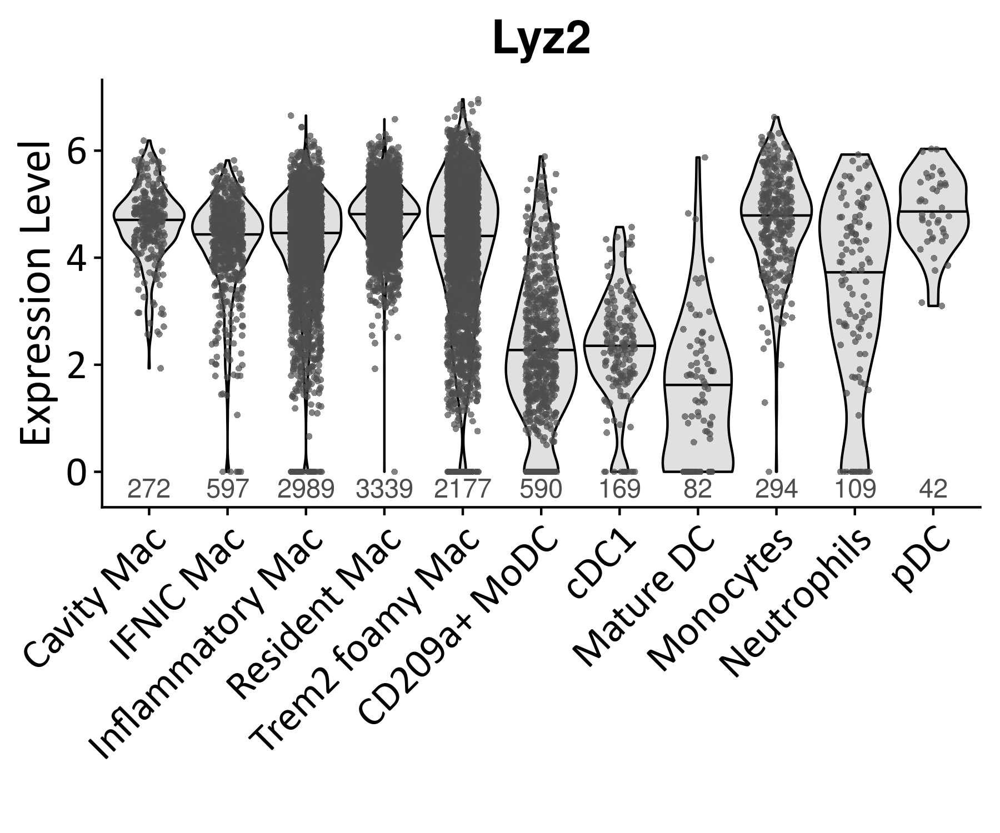<!-- -->

``` r
DefaultAssay(ALL) <- "RNA"
old_order <- levels(ALL)
# medLyz2 <- sapply(levels(ALL), function(lvl) {
#             median(as.numeric(ALL@assays$RNA@data["Lyz2",
#                                  WhichCells(ALL, ident=lvl)]))
#   })
# ALL <- ReorderIdent(ALL, names(sort(medLyz2, decreasing=TRUE)))
ALL <- ReorderIdent(ALL, "Lyz2")
# Reverse
levels(ALL) <- rev(levels(ALL))
plotVln(SeuratObject = ALL, gene="Lyz2", meta=NULL,
    stats=NULL,
    vlnsplit = FALSE, fontTXT,  nCell.y=-0.3, pt.alpha=0.7) +
theme(plot.margin = unit(c(2,2,2,20), "mm")) +
        NoLegend()
```

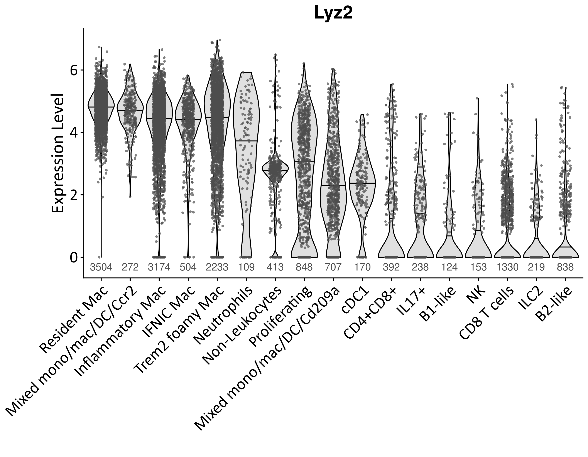<!-- -->

## UMAP

We have subset the data so we do a selection of variables, scaling etc
for umap

``` r
DefaultAssay(WT) <- "RNA"
#NOTE: We recompute PCA since we have added externally Neutrophils to myeloid subset
#NOTE: Data is already normalized
WT <- ScaleData(WT, verbose=FALSE)
WT <- FindVariableFeatures(WT, 
               selection.method = "vst",
               nfeatures = 2000, verbose = FALSE)
WT <- RunPCA(WT, npcs = 50, verbose = FALSE)
# ElbowPlot(M.i)
WT <- RunHarmony(WT, group.by.vars = "dataset", plot_convergence = FALSE)
```

    ## Harmony 1/10

    ## Harmony 2/10

    ## Harmony 3/10

    ## Harmony 4/10

    ## Harmony 5/10

    ## Harmony 6/10

    ## Harmony 7/10

    ## Harmony 8/10

    ## Harmony 9/10

    ## Harmony 10/10

``` r
WT <- RunUMAP(WT, reduction = "harmony", dims = 1:15)
```

    ## Warning: The default method for RunUMAP has changed from calling Python UMAP via reticulate to the R-native UWOT using the cosine metric
    ## To use Python UMAP via reticulate, set umap.method to 'umap-learn' and metric to 'correlation'
    ## This message will be shown once per session

    ## 09:15:02 UMAP embedding parameters a = 0.9922 b = 1.112

    ## 09:15:02 Read 10660 rows and found 15 numeric columns

    ## 09:15:02 Using Annoy for neighbor search, n_neighbors = 30

    ## 09:15:02 Building Annoy index with metric = cosine, n_trees = 50

    ## 0%   10   20   30   40   50   60   70   80   90   100%

    ## [----|----|----|----|----|----|----|----|----|----|

    ## **************************************************|
    ## 09:15:04 Writing NN index file to temp file /tmp/RtmpRsmeUV/file54c954af91c1
    ## 09:15:04 Searching Annoy index using 1 thread, search_k = 3000
    ## 09:15:07 Annoy recall = 100%
    ## 09:15:07 Commencing smooth kNN distance calibration using 1 thread
    ## 09:15:08 Initializing from normalized Laplacian + noise
    ## 09:15:09 Commencing optimization for 200 epochs, with 441616 positive edges
    ## 09:15:18 Optimization finished

``` r
p1 <- DimPlot(WT, label=TRUE, repel = TRUE)
```

    ## Warning: Using `as.character()` on a quosure is deprecated as of rlang 0.3.0.
    ## Please use `as_label()` or `as_name()` instead.
    ## This warning is displayed once per session.

``` r
p2 <- DimPlot(WT, group.by="dataset", label=TRUE, repel = TRUE)
plot_grid(p1,p2)
```

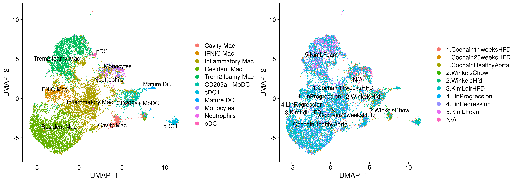<!-- -->

## Dissection of hypoxia response

### Dorothea focused on Hif1a

We calculate Hif1a transcription factor activities using dorothea.

``` r
# load regulons
df2regulon <- function(df, regulator_name="tf") {
  regulon = df %>% split(.[regulator_name]) %>% map(function(dat) {
    targets = setNames(dat$mor, dat$target)
    likelihood = dat$likelihood
    list(tfmode = targets, likelihood = likelihood)
  })
  return(regulon)
}

regulon.df <- read.table("../data/Prior/dorothea_regulon_mouse_v1.csv", sep=",", 
             header=TRUE, stringsAsFactors = FALSE)
regul <- df2regulon(df=regulon.df)

# Calculate TF activities
TF <- viper(eset = as.matrix(WT@assays$RNA@data), regulon = regul,
              nes = T, minsize = 4,
              eset.filter = F, adaptive.size = F,
          verbose=FALSE)
  
# Add them as metadata
stopifnot(colnames(WT) == colnames(TF))
WT$Hif1a_activity <- TF["Hif1a",]
rm(TF)
```

``` r
WT$Hif1a_strata <- NA
for(cell in levels(WT)) {
    idx <- WhichCells(WT, idents=cell)
    Q3 <- quantile(WT$Hif1a_activity[idx], probs=0.75)
    WT$Hif1a_strata[idx] <- ifelse(WT$Hif1a_activity[idx] > Q3,
                     "High_Hif1a", "Low_Hif1a")
}
WT$Hif1a_strata <- factor(WT$Hif1a_strata, levels=c("Low_Hif1a", "High_Hif1a"))
```

### PROGENy focused on hypoxia response

We calculate a score of hypoxia response using progeny as well.

``` r
### Progeny ####
progeny.mat <- read.table("../data/Prior/progeny_matrix_mouse_v1.txt",sep=",",header=TRUE)
rownames(progeny.mat) <- progeny.mat$X
progeny.mat <- progeny.mat[which(colnames(progeny.mat)!="X")]
progeny.mat <- as.matrix(progeny.mat)

common <- intersect(rownames(WT), rownames(progeny.mat))
  
prog <- t(as.matrix(WT@assays$RNA@data[common,])) %*% progeny.mat[common,]
rn <- rownames(prog)
prog <- apply(prog,2,scale)
rownames(prog) <- rn
prog <- t(prog)
  
stopifnot(colnames(WT) == colnames(prog))
WT$Hypoxia_response <- prog["Hypoxia",]
rm(common,prog)
```

``` r
WT$Hypoxia_scaled <- NA
for(cell in levels(WT)) {
    idx <- WhichCells(WT, idents=cell)
    WT$Hypoxia_scaled[idx] <- scale(WT$Hypoxia_response[idx])
}
```

``` r
WT$Hypoxia_strata <- NA
for(cell in levels(WT)) {
    idx <- WhichCells(WT, idents=cell)
    Q3 <- quantile(WT$Hypoxia_response[idx], probs=0.75)
    WT$Hypoxia_strata[idx] <- ifelse(WT$Hypoxia_response[idx] > Q3,
                     "High_hypoxia", "Low_hypoxia")
}
WT$Hypoxia_strata<- factor(WT$Hypoxia_strata, levels=c("Low_hypoxia", "High_hypoxia"))
```

## Results

``` r
gene <- "Pfkfb3"
genes <- paste0("Pfkfb",1:4) 
```

### Pfkfb3

``` r
p2 <- FeaturePlot(WT, features=gene, pt.size = 0.3)
print(p2)
```

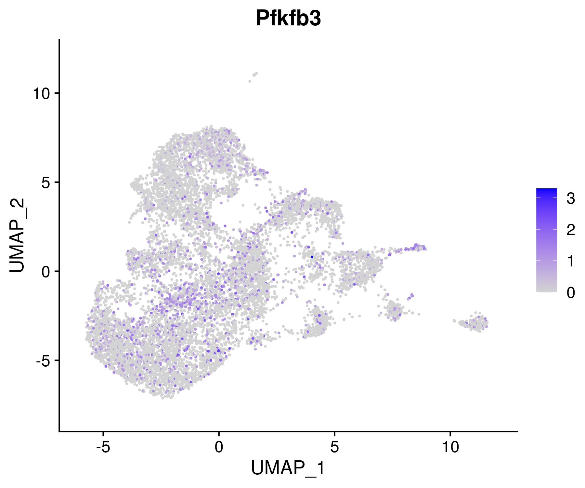<!-- -->

``` r
plot_grid(p1,p2, rel_widths = c(0.55,0.45))
```

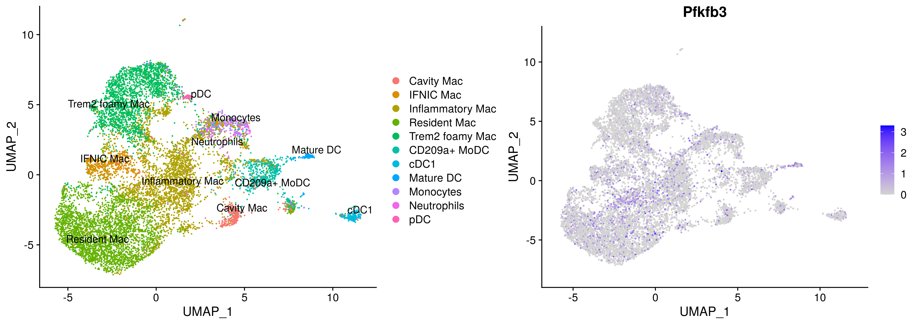<!-- -->

``` r
DotPlot(WT, features=gene) + 
    xlab("") + ylab("Cell type")
```

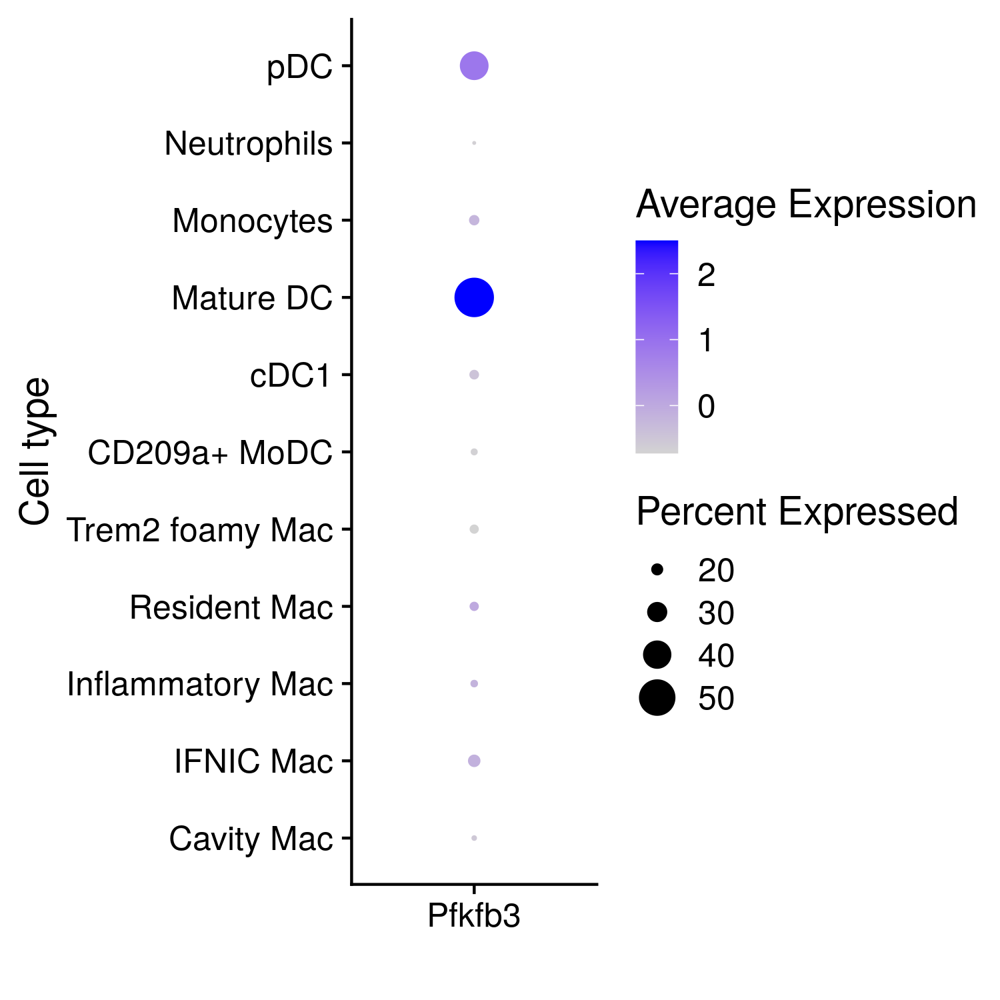<!-- -->

``` r
# VlnPlot(WT, features=gene, pt.size=0.7) + NoLegend()
plotVln(SeuratObject = WT, gene="Pfkfb3", meta=NULL,
    stats=NULL,
    vlnsplit = FALSE, fontTXT,  nCell.y=-0.2, pt.alpha=0.8) +
        NoLegend()
```

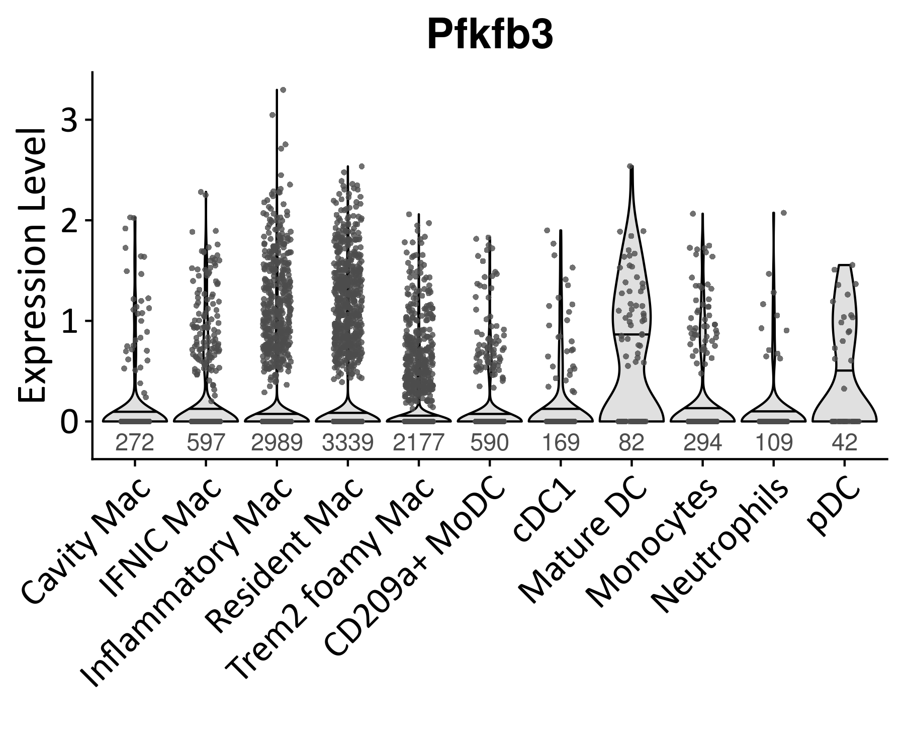<!-- -->

### Pfkfb isoforms

``` r
p2 <- FeaturePlot(WT, features=genes, pt.size = 0.3)
print(p2)
```

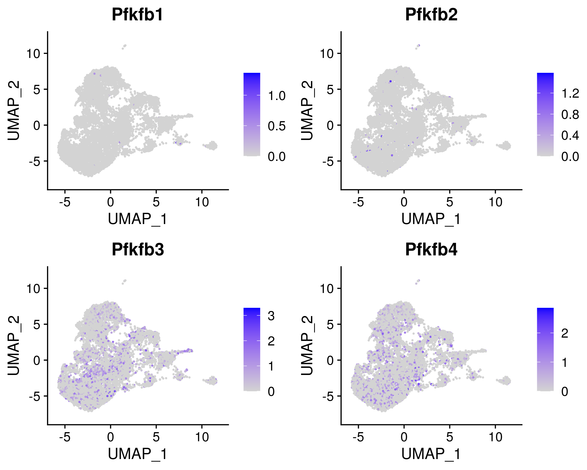<!-- -->

``` r
plot_grid(p1,p2, rel_widths = c(0.53,0.47))
```

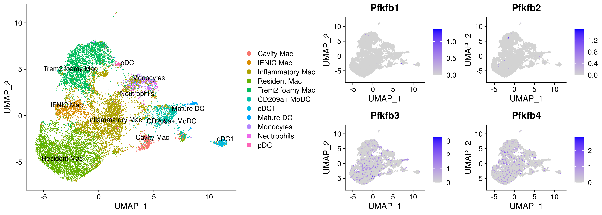<!-- -->

``` r
DotPlot(WT, features=genes) + 
    xlab("Pfkfb isoforms") + ylab("Cell type")
```

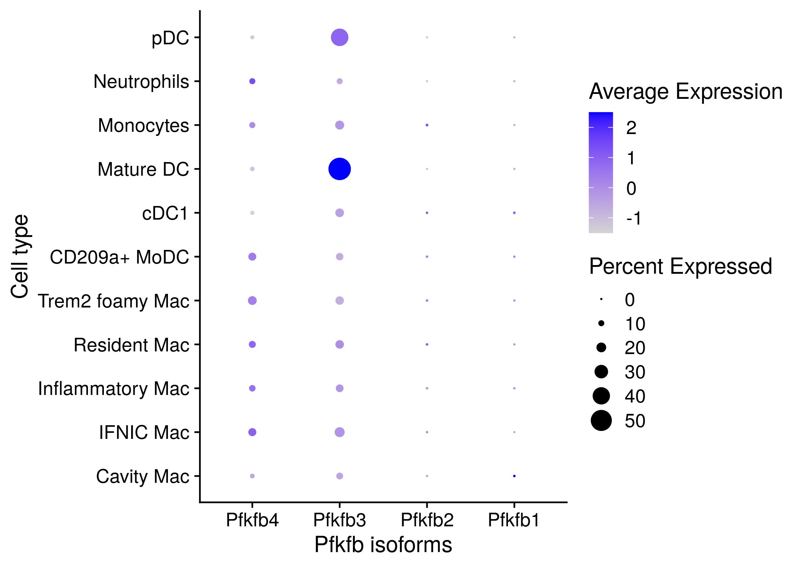<!-- -->

``` r
# VlnPlot(WT, features=genes, ncol=length(genes)/2, pt.size=0.7)
plot_grid(plotlist=sapply(genes,function(z) {
        plotVln(SeuratObject = WT, gene=z, meta=NULL,
          stats=NULL,
          vlnsplit = FALSE, fontTXT,  nCell.y=-0.1, pt.alpha=0.8) +
              theme(axis.text.x=element_text(size=16)) + 
              NoLegend()
         }, simplify=FALSE), ncol = length(genes)/2)
```

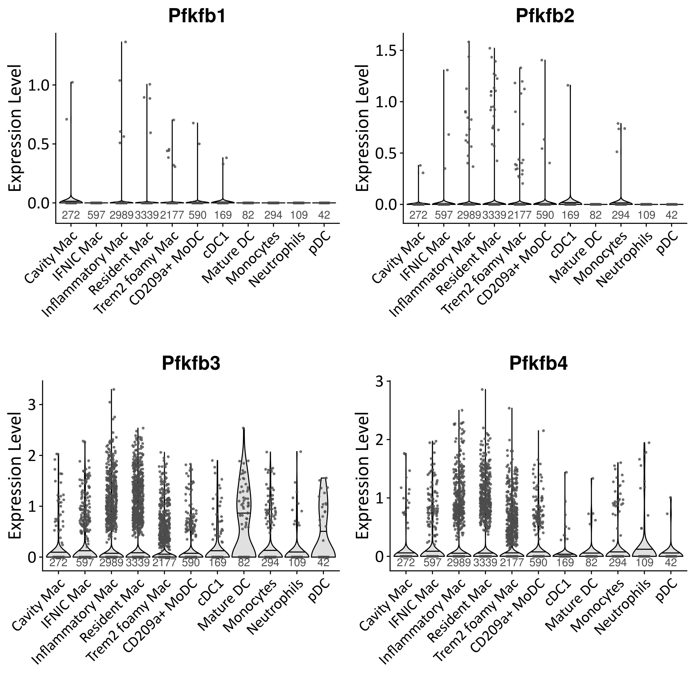<!-- -->

### Pfkfb3 High Hypoxia/Hif1a

#### Hypoxia

``` r
WT$stim <- WT$Hypoxia_strata
wPfkfb3_stats <- t(sapply(levels(WT), function(cell) {
                   cellIds <- WhichCells(WT, idents=cell)
                   # The test
                   wilcox.test_stats(xy=WT@assays$RNA@data["Pfkfb3", cellIds],
                             gr=WT$stim[cellIds])
               }))
```

    ## Warning in wilcox.test.default(x = c(KimRegression_GGAAAGCAGTATTGGA = 0, :
    ## cannot compute exact p-value with ties

``` r
wPfkfb3_stats <- as.data.frame(wPfkfb3_stats)
wPfkfb3_stats$adjpval <- p.adjust(wPfkfb3_stats$pvalue, method="fdr")
wPfkfb3_stats$significance <- tagSignif(wPfkfb3_stats$adjpval)
print(wPfkfb3_stats)
```

    ##                         W       pvalue     r      adjpval significance
    ## Cavity Mac         6167.0 1.585376e-02 0.146 1.743913e-02            *
    ## IFNIC Mac         24604.5 1.014375e-11 0.278 2.789531e-11          ***
    ## Inflammatory Mac 675247.0 3.086007e-38 0.236 1.131536e-37          ***
    ## Resident Mac     822287.0 4.134637e-46 0.247 4.548101e-45          ***
    ## Trem2 foamy Mac  333127.5 1.525074e-41 0.289 8.387905e-41          ***
    ## CD209a+ MoDC      29996.0 1.200899e-02 0.103 1.467765e-02            *
    ## cDC1               2037.5 4.952704e-04 0.268 1.089595e-03           **
    ## Mature DC           557.5 3.556981e-01 0.103 3.556981e-01           ns
    ## Monocytes          6759.0 1.130165e-03 0.190 2.071969e-03           **
    ## Neutrophils         876.0 1.966127e-03 0.297 3.089629e-03           **
    ## pDC                  91.0 1.096598e-02 0.395 1.467765e-02            *

``` r
RES <- wPfkfb3_stats[, c("r", "significance")]
RES$r <- format(round(RES$r, 2), nsmall=2)
colnames(RES)[ncol(RES)] <- ""
```

``` r
plotVln(SeuratObject = WT, gene="Pfkfb3", meta=NULL,
    stats=RES,
    vlnsplit = TRUE, fontTXT,  nCell.y=-0.1, pt.alpha=0.4) +
      guides(fill= guide_legend(nrow=1, byrow=TRUE)) 
```

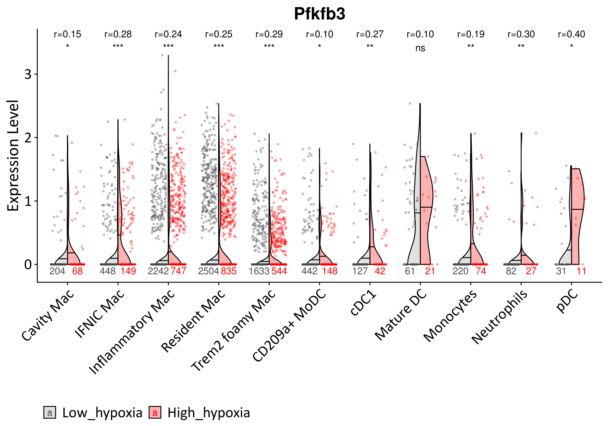<!-- -->

#### Hif1a

``` r
WT$stim <- WT$Hif1a_strata
wPfkfb3_stats <- t(sapply(levels(WT), function(cell) {
                   cellIds <- WhichCells(WT, idents=cell)
                   # The test
                   wilcox.test_stats(xy=WT@assays$RNA@data["Pfkfb3", cellIds],
                             gr=WT$stim[cellIds])
               }))
```

    ## Warning in wilcox.test.default(x = c(KimRegression_GGAAAGCAGTATTGGA = 0, :
    ## cannot compute exact p-value with ties

``` r
wPfkfb3_stats <- as.data.frame(wPfkfb3_stats)
wPfkfb3_stats$adjpval <- p.adjust(wPfkfb3_stats$pvalue, method="fdr")
wPfkfb3_stats$significance <- tagSignif(wPfkfb3_stats$adjpval)
print(wPfkfb3_stats)
```

    ##                         W       pvalue     r      adjpval significance
    ## Cavity Mac         6311.0 4.996547e-02 0.119 6.106890e-02           ns
    ## IFNIC Mac         28424.0 1.223741e-04 0.157 2.692231e-04          ***
    ## Inflammatory Mac 680518.0 6.687590e-36 0.229 7.356349e-35          ***
    ## Resident Mac     856251.5 1.256990e-33 0.209 6.913447e-33          ***
    ## Trem2 foamy Mac  356663.5 1.937023e-26 0.227 7.102419e-26          ***
    ## CD209a+ MoDC      28284.0 4.170176e-05 0.169 1.146798e-04          ***
    ## cDC1               2140.0 3.549225e-03 0.225 5.577353e-03           **
    ## Mature DC           485.5 8.369488e-02 0.192 8.369488e-02           ns
    ## Monocytes          7102.0 1.440632e-02 0.143 1.980869e-02            *
    ## Neutrophils         826.5 1.699001e-04 0.361 3.114835e-04          ***
    ## pDC                 116.0 8.207225e-02 0.270 8.369488e-02           ns

``` r
RES <- wPfkfb3_stats[, c("r", "significance")]
RES$r <- format(round(RES$r, 2), nsmall=2)
colnames(RES)[ncol(RES)] <- ""
```

``` r
plotVln(SeuratObject = WT, gene="Pfkfb3", meta=NULL,
    stats=RES,
    vlnsplit = TRUE, fontTXT,  nCell.y=-0.1, pt.alpha=0.4) +
      guides(fill= guide_legend(nrow=1, byrow=TRUE))
```

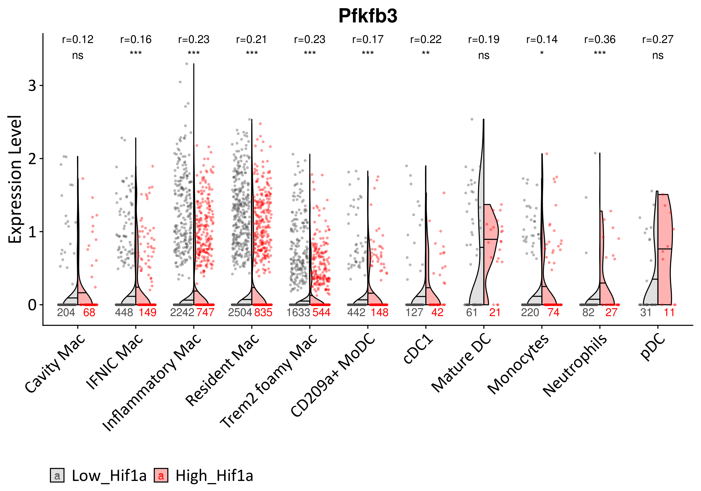<!-- -->

### Pfkfb4 High Hypoxia/Hif1a

#### Hypoxia

``` r
WT$stim <- WT$Hypoxia_strata
wPfkfb4_stats <- t(sapply(levels(WT), function(cell) {
                   cellIds <- WhichCells(WT, idents=cell)
                   # The test
                   wilcox.test_stats(xy=WT@assays$RNA@data["Pfkfb4", cellIds],
                             gr=WT$stim[cellIds])
               }))
```

    ## Warning in wilcox.test.default(x = c(KimRegression_GGAAAGCAGTATTGGA = 0, :
    ## cannot compute exact p-value with ties

``` r
wPfkfb4_stats <- as.data.frame(wPfkfb4_stats)
wPfkfb4_stats$adjpval <- p.adjust(wPfkfb4_stats$pvalue, method="fdr")
wPfkfb4_stats$significance <- tagSignif(wPfkfb4_stats$adjpval)
print(wPfkfb4_stats)
```

    ##                         W       pvalue       r      adjpval significance
    ## Cavity Mac         7290.0 1.442065e-01 -0.0885 2.171907e-01           ns
    ## IFNIC Mac         27740.0 8.741821e-07  0.2010 2.404001e-06          ***
    ## Inflammatory Mac 731174.5 4.540896e-21  0.1720 2.497493e-20          ***
    ## Resident Mac     880597.5 2.959100e-32  0.2040 3.255010e-31          ***
    ## Trem2 foamy Mac  384785.0 1.627890e-12  0.1510 5.968930e-12          ***
    ## CD209a+ MoDC      31122.0 1.579569e-01  0.0580 2.171907e-01           ns
    ## cDC1               2610.5 6.005977e-01  0.0406 6.606575e-01           ns
    ## Mature DC           652.0 7.781246e-01 -0.0326 7.781246e-01           ns
    ## Monocytes          7520.0 6.230203e-02  0.1090 1.370645e-01           ns
    ## Neutrophils         990.0 1.177150e-01  0.1500 2.158109e-01           ns
    ## pDC                 161.0 4.854208e-01  0.1140 5.932921e-01           ns

``` r
RES <- wPfkfb4_stats[, c("r", "significance")]
RES$r <- format(round(RES$r, 2), nsmall=2)
colnames(RES)[ncol(RES)] <- ""
```

``` r
plotVln(SeuratObject = WT, gene="Pfkfb4", meta=NULL,
    stats=RES,
    vlnsplit = TRUE, fontTXT,  nCell.y=-0.1, pt.alpha=0.4) +
      guides(fill= guide_legend(nrow=1, byrow=TRUE)) 
```

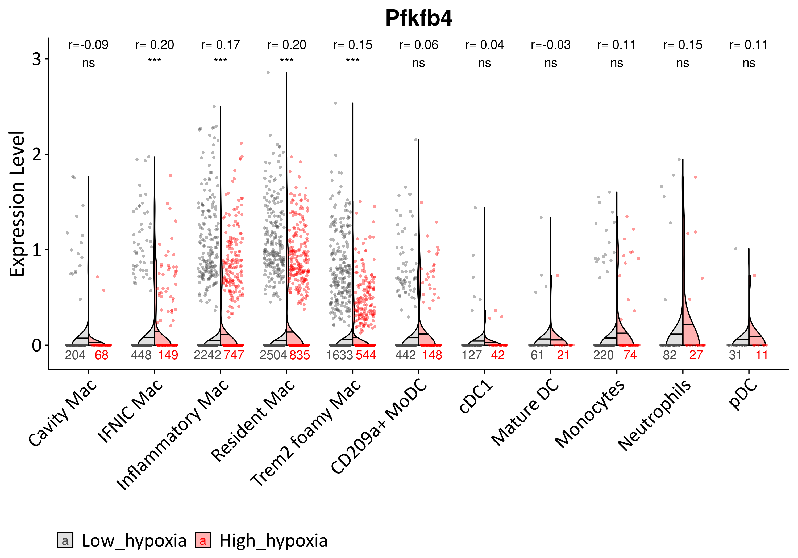<!-- -->

#### Hif1a

``` r
WT$stim <- WT$Hif1a_strata
wPfkfb4_stats <- t(sapply(levels(WT), function(cell) {
                   cellIds <- WhichCells(WT, idents=cell)
                   # The test
                   wilcox.test_stats(xy=WT@assays$RNA@data["Pfkfb4", cellIds],
                             gr=WT$stim[cellIds])
               }))
```

    ## Warning in wilcox.test.default(x = c(KimRegression_GGAAAGCAGTATTGGA = 0, :
    ## cannot compute exact p-value with ties

``` r
wPfkfb4_stats <- as.data.frame(wPfkfb4_stats)
wPfkfb4_stats$adjpval <- p.adjust(wPfkfb4_stats$pvalue, method="fdr")
wPfkfb4_stats$significance <- tagSignif(wPfkfb4_stats$adjpval)
print(wPfkfb4_stats)
```

    ##                         W       pvalue       r      adjpval significance
    ## Cavity Mac         6748.0 4.385996e-01  0.0471 5.932921e-01           ns
    ## IFNIC Mac         29902.0 2.435180e-03  0.1240 6.696746e-03           **
    ## Inflammatory Mac 763678.5 6.288290e-11  0.1200 6.917119e-10          ***
    ## Resident Mac     962224.0 2.403063e-09  0.1030 1.321684e-08          ***
    ## Trem2 foamy Mac  397868.0 3.645616e-08  0.1180 1.336726e-07          ***
    ## CD209a+ MoDC      32234.5 6.735850e-01  0.0174 7.045786e-01           ns
    ## cDC1               2354.0 3.482978e-03  0.2250 7.662552e-03           **
    ## Mature DC           611.0 4.575834e-01  0.0835 5.932921e-01           ns
    ## Monocytes          8266.5 7.045786e-01 -0.0222 7.045786e-01           ns
    ## Neutrophils         938.5 2.406990e-02  0.2160 4.412814e-02            *
    ## pDC                 161.0 4.854208e-01  0.1140 5.932921e-01           ns

``` r
RES <- wPfkfb4_stats[, c("r", "significance")]
RES$r <- format(round(RES$r, 2), nsmall=2)
colnames(RES)[ncol(RES)] <- ""
```

``` r
plotVln(SeuratObject = WT, gene="Pfkfb4", meta=NULL,
    stats=RES,
    vlnsplit = TRUE, fontTXT,  nCell.y=-0.1, pt.alpha=0.4) +
      guides(fill= guide_legend(nrow=1, byrow=TRUE)) 
```

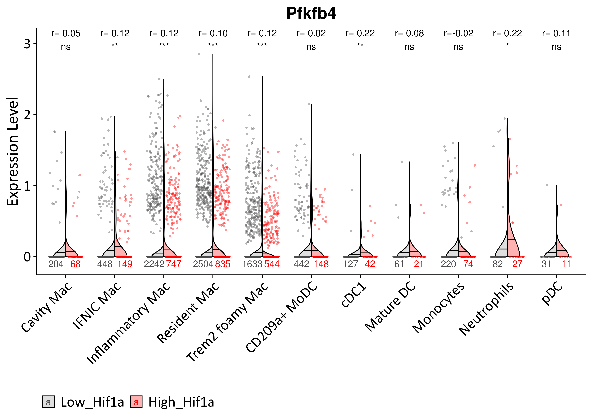<!-- -->

## Save the Seurat Object

``` r
saveRDS(WT, paste0(DATADIR,"/M.rds"));
```

## SessionInfo

``` r
sessionInfo()
```

    ## R version 3.6.1 (2019-07-05)
    ## Platform: x86_64-pc-linux-gnu (64-bit)
    ## Running under: Ubuntu 18.04.3 LTS
    ## 
    ## Matrix products: default
    ## BLAS:   /usr/lib/x86_64-linux-gnu/blas/libblas.so.3.7.1
    ## LAPACK: /usr/lib/x86_64-linux-gnu/lapack/liblapack.so.3.7.1
    ## 
    ## locale:
    ##  [1] LC_CTYPE=en_US.UTF-8       LC_NUMERIC=C              
    ##  [3] LC_TIME=en_GB.UTF-8        LC_COLLATE=en_US.UTF-8    
    ##  [5] LC_MONETARY=en_GB.UTF-8    LC_MESSAGES=en_US.UTF-8   
    ##  [7] LC_PAPER=en_GB.UTF-8       LC_NAME=C                 
    ##  [9] LC_ADDRESS=C               LC_TELEPHONE=C            
    ## [11] LC_MEASUREMENT=en_GB.UTF-8 LC_IDENTIFICATION=C       
    ## 
    ## attached base packages:
    ##  [1] grid      stats4    parallel  stats     graphics  grDevices utils    
    ##  [8] datasets  methods   base     
    ## 
    ## other attached packages:
    ##  [1] extrafont_0.17       harmony_1.0          Rcpp_1.0.2          
    ##  [4] rcompanion_2.3.26    viper_1.18.1         ComplexHeatmap_2.0.0
    ##  [7] GSEABase_1.46.0      graph_1.62.0         annotate_1.62.0     
    ## [10] XML_3.98-1.20        AnnotationDbi_1.46.1 IRanges_2.18.2      
    ## [13] S4Vectors_0.22.1     Biobase_2.44.0       BiocGenerics_0.30.0 
    ## [16] openxlsx_4.2.3       dplyr_0.8.3          purrr_0.3.2         
    ## [19] ggplot2_3.3.3        cowplot_1.0.0        Seurat_3.1.0        
    ## [22] rmarkdown_1.15       nvimcom_0.9-82      
    ## 
    ## loaded via a namespace (and not attached):
    ##   [1] backports_1.1.4     circlize_0.4.7      plyr_1.8.4         
    ##   [4] igraph_1.2.4.1      lazyeval_0.2.2      splines_3.6.1      
    ##   [7] listenv_0.7.0       TH.data_1.0-10      digest_0.6.21      
    ##  [10] htmltools_0.3.6     gdata_2.18.0        magrittr_1.5       
    ##  [13] memoise_1.1.0       cluster_2.1.0       mixtools_1.1.0     
    ##  [16] ROCR_1.0-7          globals_0.12.4      matrixStats_0.55.0 
    ##  [19] RcppParallel_4.4.3  R.utils_2.9.0       extrafontdb_1.0    
    ##  [22] sandwich_2.5-1      colorspace_1.4-1    blob_1.2.0         
    ##  [25] ggrepel_0.8.1       xfun_0.9            libcoin_1.0-6      
    ##  [28] crayon_1.3.4        RCurl_1.95-4.12     jsonlite_1.6       
    ##  [31] Exact_2.1           zeallot_0.1.0       survival_2.44-1.1  
    ##  [34] zoo_1.8-6           ape_5.3             glue_1.3.1         
    ##  [37] gtable_0.3.0        leiden_0.3.1        GetoptLong_0.1.7   
    ##  [40] Rttf2pt1_1.3.8      future.apply_1.3.0  shape_1.4.4        
    ##  [43] scales_1.0.0        mvtnorm_1.0-11      DBI_1.0.0          
    ##  [46] bibtex_0.4.2        metap_1.1           viridisLite_0.3.0  
    ##  [49] xtable_1.8-4        clue_0.3-57         reticulate_1.13    
    ##  [52] bit_1.1-14          rsvd_1.0.2          SDMTools_1.1-221.1 
    ##  [55] tsne_0.1-3          htmlwidgets_1.3     httr_1.4.1         
    ##  [58] gplots_3.0.1.1      RColorBrewer_1.1-2  modeltools_0.2-23  
    ##  [61] ica_1.0-2           pkgconfig_2.0.3     R.methodsS3_1.7.1  
    ##  [64] multcompView_0.1-8  uwot_0.1.4          labeling_0.3       
    ##  [67] tidyselect_0.2.5    rlang_0.4.0         reshape2_1.4.3     
    ##  [70] munsell_0.5.0       tools_3.6.1         RSQLite_2.1.2      
    ##  [73] ggridges_0.5.1      EMT_1.1             evaluate_0.14      
    ##  [76] stringr_1.4.0       yaml_2.2.0          npsurv_0.4-0       
    ##  [79] knitr_1.24          bit64_0.9-7         fitdistrplus_1.0-14
    ##  [82] zip_2.1.1           caTools_1.17.1.2    RANN_2.6.1         
    ##  [85] coin_1.3-1          rootSolve_1.8.2.1   pbapply_1.4-2      
    ##  [88] future_1.14.0       nlme_3.1-141        R.oo_1.22.0        
    ##  [91] compiler_3.6.1      rstudioapi_0.10     plotly_4.9.0       
    ##  [94] png_0.1-7           e1071_1.7-2         lsei_1.2-0         
    ##  [97] tibble_2.1.3        DescTools_0.99.39   stringi_1.4.3      
    ## [100] RSpectra_0.15-0     lattice_0.20-38     Matrix_1.2-17      
    ## [103] vctrs_0.2.0         pillar_1.4.2        lifecycle_0.1.0    
    ## [106] Rdpack_0.11-0       lmtest_0.9-37       GlobalOptions_0.1.0
    ## [109] RcppAnnoy_0.0.13    data.table_1.12.8   bitops_1.0-6       
    ## [112] irlba_2.3.3         lmom_2.8            gbRd_0.4-11        
    ## [115] R6_2.4.0            KernSmooth_2.23-16  gridExtra_2.3      
    ## [118] gld_2.6.2           codetools_0.2-16    boot_1.3-23        
    ## [121] MASS_7.3-51.4       gtools_3.8.1        assertthat_0.2.1   
    ## [124] rjson_0.2.20        nortest_1.0-4       withr_2.1.2        
    ## [127] sctransform_0.2.0   multcomp_1.4-12     expm_0.999-4       
    ## [130] tidyr_1.0.0         class_7.3-15        segmented_1.0-0    
    ## [133] Rtsne_0.15

``` r
{                                                                                                                                                                                                           
sink(file=paste0(OUTDIR,"/sessionInfo.txt"))
print(sessionInfo())
sink()
}
```
