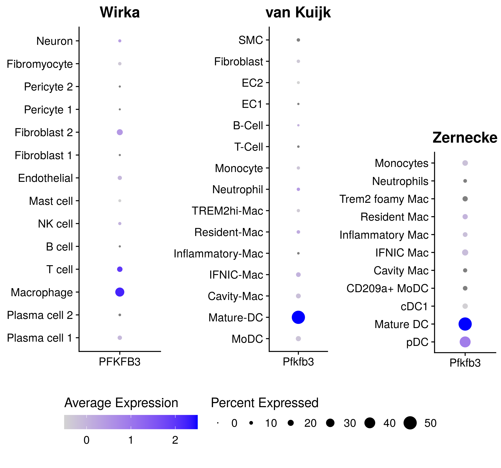

Meta-data of PFKFB3 expression
================
Javier Perales-Patón - <javier.perales@bioquant.uni-heidelberg.de> -
ORCID: 0000-0003-0780-6683

## Setup

We define a random seed number for reproducibility, file structure for
the output, and load essential libraries

### Environment

``` r
# Seed number
set.seed(1234)
# Output directory
OUTDIR <- "./meta-dplot/"
if(!dir.exists(OUTDIR)) dir.create(OUTDIR);

# Figures
FIGDIR <- paste0(OUTDIR, "/figures/")
knitr::opts_chunk$set(fig.path=FIGDIR)
knitr::opts_chunk$set(dev=c('png','tiff'))
knitr::opts_chunk$set(dpi=300)
# Data
DATADIR <- paste0(OUTDIR, "/data/")
if(!dir.exists(DATADIR)) dir.create(DATADIR);
```

### Load libraries

``` r
suppressPackageStartupMessages(require(Seurat))
suppressPackageStartupMessages(require(cowplot))
suppressPackageStartupMessages(require(ggplot2))
source("../src/seurat_fx.R")
source("../src/wilcox_fx.R")
```

### Load data

  - van Kuijk

<!-- end list -->

``` r
Kuijk <- readRDS("LDLrlysMCRE-mice/data/M.rds")
```

  - Wirka et al

<!-- end list -->

``` r
Wirka <- readRDS("Wirka2019/data/M.rds")
```

  - Zernecke 2020

<!-- end list -->

``` r
Zernecke <- readRDS("Zernecke2020/data/M.rds")
```

### Plot

``` r
tm <- theme(plot.title=element_text(hjust=0.5),
        axis.title = element_blank()) 

p1 <- DotPlot(Kuijk, feature="Pfkfb3", 
          scale.min=0, scale.max=50) + ggtitle("van Kuijk")+ 
scale_color_gradient(limits=c(-0.5, 2.5), low="lightgrey",high= "blue", breaks=c(0, 1, 2)) +
tm
```

    ## Scale for 'colour' is already present. Adding another scale for
    ## 'colour', which will replace the existing scale.

``` r
p2 <- DotPlot(Wirka, feature="PFKFB3", scale.min=0, scale.max=50) + ggtitle("Wirka") + 
scale_color_gradient(limits=c(-0.5, 2.5), low="lightgrey",high= "blue", breaks=c(0, 1, 2)) + tm
```

    ## Scale for 'colour' is already present. Adding another scale for
    ## 'colour', which will replace the existing scale.

``` r
p3 <- DotPlot(Zernecke, feature="Pfkfb3", scale.min=0, scale.max=50) + ggtitle("Zernecke") + 
scale_color_gradient(limits=c(-0.5, 2.5), low="lightgrey",high= "blue", breaks=c(0, 1, 2)) + tm
```

    ## Scale for 'colour' is already present. Adding another scale for
    ## 'colour', which will replace the existing scale.

``` r
leg <- get_legend(p3 + theme(legend.position="bottom") + 
          guides(colour= guide_colorbar(title="Average Expression",
                        title.position="top",
                        barwidth=10),
             size = guide_legend(title = "Percent Expressed",
                         title.position="top",
                         nrow=1, byrow=TRUE)
             ))

plot_grid(p2 + NoLegend(), p3 + NoLegend(), p1 + NoLegend(),
      ggplot()+theme_void(), leg, 
      ncol = 3, rel_heights = c(0.8,0.2))
```

<!-- -->

### TRY

``` r
# res <- apply(M@assays$RNA@counts[, 1:5], 2, function(b) which(apply(ALL@assays$RNA@counts==b,2,all)))
```
