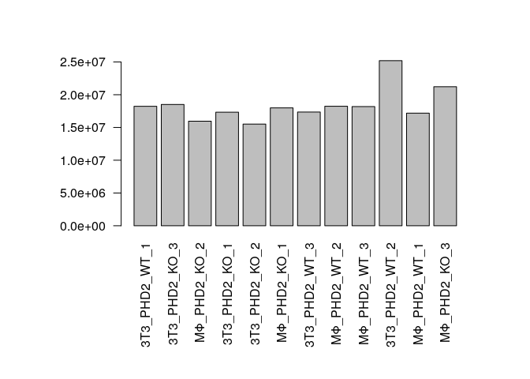
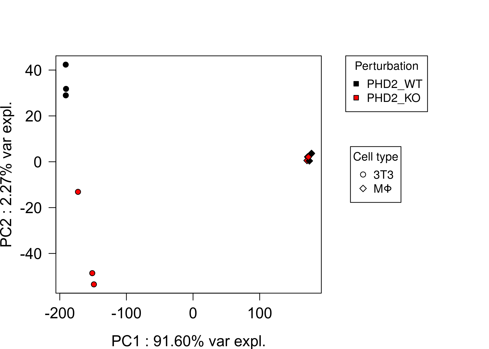
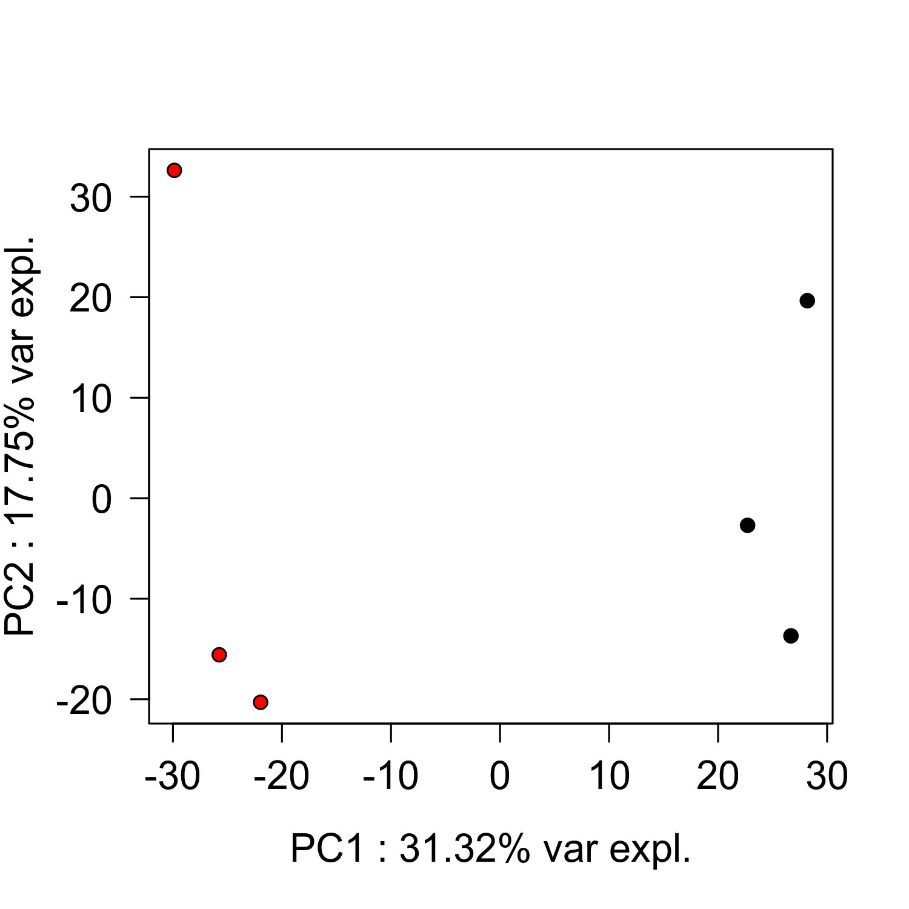
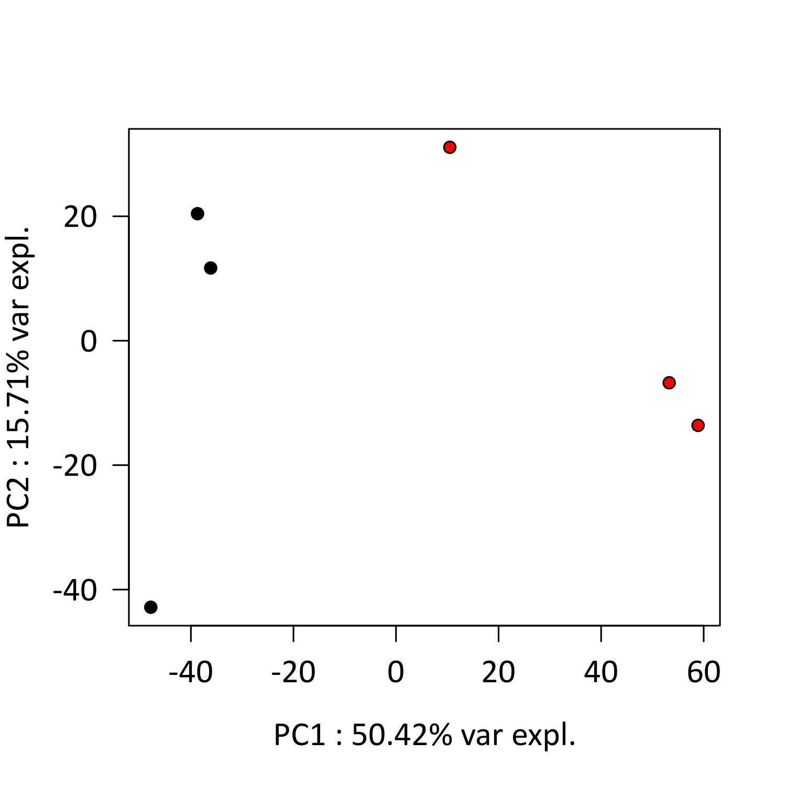
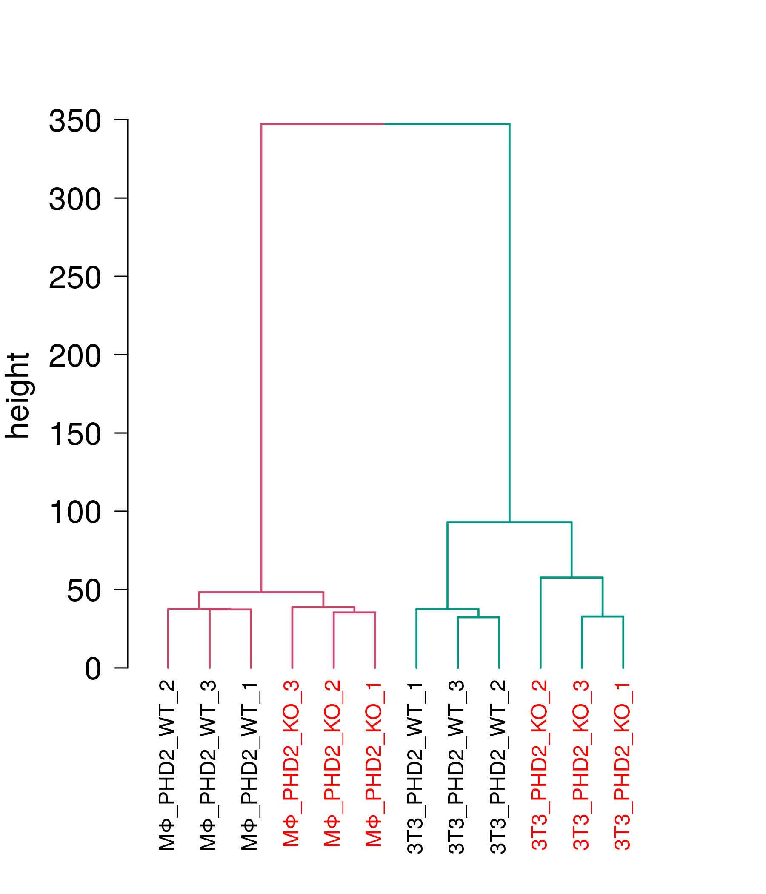

Exploratory Data Analysis (EDA) on conventional bulk RNA-seq from
in-vitro Macrophage PHD2cKO and medium conditioned Fibroblasts
================
Javier Perales-Patón - <javier.perales@bioquant.uni-heidelberg.de> -
ORCID: 0000-0003-0780-6683

Transcriptome profiling with conventional RNAseq was performed in three
replicates of macrophages carrying PHD2 knock-out (with wildtype) and
fibroblasts co-cultured with supernadant of these macrophages (as
compared to supernadant of the wiltype genotype). Herein we perform an
exploratory analysis on these settings.

## Setting-up environment

The environment will be set with a random seed number for
reproducibility and an output folder for processed data and figures.

### set env

``` r
options(stringsAsFactors = FALSE)
# Seed number
set.seed(1234)
# Output directory
OUTDIR <- "./00_EDA_output/"
if(!dir.exists(OUTDIR)) dir.create(OUTDIR);

# Figures
FIGDIR <- paste0(OUTDIR, "/figures/")
knitr::opts_chunk$set(fig.path=FIGDIR)
knitr::opts_chunk$set(dev=c('png','tiff'))
# Data
DATADIR <- paste0(OUTDIR, "/data/")
if(!dir.exists(DATADIR)) dir.create(DATADIR);
```

### Load libraries

Essential libraries for R analysis.

``` r
library(edgeR)
library(limma)
library(fgsea)
library(GSEABase)
library(dendextend)
```

    ## 
    ## ---------------------
    ## Welcome to dendextend version 1.12.0
    ## Type citation('dendextend') for how to cite the package.
    ## 
    ## Type browseVignettes(package = 'dendextend') for the package vignette.
    ## The github page is: https://github.com/talgalili/dendextend/
    ## 
    ## Suggestions and bug-reports can be submitted at: https://github.com/talgalili/dendextend/issues
    ## Or contact: <tal.galili@gmail.com>
    ## 
    ##  To suppress this message use:  suppressPackageStartupMessages(library(dendextend))
    ## ---------------------

    ## 
    ## Attaching package: 'dendextend'

    ## The following object is masked from 'package:stats':
    ## 
    ##     cutree

``` r
source("../src/graphics.R")
```

## Load data and normalize

The data must be stored locally in the `./data/bulk` folder. This
processed data has been deposited under the accession number described
in the main [README file](../README.md) of the project.

``` r
### 1 Load data
cnt <- read.table("../data/bulk/MST_MC_N_fibroblasts_PHD2-rawdata.txt", 
          sep="\t", header = TRUE, check.names = FALSE)
rownames(cnt) <- cnt[,1]
cnt <- cnt[,-1]

targets <- read.table("../data/bulk/MST_MC_N_fibroblasts_PHD2-metadata.txt", 
              sep="\t",header=TRUE, colClasses = "character")
targets$Sample <- gsub(" ","_",targets$Sample)

# Rename samples
stopifnot(all(colnames(cnt)==targets$FastQ))
colnames(cnt) <- targets$Sample

# Create metadata
stopifnot(all(colnames(cnt)==targets$Sample))
gr <- targets$Group
gt <- factor(gsub("^(3T3|MΦ)_", "", targets$Group), levels=c(c("PHD2_WT", "PHD2_KO")))
cell <- factor(unlist(sapply(targets$Group, function(z) strsplit(z, split="_")[[1]][1])))
repl <- factor(targets$Replicate)

## 2 Create DGElist (edgeR package, followed by TMM default normalization method)
y <- DGEList(counts = cnt, group = gr, genes = rownames(cnt))
y <- calcNormFactors(y, method = "TMM")
```

## Diagnostics

### The library size

``` r
par(mar=c(10,8,4,4)); 
barplot(y$samples$lib.size,names.arg = rownames(y$samples), las=2)
```

    ## Warning in axis(if (horiz) 2 else 1, at = at.l, labels = names.arg, lty
    ## = axis.lty, : conversion failure on 'MΦ_PHD2_KO_2' in 'mbcsToSbcs': dot
    ## substituted for <ce>

    ## Warning in axis(if (horiz) 2 else 1, at = at.l, labels = names.arg, lty
    ## = axis.lty, : conversion failure on 'MΦ_PHD2_KO_2' in 'mbcsToSbcs': dot
    ## substituted for <a6>

    ## Warning in axis(if (horiz) 2 else 1, at = at.l, labels = names.arg, lty
    ## = axis.lty, : conversion failure on 'MΦ_PHD2_KO_1' in 'mbcsToSbcs': dot
    ## substituted for <ce>

    ## Warning in axis(if (horiz) 2 else 1, at = at.l, labels = names.arg, lty
    ## = axis.lty, : conversion failure on 'MΦ_PHD2_KO_1' in 'mbcsToSbcs': dot
    ## substituted for <a6>

    ## Warning in axis(if (horiz) 2 else 1, at = at.l, labels = names.arg, lty
    ## = axis.lty, : conversion failure on 'MΦ_PHD2_WT_2' in 'mbcsToSbcs': dot
    ## substituted for <ce>

    ## Warning in axis(if (horiz) 2 else 1, at = at.l, labels = names.arg, lty
    ## = axis.lty, : conversion failure on 'MΦ_PHD2_WT_2' in 'mbcsToSbcs': dot
    ## substituted for <a6>

    ## Warning in axis(if (horiz) 2 else 1, at = at.l, labels = names.arg, lty
    ## = axis.lty, : conversion failure on 'MΦ_PHD2_WT_3' in 'mbcsToSbcs': dot
    ## substituted for <ce>

    ## Warning in axis(if (horiz) 2 else 1, at = at.l, labels = names.arg, lty
    ## = axis.lty, : conversion failure on 'MΦ_PHD2_WT_3' in 'mbcsToSbcs': dot
    ## substituted for <a6>

    ## Warning in axis(if (horiz) 2 else 1, at = at.l, labels = names.arg, lty
    ## = axis.lty, : conversion failure on 'MΦ_PHD2_WT_1' in 'mbcsToSbcs': dot
    ## substituted for <ce>

    ## Warning in axis(if (horiz) 2 else 1, at = at.l, labels = names.arg, lty
    ## = axis.lty, : conversion failure on 'MΦ_PHD2_WT_1' in 'mbcsToSbcs': dot
    ## substituted for <a6>

    ## Warning in axis(if (horiz) 2 else 1, at = at.l, labels = names.arg, lty
    ## = axis.lty, : conversion failure on 'MΦ_PHD2_KO_3' in 'mbcsToSbcs': dot
    ## substituted for <ce>

    ## Warning in axis(if (horiz) 2 else 1, at = at.l, labels = names.arg, lty
    ## = axis.lty, : conversion failure on 'MΦ_PHD2_KO_3' in 'mbcsToSbcs': dot
    ## substituted for <a6>

<!-- -->

### Principal Component analysis

First we start with the definition of ad-hoc handle functions to quick
generate PCA plots (i.e. two-first principal components showing their
variance explained).

``` r
# Define some functions
runPCA <- function(mat) {
  pca <- prcomp(t(mat))
  
  return(pca)
}

plotPCA <- function(pca, dims, pchs, cols, labels=NULL, family="Arial") {
  importance <- summary(pca)$importance[,dims]
  PCscores <- data.frame(pca$x)[,dims]
  
  plot(PCscores,las=1,
       pch=pchs,bg=cols,
       family=family,
       cex.axis=1.3, cex.lab=1.3,
       xlab=paste0(dims[1]," : ",format(round(importance[2,dims[1]]*100,digits = 2),nsmall = 2),"% var expl."),
       ylab=paste0(dims[2]," : ",format(round(importance[2,dims[2]]*100,digits = 2),nsmall = 2),"% var expl."))
  if(!is.null(labels)) {
    par(xpd=TRUE)
    text(x=PCscores[,dims[1]], y=PCscores[,dims[2]], labels=labels, pos=1, family=family)
  }
}
```

Then we run PCA and visualize the PCA plots.

``` r
# Run PCA
pca <- runPCA(mat = cpm(y, log = TRUE))

par(mar=c(4,4,4,12), xpd=TRUE)
plotPCA(pca=runPCA(mat = cpm(y, log = TRUE)),
        dims=c("PC1","PC2"),
        pchs=c(21,23)[as.integer(cell)], cols=as.integer(gt))
legend("right",legend = levels(cell), pch=c(21,23), 
       inset = c(-0.3,0), title = "Cell type")
```

    ## Warning in strwidth(legend, units = "user", cex = cex, font = text.font):
    ## conversion failure on 'MΦ' in 'mbcsToSbcs': dot substituted for <ce>

    ## Warning in strwidth(legend, units = "user", cex = cex, font = text.font):
    ## conversion failure on 'MΦ' in 'mbcsToSbcs': dot substituted for <a6>

    ## Warning in text.default(x, y, ...): conversion failure on 'MΦ' in
    ## 'mbcsToSbcs': dot substituted for <ce>

    ## Warning in text.default(x, y, ...): conversion failure on 'MΦ' in
    ## 'mbcsToSbcs': dot substituted for <a6>

``` r
legend("topright",legend = levels(gt), pch=c(22),pt.bg = c("black","red"), 
       inset = c(-0.4,0), title = "Perturbation")
```

<!-- -->

``` r
# Which hallmarks of cell state are explained by those principal components
PC1_loadings <- sort(abs(pca$rotation[,"PC1"]),decreasing = TRUE)
GSC <- getGmt("../data/MSigDB/h.all.v6.2.symbols.gmt")
res <- fgsea(pathways = geneIds(GSC), stats = setNames(PC1_loadings, toupper(names(PC1_loadings))), nperm = 1000)
```

    ## Warning in fgsea(pathways = geneIds(GSC), stats = setNames(PC1_loadings, : There are ties in the preranked stats (39.95% of the list).
    ## The order of those tied genes will be arbitrary, which may produce unexpected results.

``` r
res <- res[order(res$padj,decreasing = FALSE),]

options(digits=2)
print(res[, 1:5])
```

    ##                                        pathway  pval   padj   ES  NES
    ##  1:           HALLMARK_TNFA_SIGNALING_VIA_NFKB 0.001 0.0036 0.72 1.20
    ##  2:                           HALLMARK_HYPOXIA 0.001 0.0036 0.70 1.16
    ##  3:           HALLMARK_IL6_JAK_STAT3_SIGNALING 0.001 0.0036 0.75 1.23
    ##  4:                        HALLMARK_MYOGENESIS 0.001 0.0036 0.73 1.23
    ##  5:         HALLMARK_INTERFERON_GAMMA_RESPONSE 0.001 0.0036 0.73 1.21
    ##  6:                   HALLMARK_APICAL_JUNCTION 0.001 0.0036 0.73 1.22
    ##  7:                        HALLMARK_COMPLEMENT 0.001 0.0036 0.71 1.19
    ##  8: HALLMARK_EPITHELIAL_MESENCHYMAL_TRANSITION 0.001 0.0036 0.82 1.38
    ##  9:             HALLMARK_INFLAMMATORY_RESPONSE 0.001 0.0036 0.76 1.28
    ## 10:                    HALLMARK_UV_RESPONSE_DN 0.001 0.0036 0.74 1.22
    ## 11:                       HALLMARK_COAGULATION 0.001 0.0036 0.72 1.19
    ## 12:               HALLMARK_IL2_STAT5_SIGNALING 0.001 0.0036 0.70 1.18
    ## 13:               HALLMARK_ALLOGRAFT_REJECTION 0.001 0.0036 0.76 1.26
    ## 14:                 HALLMARK_KRAS_SIGNALING_UP 0.001 0.0036 0.76 1.27
    ## 15:                 HALLMARK_KRAS_SIGNALING_DN 0.005 0.0167 0.68 1.13
    ## 16:           HALLMARK_ESTROGEN_RESPONSE_EARLY 0.006 0.0187 0.68 1.13
    ## 17:                      HALLMARK_ANGIOGENESIS 0.007 0.0206 0.79 1.26
    ## 18:            HALLMARK_ESTROGEN_RESPONSE_LATE 0.010 0.0278 0.67 1.12
    ## 19:                         HALLMARK_APOPTOSIS 0.013 0.0342 0.68 1.13
    ## 20:                       HALLMARK_P53_PATHWAY 0.018 0.0450 0.66 1.11
    ## 21:         HALLMARK_INTERFERON_ALPHA_RESPONSE 0.022 0.0522 0.70 1.14
    ## 22:             HALLMARK_XENOBIOTIC_METABOLISM 0.023 0.0522 0.66 1.10
    ## 23:           HALLMARK_CHOLESTEROL_HOMEOSTASIS 0.028 0.0608 0.71 1.15
    ## 24:                    HALLMARK_UV_RESPONSE_UP 0.034 0.0708 0.66 1.10
    ## 25:                HALLMARK_TGF_BETA_SIGNALING 0.060 0.1153 0.70 1.13
    ## 26:                        HALLMARK_GLYCOLYSIS 0.060 0.1153 0.64 1.08
    ## 27:                    HALLMARK_APICAL_SURFACE 0.105 0.1943 0.70 1.12
    ## 28:               HALLMARK_PANCREAS_BETA_CELLS 0.132 0.2355 0.69 1.11
    ## 29:                      HALLMARK_ADIPOGENESIS 0.161 0.2681 0.63 1.05
    ## 30:                 HALLMARK_ANDROGEN_RESPONSE 0.157 0.2681 0.65 1.07
    ## 31:        HALLMARK_WNT_BETA_CATENIN_SIGNALING 0.182 0.2841 0.68 1.09
    ## 32:                  HALLMARK_MTORC1_SIGNALING 0.177 0.2841 0.63 1.05
    ## 33:   HALLMARK_REACTIVE_OXIGEN_SPECIES_PATHWAY 0.198 0.2909 0.67 1.08
    ## 34:                        HALLMARK_PEROXISOME 0.195 0.2909 0.64 1.06
    ## 35:              HALLMARK_BILE_ACID_METABOLISM 0.273 0.3896 0.63 1.04
    ## 36:                   HALLMARK_NOTCH_SIGNALING 0.333 0.4620 0.66 1.05
    ## 37:                    HALLMARK_MYC_TARGETS_V2 0.409 0.5522 0.63 1.02
    ## 38:             HALLMARK_FATTY_ACID_METABOLISM 0.430 0.5652 0.61 1.01
    ## 39:           HALLMARK_PI3K_AKT_MTOR_SIGNALING 0.447 0.5725 0.61 1.01
    ## 40:                HALLMARK_HEDGEHOG_SIGNALING 0.464 0.5794 0.64 1.01
    ## 41:                   HALLMARK_HEME_METABOLISM 0.484 0.5897 0.60 1.00
    ## 42:                   HALLMARK_MITOTIC_SPINDLE 0.509 0.6065 0.60 1.00
    ## 43:         HALLMARK_UNFOLDED_PROTEIN_RESPONSE 0.555 0.6459 0.60 0.99
    ## 44:                    HALLMARK_MYC_TARGETS_V1 0.791 0.8991 0.58 0.96
    ## 45:                 HALLMARK_PROTEIN_SECRETION 0.892 0.9912 0.56 0.92
    ## 46:                        HALLMARK_DNA_REPAIR 0.964 1.0000 0.54 0.90
    ## 47:                    HALLMARK_G2M_CHECKPOINT 0.971 1.0000 0.55 0.91
    ## 48:                       HALLMARK_E2F_TARGETS 0.992 1.0000 0.53 0.89
    ## 49:         HALLMARK_OXIDATIVE_PHOSPHORYLATION 1.000 1.0000 0.49 0.81
    ## 50:                   HALLMARK_SPERMATOGENESIS 0.957 1.0000 0.54 0.90
    ##                                        pathway  pval   padj   ES  NES

We could conclude that PHD2 perturbation is the main factor of
variability in the experiment. Moreover, It seems Hypoxia response is
involved in this separation. This makes sense given the knowledge on the
role of PHD2.

In addition, we also look into individual PCA for each experiment.

``` r
# Macrophages
plotPCA(pca=runPCA(mat = cpm(y[,cell=="MΦ"], log = TRUE)),
        dims=c("PC1","PC2"),
        pchs=c(21), cols=as.integer(gt[cell=="MΦ"]))
```

<!-- -->

``` r
# Fibroblasts
plotPCA(pca=runPCA(mat = cpm(y[,cell=="3T3"], log = TRUE)),
        dims=c("PC1","PC2"), family=fontTXT,
        pchs=c(21), cols=as.integer(gt[cell=="3T3"]))
```

    ## Warning in axis(side = side, at = at, labels = labels, ...): font width
    ## unknown for character 0x2d
    
    ## Warning in axis(side = side, at = at, labels = labels, ...): font width
    ## unknown for character 0x2d
    
    ## Warning in axis(side = side, at = at, labels = labels, ...): font width
    ## unknown for character 0x2d
    
    ## Warning in axis(side = side, at = at, labels = labels, ...): font width
    ## unknown for character 0x2d
    
    ## Warning in axis(side = side, at = at, labels = labels, ...): font width
    ## unknown for character 0x2d
    
    ## Warning in axis(side = side, at = at, labels = labels, ...): font width
    ## unknown for character 0x2d

    ## Warning in title(...): font width unknown for character 0x20
    
    ## Warning in title(...): font width unknown for character 0x20
    
    ## Warning in title(...): font width unknown for character 0x20
    
    ## Warning in title(...): font width unknown for character 0x20
    
    ## Warning in title(...): font width unknown for character 0x20
    
    ## Warning in title(...): font width unknown for character 0x20
    
    ## Warning in title(...): font width unknown for character 0x20
    
    ## Warning in title(...): font width unknown for character 0x20

<!-- -->

We conclude that first principal component separates conditions in each
experiment.

### Hierchical clustering

Finally, we perform Hierarchical clustering with the top 10% most
variable genes to explore pair-wise sample similarities. We would expect
that biological replicates would cluster together.

``` r
cpm_norm <- cpm(y,log=TRUE)
rowise_var <- apply(cpm_norm,1,var)
genes_qt75 <- names(rowise_var[rowise_var>= quantile(rowise_var, 0.90)])
cpm_transform <- sweep(cpm_norm, 1, apply(cpm_norm, 1, median, na.rm=T))

d <- dist(t(cpm_transform[genes_qt75, ]))
hc <- hclust(d, method = "complete")
dend <- as.dendrogram(hc)

# Color the branches based on the clusters:
dend <- color_branches(dend, k=2) 
dend <- assign_values_to_branches_edgePar(dend=dend, value=c(1.5,1.5), edgePar="lwd")

# plot(dend, las=1, ylab="height")

# Manually match the labels, as much as possible, to the real classification of the flowers:
labels_colors(dend) <- as.integer(factor(setNames(gt, 
                          targets$Sample)[labels(dend)]))

par(mar=c(8,5,4,4))
plot(dend, las=1, ylab="", cex.axis=1.5)
```

    ## Warning in text.default(X, Y, nodeText, xpd = lab.xpd, srt = srt, adj
    ## = adj, : conversion failure on 'MΦ_PHD2_WT_2' in 'mbcsToSbcs': dot
    ## substituted for <ce>

    ## Warning in text.default(X, Y, nodeText, xpd = lab.xpd, srt = srt, adj
    ## = adj, : conversion failure on 'MΦ_PHD2_WT_2' in 'mbcsToSbcs': dot
    ## substituted for <a6>

    ## Warning in text.default(X, Y, nodeText, xpd = lab.xpd, srt = srt, adj =
    ## adj, : font metrics unknown for Unicode character U+03a6

    ## Warning in text.default(X, Y, nodeText, xpd = lab.xpd, srt = srt, adj
    ## = adj, : conversion failure on 'MΦ_PHD2_WT_3' in 'mbcsToSbcs': dot
    ## substituted for <ce>

    ## Warning in text.default(X, Y, nodeText, xpd = lab.xpd, srt = srt, adj
    ## = adj, : conversion failure on 'MΦ_PHD2_WT_3' in 'mbcsToSbcs': dot
    ## substituted for <a6>

    ## Warning in text.default(X, Y, nodeText, xpd = lab.xpd, srt = srt, adj =
    ## adj, : font metrics unknown for Unicode character U+03a6

    ## Warning in text.default(X, Y, nodeText, xpd = lab.xpd, srt = srt, adj
    ## = adj, : conversion failure on 'MΦ_PHD2_WT_1' in 'mbcsToSbcs': dot
    ## substituted for <ce>

    ## Warning in text.default(X, Y, nodeText, xpd = lab.xpd, srt = srt, adj
    ## = adj, : conversion failure on 'MΦ_PHD2_WT_1' in 'mbcsToSbcs': dot
    ## substituted for <a6>

    ## Warning in text.default(X, Y, nodeText, xpd = lab.xpd, srt = srt, adj =
    ## adj, : font metrics unknown for Unicode character U+03a6

    ## Warning in text.default(X, Y, nodeText, xpd = lab.xpd, srt = srt, adj
    ## = adj, : conversion failure on 'MΦ_PHD2_KO_3' in 'mbcsToSbcs': dot
    ## substituted for <ce>

    ## Warning in text.default(X, Y, nodeText, xpd = lab.xpd, srt = srt, adj
    ## = adj, : conversion failure on 'MΦ_PHD2_KO_3' in 'mbcsToSbcs': dot
    ## substituted for <a6>

    ## Warning in text.default(X, Y, nodeText, xpd = lab.xpd, srt = srt, adj =
    ## adj, : font metrics unknown for Unicode character U+03a6

    ## Warning in text.default(X, Y, nodeText, xpd = lab.xpd, srt = srt, adj
    ## = adj, : conversion failure on 'MΦ_PHD2_KO_2' in 'mbcsToSbcs': dot
    ## substituted for <ce>

    ## Warning in text.default(X, Y, nodeText, xpd = lab.xpd, srt = srt, adj
    ## = adj, : conversion failure on 'MΦ_PHD2_KO_2' in 'mbcsToSbcs': dot
    ## substituted for <a6>

    ## Warning in text.default(X, Y, nodeText, xpd = lab.xpd, srt = srt, adj =
    ## adj, : font metrics unknown for Unicode character U+03a6

    ## Warning in text.default(X, Y, nodeText, xpd = lab.xpd, srt = srt, adj
    ## = adj, : conversion failure on 'MΦ_PHD2_KO_1' in 'mbcsToSbcs': dot
    ## substituted for <ce>

    ## Warning in text.default(X, Y, nodeText, xpd = lab.xpd, srt = srt, adj
    ## = adj, : conversion failure on 'MΦ_PHD2_KO_1' in 'mbcsToSbcs': dot
    ## substituted for <a6>

    ## Warning in text.default(X, Y, nodeText, xpd = lab.xpd, srt = srt, adj =
    ## adj, : font metrics unknown for Unicode character U+03a6

``` r
title(ylab="height", cex.lab=1.5, line=+3.7)
```

<!-- -->

We conclude that biological replicates and conditions are cluster as it
would be expected given the experimental settings.

## Session info

``` r
sessionInfo()
```

    ## R version 3.6.1 (2019-07-05)
    ## Platform: x86_64-pc-linux-gnu (64-bit)
    ## Running under: Ubuntu 18.04.3 LTS
    ## 
    ## Matrix products: default
    ## BLAS:   /usr/lib/x86_64-linux-gnu/blas/libblas.so.3.7.1
    ## LAPACK: /usr/lib/x86_64-linux-gnu/lapack/liblapack.so.3.7.1
    ## 
    ## locale:
    ##  [1] LC_CTYPE=en_US.UTF-8       LC_NUMERIC=C              
    ##  [3] LC_TIME=en_GB.UTF-8        LC_COLLATE=en_US.UTF-8    
    ##  [5] LC_MONETARY=en_GB.UTF-8    LC_MESSAGES=en_US.UTF-8   
    ##  [7] LC_PAPER=en_GB.UTF-8       LC_NAME=C                 
    ##  [9] LC_ADDRESS=C               LC_TELEPHONE=C            
    ## [11] LC_MEASUREMENT=en_GB.UTF-8 LC_IDENTIFICATION=C       
    ## 
    ## attached base packages:
    ## [1] stats4    parallel  stats     graphics  grDevices utils     datasets 
    ## [8] methods   base     
    ## 
    ## other attached packages:
    ##  [1] dendextend_1.12.0    gridExtra_2.3        reshape2_1.4.3      
    ##  [4] fgsea_1.10.1         Rcpp_1.0.2           GSEABase_1.46.0     
    ##  [7] graph_1.62.0         annotate_1.62.0      XML_3.98-1.20       
    ## [10] AnnotationDbi_1.46.1 IRanges_2.18.2       S4Vectors_0.22.1    
    ## [13] Biobase_2.44.0       BiocGenerics_0.30.0  cowplot_1.0.0       
    ## [16] extrafont_0.17       ggrepel_0.8.1        ggplot2_3.2.1       
    ## [19] dplyr_0.8.3          edgeR_3.26.7         limma_3.40.6        
    ## [22] rmarkdown_1.15       nvimcom_0.9-82      
    ## 
    ## loaded via a namespace (and not attached):
    ##  [1] locfit_1.5-9.1      lattice_0.20-38     assertthat_0.2.1   
    ##  [4] zeallot_0.1.0       digest_0.6.21       plyr_1.8.4         
    ##  [7] R6_2.4.0            backports_1.1.4     RSQLite_2.1.2      
    ## [10] evaluate_0.14       pillar_1.4.2        rlang_0.4.0        
    ## [13] lazyeval_0.2.2      data.table_1.12.8   extrafontdb_1.0    
    ## [16] blob_1.2.0          Matrix_1.2-17       labeling_0.3       
    ## [19] BiocParallel_1.18.1 stringr_1.4.0       RCurl_1.95-4.12    
    ## [22] bit_1.1-14          munsell_0.5.0       compiler_3.6.1     
    ## [25] xfun_0.9            pkgconfig_2.0.3     htmltools_0.3.6    
    ## [28] tidyselect_0.2.5    tibble_2.1.3        viridisLite_0.3.0  
    ## [31] crayon_1.3.4        withr_2.1.2         bitops_1.0-6       
    ## [34] grid_3.6.1          xtable_1.8-4        Rttf2pt1_1.3.8     
    ## [37] gtable_0.3.0        DBI_1.0.0           magrittr_1.5       
    ## [40] scales_1.0.0        stringi_1.4.3       viridis_0.5.1      
    ## [43] vctrs_0.2.0         fastmatch_1.1-0     tools_3.6.1        
    ## [46] bit64_0.9-7         glue_1.3.1          purrr_0.3.2        
    ## [49] yaml_2.2.0          colorspace_1.4-1    memoise_1.1.0      
    ## [52] knitr_1.24

``` r
{                                                                                                                                                                                                           
sink(file=paste0(OUTDIR,"/sessionInfo.txt"))
print(sessionInfo())
sink()
}
```
