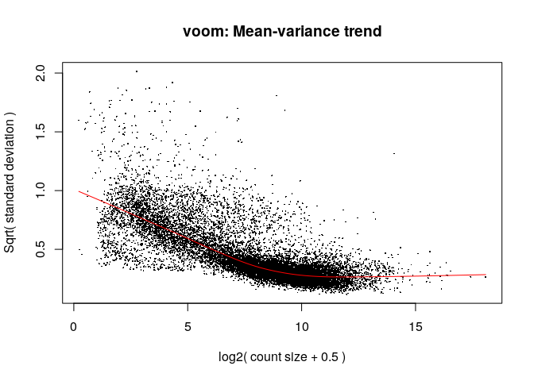
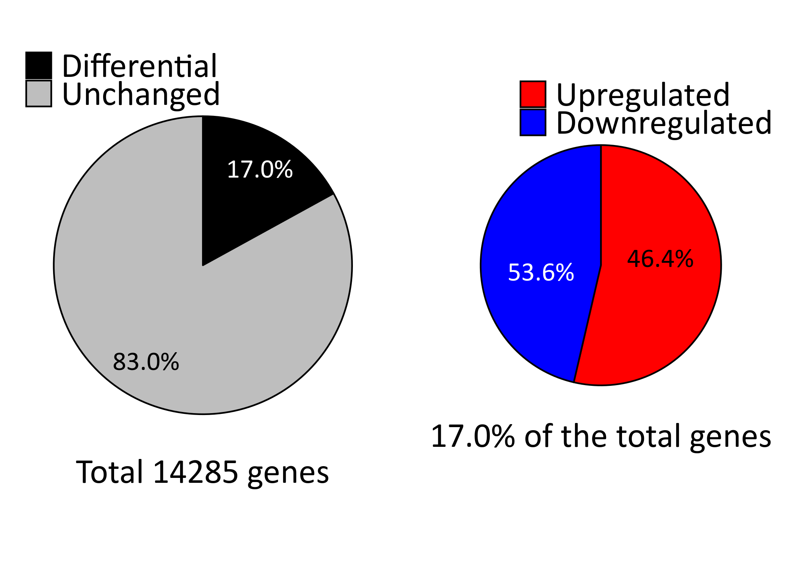
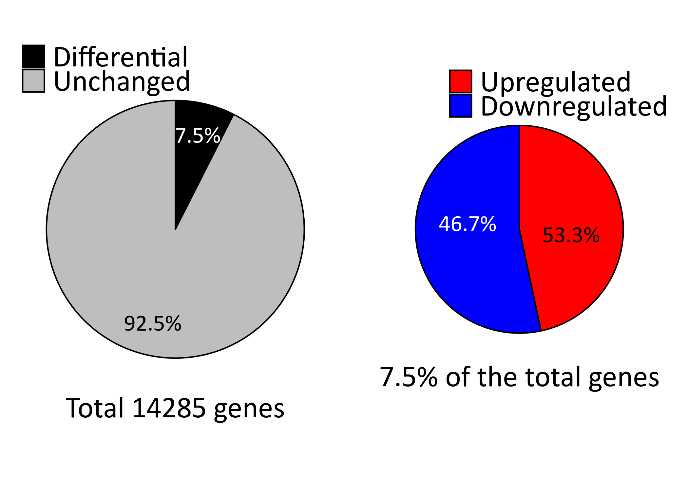
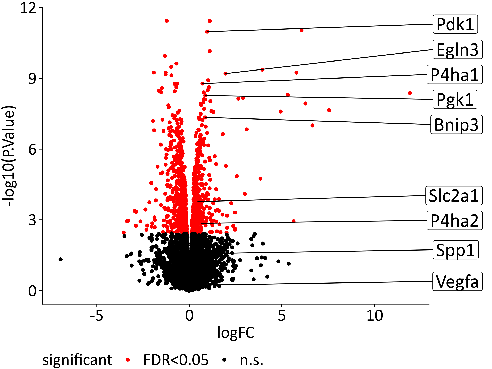
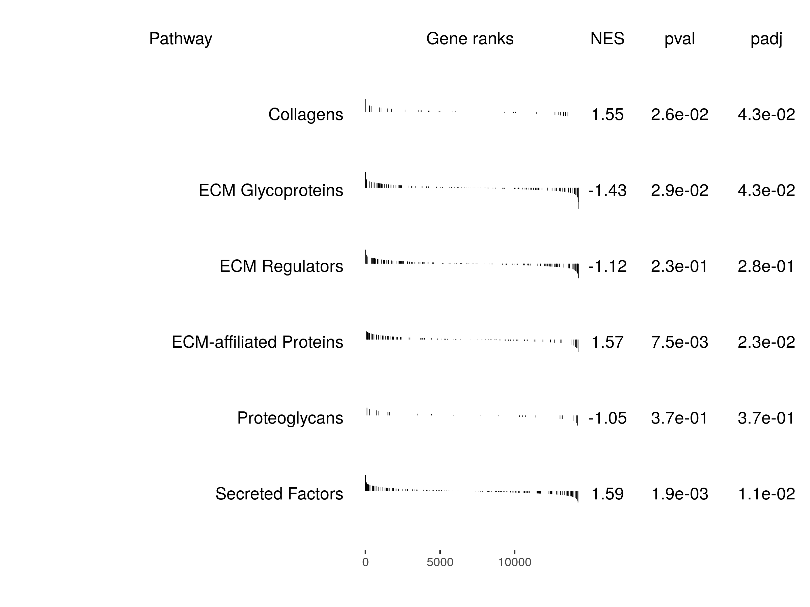
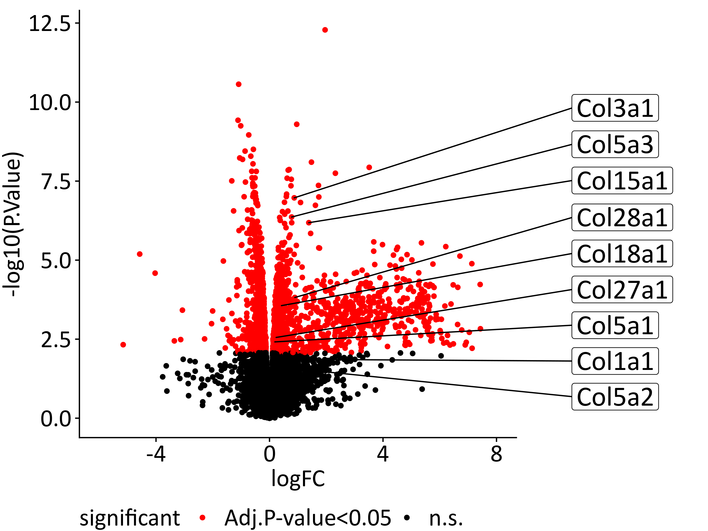

Differential expression analysis in Mieloid PHD2 deficiency in
atherogenesis
================
Javier Perales-Patón - <javier.perales@bioquant.uni-heidelberg.de> -
ORCID: 0000-0003-0780-6683

## Set-up environment

Define random seed for reproduciblity, and output folder.

``` r
# Seed number
set.seed(1234)
# Output directory
OUTDIR <- "./01_DGE_output/"
if(!dir.exists(OUTDIR)) dir.create(OUTDIR);

# Figures
FIGDIR <- paste0(OUTDIR, "/figures/")
knitr::opts_chunk$set(fig.path=FIGDIR)
knitr::opts_chunk$set(dev=c('png','tiff'))
# Data
DATADIR <- paste0(OUTDIR, "/data/")
if(!dir.exists(DATADIR)) dir.create(DATADIR);
```

## Load libraries

Essential R libraries for the analysis.

``` r
library(limma)
library(edgeR)
library(dplyr)
library(ggplot2)
library(ggrepel)
source("../src/graphics.R") 
library(cowplot)
library(GSEABase)
library(fgsea)
library(reshape2)
library(gridExtra)
```

## Load data

The raw sequencing data has been processed to quantify gene expression
using kallisto. Read material and methods section of the manuscript for
a detailed description. Processed data is available under the accession
number in the main [README](../README.md%22) file at a public
repository.

We load read counts and metadata for the
samples.

``` r
cnt <- read.table("../data/bulk/MST_MC_N_fibroblasts_PHD2-rawdata.txt", sep="\t", header = TRUE, check.names = FALSE)
rownames(cnt) <- cnt[,1]
cnt <- cnt[,-1]

targets <- read.table("../data/bulk/MST_MC_N_fibroblasts_PHD2-metadata.txt", sep="\t",header=TRUE, colClasses = "character")
targets$Sample <- gsub(" ","_",targets$Sample)
```

Prepare the gene expression matrices for the analysis. Rename samples.

``` r
# Rename samples
# Check data and metadata are in the same order
stopifnot(all(colnames(cnt)==targets$FastQ))

# Rename with samplenames
colnames(cnt) <- targets$Sample

# Reorder samples for easy visualization
cnt <- cnt[, order(colnames(cnt))]
targets <- targets[order(targets$Sample), ]

# Sanity check
stopifnot(all(colnames(cnt)==targets$Sample))

# Create metadata
  # Group
  gr <- targets$Group
  # Genotype/condition
  gt <- factor(gsub("^(3T3|MΦ)_", "", targets$Group), levels=c(c("PHD2_WT", "PHD2_KO")))
  # Cell line
  cell <- factor(unlist(sapply(targets$Group, function(z) strsplit(z, split="_")[[1]][1])))
  # Replicate
  repl <- factor(targets$Replicate)
# Check.names
gr <- gsub("^3T3_","Fib_",gr)
gr <- gsub("^MΦ_","MC_",gr)
```

## Test for differential gene expression

Create DGElist for limma-voom tranformation, and Empirical Bayes method
for differential gene expession.

``` r
y <- DGEList(counts = cnt, group = gr, genes = rownames(cnt))
design <- model.matrix(~ 0 + gr)
colnames(design) <- gsub("^gr","",colnames(design))
```

Filter out genes that are not expressed in the experiments.

``` r
keep <- filterByExpr(y, design)
# How many genes are retrieved after filtering?
table(keep)
```

    ## keep
    ## FALSE  TRUE 
    ## 18259 14285

Voom transformation

``` r
# Retrieve selected genes
y <- y[keep,,keep.lib.sizes=FALSE]
y <- calcNormFactors(y)

v <- voom(y, design, plot=TRUE)
```

<!-- -->

Statistical contrast for Macrophages and fibroblasts \* Macrophages with
PHD-KO (vs. PHD2-wt macrophages) \* Fibroblasts co-cultured with PHD-KO
macrophages (vs. co-cultured with PHD2-wt macrophages)

``` r
fit <- lmFit(v, design)
cont.mat <- makeContrasts("Fib_PHD2"=Fib_PHD2_KO - Fib_PHD2_WT,
                          "MC_PHD2"=MC_PHD2_KO - MC_PHD2_WT,
                          levels=design)
fit <- eBayes(fit)
fit2 <- contrasts.fit(fit, cont.mat)
eBay <- eBayes(fit2)
```

## Broad statistics on DEGs

Just check how many genes are differentially expressed

``` r
DGE_cnt <- apply(decideTests(eBay),2, table)
print(DGE_cnt)
```

    ##     Contrasts
    ##      Fib_PHD2 MC_PHD2
    ##   -1     1126     568
    ##   0     11857   13220
    ##   1      1302     497

We could visualize the proportion of differentially expressed genes.

``` r
NGenes <- colSums(DGE_cnt)

# First dataframe with in/out
DGE_perc <- sweep(DGE_cnt,2, STATS = colSums(DGE_cnt),FUN="/")
DGE_perc <- DGE_perc*100

DGE_perc.df <- data.frame("type"=c(rep("Differential", 2),
                  rep("Unchanged",2)),
             "value"=c(colSums(DGE_perc[c("-1","1"),]),
                   DGE_perc["0",]),
             "Contrasts"=rep(colnames(DGE_perc),2))
DGE_perc.df$type <- factor(DGE_perc.df$type, levels=c("Unchanged","Differential"))

# Second dataframe with updown
DGE_perc2 <- sweep(DGE_cnt[c("-1","1"), ],2, STATS = colSums(DGE_cnt[c("-1","1"),]),FUN="/")
DGE_perc2 <- DGE_perc2*100
DGE_perc.df2 <- reshape2::melt(DGE_perc2)
DGE_perc.df2$Var1 <- factor(c("-1"="Downregulated","1"="Upregulated")[as.character(DGE_perc.df2$Var1)],
               levels=c("Downregulated","Upregulated"))
colnames(DGE_perc.df2) <- c("type","Contrasts","value")

# Pie chart code: https://stackoverflow.com/questions/16184188/ggplot-facet-piechart-placing-text-in-the-middle-of-pie-chart-slices

blank_theme <- theme_minimal()+
  theme(
  axis.title.y = element_blank(),
  panel.border = element_blank(),
  panel.grid=element_blank(),
  axis.ticks = element_blank(),
  plot.title=element_text(size=14, face="bold")
  )

for(cnt in colnames(DGE_cnt)) {
    cat(paste0("Arranging plots for ",cnt,"\n"),file=stdout())
pie1 <- ggplot(subset(DGE_perc.df,Contrasts==cnt), aes(x="", y=value, fill=type)) +
    geom_bar(width=1, stat = "identity", colour="black") +
    coord_polar("y", start=0) +
    scale_fill_manual(values=c("grey","black"), guide = guide_legend(reverse=TRUE)) +
    geom_text(aes(x=1.25,y = cumsum(value)- (0.5*value),
            label = paste0(sprintf("%1.1f",value), "%")), 
          size=6, col=c("white","black"), family=fontTXT) +
    blank_theme + 
    ylab(paste0("Total ",NGenes[cnt]," genes")) +
    theme(axis.text.x=element_blank(),
          axis.title.x = element_text(family=fontTXT,size=22),
          legend.title=element_blank(),
          legend.text = element_text(size=22, family=fontTXT),
          legend.position = c(0,0.9),
          legend.justification = c(0,0)) 

pie2 <- ggplot(subset(DGE_perc.df2,Contrasts==cnt), aes(x="", y=value, fill=type)) +
    geom_bar(width=1, stat = "identity", colour="black") +
    coord_polar("y", start=0) +
    scale_fill_manual(values=c("blue","red"), guide = guide_legend(reverse=TRUE)) +
    geom_text(aes(y = cumsum(value)- (0.5*value), 
            label = paste0(sprintf("%1.1f",value), "%")), 
          size=6, col=c("black","white"), family=fontTXT) +
    blank_theme +
    ylab(paste0(sprintf("%1.1f",
                subset(DGE_perc.df, Contrasts==cnt & 
                   type=="Differential")$value),
                "%",
            " of the total genes")) +
    theme(axis.text.x=element_blank(),
          axis.title.x = element_text(family=fontTXT,size=22),
          legend.title=element_blank(),
          legend.text = element_text(size=22, family=fontTXT),
          legend.position = c(0.2,0.9),
          legend.justification = c(0,0),
          plot.margin = unit(c(1,1,1,1), "cm"))

grid.arrange(pie1, pie2, nrow=1)
}
```

    ## Arranging plots for Fib_PHD2

<!-- -->

    ## Arranging plots for MC_PHD2

<!-- -->

## Diagnostics and save differentially expressed genes

Write tables as supplementary data for the records and further
interpretation.

``` r
for(cont in colnames(cont.mat)) {
  cat(paste0("Registering differential expression for ",cont,"\n"),
    file=stdout())
  topTab <- topTable(eBay, coef=cont, number = Inf)
  # DEGs table
  write.table(topTab, file=paste0(DATADIR,cont,"_diffexpr.tsv"),sep="\t",
                                  row.names=FALSE, col.names=TRUE, quote=FALSE)
  # Volcano plot
  plot(eBay$coefficients[,cont], -log10(eBay$p.value[,cont]),
       xlab="log2-fold-change", ylab="-log10(pvalue)", cex=0.7)
  # Histogram of p-vals
  hist(eBay$p.value[,cont])
}
```

    ## Registering differential expression for Fib_PHD2

<!-- --><!-- -->

    ## Registering differential expression for MC_PHD2

<!-- --><!-- -->

We conclude this section with the charaterization of the cellular state
in the two experiments using the hallmark gene set collection from
MsigDB. We are particularly interested in PHD2cKO Macrophages.

``` r
mmu2hsa <- readRDS("../data/Gene_annotation/hgnc2mgi_hsa2mmu.rds")

H <- getGmt("../data/MSigDB/h.all.v7.0.symbols.gmt")
H <- lapply(geneIds(H), function(z) unlist(sapply(z, function(j) mmu2hsa[[j]])))

set.seed(1234)
H.res <- apply(eBay$t,2,function(rnk) {
  res <- fgsea(pathways = H, stats = rnk, nperm = 1000)
  res <- res[order(res$padj, decreasing = FALSE),]
  return(res)
})
```

    ## Warning in fgsea(pathways = H, stats = rnk, nperm = 1000): There are ties in the preranked stats (0.09% of the list).
    ## The order of those tied genes will be arbitrary, which may produce unexpected results.
    
    ## Warning in fgsea(pathways = H, stats = rnk, nperm = 1000): There are ties in the preranked stats (0.09% of the list).
    ## The order of those tied genes will be arbitrary, which may produce unexpected results.

``` r
for(cont in names(H.res)) {
  res.tab <- H.res[[cont]]
  res.tab$leadingEdge <- unlist(lapply(res.tab$leadingEdge, function(z) paste(z, collapse = ",")))
  write.table(res.tab, paste0(DATADIR,cont,"_Hallmarks_gsea.tsv"),sep="\t",
              row.names=FALSE, col.names=TRUE, quote=FALSE)
}
```

## Visualization of differentially expressed genes

We are interested in a series of genes for each contrast based on the
experimental evidence (qPCR and Western blots) carried out in the
laboratory.

### Macrophages

In the case of the Macrophages upon PHD2-KO, we are interested in a
series of genes and proteins related on how these cells responding to
hypoxia and self-induced apoptosis.

``` r
Mac_interesting_genes <- getGmt("../data/Prior/MC_PHD2_diff.gmt")
Mac_interesting_genes <- unlist(geneIds(Mac_interesting_genes))
if(any(!Mac_interesting_genes %in% rownames(v$E))) {
    cat(paste("The following genes are not present in the gene expr matrix:","\n",
          paste(setdiff(Mac_interesting_genes, rownames(v$E)), collapse=","),
          "\n"),
          file=stdout())
    Mac_interesting_genes <- intersect(Mac_interesting_genes, rownames(v$E))
}
```

    ## The following genes are not present in the gene expr matrix: 
    ##  Epo

``` r
topTab <- topTable(eBay, coef="MC_PHD2", number = Inf)
topTab$significant <- ifelse(topTab$adj.P.Val < 0.05,"FDR<0.05","n.s.")
topTab$show <- topTab$genes %in% Mac_interesting_genes
 
p = ggplot(topTab, aes(logFC, -log10(P.Value))) +
    geom_point(aes(col=significant)) +
    scale_color_manual(values=c("red", "black"))
  
  
p <- p+geom_label_repel(data=topTab[topTab$show,],
                          aes(label=genes), family=fontTXT, size=8,
                          force=2,
              xlim = c(13.0,16.0),
                          nudge_y=0.05, direction = "y", segment.size = 0.5) + 
    coord_cartesian(xlim = c(-7, 12), clip = "off") +
    theme_cowplot() +
    theme(text = element_text(family=fontTXT, size=20),
      legend.text = element_text(family=fontTXT, size=20),
      legend.position = "bottom",
      axis.text = element_text(family=fontTXT, size=20),
        plot.margin = unit(c(0.3, 2.6, 0.1, 0.1), "cm") 
      )
p
```

<!-- -->

### Fibroblasts

In the case of the fibroblasts, the coculture with medium conditioned
with PHD2-cKO Macrophage supernadant enhances collagen production. Thus
we are going to visualize how these regulates collagen genes upon
perturbation.

First, we obtain which collagen genes are enriched in the stimulated
fibroblasts using leading edge analysis from pre-ranked GSEA. At the
same time, we test for other genes related to extracellular
matrix.

``` r
#   # Alternative option is to use the gene set collection from MSigDB, but we found that
#   # the matrisome DB is more complete in terms of orthologs from mouse.
#   mmu2hsa <- readRDS("../data/Gene_annotation/hgnc2mgi_hsa2mmu.rds")
#   COL <- getGmt("../data/MSigDB/collagen.gmt")
#   COL <- lapply(geneIds(COL), function(z) unlist(sapply(z, function(j) mmu2hsa[[j]])))

ECM <- read.table("../data/Matrisome/matrisome_mm_masterlist.tsv", sep="\t", header=TRUE, stringsAsFactors = FALSE)
ECM <- split(ECM$Gene.Symbol,ECM$Category)
ECM <- ECM[names(ECM)!="n/a"]

rnk <- eBay$t[, "Fib_PHD2"]
set.seed(123)
ECM.res <- fgsea(pathways=ECM, stats=rnk, nperm=1000)
```

    ## Warning in fgsea(pathways = ECM, stats = rnk, nperm = 1000): There are ties in the preranked stats (0.09% of the list).
    ## The order of those tied genes will be arbitrary, which may produce unexpected results.

``` r
(ECM.res)
```

    ##                    pathway        pval       padj         ES       NES
    ## 1:               Collagens 0.026022305 0.04312115  0.4733178  1.550705
    ## 2:       ECM Glycoproteins 0.028747433 0.04312115 -0.3331060 -1.425485
    ## 3:          ECM Regulators 0.234042553 0.28085106 -0.2552750 -1.120594
    ## 4: ECM-affiliated Proteins 0.007547170 0.02264151  0.3830518  1.565932
    ## 5:           Proteoglycans 0.371991247 0.37199125 -0.3494861 -1.054776
    ## 6:        Secreted Factors 0.001851852 0.01111111  0.3574721  1.590064
    ##    nMoreExtreme size                                       leadingEdge
    ## 1:           13   31 Col3a1,Col5a3,Col15a1,Col28a1,Col18a1,Col27a1,...
    ## 2:           13  115         Tinagl1,Fbln5,Wisp2,Cyr61,Smoc2,Thbs1,...
    ## 3:          109  139        Serpine2,Adamtsl5,Lox,Cd109,Mmp2,Timp2,...
    ## 4:            3   92     Plxnc1,Sema7a,Sdc3,Clec4a1,Plxdc1,Clec12a,...
    ## 5:          169   22                   Podnl1,Ogn,Hapln4,Aspn,Bgn,Bcan
    ## 6:            0  160          Igf1,Angptl4,Cxcl14,Ccl3,Igf2,Cx3cl1,...

``` r
# Save it
ECM.tab <- ECM.res
ECM.tab$leadingEdge <- unlist(lapply(ECM.tab$leadingEdge, function(z) paste(z, collapse=",")))
write.table(ECM.tab, sep="\t", file = paste0(DATADIR, "/Fib_PHD2_prerankedGSEA_matrisome.tsv"), 
        col.names=TRUE, row.names=FALSE, quote=FALSE)
```

Let’s visualize the results in a single
plot

``` r
# plotEnrichment(ECM[["Collagens"]], rnk) + labs(title="Fibroblasts PHD2")
plotGseaTable(ECM, rnk, ECM.res)  + 
    theme(text=element_text(family=fontTXT, color="black", size=18),
          axis.text=element_text(family=fontTXT, color="black", size=18)
          )
```

<!-- -->

    ## NULL

``` r
topTab <- topTable(eBay, coef="Fib_PHD2", number = Inf)
topTab$significant <- ifelse(topTab$adj.P.Val < 0.05,"FDR<0.05","n.s.")
topTab$show <- topTab$genes %in% unlist(ECM.res[which(ECM.res$pathway=="Collagens"), "leadingEdge"])
 
p = ggplot(topTab, aes(x=logFC, y=-log10(P.Value))) +
    geom_point(aes(col=significant)) +
    coord_cartesian(xlim=c(-6, 8), clip = "off") +
    scale_color_manual(values=c("red", "black"))
  
  
p <- p+geom_label_repel(data=topTab[topTab$show,],
                          aes(label=genes), family=fontTXT, size=8,
                          force=2, xlim=c(10.5, 12.0),
                          nudge_y=0.05, direction = "y", segment.size = 0.5) + 
    theme_cowplot() +
    theme(text = element_text(family=fontTXT, size=20),
      legend.text = element_text(family=fontTXT, size=20),
      legend.position = "bottom",
      axis.text = element_text(family=fontTXT, size=20),
        plot.margin = unit(c(0.3, 5.5, 0.1, 0.1), "cm") 
      )
p
```

<!-- -->

## Save processed data

We are going to save the eBayes object for downstream analysis.

``` r
# The Elist object, with voom-transformed gene expression
saveRDS(v, paste0(DATADIR,"/v.rds"))
# The eBayes object from the two contrasts
saveRDS(eBay, paste0(DATADIR,"/eBay.rds"))
```

## Session info

``` r
sessionInfo()
```

    ## R version 3.6.1 (2019-07-05)
    ## Platform: x86_64-pc-linux-gnu (64-bit)
    ## Running under: Ubuntu 18.04.3 LTS
    ## 
    ## Matrix products: default
    ## BLAS:   /usr/lib/x86_64-linux-gnu/blas/libblas.so.3.7.1
    ## LAPACK: /usr/lib/x86_64-linux-gnu/lapack/liblapack.so.3.7.1
    ## 
    ## locale:
    ##  [1] LC_CTYPE=en_US.UTF-8       LC_NUMERIC=C              
    ##  [3] LC_TIME=en_GB.UTF-8        LC_COLLATE=en_US.UTF-8    
    ##  [5] LC_MONETARY=en_GB.UTF-8    LC_MESSAGES=en_US.UTF-8   
    ##  [7] LC_PAPER=en_GB.UTF-8       LC_NAME=C                 
    ##  [9] LC_ADDRESS=C               LC_TELEPHONE=C            
    ## [11] LC_MEASUREMENT=en_GB.UTF-8 LC_IDENTIFICATION=C       
    ## 
    ## attached base packages:
    ## [1] stats4    parallel  stats     graphics  grDevices utils     datasets 
    ## [8] methods   base     
    ## 
    ## other attached packages:
    ##  [1] rmarkdown_1.15       gridExtra_2.3        reshape2_1.4.3      
    ##  [4] fgsea_1.10.1         Rcpp_1.0.2           GSEABase_1.46.0     
    ##  [7] graph_1.62.0         annotate_1.62.0      XML_3.98-1.20       
    ## [10] AnnotationDbi_1.46.1 IRanges_2.18.2       S4Vectors_0.22.1    
    ## [13] Biobase_2.44.0       BiocGenerics_0.30.0  cowplot_1.0.0       
    ## [16] extrafont_0.17       ggrepel_0.8.1        ggplot2_3.2.1       
    ## [19] dplyr_0.8.3          edgeR_3.26.7         limma_3.40.6        
    ## [22] nvimcom_0.9-82      
    ## 
    ## loaded via a namespace (and not attached):
    ##  [1] locfit_1.5-9.1      lattice_0.20-38     assertthat_0.2.1   
    ##  [4] zeallot_0.1.0       digest_0.6.21       R6_2.4.0           
    ##  [7] plyr_1.8.4          backports_1.1.4     RSQLite_2.1.2      
    ## [10] evaluate_0.14       pillar_1.4.2        rlang_0.4.0        
    ## [13] lazyeval_0.2.2      data.table_1.12.8   extrafontdb_1.0    
    ## [16] blob_1.2.0          Matrix_1.2-17       labeling_0.3       
    ## [19] BiocParallel_1.18.1 stringr_1.4.0       RCurl_1.95-4.12    
    ## [22] bit_1.1-14          munsell_0.5.0       compiler_3.6.1     
    ## [25] xfun_0.9            pkgconfig_2.0.3     htmltools_0.3.6    
    ## [28] tidyselect_0.2.5    tibble_2.1.3        crayon_1.3.4       
    ## [31] withr_2.1.2         bitops_1.0-6        grid_3.6.1         
    ## [34] xtable_1.8-4        Rttf2pt1_1.3.8      gtable_0.3.0       
    ## [37] DBI_1.0.0           magrittr_1.5        scales_1.0.0       
    ## [40] stringi_1.4.3       vctrs_0.2.0         fastmatch_1.1-0    
    ## [43] tools_3.6.1         bit64_0.9-7         glue_1.3.1         
    ## [46] purrr_0.3.2         yaml_2.2.0          colorspace_1.4-1   
    ## [49] memoise_1.1.0       knitr_1.24

``` r
{                                                                                                                                                                                                           
sink(file=paste0(OUTDIR,"/sessionInfo.txt"))
print(sessionInfo())
sink()
}
```
