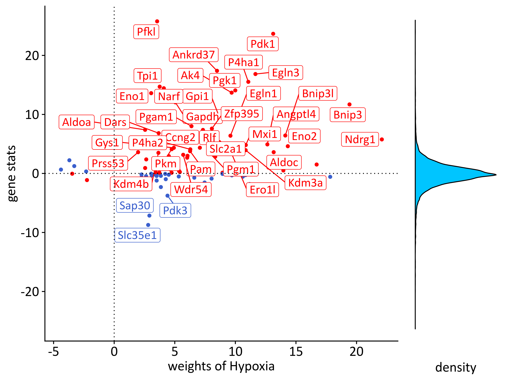

Inference of TF activities in Mieloid PHD2 deficiency in atherogenesis
================
Javier Perales-Patón - <javier.perales@bioquant.uni-heidelberg.de> -
ORCID: 0000-0003-0780-6683

We will use the ranking of differentially expressed genes by the
moderated-t statistics to estimate the pathways activities using
PROGENy. Then, we will focused on Hypoxia response in macrophages upon
PHD2 knock-out given two facts: \* Exploratory data analysis (EDA) has
shown that hypoxia is driving the major pattern of transcriptional
heterogeneity in the dataset, separating the two conditions (PHD2cKO vs
WT). \* Actually the literature has described that PHD2 impair leads to
Hif1a stabilization, which triggers hypoxia response.

## Set-up environment

Define randome seed and output folder.

``` r
# Seed number
set.seed(1234)
# Output directory
OUTDIR <- "./02_pathway_output/"
if(!dir.exists(OUTDIR)) dir.create(OUTDIR);

# Figures
FIGDIR <- paste0(OUTDIR, "/figures/")
knitr::opts_chunk$set(fig.path=FIGDIR)
knitr::opts_chunk$set(dev=c('png','tiff'))
# Data
DATADIR <- paste0(OUTDIR, "/data/")
if(!dir.exists(DATADIR)) dir.create(DATADIR);
```

## Load libraries

Essential R libraries.

``` r
library(limma)
library(progeny)
```

## Load data

We use the output data from previous step (01). In particular, the eBay
object from limma which contains the contrasts and
statistics.

``` r
eBay <- readRDS("./01_DGE_output/data/eBay.rds")
```

## PROGENy analysis

``` r
source("../src/runProgenyFast.R") # Ack. to A. Dugourd (c under GPL license)
progeny.mat <- read.table("../data/Prior/progeny_matrix_mouse_v1.txt",sep=",",header=TRUE)
df <- data.frame(ID=rownames(eBay$t),
                 Fib_PHD2=eBay$t[,"Fib_PHD2"],
                 MC_PHD2=eBay$t[,"MC_PHD2"])

set.seed(1234)
progeny.res <- runProgenyFast(df, progeny.mat)
pvals <- apply(progeny.res, 2, function(z) pnorm(z))
pvals <- apply(pvals, c(1,2), function(pval) ifelse(pval > 0.5, (1-pval)*2, pval*2))
colnames(pvals) <- colnames(progeny.res)

for(tag in names(progeny.res)) {
    # Make a simple table with the outcome
    progeny.cont <- cbind(Activity=progeny.res[,tag],Pvalue=pvals[,tag])
    # Show in stdout
    cat(paste("Pathway activity from",tag,"\n"), file=stdout())
    print(progeny.cont)
    # Save if as a supplementary table in a file
  write.table(progeny.cont,
              file = paste0(DATADIR,"/",tag,"_progeny.tsv"),
              sep="\t", col.names = NA, row.names = TRUE)
}
```

    ## Pathway activity from Fib_PHD2 
    ##             Activity       Pvalue
    ## Androgen -0.27157138 7.859516e-01
    ## EGFR      1.53363515 1.251194e-01
    ## Estrogen -0.78675976 4.314225e-01
    ## Hypoxia   3.89751711 9.718396e-05
    ## JAK.STAT  6.60422551 3.996004e-11
    ## MAPK      4.27604836 1.902399e-05
    ## NFkB      4.36928313 1.246551e-05
    ## p53      -2.25814431 2.393666e-02
    ## PI3K      0.97050140 3.317966e-01
    ## TGFb     -2.91074062 3.605732e-03
    ## TNFa      4.77809024 1.769680e-06
    ## Trail    -0.03337129 9.733785e-01
    ## VEGF     -1.57821272 1.145167e-01
    ## WNT       0.65141387 5.147794e-01
    ## Pathway activity from MC_PHD2 
    ##             Activity       Pvalue
    ## Androgen  -1.8377097 6.610519e-02
    ## EGFR       0.7189888 4.721478e-01
    ## Estrogen  -1.3031314 1.925299e-01
    ## Hypoxia   14.8533291 0.000000e+00
    ## JAK.STAT -11.0703875 1.746438e-28
    ## MAPK       1.8350592 6.649691e-02
    ## NFkB      -6.2198008 4.977865e-10
    ## p53       -0.9619877 3.360558e-01
    ## PI3K      -3.1438173 1.667595e-03
    ## TGFb       0.8216429 4.112801e-01
    ## TNFa      -3.7390722 1.847007e-04
    ## Trail     -1.2691690 2.043808e-01
    ## VEGF      -2.3897043 1.686194e-02
    ## WNT       -1.3072662 1.911223e-01

It seems that hypoxia is highly active in Macrophages upon PHD2-KO
(z-score=14.85, pval\<0.0001). Thus we make a visualization of this
activation for publication.

``` r
source("../src/progenyScores.R")
```

    ## 
    ## ********************************************************

    ## Note: As of version 1.0.0, cowplot does not change the

    ##   default ggplot2 theme anymore. To recover the previous

    ##   behavior, execute:
    ##   theme_set(theme_cowplot())

    ## ********************************************************

    ## Loading required package: RSQLite

    ## Loading required package: RCurl

    ## Loading required package: bitops

    ## Loading required package: BiocGenerics

    ## 
    ## Attaching package: 'BiocGenerics'

    ## The following objects are masked from 'package:parallel':
    ## 
    ##     clusterApply, clusterApplyLB, clusterCall, clusterEvalQ,
    ##     clusterExport, clusterMap, parApply, parCapply, parLapply,
    ##     parLapplyLB, parRapply, parSapply, parSapplyLB

    ## The following object is masked from 'package:gridExtra':
    ## 
    ##     combine

    ## The following object is masked from 'package:limma':
    ## 
    ##     plotMA

    ## The following objects are masked from 'package:stats':
    ## 
    ##     IQR, mad, sd, var, xtabs

    ## The following objects are masked from 'package:base':
    ## 
    ##     anyDuplicated, append, as.data.frame, basename, cbind,
    ##     colnames, dirname, do.call, duplicated, eval, evalq, Filter,
    ##     Find, get, grep, grepl, intersect, is.unsorted, lapply, Map,
    ##     mapply, match, mget, order, paste, pmax, pmax.int, pmin,
    ##     pmin.int, Position, rank, rbind, Reduce, rownames, sapply,
    ##     setdiff, sort, table, tapply, union, unique, unsplit, which,
    ##     which.max, which.min

``` r
source("../src/graphics.R")
```

    ## Loading required package: extrafont

    ## Registering fonts with R

``` r
progeny_scatter.out <- progenyScatter(df, progeny.mat, fontfamily=fontTXT)
```

    ## [1] "weights of Androgen"
    ## [1] "weights of EGFR"
    ## [1] "weights of Estrogen"
    ## [1] "weights of Hypoxia"
    ## [1] "weights of JAK.STAT"
    ## [1] "weights of MAPK"
    ## [1] "weights of NFkB"
    ## [1] "weights of p53"
    ## [1] "weights of PI3K"
    ## [1] "weights of TGFb"
    ## [1] "weights of TNFa"
    ## [1] "weights of Trail"
    ## [1] "weights of VEGF"
    ## [1] "weights of WNT"
    ## [1] "weights of Androgen"
    ## [1] "weights of EGFR"
    ## [1] "weights of Estrogen"
    ## [1] "weights of Hypoxia"
    ## [1] "weights of JAK.STAT"
    ## [1] "weights of MAPK"
    ## [1] "weights of NFkB"
    ## [1] "weights of p53"
    ## [1] "weights of PI3K"
    ## [1] "weights of TGFb"
    ## [1] "weights of TNFa"
    ## [1] "weights of Trail"
    ## [1] "weights of VEGF"
    ## [1] "weights of WNT"

``` r
plot(progeny_scatter.out[[2]]$Hypoxia)
```

<!-- -->

## Session info

``` r
sessionInfo()
```

    ## R version 3.6.1 (2019-07-05)
    ## Platform: x86_64-pc-linux-gnu (64-bit)
    ## Running under: Ubuntu 18.04.3 LTS
    ## 
    ## Matrix products: default
    ## BLAS:   /usr/lib/x86_64-linux-gnu/blas/libblas.so.3.7.1
    ## LAPACK: /usr/lib/x86_64-linux-gnu/lapack/liblapack.so.3.7.1
    ## 
    ## locale:
    ##  [1] LC_CTYPE=en_US.UTF-8       LC_NUMERIC=C              
    ##  [3] LC_TIME=en_GB.UTF-8        LC_COLLATE=en_US.UTF-8    
    ##  [5] LC_MONETARY=en_GB.UTF-8    LC_MESSAGES=en_US.UTF-8   
    ##  [7] LC_PAPER=en_GB.UTF-8       LC_NAME=C                 
    ##  [9] LC_ADDRESS=C               LC_TELEPHONE=C            
    ## [11] LC_MEASUREMENT=en_GB.UTF-8 LC_IDENTIFICATION=C       
    ## 
    ## attached base packages:
    ## [1] parallel  stats     graphics  grDevices utils     datasets  methods  
    ## [8] base     
    ## 
    ## other attached packages:
    ##  [1] extrafont_0.17      UniProt.ws_2.24.2   BiocGenerics_0.30.0
    ##  [4] RCurl_1.95-4.12     bitops_1.0-6        RSQLite_2.1.2      
    ##  [7] cowplot_1.0.0       ggrepel_0.8.1       gridExtra_2.3      
    ## [10] ggplot2_3.2.1       reshape2_1.4.3      readr_1.3.1        
    ## [13] progeny_1.6.0       limma_3.40.6        rmarkdown_1.15     
    ## [16] nvimcom_0.9-82     
    ## 
    ## loaded via a namespace (and not attached):
    ##  [1] tidyselect_0.2.5     xfun_0.9             purrr_0.3.2         
    ##  [4] colorspace_1.4-1     vctrs_0.2.0          BiocFileCache_1.8.0 
    ##  [7] htmltools_0.3.6      stats4_3.6.1         yaml_2.2.0          
    ## [10] blob_1.2.0           rlang_0.4.0          pillar_1.4.2        
    ## [13] glue_1.3.1           withr_2.1.2          DBI_1.0.0           
    ## [16] rappdirs_0.3.1       dbplyr_1.4.2         bit64_0.9-7         
    ## [19] plyr_1.8.4           stringr_1.4.0        munsell_0.5.0       
    ## [22] gtable_0.3.0         evaluate_0.14        memoise_1.1.0       
    ## [25] labeling_0.3         Biobase_2.44.0       knitr_1.24          
    ## [28] IRanges_2.18.2       curl_4.2             AnnotationDbi_1.46.1
    ## [31] Rttf2pt1_1.3.8       Rcpp_1.0.2           scales_1.0.0        
    ## [34] backports_1.1.4      S4Vectors_0.22.1     bit_1.1-14          
    ## [37] hms_0.5.1            digest_0.6.21        stringi_1.4.3       
    ## [40] dplyr_0.8.3          grid_3.6.1           tools_3.6.1         
    ## [43] magrittr_1.5         lazyeval_0.2.2       tibble_2.1.3        
    ## [46] extrafontdb_1.0      crayon_1.3.4         pkgconfig_2.0.3     
    ## [49] zeallot_0.1.0        httr_1.4.1           assertthat_0.2.1    
    ## [52] R6_2.4.0             compiler_3.6.1

``` r
{                                                                                                                                                                                                           
sink(file=paste0(OUTDIR,"/sessionInfo.txt"))
print(sessionInfo())
sink()
}
```
