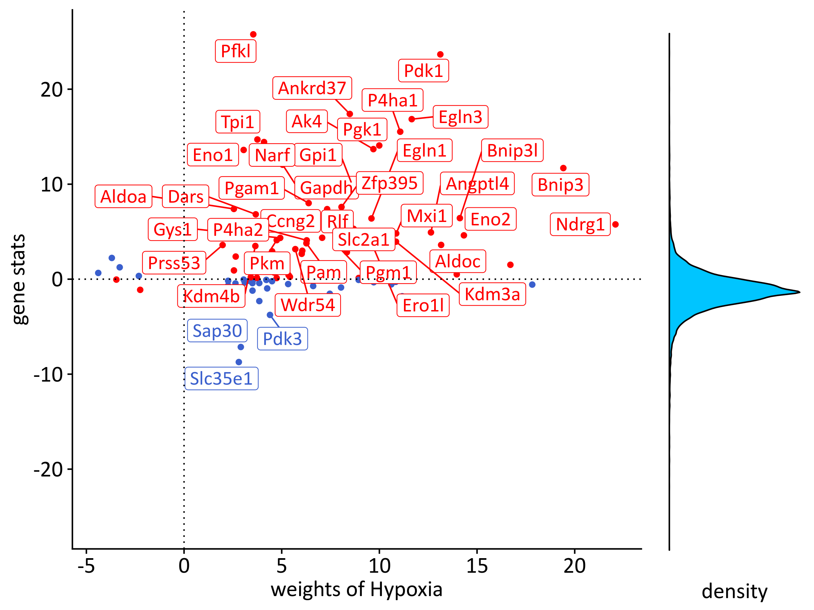

Inference of TF activities in Mieloid PHD2 deficiency in atherogenesis
================
Javier Perales-Paton - <javier.perales@bioquant.uni-heidelberg.de>

## Set-up environment

``` r
set.seed(1234)
outdir <- "./output/04_TF/"
if(!dir.exists(outdir)) dir.create(outdir, recursive = TRUE)
```

## Load libraries

``` r
library(limma)
library(progeny)
```

## Load data

We use the output from previous step, 01 differential expression.

``` r
eBay <- readRDS("./output/01_bulk_dge/eBay.rds")
```

## PROGENy analysis

``` r
source("../src/runProgenyFast.R")
progeny.mat <- read.table("../data/Prior/progeny_matrix_mouse_v1.txt",sep=",",header=TRUE)
df <- data.frame(ID=rownames(eBay$t),
                 Fib_PHD2=eBay$t[,"Fib_PHD2"],
                 MC_PHD2=eBay$t[,"MC_PHD2"])

set.seed(1234)
progeny.res <- runProgenyFast(df, progeny.mat)
pvals <- apply(progeny.res, 2, function(z) pnorm(z))
pvals <- apply(pvals, c(1,2), function(pval) ifelse(pval > 0.5, (1-pval)*2, pval*2))
colnames(pvals) <- colnames(progeny.res)

for(tag in names(progeny.res)) {
    # Make a simple table with the outcome
    progeny.cont <- cbind(Activity=progeny.res[,tag],Pvalue=pvals[,tag])
    # Show in stdout
    cat(paste("Pathway activity from",tag,"\n"), file=stdout())
    print(progeny.cont)
    # Save if as a supplementary table in a file
  write.table(progeny.cont,
              file = paste0(outdir,"/",tag,"_progeny.tsv"),
              sep="\t", col.names = NA, row.names = TRUE)
}
```

    ## Pathway activity from Fib_PHD2 
    ##             Activity       Pvalue
    ## Androgen -0.27157138 7.859516e-01
    ## EGFR      1.53363515 1.251194e-01
    ## Estrogen -0.78675976 4.314225e-01
    ## Hypoxia   3.89751711 9.718396e-05
    ## JAK.STAT  6.60422551 3.996004e-11
    ## MAPK      4.27604836 1.902399e-05
    ## NFkB      4.36928313 1.246551e-05
    ## p53      -2.25814431 2.393666e-02
    ## PI3K      0.97050140 3.317966e-01
    ## TGFb     -2.91074062 3.605732e-03
    ## TNFa      4.77809024 1.769680e-06
    ## Trail    -0.03337129 9.733785e-01
    ## VEGF     -1.57821272 1.145167e-01
    ## WNT       0.65141387 5.147794e-01
    ## Pathway activity from MC_PHD2 
    ##             Activity       Pvalue
    ## Androgen  -1.8377097 6.610519e-02
    ## EGFR       0.7189888 4.721478e-01
    ## Estrogen  -1.3031314 1.925299e-01
    ## Hypoxia   14.8533291 0.000000e+00
    ## JAK.STAT -11.0703875 1.746438e-28
    ## MAPK       1.8350592 6.649691e-02
    ## NFkB      -6.2198008 4.977865e-10
    ## p53       -0.9619877 3.360558e-01
    ## PI3K      -3.1438173 1.667595e-03
    ## TGFb       0.8216429 4.112801e-01
    ## TNFa      -3.7390722 1.847007e-04
    ## Trail     -1.2691690 2.043808e-01
    ## VEGF      -2.3897043 1.686194e-02
    ## WNT       -1.3072662 1.911223e-01

It seems that hypoxia is highly active in Macrophages upon PHD2-KO
(z-score=14.85, pval\<0.0001). Thus we make a visualization of this
activation for Figure 3E in the manuscript.

``` r
source("../src/progenyScores.R")
```

    ## 
    ## ********************************************************

    ## Note: As of version 1.0.0, cowplot does not change the

    ##   default ggplot2 theme anymore. To recover the previous

    ##   behavior, execute:
    ##   theme_set(theme_cowplot())

    ## ********************************************************

    ## Loading required package: RSQLite

    ## Loading required package: RCurl

    ## Loading required package: bitops

    ## Loading required package: BiocGenerics

    ## 
    ## Attaching package: 'BiocGenerics'

    ## The following objects are masked from 'package:parallel':
    ## 
    ##     clusterApply, clusterApplyLB, clusterCall, clusterEvalQ,
    ##     clusterExport, clusterMap, parApply, parCapply, parLapply,
    ##     parLapplyLB, parRapply, parSapply, parSapplyLB

    ## The following object is masked from 'package:gridExtra':
    ## 
    ##     combine

    ## The following object is masked from 'package:limma':
    ## 
    ##     plotMA

    ## The following objects are masked from 'package:stats':
    ## 
    ##     IQR, mad, sd, var, xtabs

    ## The following objects are masked from 'package:base':
    ## 
    ##     anyDuplicated, append, as.data.frame, basename, cbind,
    ##     colnames, dirname, do.call, duplicated, eval, evalq, Filter,
    ##     Find, get, grep, grepl, intersect, is.unsorted, lapply, Map,
    ##     mapply, match, mget, order, paste, pmax, pmax.int, pmin,
    ##     pmin.int, Position, rank, rbind, Reduce, rownames, sapply,
    ##     setdiff, sort, table, tapply, union, unique, unsplit, which,
    ##     which.max, which.min

``` r
source("../src/graphics.R")
```

    ## Loading required package: extrafont

    ## Registering fonts with R

``` r
progeny_scatter.out <- progenyScatter(df, progeny.mat, fontfamily=fontTXT)
```

    ## [1] "weights of Androgen"

    ## Warning: Removed 56 rows containing missing values (geom_label_repel).

    ## [1] "weights of EGFR"

    ## Warning: Removed 82 rows containing missing values (geom_label_repel).

    ## [1] "weights of Estrogen"

    ## Warning: Removed 62 rows containing missing values (geom_label_repel).

    ## [1] "weights of Hypoxia"

    ## Warning: Removed 89 rows containing missing values (geom_label_repel).

    ## [1] "weights of JAK.STAT"

    ## Warning: Removed 104 rows containing missing values (geom_label_repel).

    ## [1] "weights of MAPK"

    ## Warning: Removed 77 rows containing missing values (geom_label_repel).

    ## [1] "weights of NFkB"

    ## Warning: Removed 70 rows containing missing values (geom_label_repel).

    ## [1] "weights of p53"

    ## Warning: Removed 73 rows containing missing values (geom_label_repel).

    ## [1] "weights of PI3K"

    ## Warning: Removed 67 rows containing missing values (geom_label_repel).

    ## [1] "weights of TGFb"

    ## Warning: Removed 63 rows containing missing values (geom_label_repel).

    ## [1] "weights of TNFa"

    ## Warning: Removed 74 rows containing missing values (geom_label_repel).

    ## [1] "weights of Trail"

    ## Warning: Removed 43 rows containing missing values (geom_label_repel).

    ## [1] "weights of VEGF"

    ## Warning: Removed 44 rows containing missing values (geom_label_repel).

    ## [1] "weights of WNT"

    ## Warning: Removed 53 rows containing missing values (geom_label_repel).

    ## [1] "weights of Androgen"

    ## Warning: Removed 57 rows containing missing values (geom_label_repel).

    ## [1] "weights of EGFR"

    ## Warning: Removed 80 rows containing missing values (geom_label_repel).

    ## [1] "weights of Estrogen"

    ## Warning: Removed 61 rows containing missing values (geom_label_repel).

    ## [1] "weights of Hypoxia"

    ## Warning: Removed 61 rows containing missing values (geom_label_repel).

    ## [1] "weights of JAK.STAT"

    ## Warning: Removed 76 rows containing missing values (geom_label_repel).

    ## [1] "weights of MAPK"

    ## Warning: Removed 77 rows containing missing values (geom_label_repel).

    ## [1] "weights of NFkB"

    ## Warning: Removed 67 rows containing missing values (geom_label_repel).

    ## [1] "weights of p53"

    ## Warning: Removed 70 rows containing missing values (geom_label_repel).

    ## [1] "weights of PI3K"

    ## Warning: Removed 68 rows containing missing values (geom_label_repel).

    ## [1] "weights of TGFb"

    ## Warning: Removed 74 rows containing missing values (geom_label_repel).

    ## [1] "weights of TNFa"

    ## Warning: Removed 73 rows containing missing values (geom_label_repel).

    ## [1] "weights of Trail"

    ## Warning: Removed 48 rows containing missing values (geom_label_repel).

    ## [1] "weights of VEGF"

    ## Warning: Removed 51 rows containing missing values (geom_label_repel).

    ## [1] "weights of WNT"

    ## Warning: Removed 55 rows containing missing values (geom_label_repel).

``` r
plot(progeny_scatter.out[[2]]$Hypoxia)
```

    ## Warning in grid.Call(C_textBounds, as.graphicsAnnot(x$label), x$x, x$y, :
    ## font width unknown for character 0x20

    ## Warning in grid.Call(C_textBounds, as.graphicsAnnot(x$label), x$x, x$y, :
    ## font width unknown for character 0x20

    ## Warning in grid.Call(C_textBounds, as.graphicsAnnot(x$label), x$x, x$y, :
    ## font width unknown for character 0x2d
    
    ## Warning in grid.Call(C_textBounds, as.graphicsAnnot(x$label), x$x, x$y, :
    ## font width unknown for character 0x2d
    
    ## Warning in grid.Call(C_textBounds, as.graphicsAnnot(x$label), x$x, x$y, :
    ## font width unknown for character 0x2d
    
    ## Warning in grid.Call(C_textBounds, as.graphicsAnnot(x$label), x$x, x$y, :
    ## font width unknown for character 0x2d

    ## Warning in grid.Call(C_textBounds, as.graphicsAnnot(x$label), x$x, x$y, :
    ## font width unknown for character 0x20
    
    ## Warning in grid.Call(C_textBounds, as.graphicsAnnot(x$label), x$x, x$y, :
    ## font width unknown for character 0x20
    
    ## Warning in grid.Call(C_textBounds, as.graphicsAnnot(x$label), x$x, x$y, :
    ## font width unknown for character 0x20
    
    ## Warning in grid.Call(C_textBounds, as.graphicsAnnot(x$label), x$x, x$y, :
    ## font width unknown for character 0x20
    
    ## Warning in grid.Call(C_textBounds, as.graphicsAnnot(x$label), x$x, x$y, :
    ## font width unknown for character 0x20
    
    ## Warning in grid.Call(C_textBounds, as.graphicsAnnot(x$label), x$x, x$y, :
    ## font width unknown for character 0x20
    
    ## Warning in grid.Call(C_textBounds, as.graphicsAnnot(x$label), x$x, x$y, :
    ## font width unknown for character 0x20

    ## Warning in grid.Call(C_textBounds, as.graphicsAnnot(x$label), x$x, x$y, :
    ## font width unknown for character 0x2d
    
    ## Warning in grid.Call(C_textBounds, as.graphicsAnnot(x$label), x$x, x$y, :
    ## font width unknown for character 0x2d
    
    ## Warning in grid.Call(C_textBounds, as.graphicsAnnot(x$label), x$x, x$y, :
    ## font width unknown for character 0x2d
    
    ## Warning in grid.Call(C_textBounds, as.graphicsAnnot(x$label), x$x, x$y, :
    ## font width unknown for character 0x2d
    
    ## Warning in grid.Call(C_textBounds, as.graphicsAnnot(x$label), x$x, x$y, :
    ## font width unknown for character 0x2d
    
    ## Warning in grid.Call(C_textBounds, as.graphicsAnnot(x$label), x$x, x$y, :
    ## font width unknown for character 0x2d
    
    ## Warning in grid.Call(C_textBounds, as.graphicsAnnot(x$label), x$x, x$y, :
    ## font width unknown for character 0x2d
    
    ## Warning in grid.Call(C_textBounds, as.graphicsAnnot(x$label), x$x, x$y, :
    ## font width unknown for character 0x2d
    
    ## Warning in grid.Call(C_textBounds, as.graphicsAnnot(x$label), x$x, x$y, :
    ## font width unknown for character 0x2d

    ## Warning in grid.Call(C_textBounds, as.graphicsAnnot(x$label), x$x, x$y, :
    ## font width unknown for character 0x20
    
    ## Warning in grid.Call(C_textBounds, as.graphicsAnnot(x$label), x$x, x$y, :
    ## font width unknown for character 0x20
    
    ## Warning in grid.Call(C_textBounds, as.graphicsAnnot(x$label), x$x, x$y, :
    ## font width unknown for character 0x20
    
    ## Warning in grid.Call(C_textBounds, as.graphicsAnnot(x$label), x$x, x$y, :
    ## font width unknown for character 0x20
    
    ## Warning in grid.Call(C_textBounds, as.graphicsAnnot(x$label), x$x, x$y, :
    ## font width unknown for character 0x20
    
    ## Warning in grid.Call(C_textBounds, as.graphicsAnnot(x$label), x$x, x$y, :
    ## font width unknown for character 0x20

    ## Warning in grid.Call(C_textBounds, as.graphicsAnnot(x$label), x$x, x$y, :
    ## font width unknown for character 0x2d
    
    ## Warning in grid.Call(C_textBounds, as.graphicsAnnot(x$label), x$x, x$y, :
    ## font width unknown for character 0x2d
    
    ## Warning in grid.Call(C_textBounds, as.graphicsAnnot(x$label), x$x, x$y, :
    ## font width unknown for character 0x2d
    
    ## Warning in grid.Call(C_textBounds, as.graphicsAnnot(x$label), x$x, x$y, :
    ## font width unknown for character 0x2d
    
    ## Warning in grid.Call(C_textBounds, as.graphicsAnnot(x$label), x$x, x$y, :
    ## font width unknown for character 0x2d
    
    ## Warning in grid.Call(C_textBounds, as.graphicsAnnot(x$label), x$x, x$y, :
    ## font width unknown for character 0x2d
    
    ## Warning in grid.Call(C_textBounds, as.graphicsAnnot(x$label), x$x, x$y, :
    ## font width unknown for character 0x2d
    
    ## Warning in grid.Call(C_textBounds, as.graphicsAnnot(x$label), x$x, x$y, :
    ## font width unknown for character 0x2d
    
    ## Warning in grid.Call(C_textBounds, as.graphicsAnnot(x$label), x$x, x$y, :
    ## font width unknown for character 0x2d
    
    ## Warning in grid.Call(C_textBounds, as.graphicsAnnot(x$label), x$x, x$y, :
    ## font width unknown for character 0x2d
    
    ## Warning in grid.Call(C_textBounds, as.graphicsAnnot(x$label), x$x, x$y, :
    ## font width unknown for character 0x2d
    
    ## Warning in grid.Call(C_textBounds, as.graphicsAnnot(x$label), x$x, x$y, :
    ## font width unknown for character 0x2d
    
    ## Warning in grid.Call(C_textBounds, as.graphicsAnnot(x$label), x$x, x$y, :
    ## font width unknown for character 0x2d
    
    ## Warning in grid.Call(C_textBounds, as.graphicsAnnot(x$label), x$x, x$y, :
    ## font width unknown for character 0x2d
    
    ## Warning in grid.Call(C_textBounds, as.graphicsAnnot(x$label), x$x, x$y, :
    ## font width unknown for character 0x2d
    
    ## Warning in grid.Call(C_textBounds, as.graphicsAnnot(x$label), x$x, x$y, :
    ## font width unknown for character 0x2d
    
    ## Warning in grid.Call(C_textBounds, as.graphicsAnnot(x$label), x$x, x$y, :
    ## font width unknown for character 0x2d
    
    ## Warning in grid.Call(C_textBounds, as.graphicsAnnot(x$label), x$x, x$y, :
    ## font width unknown for character 0x2d
    
    ## Warning in grid.Call(C_textBounds, as.graphicsAnnot(x$label), x$x, x$y, :
    ## font width unknown for character 0x2d
    
    ## Warning in grid.Call(C_textBounds, as.graphicsAnnot(x$label), x$x, x$y, :
    ## font width unknown for character 0x2d

    ## Warning in grid.Call.graphics(C_text, as.graphicsAnnot(x$label), x$x,
    ## x$y, : font width unknown for character 0x2d
    
    ## Warning in grid.Call.graphics(C_text, as.graphicsAnnot(x$label), x$x,
    ## x$y, : font width unknown for character 0x2d

    ## Warning in grid.Call(C_textBounds, as.graphicsAnnot(x$label), x$x, x$y, :
    ## font width unknown for character 0x2d
    
    ## Warning in grid.Call(C_textBounds, as.graphicsAnnot(x$label), x$x, x$y, :
    ## font width unknown for character 0x2d
    
    ## Warning in grid.Call(C_textBounds, as.graphicsAnnot(x$label), x$x, x$y, :
    ## font width unknown for character 0x2d
    
    ## Warning in grid.Call(C_textBounds, as.graphicsAnnot(x$label), x$x, x$y, :
    ## font width unknown for character 0x2d
    
    ## Warning in grid.Call(C_textBounds, as.graphicsAnnot(x$label), x$x, x$y, :
    ## font width unknown for character 0x2d
    
    ## Warning in grid.Call(C_textBounds, as.graphicsAnnot(x$label), x$x, x$y, :
    ## font width unknown for character 0x2d
    
    ## Warning in grid.Call(C_textBounds, as.graphicsAnnot(x$label), x$x, x$y, :
    ## font width unknown for character 0x2d
    
    ## Warning in grid.Call(C_textBounds, as.graphicsAnnot(x$label), x$x, x$y, :
    ## font width unknown for character 0x2d
    
    ## Warning in grid.Call(C_textBounds, as.graphicsAnnot(x$label), x$x, x$y, :
    ## font width unknown for character 0x2d
    
    ## Warning in grid.Call(C_textBounds, as.graphicsAnnot(x$label), x$x, x$y, :
    ## font width unknown for character 0x2d

    ## Warning in grid.Call.graphics(C_text, as.graphicsAnnot(x$label), x$x,
    ## x$y, : font width unknown for character 0x2d

    ## Warning in grid.Call(C_textBounds, as.graphicsAnnot(x$label), x$x, x$y, :
    ## font width unknown for character 0x20
    
    ## Warning in grid.Call(C_textBounds, as.graphicsAnnot(x$label), x$x, x$y, :
    ## font width unknown for character 0x20
    
    ## Warning in grid.Call(C_textBounds, as.graphicsAnnot(x$label), x$x, x$y, :
    ## font width unknown for character 0x20
    
    ## Warning in grid.Call(C_textBounds, as.graphicsAnnot(x$label), x$x, x$y, :
    ## font width unknown for character 0x20

    ## Warning in grid.Call.graphics(C_text, as.graphicsAnnot(x$label), x$x,
    ## x$y, : font width unknown for character 0x20
    
    ## Warning in grid.Call.graphics(C_text, as.graphicsAnnot(x$label), x$x,
    ## x$y, : font width unknown for character 0x20

    ## Warning in grid.Call(C_textBounds, as.graphicsAnnot(x$label), x$x, x$y, :
    ## font width unknown for character 0x20
    
    ## Warning in grid.Call(C_textBounds, as.graphicsAnnot(x$label), x$x, x$y, :
    ## font width unknown for character 0x20

    ## Warning in grid.Call.graphics(C_text, as.graphicsAnnot(x$label), x$x,
    ## x$y, : font width unknown for character 0x20

<!-- -->
