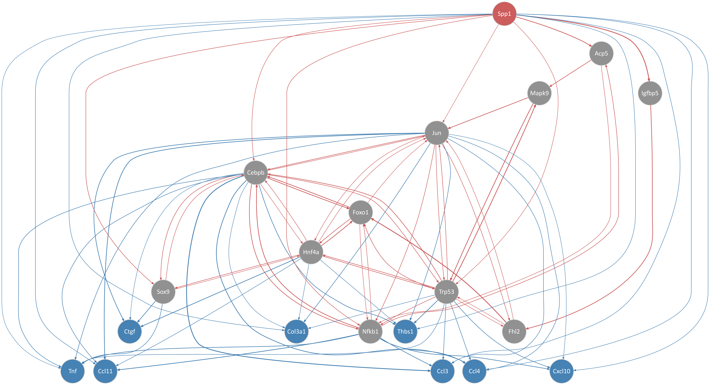

```{r setup, include = FALSE}
# knitr::opts_chunk$set(
#   collapse = TRUE,
#   # comment = "#>",
#   warning = FALSE,
#   message = FALSE
# )
knitr::opts_chunk$set(echo = TRUE, warning = FALSE, message = FALSE)
```

Here we will perform a NicheNet ligand activity analysis with the in-vitro signatures from PHD2-KO Macrophages cocultured 
with fibroblasts (mouse).
This consists on how ligands affect gene expression in co-cultured through ligand-receptor interactions.
For the analysis, it is required to have a clear signature of genes that are responsive of this interactions and 
related to the phenotype.

The pipeline of a basic NicheNet analysis consist mainly of the following steps:

* 1. Define a “sender/niche” cell population and a “receiver/target” cell population present in the expression data and 
determine which genes are expressed in both populations
* 2. Define a gene set of interest: these are the genes in the “receiver/target” cell population that are potentially 
affected by ligands expressed by interacting cells (e.g. genes differentially expressed upon cell-cell interaction)
* 3. Define a set of potential ligands: these are ligands that are expressed by the “sender/niche” cell population and 
bind a (putative) receptor expressed by the “receiver/target” population
* 4. Perform NicheNet ligand activity analysis: rank the potential ligands based on the presence of their target genes 
in the gene set of interest (compared to the background set of genes)
* 5. Infer top-predicted target genes of ligands that are top-ranked in the ligand activity analysis

## Step 0: Load required packages, NicheNet's ligand-target prior model and processed expression data of interacting cells

```{r settings}
set.seed(1234)
OUTDIR <- "./output/03_ligands"
if(!dir.exists(OUTDIR)) dir.create(OUTDIR)
```


Packages:

```{r}
library(nichenetr)
library(tidyverse)
library(limma)

# pre-ranked GSEA
library(fgsea)

# GraphVis (final chunks)
source("../src/graphics.R")
library(DiagrammeR)
```

Ligand-target model:

This model denotes the prior potential that a particular ligand might regulate the expression  of a specific target gene. 

```{r}
# ligand_target_matrix = readRDS(url("https://zenodo.org/record/3260758/files/ligand_target_matrix.rds"))
ligand_target_matrix = readRDS(("../data/nichenetr/ligand_target_matrix.rds"))
#ligand_target_matrix[1:5,1:5] # target genes in rows, ligands in columns

# Because expr data is from mouse, we will convert it
colnames(ligand_target_matrix) = ligand_target_matrix %>% colnames() %>% convert_human_to_mouse_symbols()
rownames(ligand_target_matrix) = ligand_target_matrix %>% rownames() %>% convert_human_to_mouse_symbols()

ligand_target_matrix = ligand_target_matrix %>% .[!is.na(rownames(ligand_target_matrix)), !is.na(colnames(ligand_target_matrix))]
```

Expression data of interacting cells: publicly available single-cell data from CAF and malignant cells from HNSCC fibs:

```{r}
v <- readRDS("./output/01_bulk_dge/v.rds")
expression = v$E
sample_info = v$target # contains meta-information about the samples
```

## Step 1: Define expressed genes in sender and receiver cell populations
Our research question is to prioritize ligands releases by Macrophages upon PHD2 knock-out perturbation, which
triggers hypoxia response, that is stimulating collagen production by fibroblasts.

First we have to define which genes are expressed in sender cells (macrophages) and
receiver cells (fibroblasts).

```{r}
CPM_cutoff <- 10
N_samples <- c("Mac"=sum(grepl("^MC_", sample_info$group)), "Fib"=sum(grepl("^Fib_", sample_info$group)))

expressed_genes_sender = rownames(expression)[rowSums(2^expression[,grep("^MC_", sample_info$group)] > CPM_cutoff) > N_samples["Mac"]*0.5]
# Here we use the DEG analysis to define important ligands
eBay <- readRDS("./output/01_bulk_dge/eBay.rds")

topTab_sender <- topTable(eBay, coef="MC_PHD2", number=Inf) # FDR adjust
DEup_sender <- topTab_sender$genes[topTab_sender$P.Value < 0.05 & topTab_sender$logFC > 0]

# twoFC_sender <- eBay$coefficients[,"MC_PHD2"]
# twoFC_sender <- names(twoFC_sender[twoFC_sender > 1])
# expressed_genes_sender <- twoFC_sender

expressed_genes_receiver = rownames(expression)[rowSums(2^expression[,grep("^Fib_", sample_info$group)] > CPM_cutoff) > N_samples["Fib"]*0.5]

# Check the number of expressed genes: should be a 'reasonable' number of total expressed genes in a cell type, e.g. between 5000-10000 (and not 500 or 20000)
length(expressed_genes_sender)
length(expressed_genes_receiver)
```

## Step 2: Define the gene set of interest and a background of genes

As gene set of interest, we consider the genes of which the expression is possibly affected due to communication with other cells. The definition of this gene set depends on your research question and is a crucial step in the use of NicheNet.

Because we here want to investigate how Macrophages regulate the expression of Fib signature genes in malignant cells, we will use the Fib signature gene set defined by Puram et al. as gene set of interest and use all genes expressed in malignant cells as background of genes. 

```{r}
matrisomeDB <- read.table("../data/Matrisome/matrisome_mm_masterlist.tsv", sep="\t", header=TRUE, stringsAsFactors = FALSE)
matrisome <- split(matrisomeDB$Gene.Symbol, matrisomeDB$Category)
matrisome <- matrisome[names(matrisome)!="n/a"]

set.seed(123)
matrisome.res <- fgsea(pathways = matrisome, stats = eBay$t[,"Fib_PHD2"], nperm=10000)
# Define the downstream analysis based on leading edge genes from matrisome
geneset_oi <- unlist(matrisome.res[matrisome.res$padj<0.05, "leadingEdge"]) 

head(geneset_oi)

background_expressed_genes = expressed_genes_receiver %>% .[. %in% rownames(ligand_target_matrix)]
head(background_expressed_genes)
```

## Step 3: Define a set of potential ligands

As potentially active ligands, we will use ligands that are 1) expressed by Macrophages and 2) can bind a (putative) receptor expressed by malignant cells. Putative ligand-receptor links were gathered from NicheNet's ligand-receptor data sources.

```{r}
# lr_network = readRDS(url("https://zenodo.org/record/3260758/files/lr_network.rds"))
lr_network = readRDS(("../data/nichenetr/lr_network.rds"))
# Transform to mouse
lr_network = lr_network %>% mutate(from = convert_human_to_mouse_symbols(from), to = convert_human_to_mouse_symbols(to)) %>% drop_na()

# If wanted, users can remove ligand-receptor interactions that were predicted based on protein-protein interactions and only keep ligand-receptor interactions that are described in curated databases. To do this: uncomment following line of code:
# lr_network = lr_network %>% filter(database != "ppi_prediction_go" & database != "ppi_prediction")

ligands = lr_network %>% pull(from) %>% unique()
expressed_ligands = intersect(ligands,expressed_genes_sender)

# NOTE: this is based in our experimental design
expressed_ligands <- intersect(expressed_ligands, DEup_sender)

receptors = lr_network %>% pull(to) %>% unique()
expressed_receptors = intersect(receptors,expressed_genes_receiver)

lr_network_expressed = lr_network %>% filter(from %in% expressed_ligands & to %in% expressed_receptors) 
head(lr_network_expressed)
```


This ligand-receptor network contains the expressed ligand-receptor interactions. As potentially active ligands for the NicheNet analysis, we will consider the ligands from this network.

```{r}
potential_ligands = lr_network_expressed %>% pull(from) %>% unique()
head(potential_ligands)
```


## Step 4: Perform NicheNet's ligand activity analysis on the gene set of interest

Now perform the ligand activity analysis: in this analysis, we will calculate the ligand activity of each ligand, or in other words, we will assess how well each CAF-ligand can predict the Fib signature gene set compared to the background of expressed genes (predict whether a gene belongs to the Fib signature program or not).

```{r}
ligand_activities = predict_ligand_activities(geneset = geneset_oi, background_expressed_genes = background_expressed_genes, ligand_target_matrix = ligand_target_matrix, potential_ligands = potential_ligands)
```

Now, we want to rank the ligands based on their ligand activity. In Nichnet validation, they showed that the pearson correlation coefficient (PCC) between a ligand's target predictions and the observed transcriptional response was the most informative measure to define ligand activity. Therefore, we will rank the ligands based on their pearson correlation coefficient. This allows us to prioritize Macrophage-released ligands.

```{r}
ligand_activities %>% arrange(-pearson) 
best_upstream_ligands = ligand_activities %>% top_n(20, pearson) %>% arrange(-pearson) %>% pull(test_ligand)
head(best_upstream_ligands)
```

We see here that the performance metrics indicate that the 20 top-ranked ligands can predict the Fib signature genes reasonably, this implies that ranking of the ligands might be accurate as shown in our study. However, it is possible that for some gene sets, the target gene prediction performance of the top-ranked ligands would not be much better than random prediction. In that case, prioritization of ligands will be less trustworthy. 

Additional note: we looked at the top 20 ligands here and will continue the analysis by inferring target genes of 
these 20 ligands. However, the choice of looking only at the 20 top-ranked ligands for further biological interpretation 
is based on biological intuition and is quite arbitrary. Therefore, users can decide to continue the analysis with a 
different number of ligands. We recommend to check the selected cutoff by looking at the distribution of the ligand activity 
values. Here, we show the ligand activity histogram (the score for the 20th ligand is indicated via the dashed line).

```{r}
# show histogram of ligand activity scores
p_hist_lig_activity = ggplot(ligand_activities, aes(x=pearson)) + 
  geom_histogram(color="black", fill="darkorange")  + 
  # geom_density(alpha=.1, fill="orange") +
  geom_vline(aes(xintercept=min(ligand_activities %>% 
				top_n(20, pearson) %>% pull(pearson))), 
	     color="red", linetype="dashed", size=1) + 
  labs(x="ligand activity (PCC)", y = "# ligands") +
  theme_classic()
p_hist_lig_activity
```


## Step 5: Infer target genes of top-ranked ligands and visualize in a heatmap

Now we will show how you can look at the regulatory potential scores between ligands and target genes of interest. 
In this case, we will look at links between top-ranked  regulating ligands and  genes. In the ligand-target heatmaps, 
we show here regulatory potential scores for interactions between the 20 top-ranked ligands and following 
target genes: genes that belong to the gene set of interest and to the 250 most strongly predicted targets of at least 
one of the 20 top-ranked ligands (the top 250 targets according to the general prior model, so not the top 250 targets 
for this dataset). Consequently, genes of your gene set that are not a top target gene of one of the prioritized ligands, 
will not be shown on the heatmap.

```{r}
active_ligand_target_links_df = best_upstream_ligands %>% 
	lapply(get_weighted_ligand_target_links,
	       geneset = geneset_oi, 
	       ligand_target_matrix = ligand_target_matrix, 
	       n = 250) %>% 
bind_rows()

nrow(active_ligand_target_links_df)
head(active_ligand_target_links_df)
```

For visualization purposes, we adapted the ligand-target regulatory potential matrix as follows. Regulatory potential 
scores were set as 0 if their score was below a predefined threshold, which was here the 0.25 quantile of scores of 
interactions between the 20 top-ranked ligands and each of their respective top targets (see the ligand-target network 
defined in the data frame).

```{r}
# Some got weight of NA
active_ligand_target_links_df <- na.omit(active_ligand_target_links_df)

active_ligand_target_links = prepare_ligand_target_visualization(ligand_target_df = active_ligand_target_links_df,
                                      ligand_target_matrix = ligand_target_matrix,
                                      cutoff = 0.25)

nrow(active_ligand_target_links_df)
head(active_ligand_target_links_df)
# This is a circunvent somehow it is crashing the dimensionality of the matrix
if(any(!active_ligand_target_links_df$target %in% rownames(active_ligand_target_links))) {
  common <- intersect(active_ligand_target_links_df$target,
                        rownames(active_ligand_target_links))
  which_df <- active_ligand_target_links_df$target %in% common
  active_ligand_target_links_df <- active_ligand_target_links_df[which_df, ]
 active_ligand_target_links <- active_ligand_target_links[common,] 
 rm(common)
}

if(any(!active_ligand_target_links_df$ligand %in% colnames(active_ligand_target_links))) {
    common <- intersect(active_ligand_target_links_df$ligand,
                            colnames(active_ligand_target_links))
      which_df <- active_ligand_target_links_df$ligand %in% common
      active_ligand_target_links_df <- active_ligand_target_links_df[which_df,]
     active_ligand_target_links <- active_ligand_target_links[, common] 
}
```

The putatively active ligand-target links will now be visualized in a heatmap.
The order of the ligands accord to the ranking according to the ligand activity prediction.

```{r, fig.width=8, fig.height=6}
order_ligands = intersect(best_upstream_ligands, colnames(active_ligand_target_links)) %>% rev()
order_targets = active_ligand_target_links_df$target %>% unique()
vis_ligand_target = active_ligand_target_links[order_targets,order_ligands] %>% t()

p_ligand_target_network = vis_ligand_target %>% make_heatmap_ggplot("Prioritized Macrophage-ligands",
								    "Responsive target genes from co-cultured Fibroblast", 
								    color = "purple",legend_position = "top", x_axis_position = "top",
								    legend_title = "Regulatory potential\n") + 
scale_fill_gradient2(low = "whitesmoke",  high = "purple", breaks = c(0,0.005,0.01)) + # theme(axis.text.x = element_text(face = "italic")) +
theme(legend.key.width = unit(1.0, "cm"),
      legend.text = element_text(family=fontTXT, size=10),
      legend.title = element_text(family=fontTXT, size=13))

p_ligand_target_network

```

Note that the choice of these cutoffs for visualization is quite arbitrary. We recommend users to test several cutoff values. 

If you would consider more than the top 250 targets based on prior information, you will infer more, but less confident, ligand-target links; by considering less than 250 targets, you will be more stringent. 

If you would change the quantile cutoff that is used to set scores to 0 (for visualization purposes), lowering this cutoff will result in a more dense heatmap, whereas highering this cutoff will result in a more sparse heatmap. 

## Follow-up analysis 1: Ligand-receptor network inference for top-ranked ligands

One type of follow-up analysis is looking at which receptors of the receiver cell population (here: malignant cells) can potentially bind to the prioritized ligands from the sender cell population (here: Macrophages).

So, we will now infer the predicted ligand-receptor interactions of the top-ranked ligands and visualize these in a heatmap.

```{r}
# get the ligand-receptor network of the top-ranked ligands
lr_network_top = lr_network %>% filter(from %in% best_upstream_ligands & to %in% expressed_receptors) %>% distinct(from,to)
best_upstream_receptors = lr_network_top %>% pull(to) %>% unique()

# get the weights of the ligand-receptor interactions as used in the NicheNet model
# weighted_networks = readRDS(url("https://zenodo.org/record/3260758/files/weighted_networks.rds"))
weighted_networks = readRDS(("../data/nichenetr/weighted_networks.rds"))
weighted_networks$lr_sig = weighted_networks$lr_sig %>% mutate(from = convert_human_to_mouse_symbols(from), to = convert_human_to_mouse_symbols(to)) %>% drop_na()
weighted_networks$gr = weighted_networks$gr %>% mutate(from = convert_human_to_mouse_symbols(from), to = convert_human_to_mouse_symbols(to)) %>% drop_na()
lr_network_top_df = weighted_networks$lr_sig %>% filter(from %in% best_upstream_ligands & to %in% best_upstream_receptors)

# convert to a matrix
lr_network_top_df = lr_network_top_df %>% spread("from","weight",fill = 0)
lr_network_top_matrix = lr_network_top_df %>% select(-to) %>% as.matrix() %>% magrittr::set_rownames(lr_network_top_df$to)

# perform hierarchical clustering to order the ligands and receptors
dist_receptors = dist(lr_network_top_matrix, method = "binary")
hclust_receptors = hclust(dist_receptors, method = "ward.D2")
order_receptors = hclust_receptors$labels[hclust_receptors$order]

dist_ligands = dist(lr_network_top_matrix %>% t(), method = "binary")
hclust_ligands = hclust(dist_ligands, method = "ward.D2")
order_ligands_receptor = hclust_ligands$labels[hclust_ligands$order]
```

Show a heatmap of the ligand-receptor interactions

```{r, fig.width=9, fig.height=6}
vis_ligand_receptor_network = lr_network_top_matrix[order_receptors, order_ligands_receptor]
p_ligand_receptor_network = vis_ligand_receptor_network %>% t() %>% make_heatmap_ggplot("Prioritized PHD2-KO Macrophage ligands",
											"Receptors expressed by Fibroblasts", 
											color = "mediumvioletred", x_axis_position = "top",
											legend_title = "Prior interaction potential")
p_ligand_receptor_network

```

## Follow-up analysis 2: Visualize expression of top-predicted ligands and their target genes in a combined heatmap

NicheNet only considers expressed ligands of sender cells, but does not take into account their expression for ranking the ligands. The ranking is purely based on the potential that a ligand might regulate the gene set of interest, given prior knowledge. Because it is also useful to further look into expression of ligands and their target genes, we demonstrate here how you could make a combined figure showing ligand activity, ligand expression, target gene expression and ligand-target regulatory potential. 

#### Load additional packages required for the visualization:

```{r}
library(RColorBrewer)
library(cowplot)
library(ggpubr)
```

#### Prepare the ligand activity matrix

```{r}
ligand_pearson_matrix = ligand_activities %>% select(pearson) %>% as.matrix() %>% magrittr::set_rownames(ligand_activities$test_ligand)

vis_ligand_pearson = ligand_pearson_matrix[order_ligands, ] %>% as.matrix(ncol = 1) %>% magrittr::set_colnames("Pearson")
```

```{r, fig.width=5, fig.height=6}
p_ligand_pearson = vis_ligand_pearson %>% 
  make_heatmap_ggplot("Prioritized Macrophage-ligands","Ligand activity",
  color = "darkorange",legend_position = "top", x_axis_position = "top",
  legend_title = "Pearson Correlation Coef. \n(prediction ability)  ") +
  theme(legend.key.width = unit(1.0, "cm"),
	legend.text = element_text(family = fontTXT, size=10),
	legend.title = element_text(family = fontTXT, size=14))

p_ligand_pearson
```

#### Prepare expression of ligands in fibroblast per fib
Because the single-cell data was collected from multiple fibs, we will show here the average expression of the ligands per fib.

```{r}
expression_df_Mac = expression[order_ligands, grep("^MC_", v$targets$group)]
colnames(expression_df_Mac) <- gsub("^.*_PHD2_KO","PHD2cKO",colnames(expression_df_Mac))
colnames(expression_df_Mac) <- gsub("^.*_PHD2_WT","WT",colnames(expression_df_Mac))

# expression_df_CAF = expression[order_ligands, grepl("^Mac_",v$targets$group,order_ligands)] %>% 
# 	data.frame() %>% rownames_to_column("cell") %>% tbl_df() %>% inner_join(sample_info %>% select(cell,fib), by =  "cell")
# 
# aggregated_expression_CAF = expression_df_CAF %>% group_by(fib) %>% select(-cell) %>% summarise_all(mean)
# 
# aggregated_expression_df_CAF = aggregated_expression_CAF %>% select(-fib) %>% t() %>% magrittr::set_colnames(aggregated_expression_CAF$fib) %>% data.frame() %>% rownames_to_column("ligand") %>% tbl_df() 
# 
# aggregated_expression_matrix_CAF = aggregated_expression_df_CAF %>% select(-ligand) %>% as.matrix() %>% magrittr::set_rownames(aggregated_expression_df_CAF$ligand)
# 
# order_fibs = c("HN6","HN20","HN26","HN28","HN22","HN25","HN5","HN18","HN17","HN16") # this order was determined based on the paper from Puram et al. Tumors are ordered according to Fib signature score.
#vis_ligand_Mac_expression = aggregated_expression_matrix_CAF[order_ligands,order_fibs]

vis_ligand_Mac_expression = expression_df_Mac
```

```{r, fig.width=9, fig.height=6}
library(RColorBrewer)
color = colorRampPalette(rev(brewer.pal(n = 7, name ="RdYlBu")))(100)
p_ligand_Mac_expression = vis_ligand_Mac_expression %>% 
            make_heatmap_ggplot("Prioritized Macrophage ligands","Marophages",
            color = color[100],legend_position = "top", x_axis_position = "top", 
	legend_title = "Expression\n(averaged over bulk cells)") + 
theme(legend.key.width = unit(1.0, "cm"),
	legend.text = element_text(family = fontTXT, size=10),
	legend.title = element_text(family = fontTXT, size=14))

p_ligand_Mac_expression
```

Same info but scaled across samples
```{r, fig.width=9, fig.height=6}
# Scaled expression
vis_ligand_Mac_expression = expression_df_Mac %>% t() %>% scale_quantile() %>% t()

p_ligand_Mac_scaled_expression = vis_ligand_Mac_expression  %>%
make_threecolor_heatmap_ggplot("Ligands","Sender (Macrophage)",
    low_color = color[1],mid_color = color[50], mid = 0.5,
    high_color = color[100], legend_position = "top", x_axis_position = "top" ,
    legend_title = "Scaled expression\n(averaged over bulk cells)") +
theme(legend.key.width = unit(1.0, "cm"),
	legend.text = element_text(family = fontTXT),
	legend.title = element_text(family = fontTXT))
p_ligand_Mac_scaled_expression
```


#### Prepare expression of target genes in malignant cells per fib

```{r}
expression_df_target = expression[order_targets, grep("^Fib_", v$target$group)]
colnames(expression_df_target) <- gsub("3T3_PHD2_KO", "Stimulated", colnames(expression_df_target))
colnames(expression_df_target) <- gsub("3T3_PHD2_WT", "Control", colnames(expression_df_target))

vis_target_fib_expression_scaled = expression_df_target %>% t() %>% scale_quantile() 
colnames(vis_target_fib_expression_scaled) <- make.names(colnames(vis_target_fib_expression_scaled)) 
```

```{r, fig.width=9, fig.height=6}
p_target_fib_scaled_expression = vis_target_fib_expression_scaled  %>%
make_threecolor_heatmap_ggplot("Receiver (Fibroblast)","Target",
    low_color = color[1],mid_color = color[50], mid = 0.5,
    high_color = color[100], legend_position = "top", x_axis_position = "top" ,
    legend_title = "Scaled Gene expression\n") +
theme(legend.key.width = unit(1.0, "cm"),
	legend.text = element_text(family = fontTXT, size=10),
	legend.title = element_text(family = fontTXT, size=14))
p_target_fib_scaled_expression
```

#### Combine the different heatmaps in one overview figure

```{r combined_heatmaps_ligand, fig.width=13, fig.height=9, fig.path="./output/03_ligands/", dev=c('png','tiff')}
figures_without_legend = plot_grid(
  p_ligand_pearson + 
	  theme(legend.position = "none", 
		text = element_text(family=fontTXT, color="black"),
		axis.ticks = element_blank(),
		axis.title.x = element_text(family=fontTXT, size=14),
		axis.title.y = element_text(family=fontTXT, size=14),
		axis.text = element_text(family=fontTXT, color="black", size=14),
		plot.margin = unit(c(0, 0, 0, 0), "cm")), 
  p_ligand_Mac_scaled_expression + 
	  theme(legend.position = "none", 
		legend.text = element_text(family = fontTXT, color="black", size=12),
		text = element_text(family=fontTXT, color="black", size=14),
		axis.ticks = element_blank(),
		axis.title.x = element_text(family=fontTXT, size=14),
		axis.text = element_text(family=fontTXT, color="black", size=14),
		plot.margin = unit(c(0, 0, 0, 0), "cm")) + ylab(""),
  p_ligand_target_network + 
	  theme(legend.position = "none",
		text = element_text(family = fontTXT, color="black"),
		axis.title.x = element_text(family=fontTXT, size=14),
		axis.ticks = element_blank(),
		axis.text = element_text(family=fontTXT, color="black", size=14),
		plot.margin = unit(c(0,0,0,0), "cm")) + ylab(""), 
  NULL,
  NULL,
  p_target_fib_scaled_expression + 
	  theme(legend.position = "none",
		text = element_text(family = fontTXT, color="black"),
		axis.ticks = element_blank(),
		axis.title.y = element_text(family=fontTXT, size=14),
		axis.text = element_text(family=fontTXT, color="black", size=14),
		plot.margin = unit(c(0,0,0,0), "cm")) + xlab(""), 
  align = "hv",
  nrow = 2,  rel_widths = c(ncol(vis_ligand_pearson)+ 2.0, ncol(vis_ligand_Mac_expression) -0, ncol(vis_ligand_target)) + 2,
  rel_heights = c(nrow(vis_ligand_pearson), nrow(vis_target_fib_expression_scaled) + 3)) 

legends = plot_grid(
  as_ggplot(get_legend(p_ligand_pearson)),
  as_ggplot(get_legend(p_ligand_target_network)),
  as_ggplot(get_legend(p_ligand_Mac_scaled_expression)),
#  as_ggplot(get_legend(p_target_fib_scaled_expression)), # We remove it because it is the same as above
  nrow = 1,
  align = "h")

plot_grid(figures_without_legend, 
          legends, 
          rel_heights = c(10,2), nrow = 2, align = "hv")
```


## Extract interactome for downstream analysis
* Target genes from Spp1: We have selected Spp1 for potential validation and downstream analysis given the molecular biology of this ligand
in fibrosis.

```{r}
Spp1_target_links <- get_weighted_ligand_target_links("Spp1", geneset_oi, ligand_target_matrix, n = 250)

write.table(Spp1_target_links, file=paste0(OUTDIR,"/Spp1_target_links.tsv"),
	    sep="\t", row.names=FALSE, col.names=TRUE, quote=FALSE)
```

* Receptors genes from Spp1
```{r}
Spp1_receptors <- sort(lr_network_top_matrix[,"Spp1"], decreasing=TRUE)
Spp1_receptors <- Spp1_receptors[Spp1_receptors!=0]

```

## Assess performance of target prediction

For the top 20 ligands, we will now build a multi-ligand model that uses all top-ranked ligands to predict
whether a gene belongs to the p-EMT program of not. This classification model will be trained via 
cross-validation and returns a probability for every gene.

```{r}
# change rounds and folds here, to two rounds to reduce time: normally: do multiple rounds
k = 3 # 3-fold
n = 2 # 2 rounds

gs_gene_predictions_top20_list = seq(n) %>% lapply(assess_rf_class_probabilities, 
						     folds = k, 
						     geneset = geneset_oi, 
						     background_expressed_genes = background_expressed_genes, 
						     ligands_oi = best_upstream_ligands, 
						     ligand_target_matrix = ligand_target_matrix)

```

```{r}
# get performance: auroc-aupr-pearson
target_prediction_performances_cv = gs_gene_predictions_top20_list %>% 
	lapply(classification_evaluation_continuous_pred_wrapper) %>% 
	bind_rows() %>% mutate(round=seq(1:nrow(.)))
```

What is the AUROC, AUPR and PCC of this model (averaged over cross-validation rounds)?
```{r}
target_prediction_performances_cv$auroc %>% mean()
target_prediction_performances_cv$aupr %>% mean()
target_prediction_performances_cv$pearson %>% mean()
```

Evaluate now whether genes belonging to the gene set are more likely to be top-predicted. 
We will look at the top 5% of predicted targets here.
```{r}
# get performance: how many p-EMT genes and non-p-EMT-genes among top 5% predicted targets
target_prediction_performances_discrete_cv = gs_gene_predictions_top20_list %>% 
	lapply(calculate_fraction_top_predicted, quantile_cutoff = 0.95) %>% 
	bind_rows() %>% ungroup() %>% mutate(round=rep(1:length(gs_gene_predictions_top20_list), each = 2))

```

What is the fraction of signature that belongs to the top 5% predicted targets?
```{r}
target_prediction_performances_discrete_cv %>% filter(true_target) %>% .$fraction_positive_predicted %>% mean()
```

What is the fraction of non-p-EMT genes that belongs to the top 5% predicted targets?
```{r}
target_prediction_performances_discrete_cv %>% filter(!true_target) %>% .$fraction_positive_predicted %>% mean()
```

We see that the signature is enriched in the top-predicted target genes. To test this, we will now apply a 
Fisher’s exact test for every cross-validation round and report the average p-value.
```{r}
target_prediction_performances_discrete_fisher = gs_gene_predictions_top20_list %>% 
	lapply(calculate_fraction_top_predicted_fisher, quantile_cutoff = 0.95) 
target_prediction_performances_discrete_fisher %>% unlist() %>% mean()

```

Finally, we will look at which genes from the signature are well-predicted in every cross-validation round.
```{r}
# get top predicted genes
top_predicted_genes = seq(length(gs_gene_predictions_top20_list)) %>% 
	lapply(get_top_predicted_genes, gs_gene_predictions_top20_list) %>% 
	reduce(full_join, by = c("gene","true_target"))
top_predicted_genes %>% filter(true_target)
```


## Ligand target signaling path

```{r}
ligand_tf_matrix <- readRDS(("../data/nichenetr/ligand_tf_matrix.rds"))
# Because expr data is from mouse, we will convert it
colnames(ligand_tf_matrix) = ligand_tf_matrix %>% colnames() %>% convert_human_to_mouse_symbols()
rownames(ligand_tf_matrix) = ligand_tf_matrix %>% rownames() %>% convert_human_to_mouse_symbols()
ligand_tf_matrix = ligand_tf_matrix %>% .[!is.na(rownames(ligand_tf_matrix)), !is.na(colnames(ligand_tf_matrix))]

sig_network = readRDS(("../data/nichenetr/signaling_network.rds"))
sig_network$to = sig_network$to %>% convert_human_to_mouse_symbols()
sig_network$from = sig_network$from %>% convert_human_to_mouse_symbols()


gr_network = readRDS(("../data/nichenetr/gr_network.rds"))
gr_network$to = gr_network$to %>% convert_human_to_mouse_symbols()
gr_network$from = gr_network$from %>% convert_human_to_mouse_symbols()
```

```{r}
ligands_all <- "Spp1"
targets_all <- unlist(Spp1_target_links[,"target"])

active_signaling_network = get_ligand_signaling_path(ligand_tf_matrix = ligand_tf_matrix, 
						     ligands_all = ligands_all, 
						     targets_all = targets_all, 
						     top_n_regulators= 2,
						     weighted_networks = weighted_networks)

# For better visualization of edge weigths: normalize edge weights to make them comparable between signaling and gene regulatory interactions
active_signaling_network_min_max = active_signaling_network
active_signaling_network_min_max$sig = active_signaling_network_min_max$sig %>% 
	mutate(weight = ((weight-min(weight))/(max(weight)-min(weight))) + 0.75)

active_signaling_network_min_max$gr = active_signaling_network_min_max$gr %>% 
	mutate(weight = ((weight-min(weight))/(max(weight)-min(weight))) + 0.75)

graph_min_max = diagrammer_format_signaling_graph(signaling_graph_list = active_signaling_network_min_max, 
						  ligands_all = ligands_all, targets_all = targets_all, 
						  sig_color = "indianred", gr_color = "steelblue")
# Change layout
graph_min_max$global_attrs[1, "value"] <- "dot"
# Change fontname
graph_min_max$global_attrs[4, "value"] <- fontTXT
graph_min_max$global_attrs[13, "value"] <- fontTXT
# Change fontsize
graph_min_max$global_attrs[5, "value"] <- 15
```

Let's export for visualization
```{r}
##For HTML visualization
#DiagrammeR::render_graph(graph_min_max, layout = "tree",height=1000, width=400)

# Export as a PNG and SVG, then embed the figure in markdown
# My solution: 
#	1st export it to DOT format for the records.
#	2nd export it to PS
#	3rd then from PS, export it into PNG and TIFF with density 300
cat(generate_dot(graph_min_max), file=paste0(OUTDIR,"graph.dot"))
export_graph(graph_min_max, 
	     file_name=paste0(OUTDIR,"/graph.ps"),
	     file_type="ps")
system(paste("convert", 
	     "-density 300",
	     paste0(OUTDIR,"/graph.ps"),
	     paste0(OUTDIR,"/graph.tiff")))
system(paste("convert", 
	     "-density 300",
	     paste0(OUTDIR,"/graph.ps"),
	     paste0(OUTDIR,"/graph.png")))

# Herein a convoluted 2nd strategy to export as png,pdf etc
# This one has more dependencies
# 	# Export as a figure
# 	library(rsvg) 
# 	library(DiagrammeRsvg)
# 	library(magrittr)
# 	
# DiagrammeR::grViz(generate_dot(graph_min_max), engine="dot") %>%
#  export_svg %>% charToRaw %>% rsvg_png("/tmp/g.pdf")
```




```{r}
data_source_network = infer_supporting_datasources(signaling_graph_list = active_signaling_network,
						   lr_network = lr_network, 
						   sig_network = sig_network, 
						   gr_network = gr_network)
head(data_source_network) 
```

Export to Cytoscape
```{r}
#output_path = paste0(OUTDIR,"/Spp1_") 
#write_output = FALSE # change to TRUE for writing output
#
## weighted networks ('import network' in Cytoscape)
#if(write_output){
#  bind_rows(active_signaling_network$sig %>% mutate(layer = "signaling"), active_signaling_network$gr %>% mutate(layer = "regulatory")) %>% write_tsv(paste0(output_path,"weighted_signaling_network.txt")) 
#}
#
## networks with information of supporting data sources ('import network' in Cytoscape)
#if(write_output){
#data_source_network %>% write_tsv(paste0(output_path,"data_source_network.txt"))
#}
#
## Node annotation table ('import table' in Cytoscape)
#specific_annotation_tbl = bind_rows(
#  tibble(gene = ligands_all, annotation = "ligand"),
#  tibble(gene = targets_all, annotation = "target"),
#  tibble(gene = c(data_source_network$from, data_source_network$to) %>% unique() %>% setdiff(c(targets_all,ligands_all)) %>% intersect(lr_network$to %>% unique()), annotation = "receptor"),
#  tibble(gene = c(data_source_network$from, data_source_network$to) %>% unique() %>% setdiff(c(targets_all,ligands_all)) %>% intersect(gr_network$from %>% unique()) %>% setdiff(c(data_source_network$from, data_source_network$to) %>% unique() %>% intersect(lr_network$to %>% unique())),annotation = "transcriptional regulator")
#)
#non_specific_annotation_tbl = tibble(gene = c(data_source_network$from, data_source_network$to) %>% unique() %>% setdiff(specific_annotation_tbl$gene), annotation = "signaling mediator")
#
#if(write_output){
#bind_rows(specific_annotation_tbl,non_specific_annotation_tbl) %>% write_tsv(paste0(output_path,"annotation_table.txt"))
#}
```
## SessionInfo
```{r}
sessionInfo()

{                                                                                                                                                                                                           
sink(file=paste0(OUTDIR,"/sessionInfo.txt"))
print(sessionInfo())
sink()
}
```
