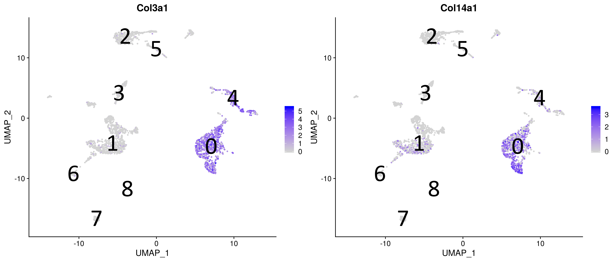
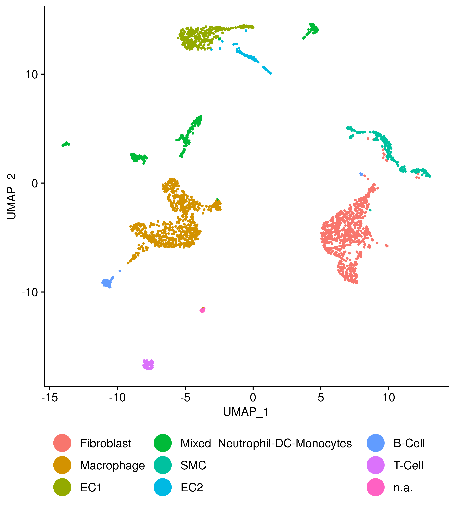

Cell identify assignment for atherosclerotic plaques single-cell RNAseq
samples
================
Javier Perales-Patón - <javier.perales@bioquant.uni-heidelberg.de> -
ORCID: 0000-0003-0780-6683

## Setup

The environment will be set with a random seed number for
reproducibility and an output folder for processed data and figures.

### Environment

``` r
# Seed number
set.seed(1234)
# Output directory
OUTDIR <- "./02_identity_output/"
if(!dir.exists(OUTDIR)) dir.create(OUTDIR);

# Figures
FIGDIR <- paste0(OUTDIR, "/figures/")
knitr::opts_chunk$set(fig.path=FIGDIR)
knitr::opts_chunk$set(dev=c('png','tiff'))
# Data
DATADIR <- paste0(OUTDIR, "/data/")
if(!dir.exists(DATADIR)) dir.create(DATADIR);
```

### Load libraries

``` r
suppressPackageStartupMessages(require(Seurat))
suppressPackageStartupMessages(require(GSEABase))
suppressPackageStartupMessages(require(dplyr))
suppressPackageStartupMessages(require(cowplot))
suppressPackageStartupMessages(require(ggplot2))
suppressPackageStartupMessages(require(ggrepel))
suppressPackageStartupMessages(require(genesorteR))
suppressPackageStartupMessages(require(optparse))
# Get some functions for Seurat analysis
source("../src/seurat_fx.R")
source("../src/graphics.R")
```

## Load data

Read the Seurat Object from first step.

``` r
# Input data
sobj <- "./01_integration_output/data/S.rds"

if(file.exists(sobj)) {
    S <- readRDS(sobj)
} else {
    stop("ERROR: Seurat object does not exist. Run 01.rmd to generate it.")
}
```

## Cell identity

Immune cells are defined by expression of Prtcpr, while non-immune cells
such as mesenchymal cells are so by collagen genes.

``` r
# FeaturePlot(S, features = "Ptprc", label = TRUE, label.size = 14)
VlnPlot(S, features="Ptprc")
```

<!-- -->

``` r
FeaturePlot(S, features = c("Col3a1", "Col14a1"), label = TRUE, label.size = 14)
```

<!-- -->

``` r
# VlnPlot(S, features=c("Col3a1", "Col14a1"))
```

Macrophages are characterized by expression of CD68

``` r
VlnPlot(S, features="Cd68")
```

<!-- --> Fibroblasts
express Pdgfra and Smoc2, these are further characterized
later.

``` r
FeaturePlot(S, features = c("Pdgfra","Smoc2"), label = TRUE, label.size = 14)
```

<!-- -->

And SMC express Acta2, which are further characterized later.

``` r
VlnPlot(S, features = c("Acta2"))
```

<!-- -->

Thus we can conclude with the stratification

``` r
S$immune <- Idents(S) %in% c("1","3","6","7","8")
S$Cd68_positive <- Idents(S) %in% c("1", "3", "8")
```

Finally we conclude showing the expresion of a consensus set of markers
(from previous step, see 01.Rmd) for each cell type in the biological
context. And assign cell type identities for each cluster.

``` r
ren_id <- c("0"="Fibroblast",
"1"="Macrophage",
"2"="EC1",
"3"="Neutrophil",
"4"="SMC",
"5"="EC2",
"6"="B-Cell",
"7"="T-Cell",
"8"="n.a."
)
S <- RenameIdents(S, ren_id)
```

``` r
hp <- DoHeatmap3(SeuratObject = S, GSC = getGmt("../data/markers/consensus_plaque.gmt"), 
       assay = "RNA", res="Idents", row_names_size=12, column_title_size=0, 
       fontfamily=fontTXT,
       show_hr=FALSE)
draw(hp, heatmap_legend_side="right", annotation_legend_side="bottom")
```

<!-- -->

We show the UMAP plot with final annotations

``` r
#geom_text <- function(...) geom_text(..., family="Calibri")
#geom_repel <- function(...) geom_repel(..., family="Calibri")
update_geom_defaults("text", list(family=fontTXT))
DimPlot(S, reduction = "umap", label = TRUE, label.size = 9) + 
    theme(text=element_text(family=fontTXT),
          axis.text=element_text(family=fontTXT, size=20),
          axis.title=element_text(family=fontTXT, size=20)
    )
```

<!-- -->

``` r
DimPlot(S, reduction = "umap", cols = c("grey","red"), group.by="stim", label = FALSE) + 
    theme(text=element_text(family=fontTXT),
          axis.text=element_text(family=fontTXT, size=20),
          axis.title=element_text(family=fontTXT, size=20)
    )
```

<!-- -->

``` r
vln1 <- VlnPlot(S[,Idents(S) %in% c("Macrophage","Fibroblast") & S$stim=="PHD2cKO"], feature="Egln1") 
vln2 <- VlnPlot(S[,Idents(S) %in% c("Macrophage","Fibroblast") & S$stim=="WT"], feature="Egln1") 
CombinePlots(list(vln1,vln2), ncol = 1)
```

<!-- -->

## Save the Seurat Object

``` r
saveRDS(S, paste0(DATADIR,"/S.rds"));
```

## SessionInfo

``` r
sessionInfo()
```

    ## R version 3.6.1 (2019-07-05)
    ## Platform: x86_64-pc-linux-gnu (64-bit)
    ## Running under: Ubuntu 18.04.3 LTS
    ## 
    ## Matrix products: default
    ## BLAS:   /usr/lib/x86_64-linux-gnu/blas/libblas.so.3.7.1
    ## LAPACK: /usr/lib/x86_64-linux-gnu/lapack/liblapack.so.3.7.1
    ## 
    ## locale:
    ##  [1] LC_CTYPE=en_US.UTF-8       LC_NUMERIC=C              
    ##  [3] LC_TIME=en_GB.UTF-8        LC_COLLATE=en_US.UTF-8    
    ##  [5] LC_MONETARY=en_GB.UTF-8    LC_MESSAGES=en_US.UTF-8   
    ##  [7] LC_PAPER=en_GB.UTF-8       LC_NAME=C                 
    ##  [9] LC_ADDRESS=C               LC_TELEPHONE=C            
    ## [11] LC_MEASUREMENT=en_GB.UTF-8 LC_IDENTIFICATION=C       
    ## 
    ## attached base packages:
    ##  [1] grid      stats4    parallel  stats     graphics  grDevices utils    
    ##  [8] datasets  methods   base     
    ## 
    ## other attached packages:
    ##  [1] ComplexHeatmap_2.0.0 extrafont_0.17       optparse_1.6.2      
    ##  [4] genesorteR_0.3.1     Matrix_1.2-17        ggrepel_0.8.1       
    ##  [7] ggplot2_3.2.1        cowplot_1.0.0        dplyr_0.8.3         
    ## [10] GSEABase_1.46.0      graph_1.62.0         annotate_1.62.0     
    ## [13] XML_3.98-1.20        AnnotationDbi_1.46.1 IRanges_2.18.2      
    ## [16] S4Vectors_0.22.1     Biobase_2.44.0       BiocGenerics_0.30.0 
    ## [19] Seurat_3.1.0         rmarkdown_1.15       nvimcom_0.9-82      
    ## 
    ## loaded via a namespace (and not attached):
    ##   [1] Rtsne_0.15          colorspace_1.4-1    rjson_0.2.20       
    ##   [4] ggridges_0.5.1      mclust_5.4.5        circlize_0.4.7     
    ##   [7] GlobalOptions_0.1.0 clue_0.3-57         leiden_0.3.1       
    ##  [10] listenv_0.7.0       npsurv_0.4-0        getopt_1.20.3      
    ##  [13] bit64_0.9-7         codetools_0.2-16    splines_3.6.1      
    ##  [16] R.methodsS3_1.7.1   lsei_1.2-0          knitr_1.24         
    ##  [19] zeallot_0.1.0       jsonlite_1.6        Rttf2pt1_1.3.8     
    ##  [22] ica_1.0-2           cluster_2.1.0       png_0.1-7          
    ##  [25] R.oo_1.22.0         pheatmap_1.0.12     uwot_0.1.4         
    ##  [28] sctransform_0.2.0   compiler_3.6.1      httr_1.4.1         
    ##  [31] backports_1.1.4     assertthat_0.2.1    lazyeval_0.2.2     
    ##  [34] htmltools_0.3.6     tools_3.6.1         rsvd_1.0.2         
    ##  [37] igraph_1.2.4.1      gtable_0.3.0        glue_1.3.1         
    ##  [40] RANN_2.6.1          reshape2_1.4.3      Rcpp_1.0.2         
    ##  [43] vctrs_0.2.0         gdata_2.18.0        ape_5.3            
    ##  [46] nlme_3.1-141        extrafontdb_1.0     gbRd_0.4-11        
    ##  [49] lmtest_0.9-37       xfun_0.9            stringr_1.4.0      
    ##  [52] globals_0.12.4      lifecycle_0.1.0     irlba_2.3.3        
    ##  [55] gtools_3.8.1        future_1.14.0       MASS_7.3-51.4      
    ##  [58] zoo_1.8-6           scales_1.0.0        RColorBrewer_1.1-2 
    ##  [61] yaml_2.2.0          memoise_1.1.0       reticulate_1.13    
    ##  [64] pbapply_1.4-2       gridExtra_2.3       stringi_1.4.3      
    ##  [67] RSQLite_2.1.2       caTools_1.17.1.2    bibtex_0.4.2       
    ##  [70] shape_1.4.4         Rdpack_0.11-0       SDMTools_1.1-221.1 
    ##  [73] rlang_0.4.0         pkgconfig_2.0.3     bitops_1.0-6       
    ##  [76] evaluate_0.14       lattice_0.20-38     ROCR_1.0-7         
    ##  [79] purrr_0.3.2         labeling_0.3        htmlwidgets_1.3    
    ##  [82] bit_1.1-14          tidyselect_0.2.5    RcppAnnoy_0.0.13   
    ##  [85] plyr_1.8.4          magrittr_1.5        R6_2.4.0           
    ##  [88] gplots_3.0.1.1      DBI_1.0.0           withr_2.1.2        
    ##  [91] pillar_1.4.2        fitdistrplus_1.0-14 survival_2.44-1.1  
    ##  [94] RCurl_1.95-4.12     tibble_2.1.3        future.apply_1.3.0 
    ##  [97] tsne_0.1-3          crayon_1.3.4        KernSmooth_2.23-16 
    ## [100] plotly_4.9.0        GetoptLong_0.1.7    data.table_1.12.8  
    ## [103] blob_1.2.0          metap_1.1           digest_0.6.21      
    ## [106] xtable_1.8-4        tidyr_1.0.0         R.utils_2.9.0      
    ## [109] RcppParallel_4.4.3  munsell_0.5.0       viridisLite_0.3.0

``` r
{                                                                                                                                                                                                           
sink(file=paste0(OUTDIR,"/sessionInfo.txt"))
print(sessionInfo())
sink()
}
```
