Investigation of the role of PHD2 atherogenesis in in-vivo Macrophages
================
Javier Perales-Patón - <javier.perales@bioquant.uni-heidelberg.de> -
ORCID: 0000-0003-0780-6683

## Setup

We define a random seed number for reproducibility, file structure for
the output, and load essential libraries

### Environment

``` r
# Seed number
set.seed(1234)
# Output directory
OUTDIR <- "./03_macrophage_output/"
if(!dir.exists(OUTDIR)) dir.create(OUTDIR);

# Figures
FIGDIR <- paste0(OUTDIR, "/figures/")
knitr::opts_chunk$set(fig.path=FIGDIR)
knitr::opts_chunk$set(dev=c('png','tiff'))
# Data
DATADIR <- paste0(OUTDIR, "/data/")
if(!dir.exists(DATADIR)) dir.create(DATADIR);
```

### Load libraries

``` r
suppressPackageStartupMessages(require(Seurat))
suppressPackageStartupMessages(require(GSEABase))
suppressPackageStartupMessages(require(cowplot))
suppressPackageStartupMessages(require(genesorteR))
suppressPackageStartupMessages(require(fgsea))
suppressPackageStartupMessages(require(ggplot2))
suppressPackageStartupMessages(require(ggrepel))
suppressPackageStartupMessages(require(AUCell))
suppressPackageStartupMessages(require(viper))
suppressPackageStartupMessages(require(purrr))
suppressPackageStartupMessages(require(dplyr))
source("../src/graphics.R")
source("../src/seurat_fx.R")
```

## Load data

Read the Seurat Object from second step.

``` r
# Input data
sobj <- "./02_identity_output/data/S.rds"
# Read 
if(file.exists(sobj)) {
    S <- readRDS(sobj)
} else {
    stop("ERROR: Seurat object does not exist. Run 02.rmd to generate it.")
}
```

We also load the ortholog information for functional analysis

``` r
# Lib of hsa2mmu orthologs
mmu2hsa <- readRDS("../data/Gene_annotation/hgnc2mgi_hsa2mmu.rds")
```

## Comparison between PHD2 functional perturbation

The in-vivo model carries a PHD2 knock-out in the myeloid lineage with
an effectivity of 30% of the cells. The section will investigate if the
penetrance of this gene perturbation is enough to be capture in the
average population of the mouse replicate.

### Differential gene expression

``` r
S1 <- S[, S@active.ident=="Macrophage"]

Idents(S1) <- "stim"
avg <- log1p(AverageExpression(S1, verbose = FALSE)$RNA)
  
rnk <- setNames(avg[,"PHD2cKO"] - avg[,"WT"], rownames(avg))
top <- names(sort(abs(rnk),decreasing = TRUE)[1:15])
  
ggplot(avg, aes(WT, PHD2cKO)) + geom_point(alpha=0.6) + ggtitle(label = "Macrophages") + 
    xlab("WT") + ylab("PHD2cKO")+
    geom_label_repel(data=avg[top,], aes(label=top), size=5) + 
    theme_cowplot() +
      theme(axis.title = element_text(size=22),
            title = element_text(size=22, hjust = 0.5),
            axis.text = element_text(size=18),
            axis.title.x = element_text(size=18),
            axis.title.y = element_text(size=18))
```

<!-- -->

``` r
dge <- FindMarkers(object = S1, ident.1 = "PHD2cKO", ident.2 = "WT", 
          logfc.threshold=0, min.pct=0)
cols_names <- colnames(dge)
# Add two extra cols
dge$cluster <- "Macrophage PHD2cKO vs PHD2wt"
dge$gene <- rownames(dge)

dge <- dge[,c("cluster", "gene", cols_names)]
   
write.table(dge,
            file = paste0(DATADIR,"/Macrophages_avg_PHD2cKO_vs_PHD2wt_DEGs.tsv"),
            sep="\t",col.names = TRUE, row.names = FALSE, quote=FALSE
)
```

There are these number of differentially expressed genes between the two
conditions:

``` r
table(sign(dge$avg_logFC) * as.integer(dge$p_val_adj < 0.05))
```

    ## 
    ##    -1     0     1 
    ##    84 13274    32

We could conclude that there are not large differences in the average
gene expression of macrophages based on condition (PHD2 KO). Next
efforts will be made to recover transcriptional programmes on this
regulation and try to dissect cell populations

### Functional analysis

We create a ranking of differentially expressed genes for the enrichment
analysis.

``` r
rnk <- setNames(sign(dge$avg_logFC) * -log10(dge$p_val_adj), dge$gene)
```

``` r
# GO analysis
GO <- getGmt("../data/MSigDB/c5.bp.v7.0.symbols.gmt")
GO <- lapply(geneIds(GO), function(z) unlist(sapply(z, function(j) mmu2hsa[[j]])))

GO.res <- fgsea(pathways = GO, stats = rnk, nperm=10000) 
GO.res <- GO.res[order(GO.res$padj, decreasing=FALSE),]
head(GO.res)
```

    ##                                            pathway         pval      padj
    ## 1:          GO_HYDROGEN_PEROXIDE_CATABOLIC_PROCESS 0.0002226676 0.4964712
    ## 2:                   GO_COFACTOR_CATABOLIC_PROCESS 0.0002714441 0.4964712
    ## 3:                        GO_BICARBONATE_TRANSPORT 0.0002321263 0.4964712
    ## 4:                 GO_ANTIBIOTIC_CATABOLIC_PROCESS 0.0002457606 0.4964712
    ## 5:                   GO_CERAMIDE_CATABOLIC_PROCESS 0.0220022002 0.7665147
    ## 6: GO_REGULATION_OF_TRIGLYCERIDE_METABOLIC_PROCESS 0.0215417107 0.7665147
    ##            ES       NES nMoreExtreme size
    ## 1:  1.0000748  3.664540            0   17
    ## 2:  1.0000749  2.929530            0   43
    ## 3:  1.0000748  3.634618            0   22
    ## 4:  1.0000748  3.470120            0   28
    ## 5: -0.9989533 -2.181874          119   15
    ## 6:  0.9979079  2.843630          101    6
    ##                          leadingEdge
    ## 1:   Hba-a1,Hba-a1,Hba-a2,Hba-a2,Cat
    ## 2: Hba-a1,Hba-a1,Hba-a2,Hba-a2,Hmox1
    ## 3: Hba-a1,Hba-a1,Hba-a2,Hba-a2,Car5b
    ## 4:   Hba-a1,Hba-a1,Hba-a2,Hba-a2,Cat
    ## 5:                              Hexb
    ## 6:                      Apoe,Tbl1xr1

``` r
# HALLMARK
H <- getGmt("../data/MSigDB/h.all.v6.2.symbols.gmt")
H <- lapply(geneIds(H), function(z) unlist(sapply(z, function(j) mmu2hsa[[j]])))

H.res <- fgsea(pathways = H, stats = rnk, nperm=10000) 
H.res <- H.res[order(H.res$padj, decreasing=FALSE),]
head(H.res)
```

    ##                                pathway       pval      padj         ES
    ## 1:               HALLMARK_ANGIOGENESIS 0.01249792 0.6248959 -0.9995508
    ## 2:                    HALLMARK_HYPOXIA 0.51647184 0.7933761  0.7741973
    ## 3:    HALLMARK_CHOLESTEROL_HOMEOSTASIS 0.55218703 0.7933761 -0.9892691
    ## 4:            HALLMARK_MITOTIC_SPINDLE 0.60296586 0.7933761 -0.9882895
    ## 5: HALLMARK_WNT_BETA_CATENIN_SIGNALING 0.11692156 0.7933761 -0.9967802
    ## 6:         HALLMARK_TGF_BETA_SIGNALING 0.50451011 0.7933761 -0.9895037
    ##          NES nMoreExtreme size                        leadingEdge
    ## 1: -1.625582           74   33                                Lum
    ## 2:  1.111014         1457  157 Mif,Aldoa,Tpi1,Ldha,Pgk1,Ddit4,...
    ## 3: -1.274208         3660   64                     Clu,Cd9,Cxcl16
    ## 4: -1.089384         4309  191                         Arf6,Clip1
    ## 5: -1.582168          710   35                               Bmyc
    ## 6: -1.363278         3243   52                 Tgfbr1,Ifngr2,Skil

It seems that hypoxia is up-regulated in PHD2-cKO condition, but the
signal is not strong enough. Given the biology of the two conditions, it
could be the case that the PHD2-wt is also responding to hypoxia because
of the atherogenesis, enmasking the output of the contrast. Next section
will study this.

## Dissection of hypoxia response and PHD2 functional impairment

Herein a transcriptional dissection of hypoxia is performed driven by
the hypothesis that PHD2-KO perturbation triggers a strong hypoxia
response. It is expected that the PHD2-cKO condition presents an
over-representation of cells responding to hypoxia.

### Dorothea focused on Hif1a

``` r
# load regulons
df2regulon <- function(df, regulator_name="tf") {
  regulon = df %>% split(.[regulator_name]) %>% map(function(dat) {
    targets = setNames(dat$mor, dat$target)
    likelihood = dat$likelihood
    list(tfmode = targets, likelihood = likelihood)
  })
  return(regulon)
}

regulon.df <- read.table("../data/Prior/dorothea_regulon_mouse_v1.csv", sep=",", header=TRUE, stringsAsFactors = FALSE)
regul <- df2regulon(df=regulon.df)

# Calculate TF activities
TF <- viper(eset = as.matrix(S@assays$RNA@data), regulon = regul,
              nes = T, minsize = 4,
              eset.filter = F, adaptive.size = F,
          verbose=FALSE)
  
# Add them as metadata
stopifnot(colnames(S) == colnames(TF))
S$Hif1a_activity <- TF["Hif1a",]
rm(TF)

# Visualization focused on Macrophages population
  #VlnPlot(S[, Idents(S)=="Macrophage"],features = "Hif1a_activity", group.by = "stim")
VlnPlot.stim(S[,Idents(S)=="Macrophage"], 
     meta.feature = "Hif1a_activity", ylab="Hif1a activity", 
     fontTXT=fontTXT)
```

    ## Joining, by = "stim"

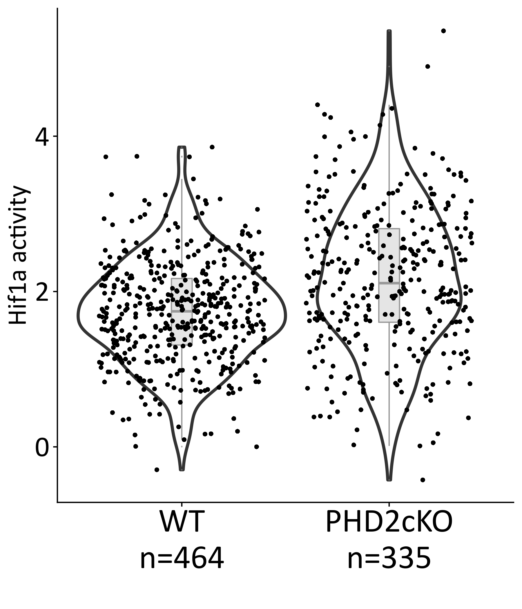<!-- -->

### PROGENy focused on hypoxia response

``` r
### Progeny ####
progeny.mat <- read.table("../data/Prior/progeny_matrix_mouse_v1.txt",sep=",",header=TRUE)
rownames(progeny.mat) <- progeny.mat$X
progeny.mat <- progeny.mat[which(colnames(progeny.mat)!="X")]
progeny.mat <- as.matrix(progeny.mat)

common <- intersect(rownames(S), rownames(progeny.mat))
  
prog <- t(as.matrix(S@assays$RNA@data[common,])) %*% progeny.mat[common,]
rn <- rownames(prog)
prog <- apply(prog,2,scale)
rownames(prog) <- rn
prog <- t(prog)
  
stopifnot(colnames(S) == colnames(prog))
S$Hypoxia_response <- prog["Hypoxia",]
rm(common,prog)

# Visualization focused on Macrophages population
 # VlnPlot(S[, Idents(S)=="Macrophage"],features = "Hypoxia_response", group.by = "stim")
VlnPlot.stim(S[,Idents(S)=="Macrophage"], 
     meta.feature = "Hypoxia_response", ylab="Hypoxia response (Score)", 
     fontTXT=fontTXT)
```

    ## Joining, by = "stim"

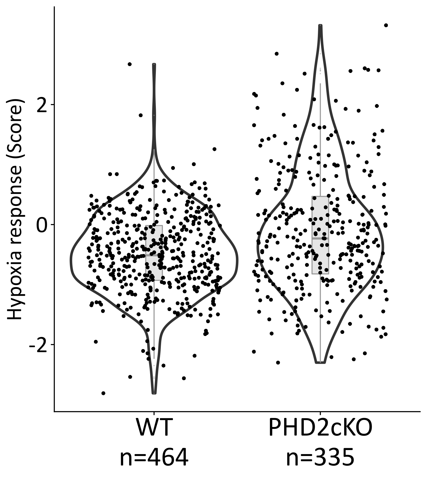<!-- -->

### Enrichment of in-vitro PHD2-KO signature

``` r
# Load in-vitro signature from the bulk analysis
invitro.dge <- read.table("../Analysis_invitro_bulk/output/01_bulk_dge/MC_PHD2_diffexpr.tsv", 
              sep="\t", header=TRUE, stringsAsFactors = FALSE)
invitro.sign <- sort(setNames(invitro.dge$t,invitro.dge$genes),decreasing = TRUE)
# Get common genes
common <- intersect(rownames(S), names(invitro.sign))
# Discard certain genes that are driving
avoid_genes <- c("Bnip3", "Spp1")
common <- setdiff(common, avoid_genes)
# Define signature and show
invitro.gs <- names(sort(invitro.sign[common],decreasing = TRUE))[1:50]
print(invitro.gs)
```

    ##  [1] "Pfkl"     "Hpgd"     "Pdk1"     "Cd5l"     "Ankrd37"  "Egln3"   
    ##  [7] "S1pr1"    "P4ha1"    "Fgd6"     "Tpi1"     "Narf"     "Ighg2b"  
    ## [13] "Pgk1"     "Ak4"      "Tfrc"     "Eno1"     "Folr2"    "Anxa3"   
    ## [19] "Col18a1"  "Wdfy1"    "Atp6v0d2" "Mif"      "Igkc"     "Armc6"   
    ## [25] "Gapdh"    "Zfyve28"  "Abcd3"    "Pcdh7"    "Mefv"     "Ets1"    
    ## [31] "Acacb"    "Mamdc2"   "Tmem8"    "Gpi1"     "Dhrs9"    "Rgs11"   
    ## [37] "Fnbp1l"   "Slc6a8"   "Jak3"     "Myo1e"    "Agl"      "Igf2bp2" 
    ## [43] "Ldha"     "Frrs1"    "Zfp868"   "Tlr1"     "Gcn1l1"   "Lpl"     
    ## [49] "Fam214a"  "Antxr2"

``` r
# Build rankings for AUC
cells_rankings <- AUCell_buildRankings(as.matrix(S@assays$RNA@data))
```

    ## Quantiles for the number of genes detected by cell: 
    ## (Non-detected genes are shuffled at the end of the ranking. Keep it in mind when choosing the threshold for calculating the AUC).

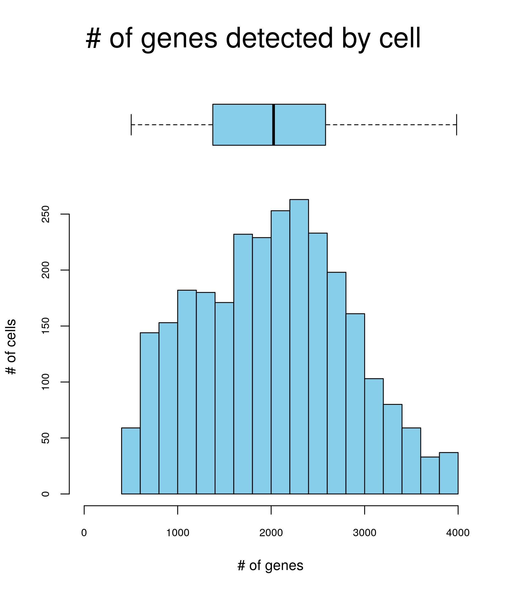<!-- -->

    ##     min      1%      5%     10%     50%    100% 
    ##  503.00  553.76  716.00  891.00 2026.00 3984.00

``` r
# Use top N (e.g. 50) to calculate enrichment at single-cell level
cells_AUC <- AUCell_calcAUC(list("invitro"=invitro.gs), cells_rankings, aucMaxRank=nrow(cells_rankings)*0.05)
# Explore thresholds
cells_assignment <- AUCell_exploreThresholds(cells_AUC, plotHist=FALSE, assign=TRUE) 
# Get AUCell scores  
AUC.sign <- getAUC(cells_AUC)[1,]
stopifnot(colnames(S) == names(AUC.sign))
S$PHD2cKO <- AUC.sign
rm(AUC.sign, cells_rankings, cells_AUC, cells_assignment)

# Visualization focused on Macrophages population
 # VlnPlot(S[, Idents(S)=="Macrophage"],features = "PHD2cKO", group.by = "stim")
VlnPlot.stim(S[,Idents(S)=="Macrophage"], 
     meta.feature = "PHD2cKO", ylab="Expression of PHD2cKO signature (AUC)", 
     fontTXT=fontTXT)
```

    ## Joining, by = "stim"

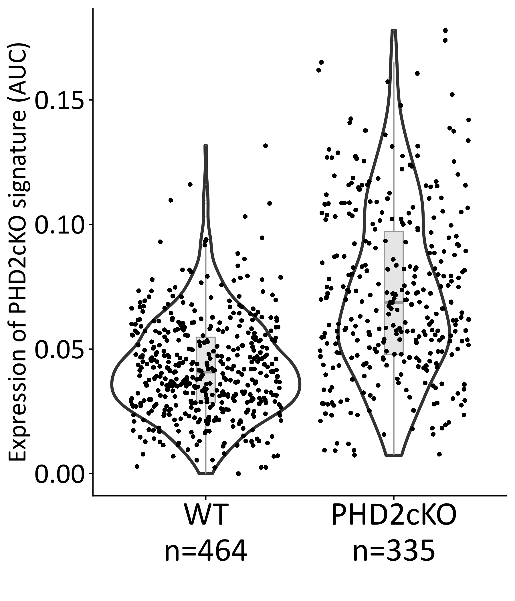<!-- -->

### Pair-wise comparison of these markers of hypoxia response

``` r
# Define colors for ggplot
cond.cols <- c("WT"="grey", "PHD2cKO"="red")

panel.cor <- function(x, y, digits=2, prefix="", cex.cor, family=fontTXT, ...)
{
  usr <- par("usr"); on.exit(par(usr))
  par(usr = c(0, 1, 0, 1))
  r <- abs(cor(x, y, method="pearson"))
  txt <- format(c(r, 0.123456789), digits=digits)[1]
  txt <- paste(prefix, txt, sep="")
  if(missing(cex.cor)) cex.cor <- 0.8/strwidth(txt)
  text(0.5, 0.5, txt, cex = cex.cor * r, family=family)
}

# Visualization
pairs(S@meta.data[Idents(S)=="Macrophage",
            c("Hif1a_activity","Hypoxia_response","PHD2cKO")],
      lower.panel=panel.smooth, upper.panel=panel.cor, cex.labels = 2.6, cex.axis=2.3, las=1,
      family=fontTXT,
      pch=21,
      bg=cond.cols[S@meta.data[Idents(S)=="Macrophage", "stim"]])
```

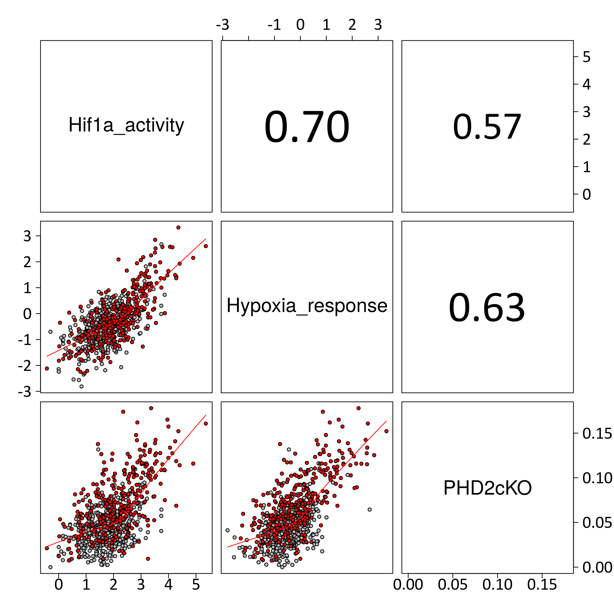<!-- -->

We could conclude that PHD2-cKO condition presents a skewed distribution
of cells towards hypoxia response as compared to PHD2-wt
condition.

### Stratify

``` r
cutoff <- quantile(S@meta.data[Idents(S)=="Macrophage" & S$stim=="PHD2cKO", "PHD2cKO"], 
           probs=0.75) 

S$PHD2cKO_class <- NA

S$PHD2cKO_class[Idents(S)=="Macrophage"] <- ifelse(S$PHD2cKO[Idents(S)=="Macrophage"] > cutoff,
                           "High", "Low")

S$PHD2cKO_class2 <- paste0(S$stim,"_",S$PHD2cKO_class)

print(cutoff)
```

    ##        75% 
    ## 0.09726568

The cutoff of Q3 in PHD2cKO is 0.0972657.

``` r
# Visualization focused on Macrophages population
VlnPlot.stim(S[,Idents(S)=="Macrophage"], 
     meta.feature = "PHD2cKO", ylab="Expression of PHD2cKO signature (AUC)", 
     fontTXT=fontTXT) + geom_hline(yintercept=cutoff)
```

    ## Joining, by = "stim"

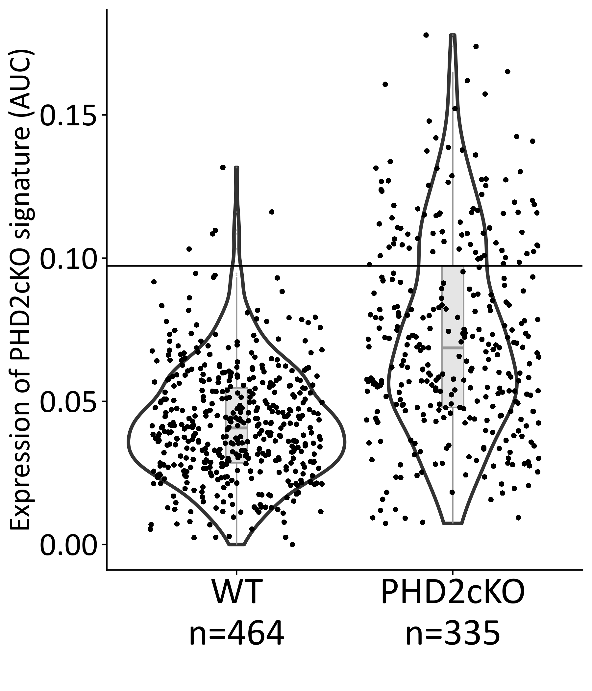<!-- -->

``` r
S1 <- S[, Idents(S)=="Macrophage"] 
Idents(S1) <- "PHD2cKO_class2"
dge <- FindMarkers(S1, ident.1 = "PHD2cKO_High", ident.2 = "WT_Low",
           min.pct = 0, logfc.threshold = 0)
```

``` r
Mac_interesting_genes <- getGmt("../data/Prior/MC_PHD2_diff.gmt")
Mac_interesting_genes <- unlist(geneIds(Mac_interesting_genes))
if(any(!Mac_interesting_genes %in% rownames(S1))) {
    cat(paste("The following genes are not present in the gene expr matrix:","\n",
          paste(setdiff(Mac_interesting_genes, rownames(S1)), collapse=","),
          "\n"),
          file=stdout())
    Mac_interesting_genes <- intersect(Mac_interesting_genes, rownames(S1))
}
```

    ## The following genes are not present in the gene expr matrix: 
    ##  Epo

``` r
dge$significant <- ifelse(dge$p_val_adj < 0.05,"Adj.P-value<0.05","n.s.")
dge$genes <- rownames(dge)
dge$show <- dge$genes %in% Mac_interesting_genes
 
p = ggplot(dge, aes(avg_logFC, -log10(p_val+0.001))) +
    geom_point(aes(col=significant), alpha=0.6) +
    scale_color_manual(values=c("red", "black"))
  
  
p+geom_label_repel(data=dge[dge$show,],
                          aes(label=genes), family=fontTXT, size=8,
                          force=2,
              xlim = c(2.5,3.0),
                          nudge_y=0.05, direction = "y", segment.size = 0.5) + 
    coord_cartesian(xlim = c(-1.3, 2.3), clip = "off") +
    theme_cowplot() +
    xlab("avg log2FC") + ylab("-log10(pvalue + 0.001)") +
    theme(text = element_text(family=fontTXT, size=20),
      legend.text = element_text(family=fontTXT, size=20),
      axis.text = element_text(family=fontTXT, size=20),
          plot.margin = unit(c(0.3, 2.6, 0.1, 0.1), "cm"),
      legend.position = "bottom",
      legend.direction = "horizontal"
      )
```

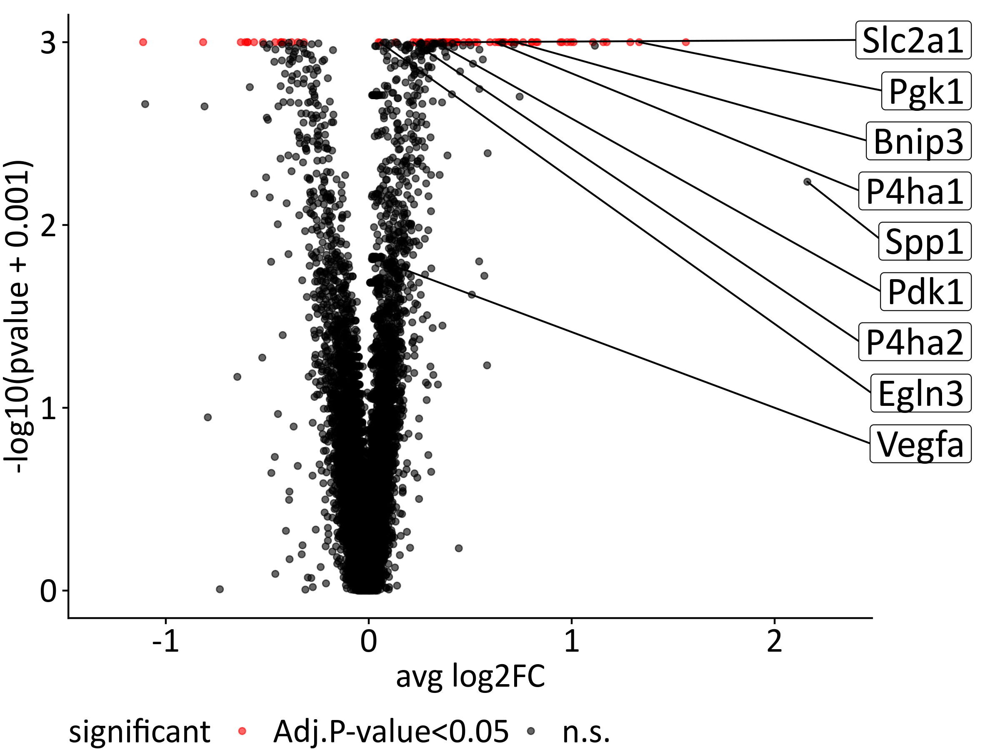<!-- -->

## Zoom-in Macrophages

``` r
M.list <- SplitObject(S[, Idents(S)=="Macrophage"],
              split.by="orig.ident")

for(i in names(M.list)){
    M.list[[i]] <- NormalizeData(M.list[[i]], verbose=FALSE)
    M.list[[i]] <- ScaleData(M.list[[i]], verbose=FALSE)
    M.list[[i]] <- FindVariableFeatures(M.list[[i]], 
                       selection.method = "vst",
                       nfeatures = 2000, verbose = FALSE)

}
M.anchors <- FindIntegrationAnchors(object.list = M.list, dims = 1:30)
```

    ## Computing 2000 integration features

    ## Scaling features for provided objects

    ## Finding all pairwise anchors

    ## Running CCA

    ## Merging objects

    ## Finding neighborhoods

    ## Finding anchors

    ##  Found 1369 anchors

    ## Filtering anchors

    ##  Retained 1278 anchors

    ## Extracting within-dataset neighbors

``` r
M.i <- IntegrateData(anchorset = M.anchors, dims = 1:30)
```

    ## Merging dataset 2 into 1

    ## Extracting anchors for merged samples

    ## Finding integration vectors

    ## Finding integration vector weights

    ## Integrating data

``` r
# Clean metadata
M.i@meta.data <- M.i@meta.data[, grep("snn_res", colnames(M.i@meta.data), invert=TRUE)]

if(all(dim(M.i@assays$RNA@scale.data) == c(0,0))) {
M.i@assays$RNA@scale.data <- cbind(M.list[[1]]@assays$RNA@scale.data,
                   M.list[[2]]@assays$RNA@scale.data)[,colnames(M.i)] 
}

DefaultAssay(M.i) <- "integrated"

# Run the standard workflow for visualization and clustering
M.i <- ScaleData(M.i, verbose = FALSE)
M.i <- RunPCA(M.i, npcs = 30, verbose = FALSE)
# ElbowPlot(M.i)
M.i <- RunUMAP(M.i, reduction = "pca", dims = 1:15)
```

    ## 23:08:23 UMAP embedding parameters a = 0.9922 b = 1.112

    ## 23:08:23 Read 799 rows and found 15 numeric columns

    ## 23:08:23 Using Annoy for neighbor search, n_neighbors = 30

    ## 23:08:23 Building Annoy index with metric = cosine, n_trees = 50

    ## 0%   10   20   30   40   50   60   70   80   90   100%

    ## [----|----|----|----|----|----|----|----|----|----|

    ## **************************************************|
    ## 23:08:24 Writing NN index file to temp file /tmp/Rtmpa0Pb1Z/file62d216b1d244
    ## 23:08:24 Searching Annoy index using 1 thread, search_k = 3000
    ## 23:08:24 Annoy recall = 100%
    ## 23:08:25 Commencing smooth kNN distance calibration using 1 thread
    ## 23:08:26 Initializing from normalized Laplacian + noise
    ## 23:08:26 Commencing optimization for 500 epochs, with 30574 positive edges
    ## 23:08:28 Optimization finished

``` r
DimPlot(M.i, reduction="umap", group.by="orig.ident", cols=c("red","grey"))
```

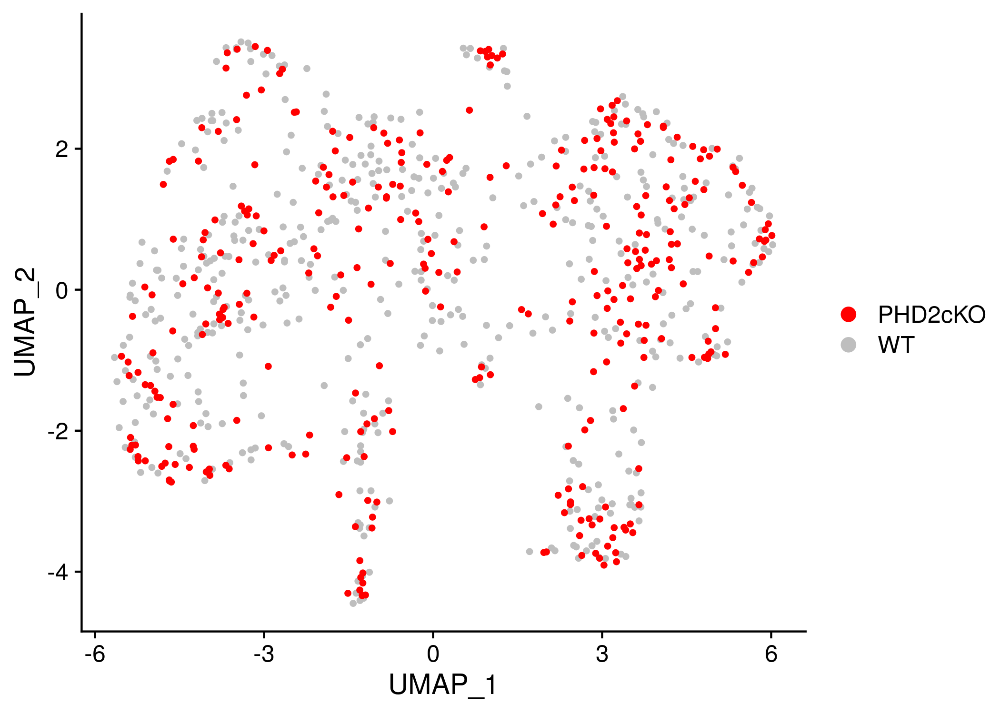<!-- -->

Second round of unsupervised clustering to find even major differences
in this cell population (macrophages).

``` r
set.seed(1234)
# Find clusters
M.i <- FindNeighbors(M.i, dims = 1:15)
```

    ## Computing nearest neighbor graph

    ## Computing SNN

``` r
M.i <- FindClusters(M.i, resolution = 0.1)
```

    ## Modularity Optimizer version 1.3.0 by Ludo Waltman and Nees Jan van Eck
    ## 
    ## Number of nodes: 799
    ## Number of edges: 26680
    ## 
    ## Running Louvain algorithm...
    ## Maximum modularity in 10 random starts: 0.9209
    ## Number of communities: 3
    ## Elapsed time: 0 seconds

``` r
table(Idents(M.i))
```

    ## 
    ##   0   1   2 
    ## 474 261  64

``` r
DimPlot(M.i, reduction="umap")
```

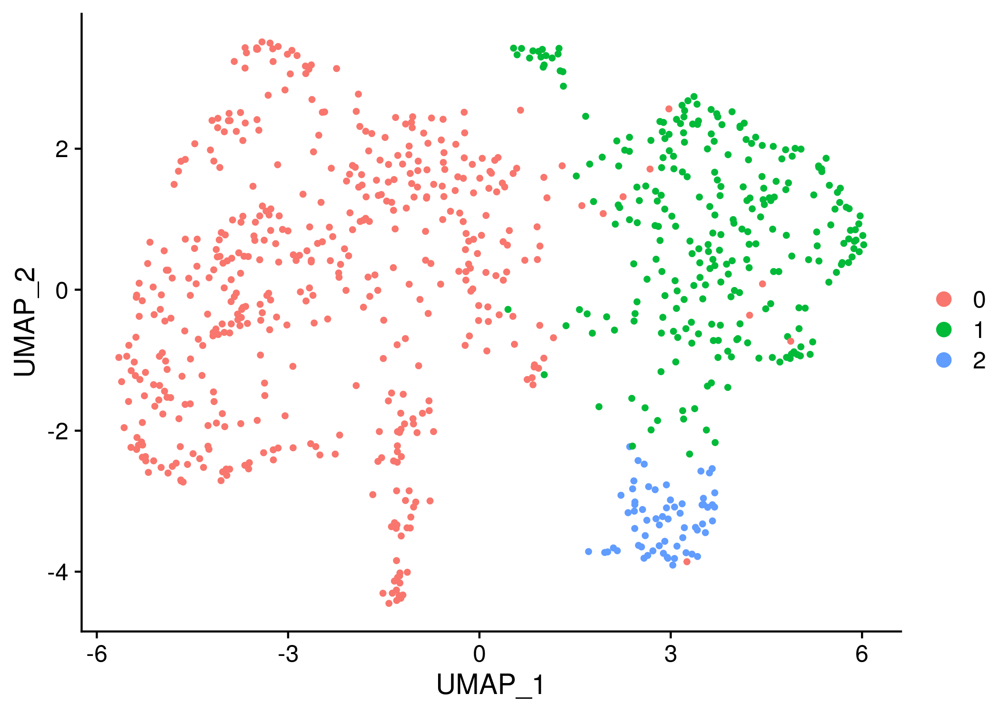<!-- -->

We will show some markers specific of macrophages to confirm that
actually these cells are macrophages.

``` r
DefaultAssay(M.i) <- "RNA"
tm <- theme(title = element_text(size=26, family=fontTXT),
        axis.title = element_text(size=20, family=fontTXT),
        axis.text = element_text(size=20, family=fontTXT),
        legend.text = element_text(size=18, family=fontTXT)
        )
p1 <- FeaturePlot(M.i, features=c("Lyz2")) + tm
p2 <- FeaturePlot(M.i, features=c("Cd68")) + tm
p3 <- FeaturePlot(M.i, features=c("Myh11")) + tm
p4 <- FeaturePlot(M.i, features=c("Cdh5")) + tm
## Other candidates, immuno markers
# FeaturePlot(M.i, features=c("Cd3e")) + tm
# FeaturePlot(M.i, features=c("Ptprc")) + tm
CombinePlots(list(p1,p2,p3,p4), ncol = 2)
```

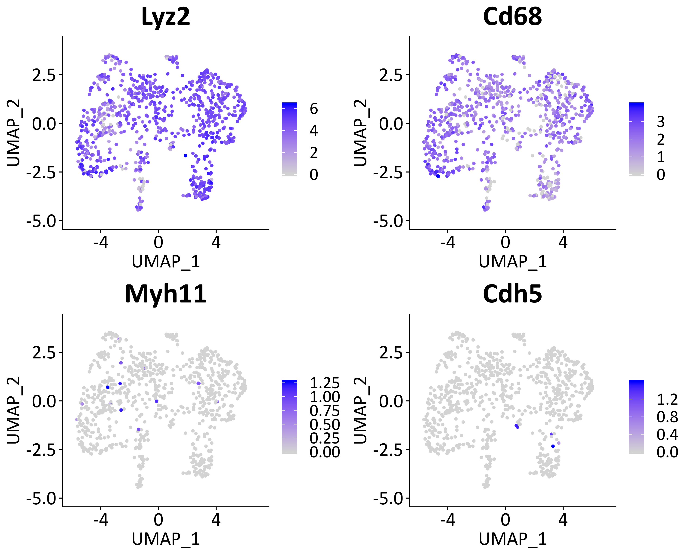<!-- -->

In addition, we show two markers characteristic of M1 and M2 macrophages
respectively.

``` r
FeaturePlot(M.i, features=c("Gngt2", "Folr2"))
```

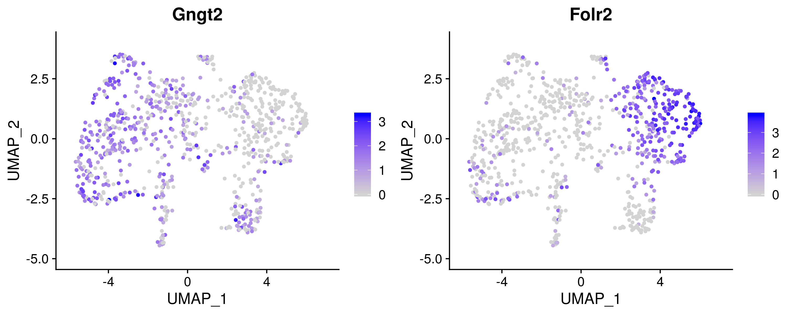<!-- -->

Then we start renaming the identities of these clusters accordingly.
Next plot are going to confirm these identities (cell subtypes) using
specific markers of these types of macrophages.

``` r
M.i <- RenameIdents(M.i, c("0"="M1-Macrophage",
               "1"="M2-Macrophage",
               "2"="n.a"))
```

``` r
M.markers <- getGmt("../data/markers/consensus_plaque.gmt")
M.markers <- M.markers[grep("M[12]-Macrophages", names(M.markers))]
setName(M.markers[[1]]) <- "M1"
setName(M.markers[[2]]) <- "M2"
#M.markers <- M.markers[grep("Macrophages", names(M.markers))]
hp <- DoHeatmap3(SeuratObject=M.i, GSC=M.markers, assay="RNA", res="Idents", 
       row_names_size=14, column_title_size=0,
       show_hr=FALSE, fontfamily=fontTXT) 
draw(hp, heatmap_legend_side="right", annotation_legend_side="bottom")
```

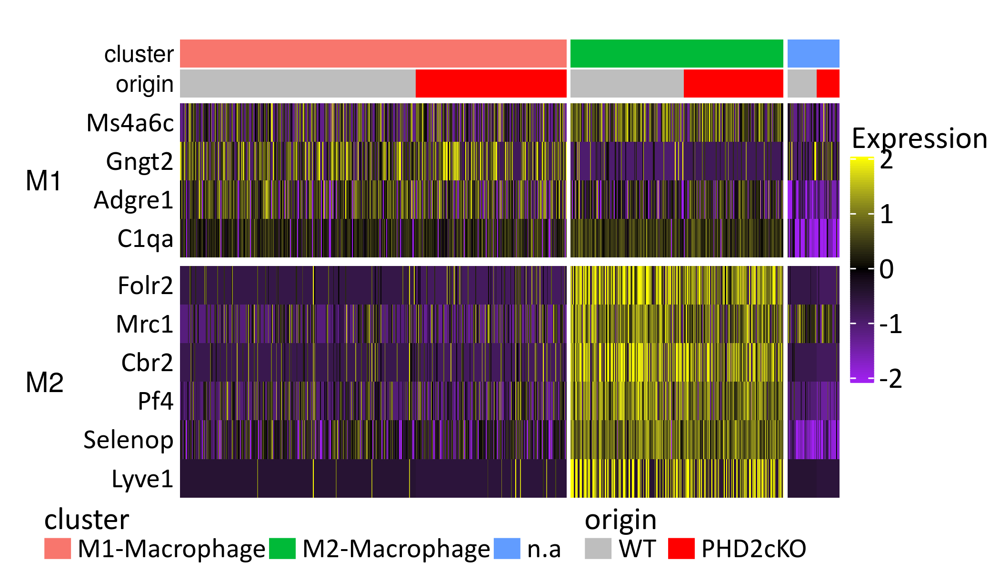<!-- -->

We reproduce the distribution of PHD2cKO signature in the in-vivo
population, but this time stratifying by subclusters (M1, M2
macrophages).

``` r
dat <- data.frame(stim=factor(M.i$orig.ident, levels=c("WT","PHD2cKO")),
          cluster=Idents(M.i),
          feat=M.i$PHD2cKO,
          row.names=colnames(M.i))

# sample size
sample_size = dat %>% group_by(stim) %>% summarize(num=n())
# Plot
dat <- dat %>%
  left_join(sample_size) %>%
  mutate(myaxis = paste0(stim, "\n", "n=", num))
```

    ## Joining, by = "stim"

``` r
dat$myaxis <- factor(dat$myaxis, levels=sapply(levels(dat$stim), function(z) grep(z, unique(dat$myaxis), value=TRUE)))

ylabTXT="Expression of PHD2CKO signature (AUC)"
    
ggplot(dat, aes(x=myaxis, y=feat, fill=cluster)) +
    geom_violin(width=1.0, lwd=1.2) +
    geom_jitter(shape=16,size=1.5, 
        position=position_jitterdodge(jitter.width=0.5,
                          dodge.width=1.0,
                          seed=1234)) +
    xlab("") + ylab(ylabTXT) +
    theme_cowplot() +
    theme(
      axis.text.x = element_text(family=fontTXT, size=28),
      axis.text.y = element_text(family=fontTXT, size=24),
      axis.title = element_text(family=fontTXT, size=22),
      legend.text = element_text(family=fontTXT, size=18),
      legend.title = element_blank(),
      legend.position="bottom",
    )
```

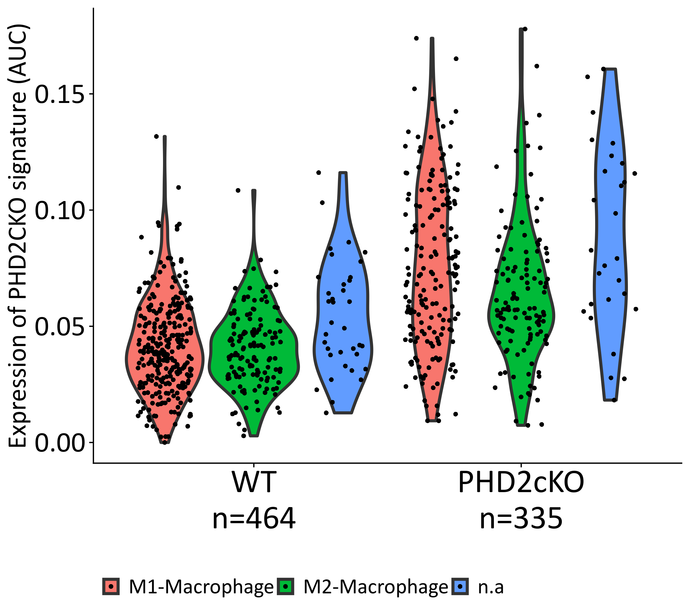<!-- -->

## Save the Seurat Object

``` r
saveRDS(S, paste0(DATADIR,"/S.rds"));
saveRDS(M.i, paste0(DATADIR,"/M.rds"));
```

## SessionInfo

``` r
sessionInfo()
```

    ## R version 3.6.1 (2019-07-05)
    ## Platform: x86_64-pc-linux-gnu (64-bit)
    ## Running under: Ubuntu 18.04.3 LTS
    ## 
    ## Matrix products: default
    ## BLAS:   /usr/lib/x86_64-linux-gnu/blas/libblas.so.3.7.1
    ## LAPACK: /usr/lib/x86_64-linux-gnu/lapack/liblapack.so.3.7.1
    ## 
    ## locale:
    ##  [1] LC_CTYPE=en_US.UTF-8       LC_NUMERIC=C              
    ##  [3] LC_TIME=en_GB.UTF-8        LC_COLLATE=en_US.UTF-8    
    ##  [5] LC_MONETARY=en_GB.UTF-8    LC_MESSAGES=en_US.UTF-8   
    ##  [7] LC_PAPER=en_GB.UTF-8       LC_NAME=C                 
    ##  [9] LC_ADDRESS=C               LC_TELEPHONE=C            
    ## [11] LC_MEASUREMENT=en_GB.UTF-8 LC_IDENTIFICATION=C       
    ## 
    ## attached base packages:
    ##  [1] grid      stats4    parallel  stats     graphics  grDevices utils    
    ##  [8] datasets  methods   base     
    ## 
    ## other attached packages:
    ##  [1] ComplexHeatmap_2.0.0 extrafont_0.17       dplyr_0.8.3         
    ##  [4] purrr_0.3.2          viper_1.18.1         AUCell_1.6.1        
    ##  [7] ggrepel_0.8.1        ggplot2_3.2.1        fgsea_1.10.1        
    ## [10] Rcpp_1.0.2           genesorteR_0.3.1     Matrix_1.2-17       
    ## [13] cowplot_1.0.0        GSEABase_1.46.0      graph_1.62.0        
    ## [16] annotate_1.62.0      XML_3.98-1.20        AnnotationDbi_1.46.1
    ## [19] IRanges_2.18.2       S4Vectors_0.22.1     Biobase_2.44.0      
    ## [22] BiocGenerics_0.30.0  Seurat_3.1.0         rmarkdown_1.15      
    ## [25] nvimcom_0.9-82      
    ## 
    ## loaded via a namespace (and not attached):
    ##   [1] circlize_0.4.7              backports_1.1.4            
    ##   [3] fastmatch_1.1-0             plyr_1.8.4                 
    ##   [5] igraph_1.2.4.1              lazyeval_0.2.2             
    ##   [7] splines_3.6.1               BiocParallel_1.18.1        
    ##   [9] listenv_0.7.0               GenomeInfoDb_1.20.0        
    ##  [11] digest_0.6.21               htmltools_0.3.6            
    ##  [13] gdata_2.18.0                magrittr_1.5               
    ##  [15] memoise_1.1.0               cluster_2.1.0              
    ##  [17] mixtools_1.1.0              ROCR_1.0-7                 
    ##  [19] globals_0.12.4              RcppParallel_4.4.3         
    ##  [21] matrixStats_0.55.0          R.utils_2.9.0              
    ##  [23] extrafontdb_1.0             colorspace_1.4-1           
    ##  [25] blob_1.2.0                  xfun_0.9                   
    ##  [27] crayon_1.3.4                RCurl_1.95-4.12            
    ##  [29] jsonlite_1.6                zeallot_0.1.0              
    ##  [31] survival_2.44-1.1           zoo_1.8-6                  
    ##  [33] ape_5.3                     glue_1.3.1                 
    ##  [35] gtable_0.3.0                zlibbioc_1.30.0            
    ##  [37] XVector_0.24.0              leiden_0.3.1               
    ##  [39] GetoptLong_0.1.7            DelayedArray_0.10.0        
    ##  [41] Rttf2pt1_1.3.8              shape_1.4.4                
    ##  [43] future.apply_1.3.0          scales_1.0.0               
    ##  [45] pheatmap_1.0.12             DBI_1.0.0                  
    ##  [47] bibtex_0.4.2                metap_1.1                  
    ##  [49] viridisLite_0.3.0           xtable_1.8-4               
    ##  [51] clue_0.3-57                 reticulate_1.13            
    ##  [53] bit_1.1-14                  rsvd_1.0.2                 
    ##  [55] mclust_5.4.5                SDMTools_1.1-221.1         
    ##  [57] tsne_0.1-3                  htmlwidgets_1.3            
    ##  [59] httr_1.4.1                  gplots_3.0.1.1             
    ##  [61] RColorBrewer_1.1-2          ica_1.0-2                  
    ##  [63] pkgconfig_2.0.3             R.methodsS3_1.7.1          
    ##  [65] uwot_0.1.4                  labeling_0.3               
    ##  [67] tidyselect_0.2.5            rlang_0.4.0                
    ##  [69] reshape2_1.4.3              later_0.8.0                
    ##  [71] munsell_0.5.0               tools_3.6.1                
    ##  [73] RSQLite_2.1.2               ggridges_0.5.1             
    ##  [75] evaluate_0.14               stringr_1.4.0              
    ##  [77] yaml_2.2.0                  npsurv_0.4-0               
    ##  [79] knitr_1.24                  bit64_0.9-7                
    ##  [81] fitdistrplus_1.0-14         caTools_1.17.1.2           
    ##  [83] RANN_2.6.1                  pbapply_1.4-2              
    ##  [85] future_1.14.0               nlme_3.1-141               
    ##  [87] mime_0.7                    R.oo_1.22.0                
    ##  [89] compiler_3.6.1              plotly_4.9.0               
    ##  [91] png_0.1-7                   e1071_1.7-2                
    ##  [93] lsei_1.2-0                  tibble_2.1.3               
    ##  [95] stringi_1.4.3               RSpectra_0.15-0            
    ##  [97] lattice_0.20-38             vctrs_0.2.0                
    ##  [99] pillar_1.4.2                lifecycle_0.1.0            
    ## [101] GlobalOptions_0.1.0         Rdpack_0.11-0              
    ## [103] lmtest_0.9-37               RcppAnnoy_0.0.13           
    ## [105] data.table_1.12.8           bitops_1.0-6               
    ## [107] irlba_2.3.3                 gbRd_0.4-11                
    ## [109] httpuv_1.5.2                GenomicRanges_1.36.0       
    ## [111] R6_2.4.0                    promises_1.0.1             
    ## [113] KernSmooth_2.23-16          gridExtra_2.3              
    ## [115] codetools_0.2-16            MASS_7.3-51.4              
    ## [117] gtools_3.8.1                assertthat_0.2.1           
    ## [119] SummarizedExperiment_1.14.1 rjson_0.2.20               
    ## [121] withr_2.1.2                 sctransform_0.2.0          
    ## [123] GenomeInfoDbData_1.2.1      class_7.3-15               
    ## [125] tidyr_1.0.0                 segmented_1.0-0            
    ## [127] Rtsne_0.15                  shiny_1.3.2

``` r
{                                                                                                                                                                                                           
sink(file=paste0(OUTDIR,"/sessionInfo.txt"))
print(sessionInfo())
sink()
}
```
