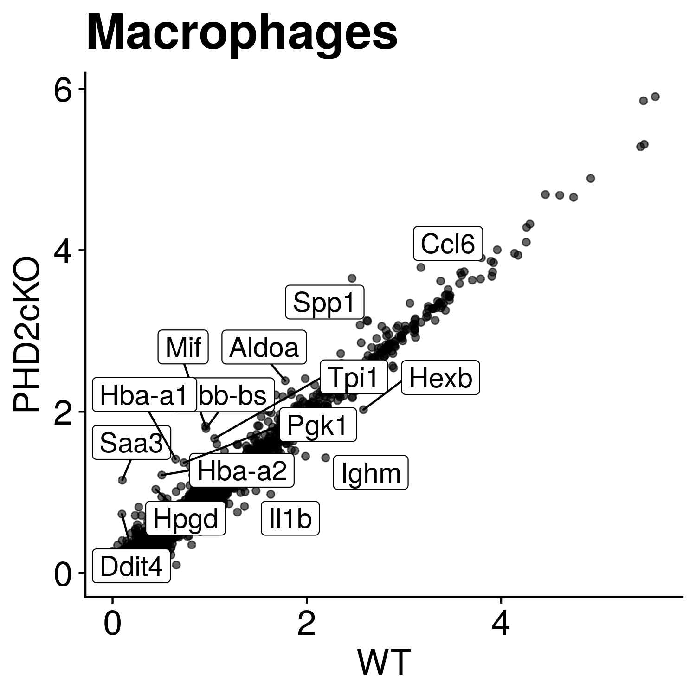
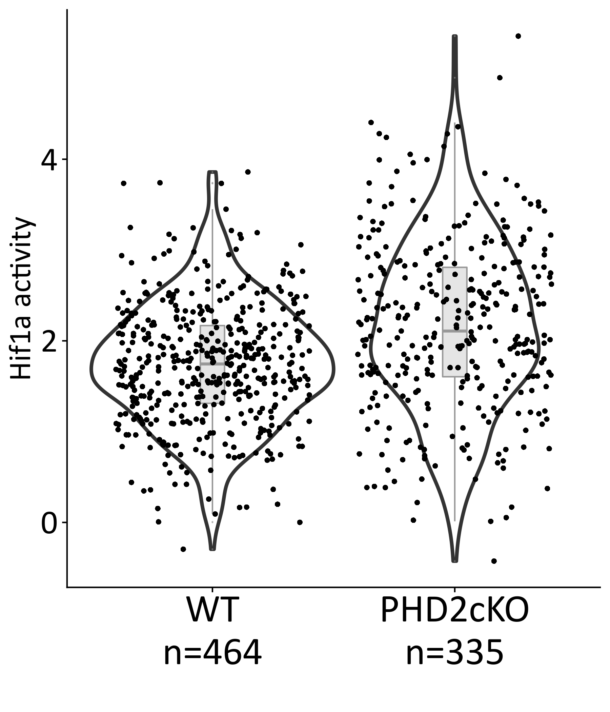
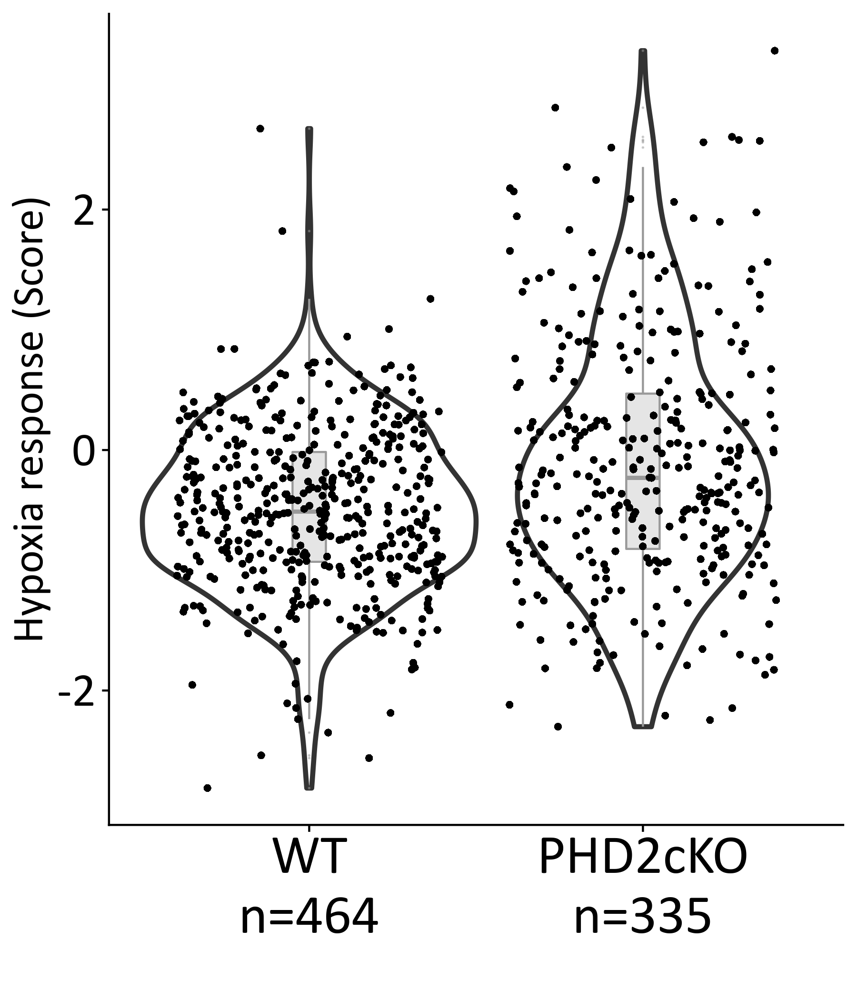
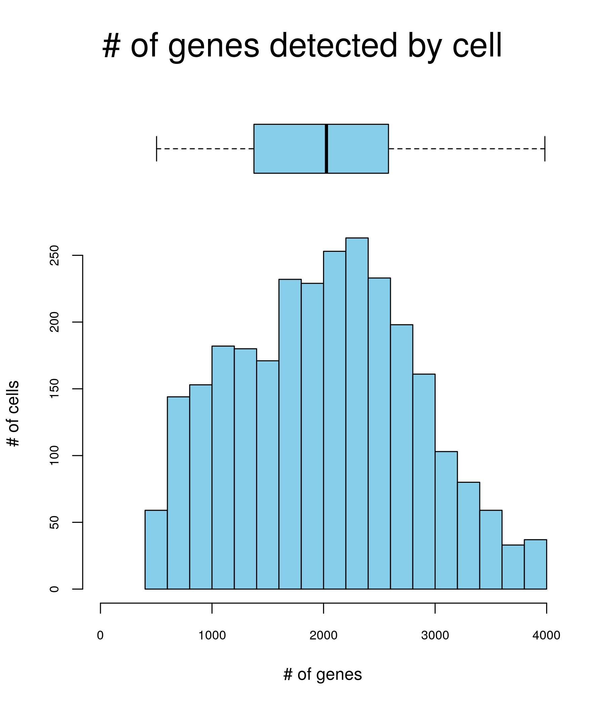
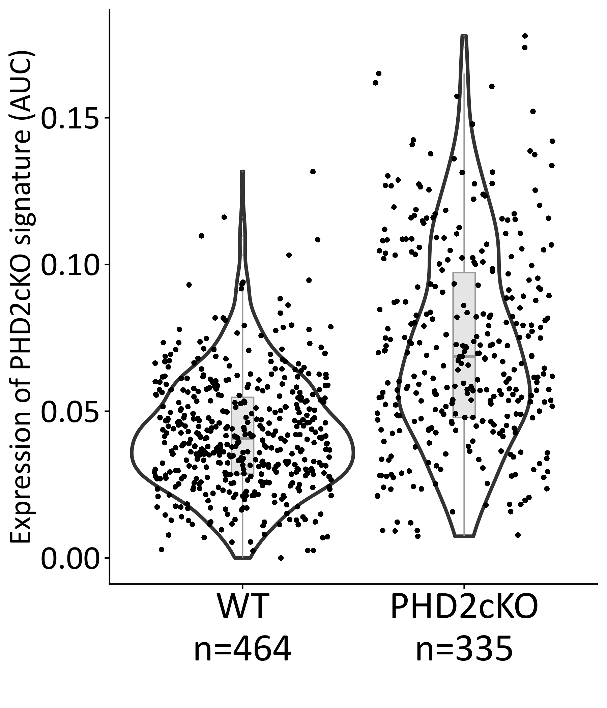
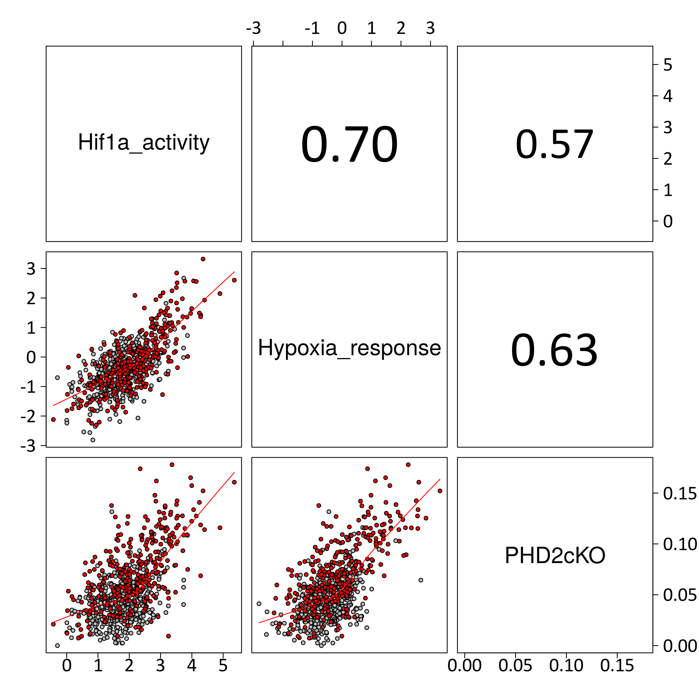
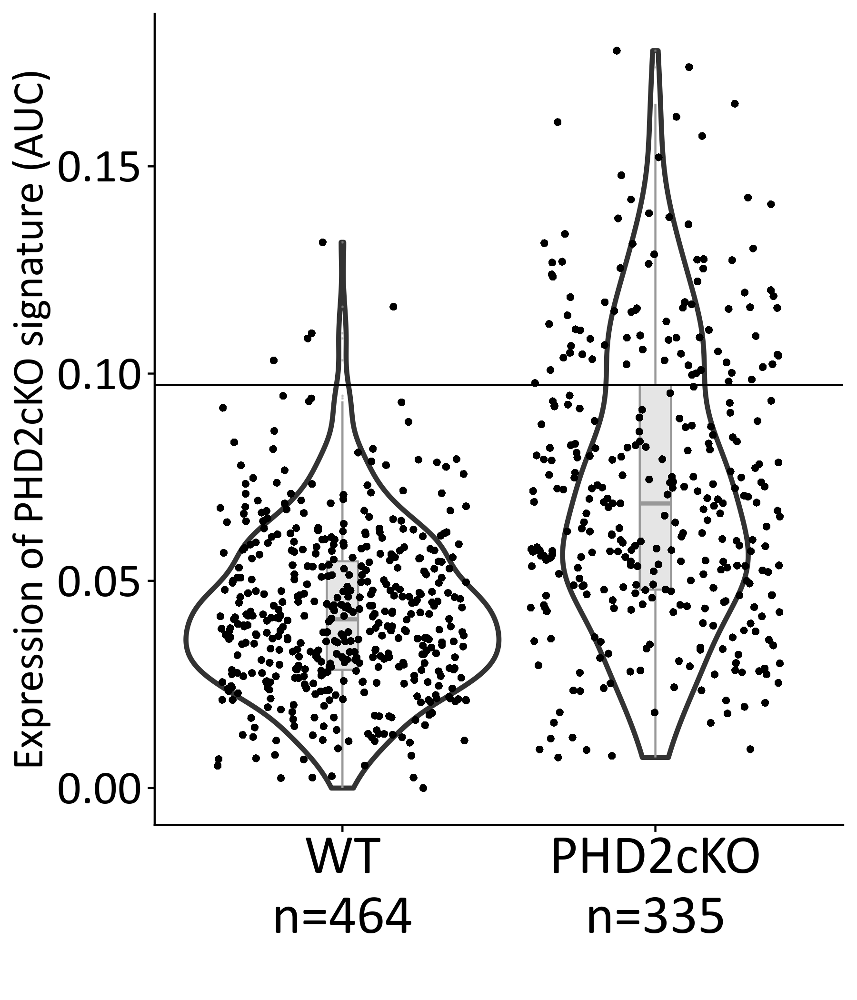
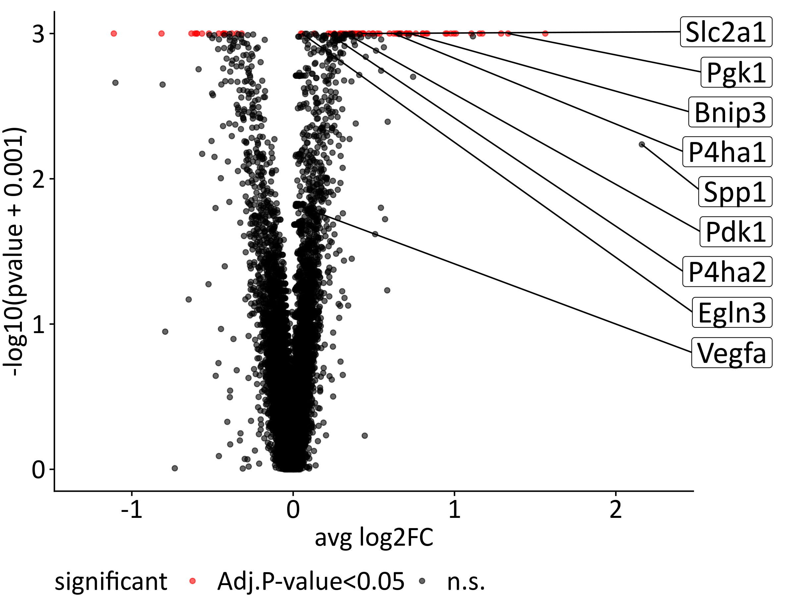

Investigation of the role of PHD2 in-vivo atherogenesis in Macrophages
================
Javier Perales-Patón - <javier.perales@bioquant.uni-heidelberg.de>

## Load libraries

``` r
suppressPackageStartupMessages(require(Seurat))
suppressPackageStartupMessages(require(GSEABase))
suppressPackageStartupMessages(require(cowplot))
suppressPackageStartupMessages(require(genesorteR))
suppressPackageStartupMessages(require(fgsea))
suppressPackageStartupMessages(require(ggplot2))
suppressPackageStartupMessages(require(ggrepel))
suppressPackageStartupMessages(require(AUCell))
suppressPackageStartupMessages(require(viper))
suppressPackageStartupMessages(require(purrr))
suppressPackageStartupMessages(require(dplyr))
source("../src/graphics.R")
```

    ## Loading required package: extrafont

    ## Registering fonts with R

``` r
source("../src/seurat_fx.R")
```

### Setting-up environment

The environment will be set with a random seed number for
reproducibility and an output folder for processed data and figures.

``` r
# Seed number
set.seed(1234)
# Output directory
OUTDIR <- "./output/03_macrophages"
if(!dir.exists(OUTDIR)) dir.create(OUTDIR);
# Input data
sobj <- "./output/02_assignment/S.rds"
```

## Load data

Read the Seurat Object from second step.

``` r
if(file.exists(sobj)) {
    S <- readRDS(sobj)
} else {
    stop("ERROR: Seurat object does not exist. Run 02.rmd to generate it.")
}
```

We also load the ortholog information for functional analysis

``` r
# Lib of hsa2mmu orthologs
mmu2hsa <- readRDS("../data/Gene_annotation/hgnc2mgi_hsa2mmu.rds")
```

## Comparison between PHD2 functional perturbation

The in-vivo model carries a PHD2 knock-out in the myeloid lineage with
an effectivity of 30% of the cells. The section will investigate if the
penetrance of this gene perturbation is enough to be capture in the
average population of the mouse replicate.

### Differential gene expression

``` r
MARKERS.OUTDIR <- paste0(OUTDIR,"/Macrophages_avg_PHD2cKO_vs_PHD2wt")
if(!dir.exists(MARKERS.OUTDIR)) dir.create(MARKERS.OUTDIR);

S1 <- S[, S@active.ident=="Macrophage"]

Idents(S1) <- "stim"
avg <- log1p(AverageExpression(S1, verbose = FALSE)$RNA)
  
rnk <- setNames(avg[,"PHD2cKO"] - avg[,"WT"], rownames(avg))
top <- names(sort(abs(rnk),decreasing = TRUE)[1:15])
  
ggplot(avg, aes(WT, PHD2cKO)) + geom_point(alpha=0.6) + ggtitle(label = "Macrophages") + 
    xlab("WT") + ylab("PHD2cKO")+
    geom_label_repel(data=avg[top,], aes(label=top), size=5) + 
    theme_cowplot() +
      theme(axis.title = element_text(size=22),
            title = element_text(size=22, hjust = 0.5),
            axis.text = element_text(size=18),
            axis.title.x = element_text(size=18),
            axis.title.y = element_text(size=18))
```

<!-- -->

``` r
dge <- FindMarkers(object = S1, ident.1 = "PHD2cKO", ident.2 = "WT", 
          logfc.threshold=0, min.pct=0)
cols_names <- colnames(dge)
# Add two extra cols
dge$cluster <- "Macrophage PHD2cKO vs PHD2wt"
dge$gene <- rownames(dge)

dge <- dge[,c("cluster", "gene", cols_names)]
   
write.table(dge,
            file = paste0(MARKERS.OUTDIR,"/Macrophages_avg_PHD2cKO_vs_PHD2wt_DEGs.tsv"),
            sep="\t",col.names = TRUE, row.names = FALSE, quote=FALSE
)
```

There are these number of differentially expressed genes between the two
conditions:

``` r
table(sign(dge$avg_logFC) * as.integer(dge$p_val_adj < 0.05))
```

    ## 
    ##    -1     0     1 
    ##    84 13274    32

We could conclude that there are not large differences in the average
gene expression of macrophages based on condition (PHD2 KO). Next
efforts will be made to recover transcriptional programmes on this
regulation and try to dissect cell populations

### Functional analysis

We create a ranking of differentially expressed genes for the enrichment
analysis.

``` r
rnk <- setNames(sign(dge$avg_logFC) * -log10(dge$p_val_adj), dge$gene)
```

``` r
# GO analysis
GO <- getGmt("../data/MSigDB/c5.bp.v7.0.symbols.gmt")
GO <- lapply(geneIds(GO), function(z) unlist(sapply(z, function(j) mmu2hsa[[j]])))

GO.res <- fgsea(pathways = GO, stats = rnk, nperm=10000) 
GO.res <- GO.res[order(GO.res$padj, decreasing=FALSE),]
head(GO.res)
```

    ##                                            pathway         pval      padj
    ## 1:          GO_HYDROGEN_PEROXIDE_CATABOLIC_PROCESS 0.0002226676 0.4964712
    ## 2:                   GO_COFACTOR_CATABOLIC_PROCESS 0.0002714441 0.4964712
    ## 3:                        GO_BICARBONATE_TRANSPORT 0.0002321263 0.4964712
    ## 4:                 GO_ANTIBIOTIC_CATABOLIC_PROCESS 0.0002457606 0.4964712
    ## 5:                   GO_CERAMIDE_CATABOLIC_PROCESS 0.0220022002 0.7665147
    ## 6: GO_REGULATION_OF_TRIGLYCERIDE_METABOLIC_PROCESS 0.0215417107 0.7665147
    ##            ES       NES nMoreExtreme size
    ## 1:  1.0000748  3.664540            0   17
    ## 2:  1.0000749  2.929530            0   43
    ## 3:  1.0000748  3.634618            0   22
    ## 4:  1.0000748  3.470120            0   28
    ## 5: -0.9989533 -2.181874          119   15
    ## 6:  0.9979079  2.843630          101    6
    ##                          leadingEdge
    ## 1:   Hba-a1,Hba-a1,Hba-a2,Hba-a2,Cat
    ## 2: Hba-a1,Hba-a1,Hba-a2,Hba-a2,Hmox1
    ## 3: Hba-a1,Hba-a1,Hba-a2,Hba-a2,Car5b
    ## 4:   Hba-a1,Hba-a1,Hba-a2,Hba-a2,Cat
    ## 5:                              Hexb
    ## 6:                      Apoe,Tbl1xr1

``` r
# HALLMARK
H <- getGmt("../data/MSigDB/h.all.v6.2.symbols.gmt")
H <- lapply(geneIds(H), function(z) unlist(sapply(z, function(j) mmu2hsa[[j]])))

H.res <- fgsea(pathways = H, stats = rnk, nperm=10000) 
H.res <- H.res[order(H.res$padj, decreasing=FALSE),]
head(H.res)
```

    ##                                pathway       pval      padj         ES
    ## 1:               HALLMARK_ANGIOGENESIS 0.01249792 0.6248959 -0.9995508
    ## 2:                    HALLMARK_HYPOXIA 0.51647184 0.7933761  0.7741973
    ## 3:    HALLMARK_CHOLESTEROL_HOMEOSTASIS 0.55218703 0.7933761 -0.9892691
    ## 4:            HALLMARK_MITOTIC_SPINDLE 0.60296586 0.7933761 -0.9882895
    ## 5: HALLMARK_WNT_BETA_CATENIN_SIGNALING 0.11692156 0.7933761 -0.9967802
    ## 6:         HALLMARK_TGF_BETA_SIGNALING 0.50451011 0.7933761 -0.9895037
    ##          NES nMoreExtreme size                        leadingEdge
    ## 1: -1.625582           74   33                                Lum
    ## 2:  1.111014         1457  157 Mif,Aldoa,Tpi1,Ldha,Pgk1,Ddit4,...
    ## 3: -1.274208         3660   64                     Clu,Cd9,Cxcl16
    ## 4: -1.089384         4309  191                         Arf6,Clip1
    ## 5: -1.582168          710   35                               Bmyc
    ## 6: -1.363278         3243   52                 Tgfbr1,Ifngr2,Skil

It seems that hypoxia is up-regulated in PHD2-cKO condition, but the
signal is not strong enough. Given the biology of the two conditions, it
could be the case that the PHD2-wt is also responding to hypoxia because
of the atherogenesis, enmasking the output of the contrast. Next section
will study this.

## Dissection of hypoxia response and PHD2 functional impairment

Herein a transcriptional dissection of hypoxia is performed driven by
the hypothesis that PHD2-KO perturbation triggers a strong hypoxia
response. It is expected that the PHD2-cKO condition presents an
over-representation of cells responding to hypoxia.

### Dorothea focused on Hif1a

Text

``` r
# load regulons
df2regulon <- function(df, regulator_name="tf") {
  regulon = df %>% split(.[regulator_name]) %>% map(function(dat) {
    targets = setNames(dat$mor, dat$target)
    likelihood = dat$likelihood
    list(tfmode = targets, likelihood = likelihood)
  })
  return(regulon)
}

regulon.df <- read.table("../data/Prior/dorothea_regulon_mouse_v1.csv", sep=",", header=TRUE, stringsAsFactors = FALSE)
regul <- df2regulon(df=regulon.df)

# Calculate TF activities
TF <- viper(eset = as.matrix(S@assays$RNA@data), regulon = regul,
              nes = T, method = "none", minsize = 4,
              eset.filter = F, adaptive.size = F)
```

    ## 
    ## Computing the association scores

    ## Computing regulons enrichment with aREA

    ## 
      |                                                                       
      |                                                                 |   0%
      |                                                                       
      |                                                                 |   1%
      |                                                                       
      |=                                                                |   1%
      |                                                                       
      |=                                                                |   2%
      |                                                                       
      |==                                                               |   2%
      |                                                                       
      |==                                                               |   3%
      |                                                                       
      |==                                                               |   4%
      |                                                                       
      |===                                                              |   4%
      |                                                                       
      |===                                                              |   5%
      |                                                                       
      |====                                                             |   5%
      |                                                                       
      |====                                                             |   6%
      |                                                                       
      |====                                                             |   7%
      |                                                                       
      |=====                                                            |   7%
      |                                                                       
      |=====                                                            |   8%
      |                                                                       
      |======                                                           |   8%
      |                                                                       
      |======                                                           |   9%
      |                                                                       
      |======                                                           |  10%
      |                                                                       
      |=======                                                          |  10%
      |                                                                       
      |=======                                                          |  11%
      |                                                                       
      |========                                                         |  12%
      |                                                                       
      |========                                                         |  13%
      |                                                                       
      |=========                                                        |  13%
      |                                                                       
      |=========                                                        |  14%
      |                                                                       
      |=========                                                        |  15%
      |                                                                       
      |==========                                                       |  15%
      |                                                                       
      |==========                                                       |  16%
      |                                                                       
      |===========                                                      |  16%
      |                                                                       
      |===========                                                      |  17%
      |                                                                       
      |===========                                                      |  18%
      |                                                                       
      |============                                                     |  18%
      |                                                                       
      |============                                                     |  19%
      |                                                                       
      |=============                                                    |  19%
      |                                                                       
      |=============                                                    |  20%
      |                                                                       
      |=============                                                    |  21%
      |                                                                       
      |==============                                                   |  21%
      |                                                                       
      |==============                                                   |  22%
      |                                                                       
      |===============                                                  |  22%
      |                                                                       
      |===============                                                  |  23%
      |                                                                       
      |===============                                                  |  24%
      |                                                                       
      |================                                                 |  24%
      |                                                                       
      |================                                                 |  25%
      |                                                                       
      |=================                                                |  25%
      |                                                                       
      |=================                                                |  26%
      |                                                                       
      |=================                                                |  27%
      |                                                                       
      |==================                                               |  27%
      |                                                                       
      |==================                                               |  28%
      |                                                                       
      |===================                                              |  28%
      |                                                                       
      |===================                                              |  29%
      |                                                                       
      |===================                                              |  30%
      |                                                                       
      |====================                                             |  30%
      |                                                                       
      |====================                                             |  31%
      |                                                                       
      |=====================                                            |  32%
      |                                                                       
      |=====================                                            |  33%
      |                                                                       
      |======================                                           |  33%
      |                                                                       
      |======================                                           |  34%
      |                                                                       
      |======================                                           |  35%
      |                                                                       
      |=======================                                          |  35%
      |                                                                       
      |=======================                                          |  36%
      |                                                                       
      |========================                                         |  36%
      |                                                                       
      |========================                                         |  37%
      |                                                                       
      |========================                                         |  38%
      |                                                                       
      |=========================                                        |  38%
      |                                                                       
      |=========================                                        |  39%
      |                                                                       
      |==========================                                       |  39%
      |                                                                       
      |==========================                                       |  40%
      |                                                                       
      |==========================                                       |  41%
      |                                                                       
      |===========================                                      |  41%
      |                                                                       
      |===========================                                      |  42%
      |                                                                       
      |============================                                     |  42%
      |                                                                       
      |============================                                     |  43%
      |                                                                       
      |============================                                     |  44%
      |                                                                       
      |=============================                                    |  44%
      |                                                                       
      |=============================                                    |  45%
      |                                                                       
      |==============================                                   |  45%
      |                                                                       
      |==============================                                   |  46%
      |                                                                       
      |==============================                                   |  47%
      |                                                                       
      |===============================                                  |  47%
      |                                                                       
      |===============================                                  |  48%
      |                                                                       
      |================================                                 |  49%
      |                                                                       
      |================================                                 |  50%
      |                                                                       
      |=================================                                |  50%
      |                                                                       
      |=================================                                |  51%
      |                                                                       
      |==================================                               |  52%
      |                                                                       
      |==================================                               |  53%
      |                                                                       
      |===================================                              |  53%
      |                                                                       
      |===================================                              |  54%
      |                                                                       
      |===================================                              |  55%
      |                                                                       
      |====================================                             |  55%
      |                                                                       
      |====================================                             |  56%
      |                                                                       
      |=====================================                            |  56%
      |                                                                       
      |=====================================                            |  57%
      |                                                                       
      |=====================================                            |  58%
      |                                                                       
      |======================================                           |  58%
      |                                                                       
      |======================================                           |  59%
      |                                                                       
      |=======================================                          |  59%
      |                                                                       
      |=======================================                          |  60%
      |                                                                       
      |=======================================                          |  61%
      |                                                                       
      |========================================                         |  61%
      |                                                                       
      |========================================                         |  62%
      |                                                                       
      |=========================================                        |  62%
      |                                                                       
      |=========================================                        |  63%
      |                                                                       
      |=========================================                        |  64%
      |                                                                       
      |==========================================                       |  64%
      |                                                                       
      |==========================================                       |  65%
      |                                                                       
      |===========================================                      |  65%
      |                                                                       
      |===========================================                      |  66%
      |                                                                       
      |===========================================                      |  67%
      |                                                                       
      |============================================                     |  67%
      |                                                                       
      |============================================                     |  68%
      |                                                                       
      |=============================================                    |  69%
      |                                                                       
      |=============================================                    |  70%
      |                                                                       
      |==============================================                   |  70%
      |                                                                       
      |==============================================                   |  71%
      |                                                                       
      |==============================================                   |  72%
      |                                                                       
      |===============================================                  |  72%
      |                                                                       
      |===============================================                  |  73%
      |                                                                       
      |================================================                 |  73%
      |                                                                       
      |================================================                 |  74%
      |                                                                       
      |================================================                 |  75%
      |                                                                       
      |=================================================                |  75%
      |                                                                       
      |=================================================                |  76%
      |                                                                       
      |==================================================               |  76%
      |                                                                       
      |==================================================               |  77%
      |                                                                       
      |==================================================               |  78%
      |                                                                       
      |===================================================              |  78%
      |                                                                       
      |===================================================              |  79%
      |                                                                       
      |====================================================             |  79%
      |                                                                       
      |====================================================             |  80%
      |                                                                       
      |====================================================             |  81%
      |                                                                       
      |=====================================================            |  81%
      |                                                                       
      |=====================================================            |  82%
      |                                                                       
      |======================================================           |  82%
      |                                                                       
      |======================================================           |  83%
      |                                                                       
      |======================================================           |  84%
      |                                                                       
      |=======================================================          |  84%
      |                                                                       
      |=======================================================          |  85%
      |                                                                       
      |========================================================         |  85%
      |                                                                       
      |========================================================         |  86%
      |                                                                       
      |========================================================         |  87%
      |                                                                       
      |=========================================================        |  87%
      |                                                                       
      |=========================================================        |  88%
      |                                                                       
      |==========================================================       |  89%
      |                                                                       
      |==========================================================       |  90%
      |                                                                       
      |===========================================================      |  90%
      |                                                                       
      |===========================================================      |  91%
      |                                                                       
      |===========================================================      |  92%
      |                                                                       
      |============================================================     |  92%
      |                                                                       
      |============================================================     |  93%
      |                                                                       
      |=============================================================    |  93%
      |                                                                       
      |=============================================================    |  94%
      |                                                                       
      |=============================================================    |  95%
      |                                                                       
      |==============================================================   |  95%
      |                                                                       
      |==============================================================   |  96%
      |                                                                       
      |===============================================================  |  96%
      |                                                                       
      |===============================================================  |  97%
      |                                                                       
      |===============================================================  |  98%
      |                                                                       
      |================================================================ |  98%
      |                                                                       
      |================================================================ |  99%
      |                                                                       
      |=================================================================|  99%
      |                                                                       
      |=================================================================| 100%

``` r
# Add them as metadata
stopifnot(colnames(S) == colnames(TF))
S$Hif1a_activity <- TF["Hif1a",]
rm(TF)

# Visualization focused on Macrophages population
  #VlnPlot(S[, Idents(S)=="Macrophage"],features = "Hif1a_activity", group.by = "stim")
VlnPlot.stim(S[,Idents(S)=="Macrophage"], 
     meta.feature = "Hif1a_activity", ylab="Hif1a activity", 
     fontTXT=fontTXT)
```

    ## Joining, by = "stim"

    ## Warning in grid.Call(C_textBounds, as.graphicsAnnot(x$label), x$x, x$y, :
    ## font width unknown for character 0x20
    
    ## Warning in grid.Call(C_textBounds, as.graphicsAnnot(x$label), x$x, x$y, :
    ## font width unknown for character 0x20
    
    ## Warning in grid.Call(C_textBounds, as.graphicsAnnot(x$label), x$x, x$y, :
    ## font width unknown for character 0x20
    
    ## Warning in grid.Call(C_textBounds, as.graphicsAnnot(x$label), x$x, x$y, :
    ## font width unknown for character 0x20
    
    ## Warning in grid.Call(C_textBounds, as.graphicsAnnot(x$label), x$x, x$y, :
    ## font width unknown for character 0x20
    
    ## Warning in grid.Call(C_textBounds, as.graphicsAnnot(x$label), x$x, x$y, :
    ## font width unknown for character 0x20
    
    ## Warning in grid.Call(C_textBounds, as.graphicsAnnot(x$label), x$x, x$y, :
    ## font width unknown for character 0x20

    ## Warning in grid.Call.graphics(C_text, as.graphicsAnnot(x$label), x$x,
    ## x$y, : font width unknown for character 0x20

<!-- -->

### PROGENy focused on hypoxia response

Text

``` r
### Progeny ####
progeny.mat <- read.table("../data/Prior/progeny_matrix_mouse_v1.txt",sep=",",header=TRUE)
rownames(progeny.mat) <- progeny.mat$X
progeny.mat <- progeny.mat[which(colnames(progeny.mat)!="X")]
progeny.mat <- as.matrix(progeny.mat)

common <- intersect(rownames(S), rownames(progeny.mat))
  
prog <- t(as.matrix(S@assays$RNA@data[common,])) %*% progeny.mat[common,]
rn <- rownames(prog)
prog <- apply(prog,2,scale)
rownames(prog) <- rn
prog <- t(prog)
  
stopifnot(colnames(S) == colnames(prog))
S$Hypoxia_response <- prog["Hypoxia",]
rm(common,prog)

# Visualization focused on Macrophages population
 # VlnPlot(S[, Idents(S)=="Macrophage"],features = "Hypoxia_response", group.by = "stim")
VlnPlot.stim(S[,Idents(S)=="Macrophage"], 
     meta.feature = "Hypoxia_response", ylab="Hypoxia response (Score)", 
     fontTXT=fontTXT)
```

    ## Joining, by = "stim"

    ## Warning in grid.Call(C_textBounds, as.graphicsAnnot(x$label), x$x, x$y, :
    ## font width unknown for character 0x20
    
    ## Warning in grid.Call(C_textBounds, as.graphicsAnnot(x$label), x$x, x$y, :
    ## font width unknown for character 0x20
    
    ## Warning in grid.Call(C_textBounds, as.graphicsAnnot(x$label), x$x, x$y, :
    ## font width unknown for character 0x20
    
    ## Warning in grid.Call(C_textBounds, as.graphicsAnnot(x$label), x$x, x$y, :
    ## font width unknown for character 0x20

    ## Warning in grid.Call(C_textBounds, as.graphicsAnnot(x$label), x$x, x$y, :
    ## font width unknown for character 0x2d
    
    ## Warning in grid.Call(C_textBounds, as.graphicsAnnot(x$label), x$x, x$y, :
    ## font width unknown for character 0x2d

    ## Warning in grid.Call(C_textBounds, as.graphicsAnnot(x$label), x$x, x$y, :
    ## font width unknown for character 0x20
    
    ## Warning in grid.Call(C_textBounds, as.graphicsAnnot(x$label), x$x, x$y, :
    ## font width unknown for character 0x20
    
    ## Warning in grid.Call(C_textBounds, as.graphicsAnnot(x$label), x$x, x$y, :
    ## font width unknown for character 0x20
    
    ## Warning in grid.Call(C_textBounds, as.graphicsAnnot(x$label), x$x, x$y, :
    ## font width unknown for character 0x20
    
    ## Warning in grid.Call(C_textBounds, as.graphicsAnnot(x$label), x$x, x$y, :
    ## font width unknown for character 0x20
    
    ## Warning in grid.Call(C_textBounds, as.graphicsAnnot(x$label), x$x, x$y, :
    ## font width unknown for character 0x20

    ## Warning in grid.Call(C_textBounds, as.graphicsAnnot(x$label), x$x, x$y, :
    ## font width unknown for character 0x2d
    
    ## Warning in grid.Call(C_textBounds, as.graphicsAnnot(x$label), x$x, x$y, :
    ## font width unknown for character 0x2d
    
    ## Warning in grid.Call(C_textBounds, as.graphicsAnnot(x$label), x$x, x$y, :
    ## font width unknown for character 0x2d
    
    ## Warning in grid.Call(C_textBounds, as.graphicsAnnot(x$label), x$x, x$y, :
    ## font width unknown for character 0x2d
    
    ## Warning in grid.Call(C_textBounds, as.graphicsAnnot(x$label), x$x, x$y, :
    ## font width unknown for character 0x2d
    
    ## Warning in grid.Call(C_textBounds, as.graphicsAnnot(x$label), x$x, x$y, :
    ## font width unknown for character 0x2d
    
    ## Warning in grid.Call(C_textBounds, as.graphicsAnnot(x$label), x$x, x$y, :
    ## font width unknown for character 0x2d
    
    ## Warning in grid.Call(C_textBounds, as.graphicsAnnot(x$label), x$x, x$y, :
    ## font width unknown for character 0x2d
    
    ## Warning in grid.Call(C_textBounds, as.graphicsAnnot(x$label), x$x, x$y, :
    ## font width unknown for character 0x2d
    
    ## Warning in grid.Call(C_textBounds, as.graphicsAnnot(x$label), x$x, x$y, :
    ## font width unknown for character 0x2d
    
    ## Warning in grid.Call(C_textBounds, as.graphicsAnnot(x$label), x$x, x$y, :
    ## font width unknown for character 0x2d
    
    ## Warning in grid.Call(C_textBounds, as.graphicsAnnot(x$label), x$x, x$y, :
    ## font width unknown for character 0x2d
    
    ## Warning in grid.Call(C_textBounds, as.graphicsAnnot(x$label), x$x, x$y, :
    ## font width unknown for character 0x2d

    ## Warning in grid.Call.graphics(C_text, as.graphicsAnnot(x$label), x$x,
    ## x$y, : font width unknown for character 0x2d

    ## Warning in grid.Call(C_textBounds, as.graphicsAnnot(x$label), x$x, x$y, :
    ## font width unknown for character 0x20
    
    ## Warning in grid.Call(C_textBounds, as.graphicsAnnot(x$label), x$x, x$y, :
    ## font width unknown for character 0x20
    
    ## Warning in grid.Call(C_textBounds, as.graphicsAnnot(x$label), x$x, x$y, :
    ## font width unknown for character 0x20
    
    ## Warning in grid.Call(C_textBounds, as.graphicsAnnot(x$label), x$x, x$y, :
    ## font width unknown for character 0x20

    ## Warning in grid.Call.graphics(C_text, as.graphicsAnnot(x$label), x$x,
    ## x$y, : font width unknown for character 0x20
    
    ## Warning in grid.Call.graphics(C_text, as.graphicsAnnot(x$label), x$x,
    ## x$y, : font width unknown for character 0x20

<!-- -->

### Enrichment of in-vitro PHD2-KO signature

``` r
# Load in-vitro signature from the bulk analysis
invitro.dge <- read.table("../Analysis_invitro_bulk/output/01_bulk_dge/MC_PHD2_diffexpr.tsv", 
              sep="\t", header=TRUE, stringsAsFactors = FALSE)
invitro.sign <- sort(setNames(invitro.dge$t,invitro.dge$genes),decreasing = TRUE)
# Get common genes
common <- intersect(rownames(S), names(invitro.sign))
# Discard certain genes that are driving
avoid_genes <- c("Bnip3", "Spp1")
common <- setdiff(common, avoid_genes)
# Define signature and show
invitro.gs <- names(sort(invitro.sign[common],decreasing = TRUE))[1:50]
print(invitro.gs)
```

    ##  [1] "Pfkl"     "Hpgd"     "Pdk1"     "Cd5l"     "Ankrd37"  "Egln3"   
    ##  [7] "S1pr1"    "P4ha1"    "Fgd6"     "Tpi1"     "Narf"     "Ighg2b"  
    ## [13] "Pgk1"     "Ak4"      "Tfrc"     "Eno1"     "Folr2"    "Anxa3"   
    ## [19] "Col18a1"  "Wdfy1"    "Atp6v0d2" "Mif"      "Igkc"     "Armc6"   
    ## [25] "Gapdh"    "Zfyve28"  "Abcd3"    "Pcdh7"    "Mefv"     "Ets1"    
    ## [31] "Acacb"    "Mamdc2"   "Tmem8"    "Gpi1"     "Dhrs9"    "Rgs11"   
    ## [37] "Fnbp1l"   "Slc6a8"   "Jak3"     "Myo1e"    "Agl"      "Igf2bp2" 
    ## [43] "Ldha"     "Frrs1"    "Zfp868"   "Tlr1"     "Gcn1l1"   "Lpl"     
    ## [49] "Fam214a"  "Antxr2"

``` r
# Build rankings for AUC
cells_rankings <- AUCell_buildRankings(as.matrix(S@assays$RNA@data))
```

    ## Quantiles for the number of genes detected by cell: 
    ## (Non-detected genes are shuffled at the end of the ranking. Keep it in mind when choosing the threshold for calculating the AUC).

<!-- -->

    ##     min      1%      5%     10%     50%    100% 
    ##  503.00  553.76  716.00  891.00 2026.00 3984.00

``` r
# Use top N (e.g. 50) to calculate enrichment at single-cell level
cells_AUC <- AUCell_calcAUC(list("invitro"=invitro.gs), cells_rankings, aucMaxRank=nrow(cells_rankings)*0.05)
# Explore thresholds
cells_assignment <- AUCell_exploreThresholds(cells_AUC, plotHist=FALSE, assign=TRUE) 
# Get AUCell scores  
AUC.sign <- getAUC(cells_AUC)[1,]
stopifnot(colnames(S) == names(AUC.sign))
S$PHD2cKO <- AUC.sign
rm(AUC.sign, cells_rankings, cells_AUC, cells_assignment)

# Visualization focused on Macrophages population
 # VlnPlot(S[, Idents(S)=="Macrophage"],features = "PHD2cKO", group.by = "stim")
VlnPlot.stim(S[,Idents(S)=="Macrophage"], 
     meta.feature = "PHD2cKO", ylab="Expression of PHD2cKO signature (AUC)", 
     fontTXT=fontTXT)
```

    ## Joining, by = "stim"

    ## Warning in grid.Call(C_textBounds, as.graphicsAnnot(x$label), x$x, x$y, :
    ## font width unknown for character 0x20
    
    ## Warning in grid.Call(C_textBounds, as.graphicsAnnot(x$label), x$x, x$y, :
    ## font width unknown for character 0x20
    
    ## Warning in grid.Call(C_textBounds, as.graphicsAnnot(x$label), x$x, x$y, :
    ## font width unknown for character 0x20
    
    ## Warning in grid.Call(C_textBounds, as.graphicsAnnot(x$label), x$x, x$y, :
    ## font width unknown for character 0x20
    
    ## Warning in grid.Call(C_textBounds, as.graphicsAnnot(x$label), x$x, x$y, :
    ## font width unknown for character 0x20
    
    ## Warning in grid.Call(C_textBounds, as.graphicsAnnot(x$label), x$x, x$y, :
    ## font width unknown for character 0x20
    
    ## Warning in grid.Call(C_textBounds, as.graphicsAnnot(x$label), x$x, x$y, :
    ## font width unknown for character 0x20
    
    ## Warning in grid.Call(C_textBounds, as.graphicsAnnot(x$label), x$x, x$y, :
    ## font width unknown for character 0x20
    
    ## Warning in grid.Call(C_textBounds, as.graphicsAnnot(x$label), x$x, x$y, :
    ## font width unknown for character 0x20
    
    ## Warning in grid.Call(C_textBounds, as.graphicsAnnot(x$label), x$x, x$y, :
    ## font width unknown for character 0x20
    
    ## Warning in grid.Call(C_textBounds, as.graphicsAnnot(x$label), x$x, x$y, :
    ## font width unknown for character 0x20
    
    ## Warning in grid.Call(C_textBounds, as.graphicsAnnot(x$label), x$x, x$y, :
    ## font width unknown for character 0x20
    
    ## Warning in grid.Call(C_textBounds, as.graphicsAnnot(x$label), x$x, x$y, :
    ## font width unknown for character 0x20
    
    ## Warning in grid.Call(C_textBounds, as.graphicsAnnot(x$label), x$x, x$y, :
    ## font width unknown for character 0x20
    
    ## Warning in grid.Call(C_textBounds, as.graphicsAnnot(x$label), x$x, x$y, :
    ## font width unknown for character 0x20
    
    ## Warning in grid.Call(C_textBounds, as.graphicsAnnot(x$label), x$x, x$y, :
    ## font width unknown for character 0x20
    
    ## Warning in grid.Call(C_textBounds, as.graphicsAnnot(x$label), x$x, x$y, :
    ## font width unknown for character 0x20
    
    ## Warning in grid.Call(C_textBounds, as.graphicsAnnot(x$label), x$x, x$y, :
    ## font width unknown for character 0x20
    
    ## Warning in grid.Call(C_textBounds, as.graphicsAnnot(x$label), x$x, x$y, :
    ## font width unknown for character 0x20
    
    ## Warning in grid.Call(C_textBounds, as.graphicsAnnot(x$label), x$x, x$y, :
    ## font width unknown for character 0x20
    
    ## Warning in grid.Call(C_textBounds, as.graphicsAnnot(x$label), x$x, x$y, :
    ## font width unknown for character 0x20
    
    ## Warning in grid.Call(C_textBounds, as.graphicsAnnot(x$label), x$x, x$y, :
    ## font width unknown for character 0x20
    
    ## Warning in grid.Call(C_textBounds, as.graphicsAnnot(x$label), x$x, x$y, :
    ## font width unknown for character 0x20
    
    ## Warning in grid.Call(C_textBounds, as.graphicsAnnot(x$label), x$x, x$y, :
    ## font width unknown for character 0x20
    
    ## Warning in grid.Call(C_textBounds, as.graphicsAnnot(x$label), x$x, x$y, :
    ## font width unknown for character 0x20
    
    ## Warning in grid.Call(C_textBounds, as.graphicsAnnot(x$label), x$x, x$y, :
    ## font width unknown for character 0x20
    
    ## Warning in grid.Call(C_textBounds, as.graphicsAnnot(x$label), x$x, x$y, :
    ## font width unknown for character 0x20
    
    ## Warning in grid.Call(C_textBounds, as.graphicsAnnot(x$label), x$x, x$y, :
    ## font width unknown for character 0x20

    ## Warning in grid.Call.graphics(C_text, as.graphicsAnnot(x$label), x$x,
    ## x$y, : font width unknown for character 0x20
    
    ## Warning in grid.Call.graphics(C_text, as.graphicsAnnot(x$label), x$x,
    ## x$y, : font width unknown for character 0x20
    
    ## Warning in grid.Call.graphics(C_text, as.graphicsAnnot(x$label), x$x,
    ## x$y, : font width unknown for character 0x20
    
    ## Warning in grid.Call.graphics(C_text, as.graphicsAnnot(x$label), x$x,
    ## x$y, : font width unknown for character 0x20

<!-- -->

### Pair-wise comparison of these markers of hypoxia response

``` r
# Define colors for ggplot
cond.cols <- c("WT"="grey", "PHD2cKO"="red")

panel.cor <- function(x, y, digits=2, prefix="", cex.cor, family=fontTXT, ...)
{
  usr <- par("usr"); on.exit(par(usr))
  par(usr = c(0, 1, 0, 1))
  r <- abs(cor(x, y, method="pearson"))
  txt <- format(c(r, 0.123456789), digits=digits)[1]
  txt <- paste(prefix, txt, sep="")
  if(missing(cex.cor)) cex.cor <- 0.8/strwidth(txt)
  text(0.5, 0.5, txt, cex = cex.cor * r, family=family)
}

# Visualization
pairs(S@meta.data[Idents(S)=="Macrophage",
            c("Hif1a_activity","Hypoxia_response","PHD2cKO")],
      lower.panel=panel.smooth, upper.panel=panel.cor, cex.labels = 2.6, cex.axis=2.3, las=1,
      family=fontTXT,
      pch=21,
      bg=cond.cols[S@meta.data[Idents(S)=="Macrophage", "stim"]])
```

    ## Warning in axis(side = side, at = at, labels = labels, ...): font width
    ## unknown for character 0x2d
    
    ## Warning in axis(side = side, at = at, labels = labels, ...): font width
    ## unknown for character 0x2d
    
    ## Warning in axis(side = side, at = at, labels = labels, ...): font width
    ## unknown for character 0x2d
    
    ## Warning in axis(side = side, at = at, labels = labels, ...): font width
    ## unknown for character 0x2d
    
    ## Warning in axis(side = side, at = at, labels = labels, ...): font width
    ## unknown for character 0x2d
    
    ## Warning in axis(side = side, at = at, labels = labels, ...): font width
    ## unknown for character 0x2d
    
    ## Warning in axis(side = side, at = at, labels = labels, ...): font width
    ## unknown for character 0x2d
    
    ## Warning in axis(side = side, at = at, labels = labels, ...): font width
    ## unknown for character 0x2d
    
    ## Warning in axis(side = side, at = at, labels = labels, ...): font width
    ## unknown for character 0x2d

<!-- -->

We could conclude that PHD2-cKO condition presents a skewed distribution
of cells towards hypoxia response as compared to PHD2-wt
condition.

### Stratify

``` r
cutoff <- quantile(S@meta.data[Idents(S)=="Macrophage" & S$stim=="PHD2cKO", "PHD2cKO"], 
           probs=0.75) 

S$PHD2cKO_class <- NA

S$PHD2cKO_class[Idents(S)=="Macrophage"] <- ifelse(S$PHD2cKO[Idents(S)=="Macrophage"] > cutoff,
                           "High", "Low")

S$PHD2cKO_class2 <- paste0(S$stim,"_",S$PHD2cKO_class)
```

``` r
# Visualization focused on Macrophages population
VlnPlot.stim(S[,Idents(S)=="Macrophage"], 
     meta.feature = "PHD2cKO", ylab="Expression of PHD2cKO signature (AUC)", 
     fontTXT=fontTXT) + geom_hline(yintercept=cutoff)
```

    ## Joining, by = "stim"

    ## Warning in grid.Call(C_textBounds, as.graphicsAnnot(x$label), x$x, x$y, :
    ## font width unknown for character 0x20
    
    ## Warning in grid.Call(C_textBounds, as.graphicsAnnot(x$label), x$x, x$y, :
    ## font width unknown for character 0x20
    
    ## Warning in grid.Call(C_textBounds, as.graphicsAnnot(x$label), x$x, x$y, :
    ## font width unknown for character 0x20
    
    ## Warning in grid.Call(C_textBounds, as.graphicsAnnot(x$label), x$x, x$y, :
    ## font width unknown for character 0x20
    
    ## Warning in grid.Call(C_textBounds, as.graphicsAnnot(x$label), x$x, x$y, :
    ## font width unknown for character 0x20
    
    ## Warning in grid.Call(C_textBounds, as.graphicsAnnot(x$label), x$x, x$y, :
    ## font width unknown for character 0x20
    
    ## Warning in grid.Call(C_textBounds, as.graphicsAnnot(x$label), x$x, x$y, :
    ## font width unknown for character 0x20
    
    ## Warning in grid.Call(C_textBounds, as.graphicsAnnot(x$label), x$x, x$y, :
    ## font width unknown for character 0x20
    
    ## Warning in grid.Call(C_textBounds, as.graphicsAnnot(x$label), x$x, x$y, :
    ## font width unknown for character 0x20
    
    ## Warning in grid.Call(C_textBounds, as.graphicsAnnot(x$label), x$x, x$y, :
    ## font width unknown for character 0x20
    
    ## Warning in grid.Call(C_textBounds, as.graphicsAnnot(x$label), x$x, x$y, :
    ## font width unknown for character 0x20
    
    ## Warning in grid.Call(C_textBounds, as.graphicsAnnot(x$label), x$x, x$y, :
    ## font width unknown for character 0x20
    
    ## Warning in grid.Call(C_textBounds, as.graphicsAnnot(x$label), x$x, x$y, :
    ## font width unknown for character 0x20
    
    ## Warning in grid.Call(C_textBounds, as.graphicsAnnot(x$label), x$x, x$y, :
    ## font width unknown for character 0x20
    
    ## Warning in grid.Call(C_textBounds, as.graphicsAnnot(x$label), x$x, x$y, :
    ## font width unknown for character 0x20
    
    ## Warning in grid.Call(C_textBounds, as.graphicsAnnot(x$label), x$x, x$y, :
    ## font width unknown for character 0x20
    
    ## Warning in grid.Call(C_textBounds, as.graphicsAnnot(x$label), x$x, x$y, :
    ## font width unknown for character 0x20
    
    ## Warning in grid.Call(C_textBounds, as.graphicsAnnot(x$label), x$x, x$y, :
    ## font width unknown for character 0x20
    
    ## Warning in grid.Call(C_textBounds, as.graphicsAnnot(x$label), x$x, x$y, :
    ## font width unknown for character 0x20
    
    ## Warning in grid.Call(C_textBounds, as.graphicsAnnot(x$label), x$x, x$y, :
    ## font width unknown for character 0x20
    
    ## Warning in grid.Call(C_textBounds, as.graphicsAnnot(x$label), x$x, x$y, :
    ## font width unknown for character 0x20
    
    ## Warning in grid.Call(C_textBounds, as.graphicsAnnot(x$label), x$x, x$y, :
    ## font width unknown for character 0x20
    
    ## Warning in grid.Call(C_textBounds, as.graphicsAnnot(x$label), x$x, x$y, :
    ## font width unknown for character 0x20
    
    ## Warning in grid.Call(C_textBounds, as.graphicsAnnot(x$label), x$x, x$y, :
    ## font width unknown for character 0x20
    
    ## Warning in grid.Call(C_textBounds, as.graphicsAnnot(x$label), x$x, x$y, :
    ## font width unknown for character 0x20
    
    ## Warning in grid.Call(C_textBounds, as.graphicsAnnot(x$label), x$x, x$y, :
    ## font width unknown for character 0x20
    
    ## Warning in grid.Call(C_textBounds, as.graphicsAnnot(x$label), x$x, x$y, :
    ## font width unknown for character 0x20
    
    ## Warning in grid.Call(C_textBounds, as.graphicsAnnot(x$label), x$x, x$y, :
    ## font width unknown for character 0x20

    ## Warning in grid.Call.graphics(C_text, as.graphicsAnnot(x$label), x$x,
    ## x$y, : font width unknown for character 0x20
    
    ## Warning in grid.Call.graphics(C_text, as.graphicsAnnot(x$label), x$x,
    ## x$y, : font width unknown for character 0x20
    
    ## Warning in grid.Call.graphics(C_text, as.graphicsAnnot(x$label), x$x,
    ## x$y, : font width unknown for character 0x20
    
    ## Warning in grid.Call.graphics(C_text, as.graphicsAnnot(x$label), x$x,
    ## x$y, : font width unknown for character 0x20

<!-- -->

``` r
S1 <- S[, Idents(S)=="Macrophage"] 
Idents(S1) <- "PHD2cKO_class2"
dge <- FindMarkers(S1, ident.1 = "PHD2cKO_High", ident.2 = "WT_Low",
           min.pct = 0, logfc.threshold = 0)
```

``` r
Mac_interesting_genes <- getGmt("../data/Prior/MC_PHD2_diff.gmt")
Mac_interesting_genes <- unlist(geneIds(Mac_interesting_genes))
if(any(!Mac_interesting_genes %in% rownames(S1))) {
    cat(paste("The following genes are not present in the gene expr matrix:","\n",
          paste(setdiff(Mac_interesting_genes, rownames(S1)), collapse=","),
          "\n"),
          file=stdout())
    Mac_interesting_genes <- intersect(Mac_interesting_genes, rownames(S1))
}
```

    ## The following genes are not present in the gene expr matrix: 
    ##  Epo

``` r
dge$significant <- ifelse(dge$p_val_adj < 0.05,"Adj.P-value<0.05","n.s.")
dge$genes <- rownames(dge)
dge$show <- dge$genes %in% Mac_interesting_genes
 
p = ggplot(dge, aes(avg_logFC, -log10(p_val+0.001))) +
    geom_point(aes(col=significant), alpha=0.6) +
    scale_color_manual(values=c("red", "black"))
  
  
p+geom_label_repel(data=dge[dge$show,],
                          aes(label=genes), family=fontTXT, size=8,
                          force=2,
              xlim = c(2.5,3.0),
                          nudge_y=0.05, direction = "y", segment.size = 0.5) + 
    coord_cartesian(xlim = c(-1.3, 2.3), clip = "off") +
    theme_cowplot() +
    xlab("avg log2FC") + ylab("-log10(pvalue + 0.001)") +
    theme(text = element_text(family=fontTXT, size=20),
      legend.text = element_text(family=fontTXT, size=20),
      axis.text = element_text(family=fontTXT, size=20),
          plot.margin = unit(c(0.3, 2.6, 0.1, 0.1), "cm"),
      legend.position = "bottom",
      legend.direction = "horizontal"
      )
```

    ## Warning in grid.Call(C_textBounds, as.graphicsAnnot(x$label), x$x, x$y, :
    ## font width unknown for character 0x2d
    
    ## Warning in grid.Call(C_textBounds, as.graphicsAnnot(x$label), x$x, x$y, :
    ## font width unknown for character 0x2d
    
    ## Warning in grid.Call(C_textBounds, as.graphicsAnnot(x$label), x$x, x$y, :
    ## font width unknown for character 0x2d
    
    ## Warning in grid.Call(C_textBounds, as.graphicsAnnot(x$label), x$x, x$y, :
    ## font width unknown for character 0x2d
    
    ## Warning in grid.Call(C_textBounds, as.graphicsAnnot(x$label), x$x, x$y, :
    ## font width unknown for character 0x2d
    
    ## Warning in grid.Call(C_textBounds, as.graphicsAnnot(x$label), x$x, x$y, :
    ## font width unknown for character 0x2d
    
    ## Warning in grid.Call(C_textBounds, as.graphicsAnnot(x$label), x$x, x$y, :
    ## font width unknown for character 0x2d
    
    ## Warning in grid.Call(C_textBounds, as.graphicsAnnot(x$label), x$x, x$y, :
    ## font width unknown for character 0x2d
    
    ## Warning in grid.Call(C_textBounds, as.graphicsAnnot(x$label), x$x, x$y, :
    ## font width unknown for character 0x2d
    
    ## Warning in grid.Call(C_textBounds, as.graphicsAnnot(x$label), x$x, x$y, :
    ## font width unknown for character 0x2d
    
    ## Warning in grid.Call(C_textBounds, as.graphicsAnnot(x$label), x$x, x$y, :
    ## font width unknown for character 0x2d

    ## Warning in grid.Call(C_textBounds, as.graphicsAnnot(x$label), x$x, x$y, :
    ## font width unknown for character 0x20
    
    ## Warning in grid.Call(C_textBounds, as.graphicsAnnot(x$label), x$x, x$y, :
    ## font width unknown for character 0x20

    ## Warning in grid.Call(C_textBounds, as.graphicsAnnot(x$label), x$x, x$y, :
    ## font width unknown for character 0x2d

    ## Warning in grid.Call(C_textBounds, as.graphicsAnnot(x$label), x$x, x$y, :
    ## font width unknown for character 0x20
    
    ## Warning in grid.Call(C_textBounds, as.graphicsAnnot(x$label), x$x, x$y, :
    ## font width unknown for character 0x20
    
    ## Warning in grid.Call(C_textBounds, as.graphicsAnnot(x$label), x$x, x$y, :
    ## font width unknown for character 0x20
    
    ## Warning in grid.Call(C_textBounds, as.graphicsAnnot(x$label), x$x, x$y, :
    ## font width unknown for character 0x20

    ## Warning in grid.Call(C_textBounds, as.graphicsAnnot(x$label), x$x, x$y, :
    ## font width unknown for character 0x2d

    ## Warning in grid.Call(C_textBounds, as.graphicsAnnot(x$label), x$x, x$y, :
    ## font width unknown for character 0x20
    
    ## Warning in grid.Call(C_textBounds, as.graphicsAnnot(x$label), x$x, x$y, :
    ## font width unknown for character 0x20

    ## Warning in grid.Call(C_textBounds, as.graphicsAnnot(x$label), x$x, x$y, :
    ## font width unknown for character 0x2d

    ## Warning in grid.Call(C_textBounds, as.graphicsAnnot(x$label), x$x, x$y, :
    ## font width unknown for character 0x20
    
    ## Warning in grid.Call(C_textBounds, as.graphicsAnnot(x$label), x$x, x$y, :
    ## font width unknown for character 0x20

    ## Warning in grid.Call(C_textBounds, as.graphicsAnnot(x$label), x$x, x$y, :
    ## font width unknown for character 0x2d

    ## Warning in grid.Call(C_textBounds, as.graphicsAnnot(x$label), x$x, x$y, :
    ## font width unknown for character 0x20
    
    ## Warning in grid.Call(C_textBounds, as.graphicsAnnot(x$label), x$x, x$y, :
    ## font width unknown for character 0x20

    ## Warning in grid.Call(C_textBounds, as.graphicsAnnot(x$label), x$x, x$y, :
    ## font width unknown for character 0x2d
    
    ## Warning in grid.Call(C_textBounds, as.graphicsAnnot(x$label), x$x, x$y, :
    ## font width unknown for character 0x2d
    
    ## Warning in grid.Call(C_textBounds, as.graphicsAnnot(x$label), x$x, x$y, :
    ## font width unknown for character 0x2d

    ## Warning in grid.Call(C_textBounds, as.graphicsAnnot(x$label), x$x, x$y, :
    ## font width unknown for character 0x20
    
    ## Warning in grid.Call(C_textBounds, as.graphicsAnnot(x$label), x$x, x$y, :
    ## font width unknown for character 0x20
    
    ## Warning in grid.Call(C_textBounds, as.graphicsAnnot(x$label), x$x, x$y, :
    ## font width unknown for character 0x20

    ## Warning in grid.Call(C_textBounds, as.graphicsAnnot(x$label), x$x, x$y, :
    ## font width unknown for character 0x2d
    
    ## Warning in grid.Call(C_textBounds, as.graphicsAnnot(x$label), x$x, x$y, :
    ## font width unknown for character 0x2d
    
    ## Warning in grid.Call(C_textBounds, as.graphicsAnnot(x$label), x$x, x$y, :
    ## font width unknown for character 0x2d
    
    ## Warning in grid.Call(C_textBounds, as.graphicsAnnot(x$label), x$x, x$y, :
    ## font width unknown for character 0x2d
    
    ## Warning in grid.Call(C_textBounds, as.graphicsAnnot(x$label), x$x, x$y, :
    ## font width unknown for character 0x2d
    
    ## Warning in grid.Call(C_textBounds, as.graphicsAnnot(x$label), x$x, x$y, :
    ## font width unknown for character 0x2d
    
    ## Warning in grid.Call(C_textBounds, as.graphicsAnnot(x$label), x$x, x$y, :
    ## font width unknown for character 0x2d
    
    ## Warning in grid.Call(C_textBounds, as.graphicsAnnot(x$label), x$x, x$y, :
    ## font width unknown for character 0x2d
    
    ## Warning in grid.Call(C_textBounds, as.graphicsAnnot(x$label), x$x, x$y, :
    ## font width unknown for character 0x2d
    
    ## Warning in grid.Call(C_textBounds, as.graphicsAnnot(x$label), x$x, x$y, :
    ## font width unknown for character 0x2d

    ## Warning in grid.Call.graphics(C_text, as.graphicsAnnot(x$label), x$x,
    ## x$y, : font width unknown for character 0x2d

    ## Warning in grid.Call(C_textBounds, as.graphicsAnnot(x$label), x$x, x$y, :
    ## font width unknown for character 0x20
    
    ## Warning in grid.Call(C_textBounds, as.graphicsAnnot(x$label), x$x, x$y, :
    ## font width unknown for character 0x20

    ## Warning in grid.Call.graphics(C_text, as.graphicsAnnot(x$label), x$x,
    ## x$y, : font width unknown for character 0x20

    ## Warning in grid.Call(C_textBounds, as.graphicsAnnot(x$label), x$x, x$y, :
    ## font width unknown for character 0x2d

    ## Warning in grid.Call(C_textBounds, as.graphicsAnnot(x$label), x$x, x$y, :
    ## font width unknown for character 0x20
    
    ## Warning in grid.Call(C_textBounds, as.graphicsAnnot(x$label), x$x, x$y, :
    ## font width unknown for character 0x20

    ## Warning in grid.Call(C_textBounds, as.graphicsAnnot(x$label), x$x, x$y, :
    ## font width unknown for character 0x2d

    ## Warning in grid.Call(C_textBounds, as.graphicsAnnot(x$label), x$x, x$y, :
    ## font width unknown for character 0x20
    
    ## Warning in grid.Call(C_textBounds, as.graphicsAnnot(x$label), x$x, x$y, :
    ## font width unknown for character 0x20

    ## Warning in grid.Call.graphics(C_text, as.graphicsAnnot(x$label), x$x,
    ## x$y, : font width unknown for character 0x2d

    ## Warning in grid.Call.graphics(C_text, as.graphicsAnnot(x$label), x$x,
    ## x$y, : font width unknown for character 0x20
    
    ## Warning in grid.Call.graphics(C_text, as.graphicsAnnot(x$label), x$x,
    ## x$y, : font width unknown for character 0x20

    ## Warning in grid.Call(C_textBounds, as.graphicsAnnot(x$label), x$x, x$y, :
    ## font width unknown for character 0x2d
    
    ## Warning in grid.Call(C_textBounds, as.graphicsAnnot(x$label), x$x, x$y, :
    ## font width unknown for character 0x2d
    
    ## Warning in grid.Call(C_textBounds, as.graphicsAnnot(x$label), x$x, x$y, :
    ## font width unknown for character 0x2d
    
    ## Warning in grid.Call(C_textBounds, as.graphicsAnnot(x$label), x$x, x$y, :
    ## font width unknown for character 0x2d
    
    ## Warning in grid.Call(C_textBounds, as.graphicsAnnot(x$label), x$x, x$y, :
    ## font width unknown for character 0x2d
    
    ## Warning in grid.Call(C_textBounds, as.graphicsAnnot(x$label), x$x, x$y, :
    ## font width unknown for character 0x2d
    
    ## Warning in grid.Call(C_textBounds, as.graphicsAnnot(x$label), x$x, x$y, :
    ## font width unknown for character 0x2d
    
    ## Warning in grid.Call(C_textBounds, as.graphicsAnnot(x$label), x$x, x$y, :
    ## font width unknown for character 0x2d
    
    ## Warning in grid.Call(C_textBounds, as.graphicsAnnot(x$label), x$x, x$y, :
    ## font width unknown for character 0x2d
    
    ## Warning in grid.Call(C_textBounds, as.graphicsAnnot(x$label), x$x, x$y, :
    ## font width unknown for character 0x2d
    
    ## Warning in grid.Call(C_textBounds, as.graphicsAnnot(x$label), x$x, x$y, :
    ## font width unknown for character 0x2d
    
    ## Warning in grid.Call(C_textBounds, as.graphicsAnnot(x$label), x$x, x$y, :
    ## font width unknown for character 0x2d
    
    ## Warning in grid.Call(C_textBounds, as.graphicsAnnot(x$label), x$x, x$y, :
    ## font width unknown for character 0x2d
    
    ## Warning in grid.Call(C_textBounds, as.graphicsAnnot(x$label), x$x, x$y, :
    ## font width unknown for character 0x2d

    ## Warning in grid.Call.graphics(C_text, as.graphicsAnnot(x$label), x$x,
    ## x$y, : font width unknown for character 0x2d

<!-- -->

## Save the Seurat Object

``` r
saveRDS(S, paste0(OUTDIR,"/S.rds"));
```

## SessionInfo

``` r
sessionInfo()
```

    ## R version 3.6.1 (2019-07-05)
    ## Platform: x86_64-pc-linux-gnu (64-bit)
    ## Running under: Ubuntu 18.04.3 LTS
    ## 
    ## Matrix products: default
    ## BLAS:   /usr/lib/x86_64-linux-gnu/blas/libblas.so.3.7.1
    ## LAPACK: /usr/lib/x86_64-linux-gnu/lapack/liblapack.so.3.7.1
    ## 
    ## locale:
    ##  [1] LC_CTYPE=en_US.UTF-8       LC_NUMERIC=C              
    ##  [3] LC_TIME=en_GB.UTF-8        LC_COLLATE=en_US.UTF-8    
    ##  [5] LC_MONETARY=en_GB.UTF-8    LC_MESSAGES=en_US.UTF-8   
    ##  [7] LC_PAPER=en_GB.UTF-8       LC_NAME=C                 
    ##  [9] LC_ADDRESS=C               LC_TELEPHONE=C            
    ## [11] LC_MEASUREMENT=en_GB.UTF-8 LC_IDENTIFICATION=C       
    ## 
    ## attached base packages:
    ## [1] stats4    parallel  stats     graphics  grDevices utils     datasets 
    ## [8] methods   base     
    ## 
    ## other attached packages:
    ##  [1] extrafont_0.17       dplyr_0.8.3          purrr_0.3.2         
    ##  [4] viper_1.18.1         AUCell_1.6.1         ggrepel_0.8.1       
    ##  [7] ggplot2_3.2.1        fgsea_1.10.1         Rcpp_1.0.2          
    ## [10] genesorteR_0.3.1     Matrix_1.2-17        cowplot_1.0.0       
    ## [13] GSEABase_1.46.0      graph_1.62.0         annotate_1.62.0     
    ## [16] XML_3.98-1.20        AnnotationDbi_1.46.1 IRanges_2.18.2      
    ## [19] S4Vectors_0.22.1     Biobase_2.44.0       BiocGenerics_0.30.0 
    ## [22] Seurat_3.1.0        
    ## 
    ## loaded via a namespace (and not attached):
    ##   [1] backports_1.1.4             fastmatch_1.1-0            
    ##   [3] plyr_1.8.4                  igraph_1.2.4.1             
    ##   [5] lazyeval_0.2.2              splines_3.6.1              
    ##   [7] BiocParallel_1.18.1         listenv_0.7.0              
    ##   [9] GenomeInfoDb_1.20.0         digest_0.6.21              
    ##  [11] htmltools_0.3.6             gdata_2.18.0               
    ##  [13] magrittr_1.5                memoise_1.1.0              
    ##  [15] cluster_2.1.0               mixtools_1.1.0             
    ##  [17] ROCR_1.0-7                  globals_0.12.4             
    ##  [19] RcppParallel_4.4.3          matrixStats_0.55.0         
    ##  [21] R.utils_2.9.0               extrafontdb_1.0            
    ##  [23] colorspace_1.4-1            blob_1.2.0                 
    ##  [25] xfun_0.9                    crayon_1.3.4               
    ##  [27] RCurl_1.95-4.12             jsonlite_1.6               
    ##  [29] zeallot_0.1.0               survival_2.44-1.1          
    ##  [31] zoo_1.8-6                   ape_5.3                    
    ##  [33] glue_1.3.1                  gtable_0.3.0               
    ##  [35] zlibbioc_1.30.0             XVector_0.24.0             
    ##  [37] leiden_0.3.1                DelayedArray_0.10.0        
    ##  [39] Rttf2pt1_1.3.8              future.apply_1.3.0         
    ##  [41] scales_1.0.0                pheatmap_1.0.12            
    ##  [43] DBI_1.0.0                   bibtex_0.4.2               
    ##  [45] metap_1.1                   viridisLite_0.3.0          
    ##  [47] xtable_1.8-4                reticulate_1.13            
    ##  [49] bit_1.1-14                  rsvd_1.0.2                 
    ##  [51] mclust_5.4.5                SDMTools_1.1-221.1         
    ##  [53] tsne_0.1-3                  htmlwidgets_1.3            
    ##  [55] httr_1.4.1                  gplots_3.0.1.1             
    ##  [57] RColorBrewer_1.1-2          ica_1.0-2                  
    ##  [59] pkgconfig_2.0.3             R.methodsS3_1.7.1          
    ##  [61] uwot_0.1.4                  labeling_0.3               
    ##  [63] tidyselect_0.2.5            rlang_0.4.0                
    ##  [65] reshape2_1.4.3              later_0.8.0                
    ##  [67] munsell_0.5.0               tools_3.6.1                
    ##  [69] RSQLite_2.1.2               ggridges_0.5.1             
    ##  [71] evaluate_0.14               stringr_1.4.0              
    ##  [73] yaml_2.2.0                  npsurv_0.4-0               
    ##  [75] knitr_1.24                  bit64_0.9-7                
    ##  [77] fitdistrplus_1.0-14         caTools_1.17.1.2           
    ##  [79] RANN_2.6.1                  pbapply_1.4-2              
    ##  [81] future_1.14.0               nlme_3.1-141               
    ##  [83] mime_0.7                    R.oo_1.22.0                
    ##  [85] compiler_3.6.1              plotly_4.9.0               
    ##  [87] png_0.1-7                   e1071_1.7-2                
    ##  [89] lsei_1.2-0                  tibble_2.1.3               
    ##  [91] stringi_1.4.3               lattice_0.20-38            
    ##  [93] vctrs_0.2.0                 pillar_1.4.2               
    ##  [95] lifecycle_0.1.0             Rdpack_0.11-0              
    ##  [97] lmtest_0.9-37               RcppAnnoy_0.0.13           
    ##  [99] data.table_1.12.8           bitops_1.0-6               
    ## [101] irlba_2.3.3                 gbRd_0.4-11                
    ## [103] httpuv_1.5.2                GenomicRanges_1.36.0       
    ## [105] R6_2.4.0                    promises_1.0.1             
    ## [107] KernSmooth_2.23-16          gridExtra_2.3              
    ## [109] codetools_0.2-16            MASS_7.3-51.4              
    ## [111] gtools_3.8.1                assertthat_0.2.1           
    ## [113] SummarizedExperiment_1.14.1 withr_2.1.2                
    ## [115] sctransform_0.2.0           GenomeInfoDbData_1.2.1     
    ## [117] grid_3.6.1                  class_7.3-15               
    ## [119] tidyr_1.0.0                 rmarkdown_1.15             
    ## [121] segmented_1.0-0             Rtsne_0.15                 
    ## [123] shiny_1.3.2

``` r
{                                                                                                                                                                                                           
sink(file=paste0(OUTDIR,"/sessionInfo.txt"))
print(sessionInfo())
sink()
}
```
