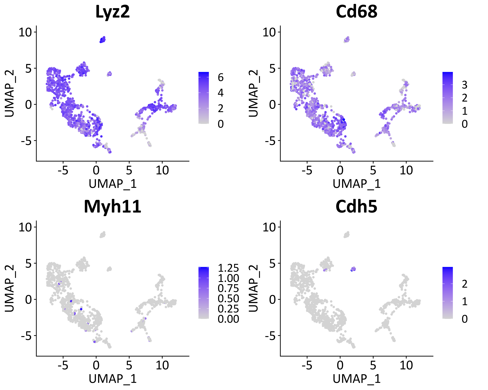
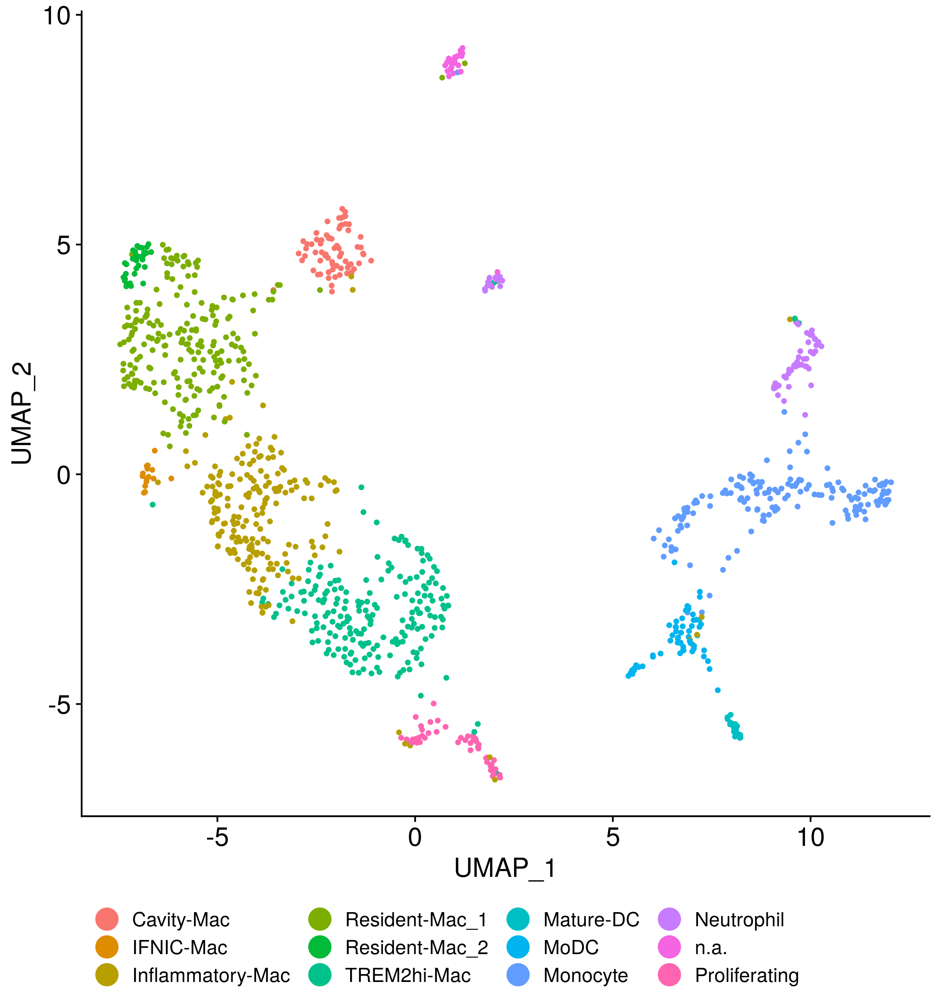
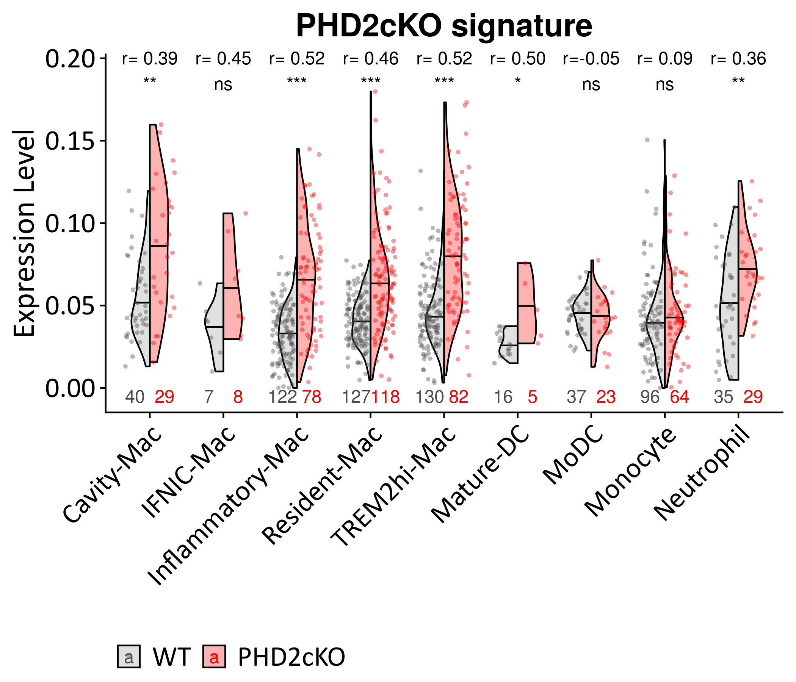
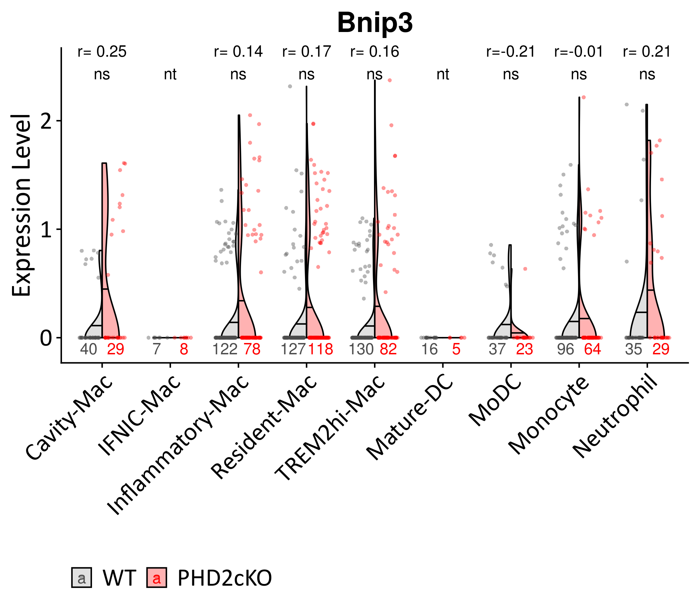
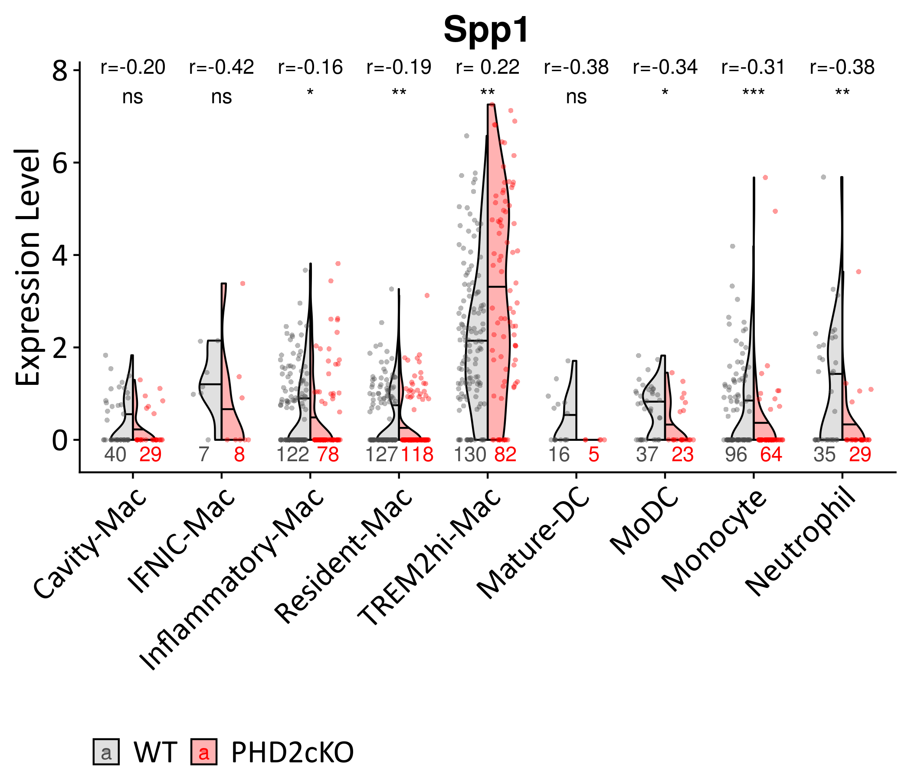

Investigation of the role of PHD2 atherogenesis derived from myeloid
lineage in-vivo
================
Javier Perales-Patón - <javier.perales@bioquant.uni-heidelberg.de> -
ORCID: 0000-0003-0780-6683

> Herein we focus on myeloid cells to study their response to PHD2cKO
> and its relation with atherogenesis in-vivo. From the in-vitro
> experiments, we showed that PHD2-KO in macrophages leads to Bnip3
> apoptosis which aggravates atherogenesis. Actually we observed that
> PHD2-KO induction of Bnip3 apoptosis in Macrophages leads to a
> cross-talk with fibroblasts, which is associated with increased ECM
> production in atherosclerotic plaques. Moreover, this event could be
> reduced by depleting Bnip3 in Macrophages (upstream). To investigate
> this further, we also have profiled bulk in-vitro data of this
> cellular cross-talk and characterized the mechanism. We predicted that
> Spp1 released by macrophage might be the ligand involved in this
> interaction with fibroblasts. Here, the data is derived from the
> in-vivo model which carries PHD2-KO in myeloid lineage. Thus we
> analyse the PHD2KO-Bnip3-Spp1 axis, and look into which cells might be
> the source of Spp1 in-vivo via characterization of myeloid leukocytes
> (incl. macrophages) in this context.

## Setup

We define a random seed number for reproducibility, file structure for
the output, and load essential libraries

### Environment

``` r
# Seed number
set.seed(1234)
# Output directory
OUTDIR <- "./03_myeloidlineage_output/"
if(!dir.exists(OUTDIR)) dir.create(OUTDIR);

# Figures
FIGDIR <- paste0(OUTDIR, "/figures/")
knitr::opts_chunk$set(fig.path=FIGDIR)
knitr::opts_chunk$set(dev=c('png','tiff'))
# Data
DATADIR <- paste0(OUTDIR, "/data/")
if(!dir.exists(DATADIR)) dir.create(DATADIR);
```

### Load libraries

``` r
suppressPackageStartupMessages(require(Seurat))
suppressPackageStartupMessages(require(cowplot))
suppressPackageStartupMessages(require(ggplot2))
suppressPackageStartupMessages(require(purrr))
suppressPackageStartupMessages(require(dplyr))
suppressPackageStartupMessages(require(openxlsx))
suppressPackageStartupMessages(require(GSEABase))
suppressPackageStartupMessages(require(ComplexHeatmap))
suppressPackageStartupMessages(require(AUCell))
suppressPackageStartupMessages(require(rcompanion))
source("../src/graphics.R")
```

    ## Loading required package: extrafont

    ## Registering fonts with R

``` r
source("../src/seurat_fx.R")
source("../src/wilcox_fx.R")
```

## Load data

Read the Seurat Object from second step.

``` r
# Input data
sobj <- "./02_identity_output/data/S.rds"
# Read 
if(file.exists(sobj)) {
    S <- readRDS(sobj)
} else {
    stop("ERROR: Seurat object does not exist. Run 02.rmd to generate it.")
}
```

We also load the ortholog information for functional analysis. We will
use it for the allocation of cell cycle phases in single cells.

``` r
# Lib of hsa2mmu orthologs
mmu2hsa <- readRDS("../data/Gene_annotation/hgnc2mgi_hsa2mmu.rds")
# Cycling genes from human to mouse
CC.genes <- lapply(cc.genes, function(vect) unlist(sapply(vect, function(z) mmu2hsa[[z]][1])))
# Allocation
S <- CellCycleScoring(S, s.features=CC.genes$s.genes, g2m.features=CC.genes$g2m.genes)
```

## Myeloid lineage

Myieloid lineage is composed by megakaryocyte (trombocytes), erytrocyte,
mast cells, basophil, neutrophils, eosinophils, monocytes and
macrophages. So far we have identified the following populations of
these in our map:

``` r
myeloid <- c("Megakaryocyte", "Thrombocyte", "Erythrocyte", "Mast cell",
         "Basophil", "Neutrophil", "Eosinophil", "Monocyte", "Macrophage")
grep(paste(myeloid, collapse="|"), levels(S), value=TRUE)
```

    ## [1] "Macrophage"                    "Mixed_Neutrophil-DC-Monocytes"

We use the marker “Lyz2” to highlight myeloid cells. Actually, the small
cluster No. 8, named previously as “n.a”, is a cluster of immune cells
expressingn Lyz2 pending to be identified. They also express other
markers of leukocytes as shown in previous step. So it must be a myeloid
leucocyte as well. In the following plot it is shown that Monocytes,
Neutrophils, DC, Macrophages and that small cluster express the myeloid
marker.

The violin plot of Lyz2 expression show that the aforementioned clusters
over-express the myeloid marker.

``` r
umap_Lyz2 <- FeaturePlot(S, feature="Lyz2", label=TRUE)
vln_Lyz2 <- VlnPlot(S, feature="Lyz2") + NoLegend()
plot_grid(umap_Lyz2, vln_Lyz2)
```

<!-- -->

Then we subset the dataset by these selected populations.

``` r
# We save the initial annotation for the records
S$Annotation.1 <- Idents(S)
# We subset
M <- S[, Idents(S) %in% c("Mixed_Neutrophil-DC-Monocytes", "Macrophage", "n.a.")]
```

Zernecke et al 2020 is a meta-analysis review of Leukocytes in (mouse)
atherosclerotic plaques. We show that macrophage express all markers of
macrophage classes described in Zernecke et al 2020. While the mixed
cluster of Neutrophils, DC and monocytes do so with the corresponding
markers of these clases. The third small cluster is not clear which cell
type represent. Thus, it remains as n.a. (Not
Assigned).

``` r
# Top10 markers for each Myeloid Leukocytes found in Meta-analysis review Zernecke et al. 2020
ML.markers <- getGmt("../data/markers/leukocytes_Zernecke2020.gmt")
ML.markers <- ML.markers[c(grep("_Mac", names(ML.markers)),
               grep("_Mac", names(ML.markers), invert=TRUE))]

hp <- DoHeatmap3(SeuratObject=M, GSC=ML.markers, assay="RNA", res="Idents", 
       row_names_size=8, column_title_size=0,
       show_hr=FALSE, legend_nrow=2, fontfamily=fontTXT) 
draw(hp, heatmap_legend_side="right", annotation_legend_side="bottom")
```

<!-- -->

## Full-identification of Myeloid lineage

> For the full identification of myeloid leukocytes, we recluster these
> cells in a second iteration of unsupervised clustering with higher
> resolution (res=0.5). Then we map again myeloid leukocytes markers.
> During the preparation of the data analysis, Zernecke et al 2020 has
> published a comprehensive catalog of markers for myeloid leukocytes in
> (mouse) atherosclerotic plaques. Thus from Zernecke et al 2020 to aid
> with the annotation.

We split the cells by dataset to perform a full workflow of data
integration, pca and clustering with Seurat.

``` r
M.list <- SplitObject(M,
              split.by="orig.ident")

for(i in names(M.list)){
    M.list[[i]] <- NormalizeData(M.list[[i]], verbose=FALSE)
    M.list[[i]] <- ScaleData(M.list[[i]], verbose=FALSE)
    M.list[[i]] <- FindVariableFeatures(M.list[[i]], 
                       selection.method = "vst",
                       nfeatures = 2000, verbose = FALSE)

}
M.anchors <- FindIntegrationAnchors(object.list = M.list, dims = 1:30)
```

    ## Computing 2000 integration features

    ## Scaling features for provided objects

    ## Finding all pairwise anchors

    ## Running CCA

    ## Merging objects

    ## Finding neighborhoods

    ## Finding anchors

    ##  Found 1703 anchors

    ## Filtering anchors

    ##  Retained 1601 anchors

    ## Extracting within-dataset neighbors

``` r
M.i <- IntegrateData(anchorset = M.anchors, dims = 1:30)
```

    ## Merging dataset 2 into 1

    ## Extracting anchors for merged samples

    ## Finding integration vectors

    ## Finding integration vector weights

    ## Integrating data

``` r
# Clean metadata
M.i@meta.data <- M.i@meta.data[, grep("snn_res", colnames(M.i@meta.data), invert=TRUE)]
Project(M.i) <- "Myeloid_Leukocytes"
if(is.character(M.i$stim)) M.i$stim <- factor(M.i$stim, levels=c("WT","PHD2cKO")) ;

if(all(dim(M.i@assays$RNA@scale.data) == c(0,0))) {
M.i@assays$RNA@scale.data <- cbind(M.list[[1]]@assays$RNA@scale.data,
                   M.list[[2]]@assays$RNA@scale.data)[,colnames(M.i)] 
}

DefaultAssay(M.i) <- "integrated"

# Run the standard workflow for visualization and clustering
M.i <- ScaleData(M.i, verbose = FALSE)
M.i <- RunPCA(M.i, npcs = 30, verbose = FALSE)
# ElbowPlot(M.i)
M.i <- RunUMAP(M.i, reduction = "pca", dims = 1:15)
```

    ## Warning: The default method for RunUMAP has changed from calling Python UMAP via reticulate to the R-native UWOT using the cosine metric
    ## To use Python UMAP via reticulate, set umap.method to 'umap-learn' and metric to 'correlation'
    ## This message will be shown once per session

    ## 10:28:11 UMAP embedding parameters a = 0.9922 b = 1.112

    ## 10:28:11 Read 1119 rows and found 15 numeric columns

    ## 10:28:11 Using Annoy for neighbor search, n_neighbors = 30

    ## 10:28:11 Building Annoy index with metric = cosine, n_trees = 50

    ## 0%   10   20   30   40   50   60   70   80   90   100%

    ## [----|----|----|----|----|----|----|----|----|----|

    ## **************************************************|
    ## 10:28:11 Writing NN index file to temp file /tmp/Rtmp16jQvl/file3bfd278deff0
    ## 10:28:11 Searching Annoy index using 1 thread, search_k = 3000
    ## 10:28:12 Annoy recall = 100%
    ## 10:28:12 Commencing smooth kNN distance calibration using 1 thread
    ## 10:28:13 Initializing from normalized Laplacian + noise
    ## 10:28:13 Commencing optimization for 500 epochs, with 42490 positive edges
    ## 10:28:16 Optimization finished

It seems that both conditions present all types of myeloid
leukocytes.

``` r
DimPlot(M.i, reduction="umap", group.by="orig.ident", cols=c("red","grey")) +
    guides(colour = guide_legend(override.aes = list(size=8))) + 
    theme(legend.position="bottom",
          axis.title = element_text(size=16),
          axis.text= element_text(size=16))
```

<!-- -->

Second iteration of unsupervised clustering to find even major
differences in this cell population of myeloid leukocytes.

``` r
set.seed(1234)
# Find clusters
M.i <- FindNeighbors(M.i, dims = 1:20)
```

    ## Computing nearest neighbor graph

    ## Computing SNN

``` r
M.i <- FindClusters(M.i, resolution = 0.5)
```

    ## Modularity Optimizer version 1.3.0 by Ludo Waltman and Nees Jan van Eck
    ## 
    ## Number of nodes: 1119
    ## Number of edges: 33319
    ## 
    ## Running Louvain algorithm...
    ## Maximum modularity in 10 random starts: 0.8716
    ## Number of communities: 12
    ## Elapsed time: 0 seconds

``` r
table(Idents(M.i))
```

    ## 
    ##   0   1   2   3   4   5   6   7   8   9  10  11 
    ## 213 212 200 160  69  64  60  48  32  25  21  15

``` r
DefaultAssay(M.i) <- "RNA"
```

These are the major distinct cell populations

``` r
DimPlot(M.i, reduction="umap") +
    guides(colour = guide_legend(override.aes = list(size=8), nrow=2)) + 
    theme(legend.position="bottom",
          axis.title = element_text(size=16),
          axis.text= element_text(size=16))
```

<!-- -->

There is one cluster that are proliferating
cells.

``` r
VlnPlot(M.i, feature=c("S.Score", "G2M.Score"))
```

<!-- -->

We confirm that these are Myeloid Leukocytes (Lyz2, Cd68) and discard
other cellular lineages (epithelial and endothelial, Myh11, Cdh5).

``` r
tm <- theme(title = element_text(size=26, family=fontTXT),
        axis.title = element_text(size=20, family=fontTXT),
        axis.text = element_text(size=20, family=fontTXT),
        legend.text = element_text(size=18, family=fontTXT)
        )
p1 <- FeaturePlot(M.i, features=c("Lyz2")) + tm
p2 <- FeaturePlot(M.i, features=c("Cd68")) + tm
p3 <- FeaturePlot(M.i, features=c("Myh11")) + tm
p4 <- FeaturePlot(M.i, features=c("Cdh5")) + tm
## Other candidates, immuno markers
# FeaturePlot(M.i, features=c("Cd3e")) + tm
# FeaturePlot(M.i, features=c("Ptprc")) + tm
CombinePlots(list(p1,p2,p3,p4), ncol = 2)
```

<!-- -->

Based on markers from next chunks of code, we assign identities to the
different cluster of cells. Please note that we have already assigned
them (restrospectively) for corcondance with final plots, but the data
shows progresively that these annotations are correct.

``` r
M.i <- RenameIdents(M.i, c("0"="Resident-Mac_1",
               "1"="Trem2-foamy-Mac",
               "2"="Inflammatory-Mac",
               "3"="Monocyte",
               "4"="Cavity-Mac",
               "5"="Neutrophil",
               "6"="MoDC",
               "7"="Proliferating",
               "8"="Resident-Mac_2",
               "9"="n.a.",
               "10"="Mature-DC",
               "11"="IFNIC-Mac"))
# Sort them by, 1st Macrophages, then the rest, finally the odd ones
last_ids<- c("n.a.","Proliferating")
ids <- c(sort(grep("-Mac", levels(M.i), value=TRUE)),
     setdiff(sort(grep("-Mac", levels(M.i), value=TRUE, invert=TRUE)),
         last_ids),
     last_ids)

Idents(M.i) <- factor(as.character(Idents(M.i)),
              levels=ids)
# We show the total number of cells
ncol(M.i)
```

    ## [1] 1119

``` r
# And the sample size of each group
table(Idents(M.i))
```

    ## 
    ##       Cavity-Mac        IFNIC-Mac Inflammatory-Mac   Resident-Mac_1 
    ##               69               15              200              213 
    ##   Resident-Mac_2  Trem2-foamy-Mac        Mature-DC             MoDC 
    ##               32              212               21               60 
    ##         Monocyte       Neutrophil             n.a.    Proliferating 
    ##              160               64               25               48

``` r
# We save the sample size
write.table(as.data.frame(table(Cluster=Idents(M.i))),
        file=paste0(DATADIR,"/nCell_per_cluster.csv"),
        sep=",", row.names=FALSE, col.names=TRUE, quote=FALSE)
```

These cell assignment of identities are supported by Zernecke et al 2020
- a meta-analysis of leukocytes in (mouse) atherosclerotic
plaques.

``` r
# Top10 markers for each Myeloid Leukocytes found in Meta-analysis review Zernecke et al. 2020
ML.markers <- getGmt("../data/markers/leukocytes_Zernecke2020.gmt")
ML.markers <- ML.markers[c(grep("_Mac", names(ML.markers)),
               grep("_Mac", names(ML.markers), invert=TRUE))]

hp <- DoHeatmap3(SeuratObject=M.i, GSC=ML.markers, assay="RNA", res="Idents", 
       row_names_size=8, column_title_size=0,
       show_hr=FALSE, legend_nrow=2, fontfamily=fontTXT) 
draw(hp, heatmap_legend_side="right", annotation_legend_side="bottom")
```

<!-- -->

We remake that heatmap but making it more compact (without showing gene
names). The genes are shown above and these are described in
[leukocytes\_Zernecke2020.gmt](../data/markers/leukocytes_Zernecke2020.gmt).

``` r
hp <- DoHeatmap3(SeuratObject=M.i, GSC=ML.markers, assay="RNA", res="Idents", 
       row_names_size=0, column_title_size=0,
       show_hr=FALSE, legend_nrow=3, fontfamily=fontTXT) 
draw(hp, heatmap_legend_side="right", annotation_legend_side="bottom")
```

<!-- -->

There is one population of macrophages not very clear whether they are
inflammatory or not. So we extend the marker list to all differentially
up-regulated genes reported in Zernecke et al
2020.

``` r
inflam <- read.table("../data/markers/inflammatory-Mac_DEGs_Zernecke2020.tsv", 
             sep="\t", header=TRUE, stringsAsFactors=FALSE)

inflam <- inflam[inflam$p_val_adj < 0.05, ]

inflam <- GeneSetCollection(GeneSet(inflam$gene, setName="Inflamm.Mac"))
hp <- DoHeatmap3(SeuratObject=M.i, GSC=inflam, assay="RNA", res="Idents", 
       row_names_size=0, column_title_size=0,
       show_hr=FALSE, legend_nrow=2, fontfamily=fontTXT) 
draw(hp, heatmap_legend_side="right", annotation_legend_side="bottom")
```

<!-- -->

``` r
# Build rankings for AUC
cells_rankings <- AUCell_buildRankings(as.matrix(M.i@assays$RNA@data))
```

    ## Quantiles for the number of genes detected by cell: 
    ## (Non-detected genes are shuffled at the end of the ranking. Keep it in mind when choosing the threshold for calculating the AUC).

<!-- -->

    ##    min     1%     5%    10%    50%   100% 
    ##  507.0  546.9  714.1  907.2 2032.0 3982.0

``` r
# Use top N (e.g. 50) to calculate enrichment at single-cell level
cells_AUC <- AUCell_calcAUC(lapply(geneIds(inflam), function(gs) head(gs,50)), 
            cells_rankings, 
             aucMaxRank=nrow(cells_rankings)*0.05)
```

    ## Genes in the gene sets NOT available in the dataset: 
    ##  Inflamm.Mac:    1 (2% of 50)

``` r
# Explore thresholds
cells_assignment <- AUCell_exploreThresholds(cells_AUC, plotHist=FALSE, assign=TRUE) 
# Get AUCell scores  
AUC.sign <- getAUC(cells_AUC)[1,]
stopifnot(colnames(M.i) == names(AUC.sign))
M.i$inflam.Mac<- AUC.sign
rm(AUC.sign, cells_rankings, cells_AUC, cells_assignment)
VlnPlot(M.i, feature="inflam.Mac")
```

<!-- -->

> We conclude that the remaining group of macrophages must be
> “inflammatory macrophages”, since these are the only one class of
> macrophages that remains missing, and the group is expressing more
> consistently and highly differentially expressed genes of this class.

The final UMAP is shown. We still have one very small population of
cells that is not assigned (n.a.) and a cluster of cells that are
proliferating.

``` r
DimPlot(M.i, reduction="umap", label=FALSE) +
    guides(colour = guide_legend(override.aes = list(size=6), nrow=3)) + 
    coord_cartesian(clip="off") +
    theme(legend.position="bottom",
          axis.title = element_text(size=16),
          axis.text= element_text(size=16)) 
```

<!-- -->

``` r
DimPlot(M.i, reduction="umap", label=TRUE, label.size=6) +
    guides(colour = guide_legend(override.aes = list(size=6), nrow=3)) + 
    coord_cartesian(clip="off") +
    theme(legend.position="bottom",
          axis.title = element_text(size=16),
          axis.text= element_text(size=16)) 
```

<!-- -->

We confirm again the proliferating
one.

``` r
VlnPlot(M.i, feature=c("S.Score", "G2M.Score"))
```

<!-- -->

Finally, we show their proportion in each condition. This is
informative, but we cannot make statistical contrasts on this direction
since these are two sequencing runs (pooled mice), so we do not have
more than 1 “replicate” in our sample populations.

``` r
# Cell freqs
cell_pop <- table(M.i$orig.ident,Idents(M.i))
print(cell_pop)
```

    ##          
    ##           Cavity-Mac IFNIC-Mac Inflammatory-Mac Resident-Mac_1
    ##   PHD2cKO         29         8               78            105
    ##   WT              40         7              122            108
    ##          
    ##           Resident-Mac_2 Trem2-foamy-Mac Mature-DC MoDC Monocyte
    ##   PHD2cKO             13              82         5   23       64
    ##   WT                  19             130        16   37       96
    ##          
    ##           Neutrophil n.a. Proliferating
    ##   PHD2cKO         29   15            18
    ##   WT              35   10            30

``` r
# Cell Proportions
cell_pop_perc <- (sweep(cell_pop,MARGIN = 1, STATS = rowSums(cell_pop), FUN = "/")) * 100
cell_pop_perc2 <- reshape2::melt(cell_pop_perc)
cell_pop_perc2$Var1 <- relevel(cell_pop_perc2$Var1, ref = "WT")


ggplot(cell_pop_perc2, aes(x= Var1, fill=Var2, y=value)) +
    geom_col(position = position_stack(reverse=TRUE)) + 
#          scale_fill_manual(values = cols[levels(cell_pop_perc2$Var2)]) +
  scale_y_continuous(position="right") +
  labs(y="Percentage of cells (%)") + theme_bw() + coord_flip() +
  theme(legend.title = element_blank(),
    legend.text = element_text(size=7, family=fontTXT),
    legend.key.size = unit(0.5, "cm"),
    legend.position = "bottom",
        axis.title.x = element_text(size=18, color = "black", family=fontTXT),
    axis.title.y = element_blank(),
        axis.text.x = element_text(size=14, color = "black", family=fontTXT),
        axis.text.y = element_text(size=12, color = "black", family=fontTXT),
        panel.grid = element_blank())
```

<!-- -->

> No clear changes in cell proportions are observed between the two
> conditions. Next we investigate the PHD2cKO phenotype from the axis of
> Bnip3-Spp1 observed in the in-vitro experment.

## PHD2cKO phenotype in myeloid cells

> We will map the in-vitro PHD2cKO signature onto myeloid cells as a
> proxy of PHD2cKO penetrance in-vivo. Next we connect the PHD2cKO
> signature, which is derived from in-vitro cell culture, with Bnip3 and
> Spp1 expression.

We first merge the two resident macrophage populations and discard two
populations: the not assigned and proliferating populations. Note that
we are going to explore the PHD2KO-Bnip3-Spp1 axis in the main myeloid
leukocyte groups.

``` r
# Drop odd clusters
M.i <- M.i[, !Idents(M.i) %in% c("n.a.", "Proliferating")]
# Merge Residen-Mac (2 clusters)
Idents(M.i) <- factor(gsub("(Resident-Mac)_[12]$",
               "\\1", as.character(Idents(M.i))),
              levels=unique(gsub("(Resident-Mac)_[12]$", 
                     "\\1", levels((M.i))))
              )

# We save the sample size
write.table(as.data.frame(table(Group=Idents(M.i))),
        file=paste0(DATADIR,"/nCell_per_group.csv"),
        sep=",", row.names=FALSE, col.names=TRUE, quote=FALSE)
```

### PHD2cKO signature

We aim to characterize the impact of PHD2cKO in the in-vivo model. In
theory, PHD2-KO is specific of myeloid lineage. However the penetrance
of the knock-out is not 100%. So far We would expect higher PHD2-KO
signal in PHD2cKO condition. To explore this, and potentially identify
which cells are undergoing PHD2-KO, we measure the expression of PHD2cKO
signature derived from the in-vitro bulk profiling of BMDM macrophages
(PHD2cKO vs WT). For this, we use AUCell method using top50 up-regulated
genes from the signature.

``` r
# Load in-vitro signature from the bulk analysis
invitro.dge <- read.table("../Analysis_invitro_bulk/output/01_bulk_dge/MC_PHD2_diffexpr.tsv", 
              sep="\t", header=TRUE, stringsAsFactors = FALSE)
invitro.sign <- sort(setNames(invitro.dge$t,invitro.dge$genes),decreasing = TRUE)
# Get common genes
common <- intersect(rownames(S), names(invitro.sign))
# Discard certain genes that are driving
avoid_genes <- c("Bnip3", "Spp1")
common <- setdiff(common, avoid_genes)
# Define signature and show
invitro.gs <- names(sort(invitro.sign[common],decreasing = TRUE))[1:50]
print(invitro.gs)
```

    ##  [1] "Pfkl"     "Hpgd"     "Pdk1"     "Cd5l"     "Ankrd37"  "Egln3"   
    ##  [7] "S1pr1"    "P4ha1"    "Fgd6"     "Tpi1"     "Narf"     "Ighg2b"  
    ## [13] "Pgk1"     "Ak4"      "Tfrc"     "Eno1"     "Folr2"    "Anxa3"   
    ## [19] "Col18a1"  "Wdfy1"    "Atp6v0d2" "Mif"      "Igkc"     "Armc6"   
    ## [25] "Gapdh"    "Zfyve28"  "Abcd3"    "Pcdh7"    "Mefv"     "Ets1"    
    ## [31] "Acacb"    "Mamdc2"   "Tmem8"    "Gpi1"     "Dhrs9"    "Rgs11"   
    ## [37] "Fnbp1l"   "Slc6a8"   "Jak3"     "Myo1e"    "Agl"      "Igf2bp2" 
    ## [43] "Ldha"     "Frrs1"    "Zfp868"   "Tlr1"     "Gcn1l1"   "Lpl"     
    ## [49] "Fam214a"  "Antxr2"

``` r
# Build rankings for AUC
cells_rankings <- AUCell_buildRankings(as.matrix(M.i@assays$RNA@data))
```

    ## Quantiles for the number of genes detected by cell: 
    ## (Non-detected genes are shuffled at the end of the ranking. Keep it in mind when choosing the threshold for calculating the AUC).

<!-- -->

    ##     min      1%      5%     10%     50%    100% 
    ##  507.00  545.45  694.50  879.50 2002.00 3967.00

``` r
# Use top N (e.g. 50) to calculate enrichment at single-cell level
cells_AUC <- AUCell_calcAUC(list("invitro"=invitro.gs), cells_rankings, aucMaxRank=nrow(cells_rankings)*0.05)
# Explore thresholds
cells_assignment <- AUCell_exploreThresholds(cells_AUC, plotHist=FALSE, assign=TRUE) 
# Get AUCell scores  
AUC.sign <- getAUC(cells_AUC)[1,]
stopifnot(colnames(M.i) == names(AUC.sign))
M.i$PHD2cKO <- AUC.sign
rm(AUC.sign, cells_rankings, cells_AUC, cells_assignment)
```

We compare the signature expression between the two conditions using
wilcox test. We also show r effect sizes.

``` r
wPHD2cKO_stats <- t(sapply(levels(M.i), function(cell) {
                   cellIds <- WhichCells(M.i, idents=cell)
                   # The test
                   wilcox.test_stats(xy=M.i$PHD2cKO[cellIds],
                             gr=M.i$stim[cellIds])
               }))
```

    ## Warning in wilcox.test.default(x = c(AAGTCTGTCGGAAATA_1 =
    ## 0.0511064129668781, : cannot compute exact p-value with ties

    ## Warning in wilcox.test.default(x = c(AAACCTGTCTACCAGA_1 =
    ## 0.0992248062015504, : cannot compute exact p-value with ties

``` r
wPHD2cKO_stats <- as.data.frame(wPHD2cKO_stats)
wPHD2cKO_stats$adjpval <- p.adjust(wPHD2cKO_stats$pvalue, method="fdr")
wPHD2cKO_stats$significance <- tagSignif(wPHD2cKO_stats$adjpval)
print(wPHD2cKO_stats)
```

    ##                       W       pvalue       r      adjpval significance
    ## Cavity-Mac        312.0 9.220112e-04  0.3920 2.074525e-03           **
    ## IFNIC-Mac          13.0 9.386169e-02  0.4490 1.206793e-01           ns
    ## Inflammatory-Mac 1808.5 1.506786e-13  0.5230 6.780536e-13          ***
    ## Resident-Mac     3544.0 1.049791e-12  0.4550 3.149372e-12          ***
    ## Trem2-foamy-Mac  2028.5 3.230795e-14  0.5210 2.907716e-13          ***
    ## Mature-DC          12.0 1.936213e-02  0.5040 2.904320e-02            *
    ## MoDC              449.0 7.265644e-01 -0.0461 7.265644e-01           ns
    ## Monocyte         2732.5 2.377067e-01  0.0933 2.674200e-01           ns
    ## Neutrophil        292.5 3.817047e-03  0.3620 6.870684e-03           **

``` r
# Save it
write.table(wPHD2cKO_stats, sep=",",
        file=paste0(DATADIR,"/PHD2cKO_wilcox_stats.csv"),
        row.names=TRUE, col.names=NA)
```

``` r
RES <- wPHD2cKO_stats[, c("r", "significance")]
RES$r <- format(round(RES$r, 2), nsmall=2)
colnames(RES)[ncol(RES)] <- ""

plotVln(SeuratObject = M.i, gene=NULL,meta="PHD2cKO",
    stats=RES,
    vlnsplit = TRUE, fontTXT,  nCell.y=-0.005, pt.alpha=0.4) +
ggtitle("PHD2cKO signature")
```

<!-- -->

### Bnip3 expression

We perform the same comparison but for Bnip3 expression.

``` r
wBnip3_stats <- t(sapply(levels(M.i), function(cell) {
                   cellIds <- WhichCells(M.i, idents=cell)
                   # The test
                   wilcox.test_stats(xy=M.i@assays$RNA@data["Bnip3", cellIds],
                             gr=M.i$stim[cellIds])
               }))
```

    ## Warning in wilcox.test.default(x = c(AACCATGGTTGAACTC_1 = 0,
    ## AAGGCAGGTCGCGTGT_1 = 0, : cannot compute exact p-value with ties

    ## Warning in wilcox.test.default(x = c(AGCAGCCGTGAAGGCT_1 = 0,
    ## CACATTTTCTCCCTGA_1 = 0, : cannot compute exact p-value with ties

    ## Warning in wilcox.test.default(x = c(ACATCAGTCTCGAGTA_1 = 0,
    ## ACGGAGATCGCGTTTC_1 = 0, : cannot compute exact p-value with ties

    ## Warning in wilcox.test.default(x = c(AAGTCTGTCGGAAATA_1 = 0,
    ## ACACCAACAGACAGGT_1 = 0, : cannot compute exact p-value with ties

    ## Warning in wilcox.test.default(x = c(AAACCTGTCTACCAGA_1 = 0,
    ## AACGTTGCAAACAACA_1 = 0, : cannot compute exact p-value with ties

``` r
wBnip3_stats <- as.data.frame(wBnip3_stats)
wBnip3_stats$adjpval <- p.adjust(wBnip3_stats$pvalue, method="fdr")
wBnip3_stats$significance <- tagSignif(wBnip3_stats$adjpval)
print(wBnip3_stats)
```

    ##                       W      pvalue        r    adjpval significance
    ## Cavity-Mac        452.5 0.041224464  0.24700 0.09570156           ns
    ## IFNIC-Mac          28.0         NaN      NaN        NaN           nt
    ## Inflammatory-Mac 4192.0 0.054686604  0.13600 0.09570156           ns
    ## Resident-Mac     6454.0 0.008279478  0.16900 0.05795635           ns
    ## Trem2-foamy-Mac  4576.0 0.017187703  0.16300 0.06015696           ns
    ## Mature-DC          40.0         NaN      NaN        NaN           nt
    ## MoDC              489.0 0.104981284 -0.21000 0.12247816           ns
    ## Monocyte         3084.0 0.950277445 -0.00515 0.95027745           ns
    ## Neutrophil        414.0 0.091169282  0.21200 0.12247816           ns

``` r
# Save it
write.table(wBnip3_stats, sep=",",
        file=paste0(DATADIR,"/Bnip3_wilcox_stats.csv"),
        row.names=TRUE, col.names=NA)
```

``` r
RES <- wBnip3_stats[, c("r", "significance")]
RES$r <- format(round(RES$r, 2), nsmall=2)
colnames(RES)[ncol(RES)] <- ""

plotVln(SeuratObject = M.i, gene="Bnip3", meta=NULL,
    stats=RES,
    vlnsplit = TRUE, fontTXT,  nCell.y=-0.1, pt.alpha=0.4)
```

<!-- -->

### Spp1 expression

Similarly to Spp1 expression, we compare both conditions among myeloid
leukocytes.

``` r
wSpp1_stats <- t(sapply(levels(M.i), function(cell) {
                   cellIds <- WhichCells(M.i, idents=cell)
                   # The test
                   wilcox.test_stats(xy=M.i@assays$RNA@data["Spp1", cellIds],
                             gr=M.i$stim[cellIds])
               }))
```

    ## Warning in wilcox.test.default(x = c(AACCATGGTTGAACTC_1 = 0,
    ## AAGGCAGGTCGCGTGT_1 = 0, : cannot compute exact p-value with ties

    ## Warning in wilcox.test.default(x = c(AGCAGCCGTGAAGGCT_1 =
    ## 0.985015110944404, : cannot compute exact p-value with ties

    ## Warning in wilcox.test.default(x = c(ACATCAGTCTCGAGTA_1 = 0,
    ## ACGGAGATCGCGTTTC_1 = 0, : cannot compute exact p-value with ties

    ## Warning in wilcox.test.default(x = c(AAGTCTGTCGGAAATA_1 =
    ## 0.4767534446549, : cannot compute exact p-value with ties

    ## Warning in wilcox.test.default(x = c(AAACCTGTCTACCAGA_1 = 0,
    ## AACGTTGCAAACAACA_1 = 0, : cannot compute exact p-value with ties

``` r
wSpp1_stats <- as.data.frame(wSpp1_stats)
wSpp1_stats$adjpval <- p.adjust(wSpp1_stats$pvalue, method="fdr")
wSpp1_stats$significance <- tagSignif(wSpp1_stats$adjpval)
print(wSpp1_stats)
```

    ##                       W       pvalue      r      adjpval significance
    ## Cavity-Mac        696.0 9.860528e-02 -0.200 0.1109309402           ns
    ## IFNIC-Mac          41.5 1.202328e-01 -0.416 0.1202328005           ns
    ## Inflammatory-Mac 5561.0 2.727282e-02 -0.156 0.0409092264            *
    ## Resident-Mac     8881.0 2.987933e-03 -0.190 0.0067228493           **
    ## Trem2-foamy-Mac  3912.5 1.101742e-03  0.224 0.0049578392           **
    ## Mature-DC          57.5 9.445417e-02 -0.375 0.1109309402           ns
    ## MoDC              591.0 8.129911e-03 -0.342 0.0146338396            *
    ## Monocyte         4038.0 8.594198e-05 -0.311 0.0007734778          ***
    ## Neutrophil        702.0 2.309027e-03 -0.382 0.0067228493           **

``` r
# Save it
write.table(wSpp1_stats, sep=",",
        file=paste0(DATADIR,"/Spp1_wilcox_stats.csv"),
        row.names=TRUE, col.names=NA)
```

``` r
RES <- wSpp1_stats[, c("r", "significance")]
RES$r <- format(round(RES$r, 2), nsmall=2)
colnames(RES)[ncol(RES)] <- ""

plotVln(SeuratObject = M.i, gene="Spp1", meta=NULL,
    stats=RES,
    vlnsplit = TRUE, fontTXT, nCell.y=-0.3, pt.alpha=0.4)
```

<!-- -->

## Conclusion

> We are able to identify the major myeloid leukocytes from
> atherosclerotic plaques (Zernecke et al. 2020). The PHD2cKO is well
> recovered in-vivo, where most of the myeloid leukocytes presents
> higher expression of this signature in PHD2cKO condition
> (medium-to-large effect sizes), with the exception of moDC and
> monocytes. The data suggests that PHD2cKO condition is associated with
> higher expression of Bnip3 in Macrophages, although the zero-inflation
> of single-cell data damps this statistical test. Trem2-foamy
> Macrophages are the main source of Spp1 ligand expression in
> Atheroscleroic plaques, and PHD2cKO condition is associated to a
> higher expression in the distribution (FDR-adjusted p-value from
> wilcox test p\<0.05, small effect size).

## Save the Seurat Object

``` r
saveRDS(S, paste0(DATADIR,"/S.rds"));
saveRDS(M.i, paste0(DATADIR,"/M.rds"));
```

## SessionInfo

``` r
sessionInfo()
```

    ## R version 3.6.1 (2019-07-05)
    ## Platform: x86_64-pc-linux-gnu (64-bit)
    ## Running under: Ubuntu 18.04.3 LTS
    ## 
    ## Matrix products: default
    ## BLAS:   /usr/lib/x86_64-linux-gnu/blas/libblas.so.3.7.1
    ## LAPACK: /usr/lib/x86_64-linux-gnu/lapack/liblapack.so.3.7.1
    ## 
    ## locale:
    ##  [1] LC_CTYPE=en_US.UTF-8       LC_NUMERIC=C              
    ##  [3] LC_TIME=en_GB.UTF-8        LC_COLLATE=en_US.UTF-8    
    ##  [5] LC_MONETARY=en_GB.UTF-8    LC_MESSAGES=en_US.UTF-8   
    ##  [7] LC_PAPER=en_GB.UTF-8       LC_NAME=C                 
    ##  [9] LC_ADDRESS=C               LC_TELEPHONE=C            
    ## [11] LC_MEASUREMENT=en_GB.UTF-8 LC_IDENTIFICATION=C       
    ## 
    ## attached base packages:
    ##  [1] grid      stats4    parallel  stats     graphics  grDevices utils    
    ##  [8] datasets  methods   base     
    ## 
    ## other attached packages:
    ##  [1] extrafont_0.17       rcompanion_2.3.26    AUCell_1.6.1        
    ##  [4] ComplexHeatmap_2.0.0 GSEABase_1.46.0      graph_1.62.0        
    ##  [7] annotate_1.62.0      XML_3.98-1.20        AnnotationDbi_1.46.1
    ## [10] IRanges_2.18.2       S4Vectors_0.22.1     Biobase_2.44.0      
    ## [13] BiocGenerics_0.30.0  openxlsx_4.2.3       dplyr_0.8.3         
    ## [16] purrr_0.3.2          ggplot2_3.2.1        cowplot_1.0.0       
    ## [19] Seurat_3.1.0         rmarkdown_1.15       nvimcom_0.9-82      
    ## 
    ## loaded via a namespace (and not attached):
    ##   [1] reticulate_1.13             R.utils_2.9.0              
    ##   [3] tidyselect_0.2.5            RSQLite_2.1.2              
    ##   [5] htmlwidgets_1.3             BiocParallel_1.18.1        
    ##   [7] Rtsne_0.15                  munsell_0.5.0              
    ##   [9] codetools_0.2-16            ica_1.0-2                  
    ##  [11] future_1.14.0               withr_2.1.2                
    ##  [13] colorspace_1.4-1            knitr_1.24                 
    ##  [15] rstudioapi_0.10             ROCR_1.0-7                 
    ##  [17] DescTools_0.99.39           Rttf2pt1_1.3.8             
    ##  [19] gbRd_0.4-11                 listenv_0.7.0              
    ##  [21] labeling_0.3                Rdpack_0.11-0              
    ##  [23] GenomeInfoDbData_1.2.1      bit64_0.9-7                
    ##  [25] vctrs_0.2.0                 TH.data_1.0-10             
    ##  [27] xfun_0.9                    R6_2.4.0                   
    ##  [29] GenomeInfoDb_1.20.0         clue_0.3-57                
    ##  [31] rsvd_1.0.2                  bitops_1.0-6               
    ##  [33] DelayedArray_0.10.0         assertthat_0.2.1           
    ##  [35] promises_1.0.1              SDMTools_1.1-221.1         
    ##  [37] scales_1.0.0                multcomp_1.4-12            
    ##  [39] rootSolve_1.8.2.1           gtable_0.3.0               
    ##  [41] npsurv_0.4-0                multcompView_0.1-8         
    ##  [43] globals_0.12.4              lmom_2.8                   
    ##  [45] sandwich_2.5-1              rlang_0.4.0                
    ##  [47] EMT_1.1                     zeallot_0.1.0              
    ##  [49] GlobalOptions_0.1.0         splines_3.6.1              
    ##  [51] extrafontdb_1.0             lazyeval_0.2.2             
    ##  [53] yaml_2.2.0                  reshape2_1.4.3             
    ##  [55] backports_1.1.4             httpuv_1.5.2               
    ##  [57] tools_3.6.1                 gplots_3.0.1.1             
    ##  [59] RColorBrewer_1.1-2          ggridges_0.5.1             
    ##  [61] Rcpp_1.0.2                  plyr_1.8.4                 
    ##  [63] zlibbioc_1.30.0             RCurl_1.95-4.12            
    ##  [65] pbapply_1.4-2               GetoptLong_0.1.7           
    ##  [67] zoo_1.8-6                   SummarizedExperiment_1.14.1
    ##  [69] ggrepel_0.8.1               cluster_2.1.0              
    ##  [71] magrittr_1.5                RSpectra_0.15-0            
    ##  [73] data.table_1.12.8           circlize_0.4.7             
    ##  [75] lmtest_0.9-37               RANN_2.6.1                 
    ##  [77] mvtnorm_1.0-11              fitdistrplus_1.0-14        
    ##  [79] matrixStats_0.55.0          lsei_1.2-0                 
    ##  [81] mime_0.7                    evaluate_0.14              
    ##  [83] xtable_1.8-4                gridExtra_2.3              
    ##  [85] shape_1.4.4                 compiler_3.6.1             
    ##  [87] tibble_2.1.3                KernSmooth_2.23-16         
    ##  [89] crayon_1.3.4                R.oo_1.22.0                
    ##  [91] htmltools_0.3.6             segmented_1.0-0            
    ##  [93] later_0.8.0                 tidyr_1.0.0                
    ##  [95] libcoin_1.0-6               expm_0.999-4               
    ##  [97] Exact_2.1                   RcppParallel_4.4.3         
    ##  [99] DBI_1.0.0                   MASS_7.3-51.4              
    ## [101] boot_1.3-23                 Matrix_1.2-17              
    ## [103] R.methodsS3_1.7.1           gdata_2.18.0               
    ## [105] metap_1.1                   igraph_1.2.4.1             
    ## [107] GenomicRanges_1.36.0        pkgconfig_2.0.3            
    ## [109] coin_1.3-1                  plotly_4.9.0               
    ## [111] XVector_0.24.0              bibtex_0.4.2               
    ## [113] stringr_1.4.0               digest_0.6.21              
    ## [115] sctransform_0.2.0           RcppAnnoy_0.0.13           
    ## [117] tsne_0.1-3                  leiden_0.3.1               
    ## [119] nortest_1.0-4               gld_2.6.2                  
    ## [121] uwot_0.1.4                  shiny_1.3.2                
    ## [123] gtools_3.8.1                modeltools_0.2-23          
    ## [125] rjson_0.2.20                lifecycle_0.1.0            
    ## [127] nlme_3.1-141                jsonlite_1.6               
    ## [129] viridisLite_0.3.0           pillar_1.4.2               
    ## [131] lattice_0.20-38             httr_1.4.1                 
    ## [133] survival_2.44-1.1           glue_1.3.1                 
    ## [135] zip_2.1.1                   png_0.1-7                  
    ## [137] bit_1.1-14                  mixtools_1.1.0             
    ## [139] class_7.3-15                stringi_1.4.3              
    ## [141] blob_1.2.0                  caTools_1.17.1.2           
    ## [143] memoise_1.1.0               irlba_2.3.3                
    ## [145] e1071_1.7-2                 future.apply_1.3.0         
    ## [147] ape_5.3

``` r
{                                                                                                                                                                                                           
sink(file=paste0(OUTDIR,"/sessionInfo.txt"))
print(sessionInfo())
sink()
}
```
