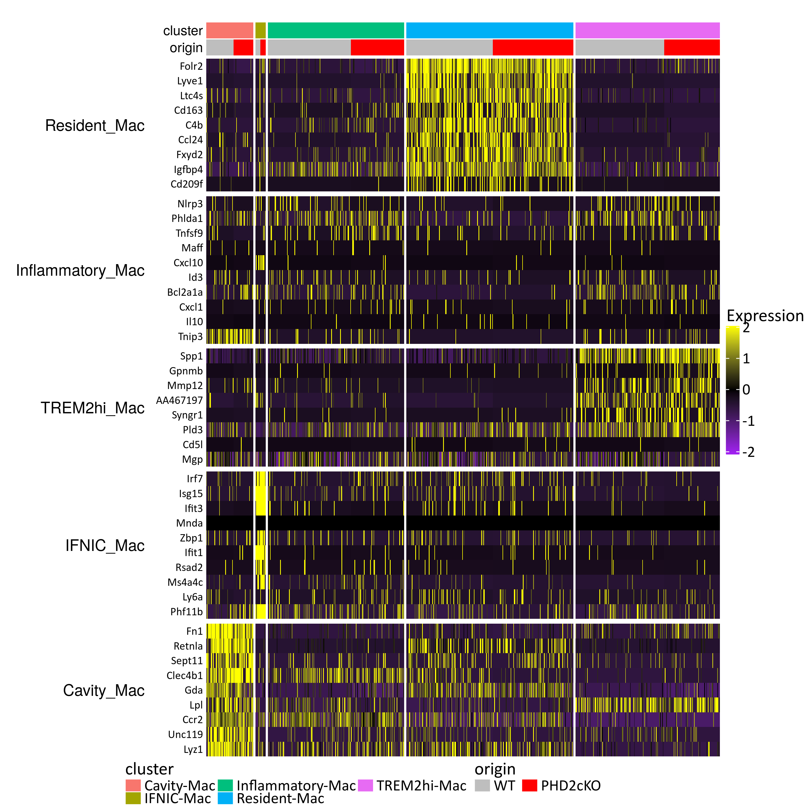
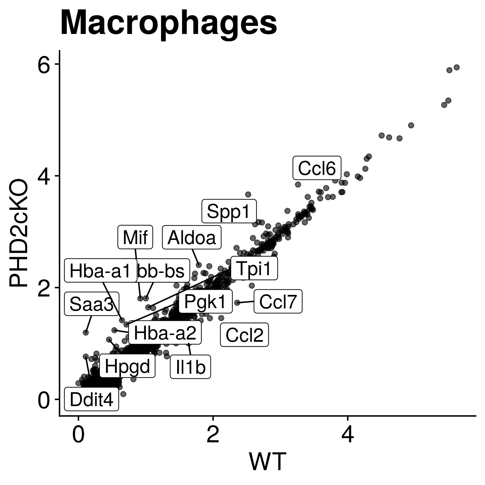
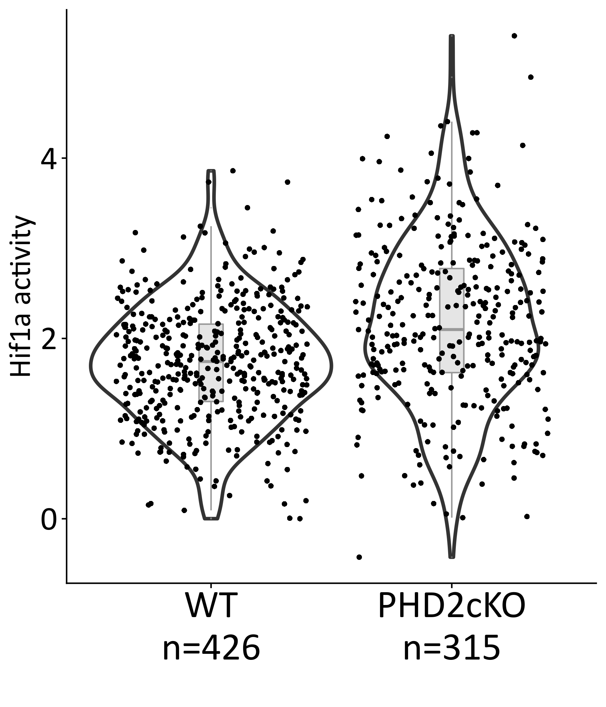
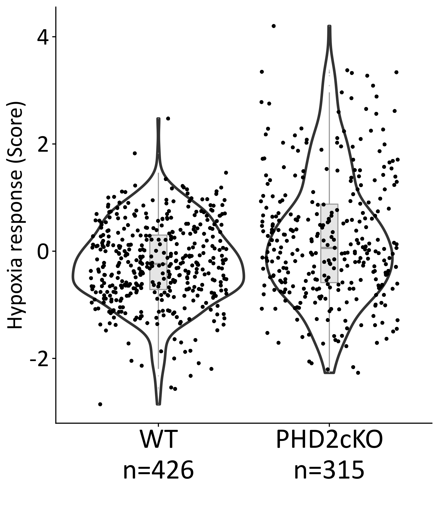
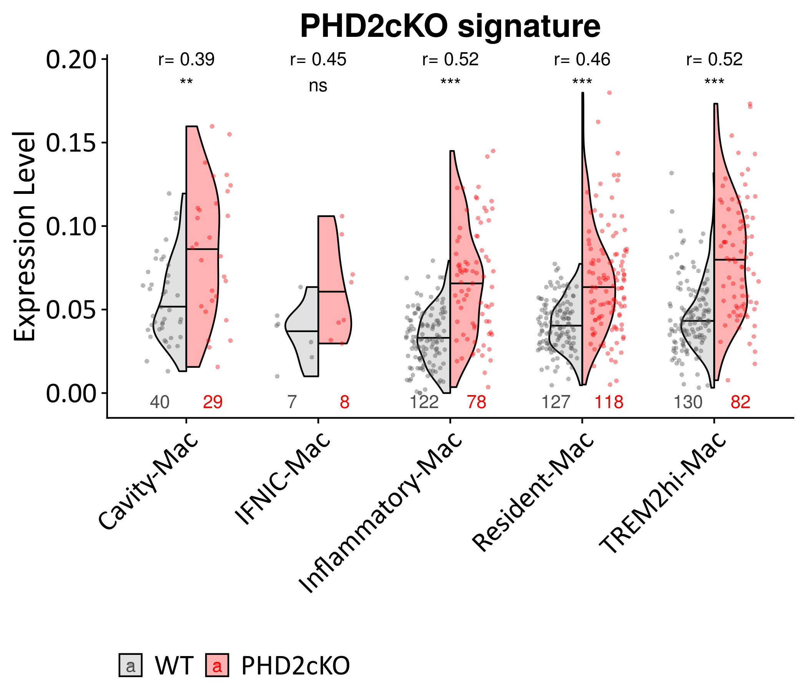
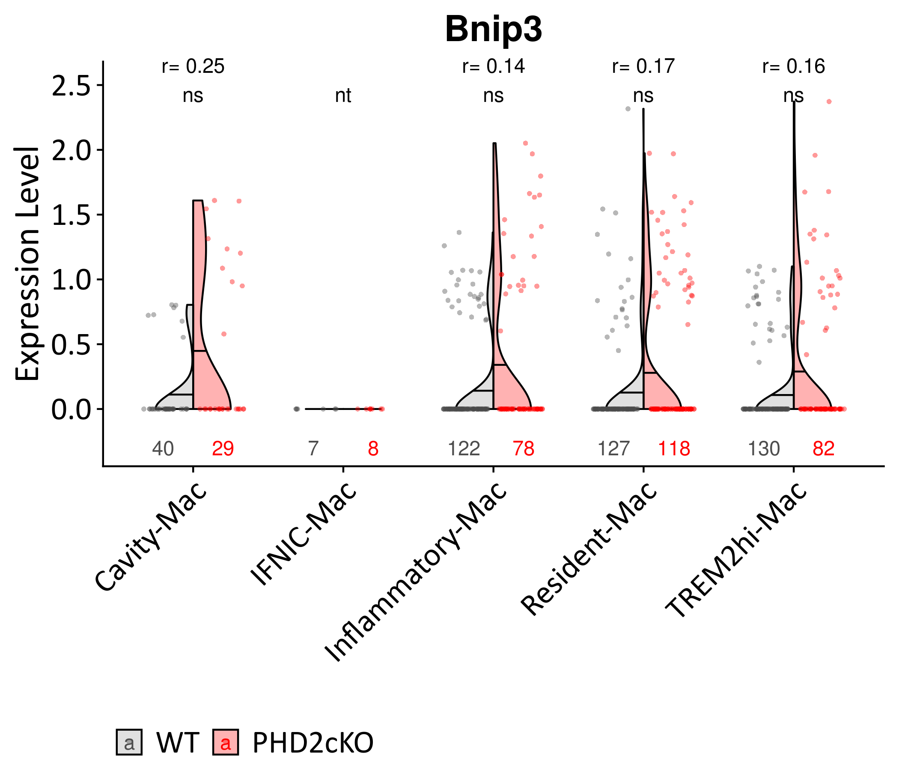
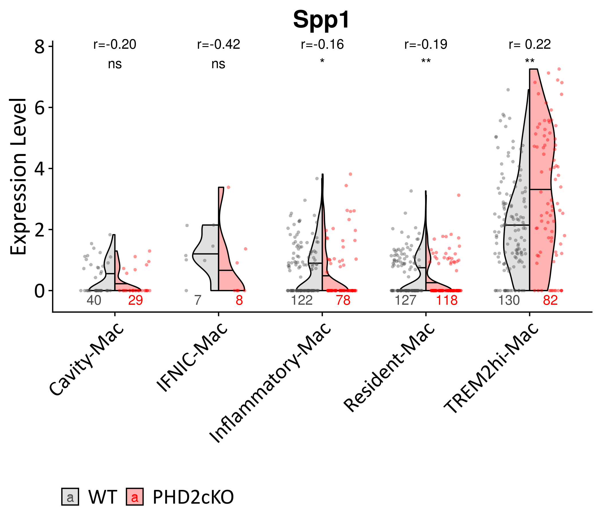
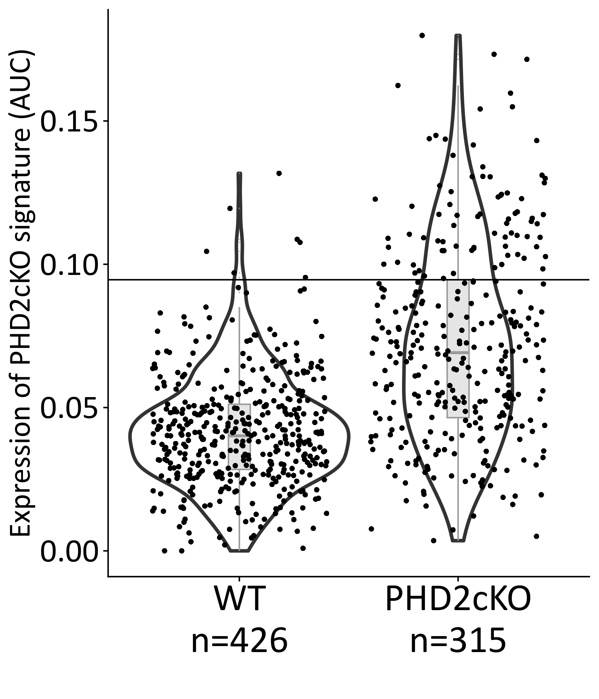
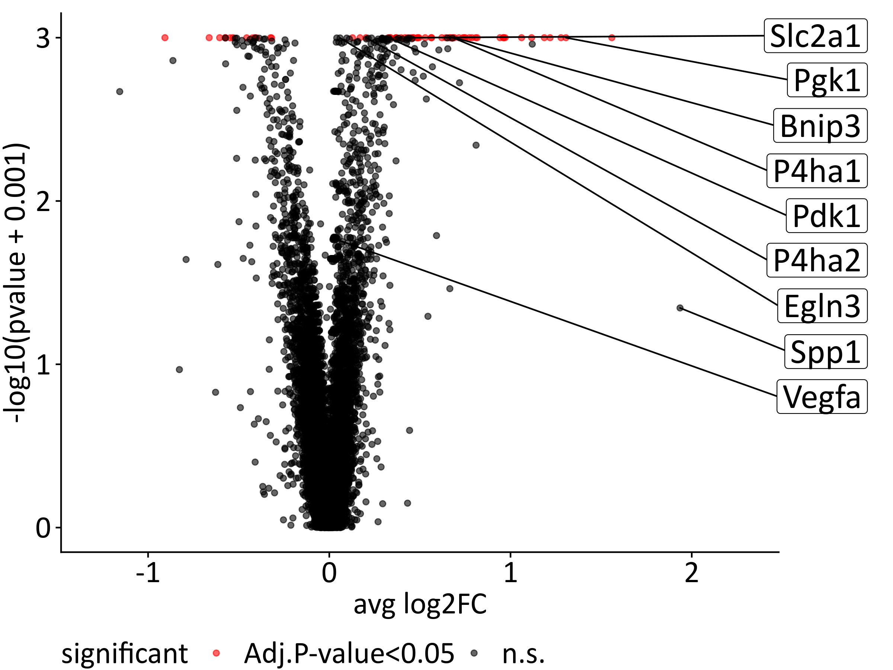
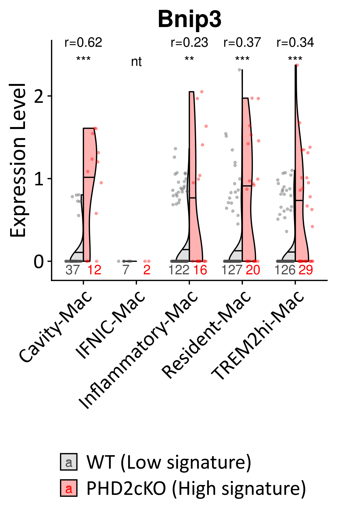

Role of PHD2 atherogenesis in in-vivo Macrophages
================
Javier Perales-Patón - <javier.perales@bioquant.uni-heidelberg.de> -
ORCID: 0000-0003-0780-6683

> We have extensive data that supports the impact of PHD2 inhibition on
> promoting an aggravated atherogenesis phenotype via Macrophage
> apoptosis and its downstream signaling with Bnip3-Spp1 expression.
> Previously we have shown that PHD2-KO is well recovered in most of the
> in-vivo myeloid leukocytes from the PHD2cKO condition. Bnip3, which is
> associated with the phenotype and macrophage apoptosis, seems to be
> up-regulated in said comparison in-vivo. Spp1, the prediced ligand
> released by Macrophages to modulate fibrotic fibroblasts based on the
> in-vitro data, seems to be mainly released by Trem2-foamy Macrophages.
> Thus, there is concordance between in-vitro and in-vivo data, but the
> (in-vivo) single-cell RNAseq data might provide higher resolution.
> Mainly pointing out Trem2-foamy macrophages as main players. Thus we
> investigate this line further here.

## Setup

We define a random seed number for reproducibility, file structure for
the output, and load essential libraries

### Environment

``` r
# Seed number
set.seed(1234)
# Output directory
OUTDIR <- "./04_macrophage_output/"
if(!dir.exists(OUTDIR)) dir.create(OUTDIR);

# Figures
FIGDIR <- paste0(OUTDIR, "/figures/")
knitr::opts_chunk$set(fig.path=FIGDIR)
knitr::opts_chunk$set(dev=c('png','tiff'))
# Data
DATADIR <- paste0(OUTDIR, "/data/")
if(!dir.exists(DATADIR)) dir.create(DATADIR);
```

### Load libraries

``` r
suppressPackageStartupMessages(require(Seurat))
suppressPackageStartupMessages(require(GSEABase))
suppressPackageStartupMessages(require(cowplot))
suppressPackageStartupMessages(require(genesorteR))
suppressPackageStartupMessages(require(fgsea))
suppressPackageStartupMessages(require(ggplot2))
suppressPackageStartupMessages(require(ggrepel))
suppressPackageStartupMessages(require(AUCell))
suppressPackageStartupMessages(require(viper))
suppressPackageStartupMessages(require(purrr))
suppressPackageStartupMessages(require(dplyr))
suppressPackageStartupMessages(require(openxlsx))
suppressPackageStartupMessages(require(ComplexHeatmap))
source("../src/graphics.R")
source("../src/seurat_fx.R")
source("../src/wilcox_fx.R")
```

## Load data

Read the Seurat Object from third step (Myeloid leukocyte map).

``` r
# Input data
sobj <- "./03_myeloidlineage_output/data/M.rds"
# Read 
if(file.exists(sobj)) {
    M <- readRDS(sobj)
} else {
    stop("ERROR: Seurat object does not exist. Run 03.rmd to generate it.")
}
```

We focus on Macrophages in this analysis. So we get the cellIds for this
population. We show the sample size of each macrophage class for the
records. It seems our data presents low representation of IFNIC
macrophage population. Thus we might have to drop it from 2-group
comparisons.

``` r
MacClasses <- grep("-Mac", levels(M), value=TRUE)
print(MacClasses)
```

    ## [1] "Cavity-Mac"       "IFNIC-Mac"        "Inflammatory-Mac"
    ## [4] "Resident-Mac"     "Trem2-foamy-Mac"

``` r
MacIDs <- WhichCells(M, ident = MacClasses)
# Total cells
length(MacIDs)
```

    ## [1] 741

``` r
# Sample size for each class
table("Class"=Idents(M[, MacIDs]))
```

    ## Class
    ##       Cavity-Mac        IFNIC-Mac Inflammatory-Mac     Resident-Mac 
    ##               69               15              200              245 
    ##  Trem2-foamy-Mac 
    ##              212

``` r
# We save the sample size
write.table(as.data.frame(table("Class"=Idents(M[, MacIDs]))),
        file=paste0(DATADIR,"/nCell_per_class.csv"),
        sep=",", row.names=FALSE, col.names=TRUE, quote=FALSE)
```

We confirm the identity of the Macrophages using the markers from
Zernecke 2020
again.

``` r
# Top10 markers for each Myeloid Leukocytes found in Meta-analysis review Zernecke et al. 2020
ML.markers <- getGmt("../data/markers/leukocytes_Zernecke2020.gmt")
ML.markers <- ML.markers[grep("_Mac", names(ML.markers))]

hp <- DoHeatmap3(SeuratObject=M[, MacIDs], GSC=ML.markers, assay="RNA", res="Idents", 
       row_names_size=10, column_title_size=0,
       show_hr=FALSE, legend_nrow=2, fontfamily=fontTXT) 
draw(hp, heatmap_legend_side="right", annotation_legend_side="bottom")
```

<!-- -->

## Comparison between PHD2 functional perturbation

> The in-vivo model carries a PHD2 knock-out in the myeloid lineage with
> an effectivity of ~30% (estimated) of the cells. We have shown that
> PHD2cKO condition presents higher penetrance of BMDM-derived PHD2cKO
> signature. The section will investigate if the penetrance of this gene
> perturbation is enough to be captured in the average population of the
> pooled PHD2cKO mice.

### Differential gene expression

We perform a standard differential expression with Bonferroni
correction.

The scatter plot between the average expression of the two populations
highlight Spp1 as one of the most differentially expressed genes in
PHD2cKO condition in Macrophages.

``` r
S1 <- M[, MacIDs] # Select macrophages to pool for a test diff expr

Idents(S1) <- "stim"
avg <- log1p(AverageExpression(S1, verbose = FALSE)$RNA)
  
rnk <- setNames(avg[,"PHD2cKO"] - avg[,"WT"], rownames(avg))
top <- names(sort(abs(rnk),decreasing = TRUE)[1:15])
  
ggplot(avg, aes(WT, PHD2cKO)) + geom_point(alpha=0.6) + ggtitle(label = "Macrophages") + 
    xlab("WT") + ylab("PHD2cKO")+
    geom_label_repel(data=avg[top,], aes(label=top), size=5) + 
    theme_cowplot() +
      theme(axis.title = element_text(size=22),
            title = element_text(size=22, hjust = 0.5),
            axis.text = element_text(size=18),
            axis.title.x = element_text(size=18),
            axis.title.y = element_text(size=18))
```

<!-- -->

``` r
dge <- FindMarkers(object = S1, ident.1 = "PHD2cKO", ident.2 = "WT", 
          logfc.threshold=0, min.pct=0)
cols_names <- colnames(dge)
# Add two extra cols
dge$cluster <- "Macrophage PHD2cKO vs PHD2wt"
dge$gene <- rownames(dge)

dge <- dge[,c("cluster", "gene", cols_names)]
   
write.table(dge,
            file = paste0(DATADIR,"/Macrophages_avg_PHD2cKO_vs_PHD2wt_DEGs.tsv"),
            sep="\t",col.names = TRUE, row.names = FALSE, quote=FALSE
)
```

We show the number of differentially expressed genes
(Bonferroni-adjusted pvalue \< 0.05):

``` r
table(sign(dge$avg_logFC) * as.integer(dge$p_val_adj < 0.05))
```

    ## 
    ##    -1     0     1 
    ##    65 13038    32

> We could conclude that there are not large differences in the average
> gene expression of macrophages based on condition (PHD2 KO).

Next efforts will be made to dissect the main transcriptional programme
of this perturbation (Hypoxia) and explore the Bnip3-Spp1 axis in the
different classes of macrophages.

## Dissection of hypoxia response and PHD2 functional impairment

> We know that PHD2 is an important regulator in hypoxia response. We
> perform a transcriptional dissection of hypoxia driven by the
> hypothesis that PHD2-KO perturbation triggers a strong hypoxia
> response. Thus it is expected that the PHD2-cKO condition presents an
> over-representation of cells responding to hypoxia.

### Dorothea focused on Hif1a

We calculate Hif1a transcription factor activities using dorothea. We
know that Hif1a is the canonical transcription factor for hypoxia
response, and PHD2 interacts with it to trigger such a response.

``` r
# load regulons
df2regulon <- function(df, regulator_name="tf") {
  regulon = df %>% split(.[regulator_name]) %>% map(function(dat) {
    targets = setNames(dat$mor, dat$target)
    likelihood = dat$likelihood
    list(tfmode = targets, likelihood = likelihood)
  })
  return(regulon)
}

regulon.df <- read.table("../data/Prior/dorothea_regulon_mouse_v1.csv", sep=",", 
             header=TRUE, stringsAsFactors = FALSE)
regul <- df2regulon(df=regulon.df)

# Calculate TF activities
TF <- viper(eset = as.matrix(M@assays$RNA@data), regulon = regul,
              nes = T, minsize = 4,
              eset.filter = F, adaptive.size = F,
          verbose=FALSE)
  
# Add them as metadata
stopifnot(colnames(M) == colnames(TF))
M$Hif1a_activity <- TF["Hif1a",]
rm(TF)

# Visualization focused on Macrophages population
VlnPlot.stim(M[, MacIDs], # Select Macrophages
     meta.feature = "Hif1a_activity", ylab="Hif1a activity", 
     fontTXT=fontTXT)
```

    ## Joining, by = "stim"

<!-- -->

### PROGENy focused on hypoxia response

We calculate a score of hypoxia response using progeny as well.

``` r
### Progeny ####
progeny.mat <- read.table("../data/Prior/progeny_matrix_mouse_v1.txt",sep=",",header=TRUE)
rownames(progeny.mat) <- progeny.mat$X
progeny.mat <- progeny.mat[which(colnames(progeny.mat)!="X")]
progeny.mat <- as.matrix(progeny.mat)

common <- intersect(rownames(M), rownames(progeny.mat))
  
prog <- t(as.matrix(M@assays$RNA@data[common,])) %*% progeny.mat[common,]
rn <- rownames(prog)
prog <- apply(prog,2,scale)
rownames(prog) <- rn
prog <- t(prog)
  
stopifnot(colnames(M) == colnames(prog))
M$Hypoxia_response <- prog["Hypoxia",]
rm(common,prog)

# Visualization focused on Macrophages population
 # VlnPlot(S[, Idents(M)=="Macrophage"],features = "Hypoxia_response", group.by = "stim")
VlnPlot.stim(M[, MacIDs], # Macrophages
     meta.feature = "Hypoxia_response", ylab="Hypoxia response (Score)", 
     fontTXT=fontTXT)
```

    ## Joining, by = "stim"

<!-- -->

### Enrichment of in-vitro PHD2-KO signature

In the previous step, [03\_myeloidlineage.md](03_myeloidlineage.md), we
have already calculated a single-cell score of the enrichment of
in-vitro PHD2-KO signature among myeloid leukocytes, including all
groups of macrophages.

> NOTE: Since we have already statistically tested this hypothesis among
> myeloid leukocytes, we use the statistics from previous analysis so we
> do not have to correct for multiple testing twice.

Here we show it again, but restricted to
Macrophages.

``` r
wPHD2cKO_stats <- read.table(file=paste0("./03_myeloidlineage_output/data",
                     "/PHD2cKO_wilcox_stats.csv"),
                 sep=",", header=TRUE, stringsAsFactors=FALSE)
rownames(wPHD2cKO_stats) <- wPHD2cKO_stats$X

RES <- wPHD2cKO_stats[, c("r", "significance")]
RES$r <- format(round(RES$r, 2), nsmall=2)
colnames(RES)[ncol(RES)] <- ""

stopifnot(all(levels(M)==rownames(RES)))
plotVln(SeuratObject = M[, grep("-Mac", Idents(M))], 
    gene=NULL,meta="PHD2cKO",
    stats=RES[grep("-Mac", rownames(RES)), ],
    vlnsplit = TRUE, fontTXT,  nCell.y=-0.005, pt.alpha=0.4) +
ggtitle("PHD2cKO signature")
```

<!-- -->

### Pair-wise comparison of these markers of hypoxia response

``` r
# Define colors for ggplot
cond.cols <- c("WT"="grey", "PHD2cKO"="red")

panel.cor <- function(x, y, digits=2, prefix="", cex.cor, family=fontTXT, ...)
{
  usr <- par("usr"); on.exit(par(usr))
  par(usr = c(0, 1, 0, 1))
  r <- abs(cor(x, y, method="pearson"))
  txt <- format(c(r, 0.123456789), digits=digits)[1]
  txt <- paste(prefix, txt, sep="")
  if(missing(cex.cor)) cex.cor <- 0.8/strwidth(txt)
  text(0.5, 0.5, txt, cex = cex.cor * r, family=family)
}

# Visualization
pairs(M@meta.data[MacIDs,
            c("Hif1a_activity","Hypoxia_response","PHD2cKO")],
      lower.panel=panel.smooth, upper.panel=panel.cor, cex.labels = 2.6, cex.axis=2.3, las=1,
      family=fontTXT,
      pch=21,
      bg=cond.cols[M@meta.data[MacIDs, "stim"]])
```

<!-- -->

> Conclusion: We could conclude that PHD2-cKO condition presents a
> skewed distribution of cells towards hypoxia response as compared to
> PHD2-wt condition. The PHD2cKO signature expression is highly
> correlated to Hif1a transcription factor and hypoxia response
> activities. Their activity and expression is higher in macrophages
> from PHD2cKO condition.

## PHD2KO-Bnip3-Spp1 axis

We already have shown that PHD2cKO signature is recovered in PHD2cKO
condition. What about the Bnip3 and Spp1 expression? These has been
already explored among other myeloid leukocytes, but it is shown here
focused on macrophages.

### Bnip3 expression across macrophages

> NOTE: Since we have already statistically tested this hypothesis among
> myeloid leukocytes, we use the statistics from previous analysis so we
> do not have to correct for multiple testing
twice.

``` r
wBnip3_stats <- read.table(file=paste0("./03_myeloidlineage_output/data",
                     "/Bnip3_wilcox_stats.csv"),
                 sep=",", header=TRUE, stringsAsFactors=FALSE)
rownames(wBnip3_stats) <- wBnip3_stats$X

RES <- wBnip3_stats[, c("r", "significance")]
RES$r <- format(round(RES$r, 2), nsmall=2)
colnames(RES)[ncol(RES)] <- ""

stopifnot(all(levels(M)==rownames(RES)))
vln_Bnip3 <- plotVln(SeuratObject = M[, grep("-Mac", Idents(M))], 
             gene="Bnip3",meta=NULL,
             stats=RES[grep("-Mac", rownames(RES)), ],
             vlnsplit = TRUE, fontTXT,  nCell.y=-0.3, pt.alpha=0.4) 
vln_Bnip3
```

<!-- -->

### Spp1 expression across macrophages

``` r
wSpp1_stats <- read.table(file=paste0("./03_myeloidlineage_output/data",
                     "/Spp1_wilcox_stats.csv"),
                 sep=",", header=TRUE, stringsAsFactors=FALSE)
rownames(wSpp1_stats) <- wSpp1_stats$X

RES <- wSpp1_stats[, c("r", "significance")]
RES$r <- format(round(RES$r, 2), nsmall=2)
colnames(RES)[ncol(RES)] <- ""

stopifnot(all(levels(M)==rownames(RES)))
vln_Spp1 <- plotVln(SeuratObject = M[, grep("-Mac", Idents(M))], 
            gene="Spp1",meta=NULL,
            stats=RES[grep("-Mac", rownames(RES)), ],
            vlnsplit = TRUE, fontTXT,  nCell.y=-0.3, pt.alpha=0.4) 
vln_Spp1
```

<!-- -->

> Conclusion: Bnip3 is hampered by drop-outs in single-cell profiling
> (zero-inflation), thus it makes difficult to compare groups. However,
> it seems that Bnip3 is up-regulated upon PHD2cKO. In contrast,
> PHD2cKO-induced up-regulation of Spp1 expression seems to be specific
> of Trem2-foamy macrophages.

Next we stratify macrophages to compare those undergoing complete
PHD2-KO.

### Stratification of cells by BMDM-derived PHD2cKO signature

We just observed that the penetrance of PHD2-KO is not complete in the
PHD2cKO condition. Thus we use the expression of the in-vitro signature
to compare those cells undergoing PHD2 versus WT. For this, we choose an
arbitrary threshold, the 3rd quartile of the signature expression in
PHD2cKO condition. We select these cells to be compared to WT
macrophages that are not responding to Hypoxia/PHD2cKO, by using the
threshold of being below the Q3 cutoff. We opt to discard WT \>Q3
signature expression to avoid downstream signaling of hypoxia response,
but actually just only few WT macrophages (n=7) are dropped with this
criteria, while 419 WT cells (low) are retrieved for the comparison. The
final comparison includes 79 PHD2cKO cells vs 419 WT
cells.

``` r
cutoff <- quantile(M@meta.data[colnames(M) %in% MacIDs & M$stim=="PHD2cKO", "PHD2cKO"], 
           probs=0.75) 

M$PHD2cKO_class <- NA

M$PHD2cKO_class[MacIDs] <- ifelse(M$PHD2cKO[MacIDs] > cutoff,
                           "High", "Low")
 
#NOTE: here it is where we concatenate condition + stratified class by PHD2cKO signature
# so later we could just compare the two groups of interest:
# - PHD2cKO macrophages above Q3 signature expression (high)
# - WT macrophages below Q3 signature expression (Low)
M$PHD2cKO_class2 <- paste0(M$stim,"_",M$PHD2cKO_class)

# Show cutoff used
print(cutoff)
```

    ##        75% 
    ## 0.09460183

``` r
# Save sample sizes
table(Strata=M$PHD2cKO_class2[MacIDs])
```

    ## Strata
    ## PHD2cKO_High  PHD2cKO_Low      WT_High       WT_Low 
    ##           79          236            7          419

``` r
# We save the sample size
write.table(as.data.frame(table("Strata"=Idents(M[, MacIDs]))),
        file=paste0(DATADIR,"/nCell_per_class.csv"),
        sep=",", row.names=FALSE, col.names=TRUE, quote=FALSE)
```

The cutoff of Q3 in PHD2cKO is 0.0946018.

For the records, we just show which cells has been selected below/above
that line.

``` r
# Visualization focused on Macrophages population
VlnPlot.stim(M[,MacIDs], 
     meta.feature = "PHD2cKO", ylab="Expression of PHD2cKO signature (AUC)", 
     fontTXT=fontTXT) + geom_hline(yintercept=cutoff)
```

    ## Joining, by = "stim"

<!-- -->

We retrieve only the macrophages involved in the group of interest from
now on. So the rest of the analysis is focused on this stratification of
cells

``` r
MacIDs <- MacIDs[which(M$PHD2cKO_class2[MacIDs] %in% c("PHD2cKO_High", "WT_Low"))]
```

Perform a genome-wide differential gene expression between the two
stratified groups.

``` r
S1 <- M[, MacIDs] 
Idents(S1) <- "PHD2cKO_class2"
dge <- FindMarkers(S1, ident.1 = "PHD2cKO_High", ident.2 = "WT_Low",
           min.pct = 0, logfc.threshold = 0)

saveRDS(dge, file="Mac_PHD2cKO_High_DGE.Rds")
```

We generate a volcano plot to visually inspect the transcriptome-wide
differences.

``` r
Mac_interesting_genes <- getGmt("../data/Prior/MC_PHD2_diff.gmt")
Mac_interesting_genes <- unlist(geneIds(Mac_interesting_genes))
if(any(!Mac_interesting_genes %in% rownames(S1))) {
    cat(paste("The following genes are not present in the gene expr matrix:","\n",
          paste(setdiff(Mac_interesting_genes, rownames(S1)), collapse=","),
          "\n"),
          file=stdout())
    Mac_interesting_genes <- intersect(Mac_interesting_genes, rownames(S1))
}
```

    ## The following genes are not present in the gene expr matrix: 
    ##  Epo

``` r
dge$significant <- ifelse(dge$p_val_adj < 0.05,"Adj.P-value<0.05","n.s.")
dge$genes <- rownames(dge)
dge$show <- dge$genes %in% Mac_interesting_genes
 
p = ggplot(dge, aes(avg_logFC, -log10(p_val+0.001))) +
    geom_point(aes(col=significant), alpha=0.6) +
    scale_color_manual(values=c("red", "black"))
  
  
p+geom_label_repel(data=dge[dge$show,],
                          aes(label=genes), family=fontTXT, size=8,
                          force=2,
              xlim = c(2.5,3.0),
                          nudge_y=0.05, direction = "y", segment.size = 0.5) + 
    coord_cartesian(xlim = c(-1.3, 2.3), clip = "off") +
    theme_cowplot() +
    xlab("avg log2FC") + ylab("-log10(pvalue + 0.001)") +
    theme(text = element_text(family=fontTXT, size=20),
      legend.text = element_text(family=fontTXT, size=20),
      axis.text = element_text(family=fontTXT, size=20),
          plot.margin = unit(c(0.3, 2.6, 0.1, 0.1), "cm"),
      legend.position = "bottom",
      legend.direction = "horizontal"
      )
```

<!-- -->

We observe two points here:

  - Bnip3 is significantly over-expressed in High PHD2cKO signature
    macrophages.
  - Spp1 follows similar trend, but it is not significant. It seems that
    there are some outliers over-expressing the gene, but not all
    macrophages. This makes sense since it seems Spp1 over-expression is
    specific of only one class of macrophages: trem2-foamy class.

## Re-visit Bnip3 and Spp1 expression in stratified macrophages

> We just distilled which macrophages are undergoing PHD2-KO in the
> PHD2cKO condition and which ones are WT sampled from WT condition. We
> compared their differential expression. Now we re-visit a potential
> differential expression of Bnip3 and Spp1 following the evidences from
> in-vitro experiments and data, but following a refined analysis with
> only these groups of macrophages (high and low PHD2cKO signature).

``` r
S1 <- M[, MacIDs]
S1$stim <- factor(c("WT_Low"="WT (Low signature)",
            "PHD2cKO_High"="PHD2cKO (High signature)")[S1$PHD2cKO_class2])
S1$stim <- relevel(S1$stim, ref=grep("WT", levels(S1$stim), value=TRUE))
cnt <- table(S1$stim, Idents(S1))>10
sel2 <- colnames(cnt)[colSums(cnt)==2]

DotPlot(S1[, WhichCells(S1, ident=sel2)], 
    features=c("Bnip3", "Spp1"), 
    split.by="stim", cols=c("blue","red"))
```

<!-- -->

### Bnip3 in high PHD2cKO Macrophages

``` r
S1 <- M[, MacIDs]
S1$stim <- factor(c("WT_Low"="WT (Low signature)",
            "PHD2cKO_High"="PHD2cKO (High signature)")[S1$PHD2cKO_class2])
S1$stim <- relevel(S1$stim, ref=grep("WT", levels(S1$stim), value=TRUE))

wBnip3_stats <- t(sapply(levels(S1), function(cell) {
                   cellIds <- WhichCells(S1, idents=cell)
                   # The test
                   wilcox.test_stats(xy=S1@assays$RNA@data["Bnip3", cellIds],
                             gr=S1$stim[cellIds])
               }))
```

    ## Warning in wilcox.test.default(x = c(AAGGCAGGTCGCGTGT_1 = 0,
    ## AAGGCAGGTTGCCTCT_1 = 0, : cannot compute exact p-value with ties

    ## [WARN] : Not enough sample size for wilcox test

``` r
wBnip3_stats <- as.data.frame(wBnip3_stats)
wBnip3_stats$adjpval <- p.adjust(wBnip3_stats$pvalue, method="fdr")
wBnip3_stats$significance <- tagSignif(wBnip3_stats$adjpval)
print(wBnip3_stats)
```

    ##                       W       pvalue     r      adjpval significance
    ## Cavity-Mac         69.5 1.490457e-05 0.620 2.980915e-05          ***
    ## IFNIC-Mac            NA           NA    NA           NA           nt
    ## Inflammatory-Mac  679.0 6.962116e-03 0.230 6.962116e-03           **
    ## Resident-Mac      705.0 5.912691e-06 0.374 2.365076e-05          ***
    ## Trem2-foamy-Mac  1139.0 2.935715e-05 0.336 3.914287e-05          ***

``` r
# Save it
write.table(wBnip3_stats, sep=",",
        file=paste0(DATADIR,"/PHD2sign_Bnip3_wilcox_stats.csv"),
        row.names=TRUE, col.names=NA)
```

``` r
RES <- wBnip3_stats[, c("r", "significance")]
RES$r <- format(round(RES$r, 2), nsmall=2)
colnames(RES)[ncol(RES)] <- ""

plotVln(SeuratObject = S1, gene="Bnip3", meta=NULL,
    stats=RES,
    vlnsplit = TRUE, fontTXT,  nCell.y=-0.1, pt.alpha=0.4) +
      guides(fill= guide_legend(nrow=2, byrow = TRUE)) 
```

<!-- -->

### Spp1 in high PHD2cKO Macrophages

``` r
S1 <- M[, MacIDs]
S1$stim <- factor(c("WT_Low"="WT (Low signature)",
            "PHD2cKO_High"="PHD2cKO (High signature)")[S1$PHD2cKO_class2])
S1$stim <- relevel(S1$stim, ref=grep("WT", levels(S1$stim), value=TRUE))

wSpp1_stats <- t(sapply(levels(S1), function(cell) {
                   cellIds <- WhichCells(S1, idents=cell)
                   # The test
                   wilcox.test_stats(xy=S1@assays$RNA@data["Spp1", cellIds],
                             gr=S1$stim[cellIds])
               }))
```

    ## Warning in wilcox.test.default(x = c(AAGGCAGGTCGCGTGT_1 = 0,
    ## AAGGCAGGTTGCCTCT_1 = 1.01972099159962, : cannot compute exact p-value with
    ## ties

    ## [WARN] : Not enough sample size for wilcox test

``` r
wSpp1_stats <- as.data.frame(wSpp1_stats)
wSpp1_stats$adjpval <- p.adjust(wSpp1_stats$pvalue, method="fdr")
wSpp1_stats$significance <- tagSignif(wSpp1_stats$adjpval)
print(wSpp1_stats)
```

    ##                     W       pvalue        r      adjpval significance
    ## Cavity-Mac        257 3.676865e-01 -0.13100 5.879284e-01           ns
    ## IFNIC-Mac          NA           NA       NA           NA           nt
    ## Inflammatory-Mac  961 9.183834e-01  0.00902 9.183834e-01           ns
    ## Resident-Mac     1393 4.409463e-01 -0.06380 5.879284e-01           ns
    ## Trem2-foamy-Mac   680 1.400139e-07  0.42300 5.600557e-07          ***

``` r
# Save it
write.table(wSpp1_stats, sep=",",
        file=paste0(DATADIR,"/PHD2sign_Spp1_wilcox_stats.csv"),
        row.names=TRUE, col.names=NA)
```

``` r
RES <- wSpp1_stats[, c("r", "significance")]
RES$r <- format(round(RES$r, 2), nsmall=2)
colnames(RES)[ncol(RES)] <- ""

plotVln(SeuratObject = S1, gene="Spp1", meta=NULL,
    stats=RES,
    vlnsplit = TRUE, fontTXT,  nCell.y=-0.2, pt.alpha=0.4) +
      guides(fill= guide_legend(nrow=2, byrow=TRUE)) 
```

<!-- -->

## Conclusion

> We have dissected PHD2cKO perturbation in all 5 classes of Macrophages
> previously described in atherosclerotic plaques (Zernecke et
> al. 2020). The PHD2cKO condition presents uncomplete but enriched
> penetrance of the perturbation, and we were able to recover which
> cells are undergoing the perturbation by using a BMDM-derived PHD2cKO
> signature from in-vitro experiments. Doing so, we were able to compare
> PHD2cKO and WT macrophages in the two conditions, and stratify them by
> those most responding to the perturbation. We confirmed that PHD2cKO
> leads to hypoxia response. We also observed that Bnip3 is up-regulated
> among all macrophage classes (except for IFNIC, for which we do not
> have enough observations). In opposite, Spp1 over-expression upon
> PHD2cKO is specific of Trem2-foamy macrophages, suggesting that these
> are the source of Spp1 in atherosclerotic plaques.

## SessionInfo

``` r
sessionInfo()
```

    ## R version 3.6.1 (2019-07-05)
    ## Platform: x86_64-pc-linux-gnu (64-bit)
    ## Running under: Ubuntu 18.04.3 LTS
    ## 
    ## Matrix products: default
    ## BLAS:   /usr/lib/x86_64-linux-gnu/blas/libblas.so.3.7.1
    ## LAPACK: /usr/lib/x86_64-linux-gnu/lapack/liblapack.so.3.7.1
    ## 
    ## locale:
    ##  [1] LC_CTYPE=en_US.UTF-8       LC_NUMERIC=C              
    ##  [3] LC_TIME=en_GB.UTF-8        LC_COLLATE=en_US.UTF-8    
    ##  [5] LC_MONETARY=en_GB.UTF-8    LC_MESSAGES=en_US.UTF-8   
    ##  [7] LC_PAPER=en_GB.UTF-8       LC_NAME=C                 
    ##  [9] LC_ADDRESS=C               LC_TELEPHONE=C            
    ## [11] LC_MEASUREMENT=en_GB.UTF-8 LC_IDENTIFICATION=C       
    ## 
    ## attached base packages:
    ##  [1] grid      stats4    parallel  stats     graphics  grDevices utils    
    ##  [8] datasets  methods   base     
    ## 
    ## other attached packages:
    ##  [1] ComplexHeatmap_2.0.0 extrafont_0.17       openxlsx_4.2.3      
    ##  [4] dplyr_0.8.3          purrr_0.3.2          viper_1.18.1        
    ##  [7] AUCell_1.6.1         ggrepel_0.8.1        ggplot2_3.2.1       
    ## [10] fgsea_1.10.1         Rcpp_1.0.2           genesorteR_0.3.1    
    ## [13] Matrix_1.2-17        cowplot_1.0.0        GSEABase_1.46.0     
    ## [16] graph_1.62.0         annotate_1.62.0      XML_3.98-1.20       
    ## [19] AnnotationDbi_1.46.1 IRanges_2.18.2       S4Vectors_0.22.1    
    ## [22] Biobase_2.44.0       BiocGenerics_0.30.0  Seurat_3.1.0        
    ## [25] rmarkdown_1.15       nvimcom_0.9-82      
    ## 
    ## loaded via a namespace (and not attached):
    ##   [1] reticulate_1.13             R.utils_2.9.0              
    ##   [3] tidyselect_0.2.5            RSQLite_2.1.2              
    ##   [5] htmlwidgets_1.3             BiocParallel_1.18.1        
    ##   [7] Rtsne_0.15                  munsell_0.5.0              
    ##   [9] codetools_0.2-16            ica_1.0-2                  
    ##  [11] future_1.14.0               withr_2.1.2                
    ##  [13] colorspace_1.4-1            knitr_1.24                 
    ##  [15] rstudioapi_0.10             ROCR_1.0-7                 
    ##  [17] DescTools_0.99.39           rcompanion_2.3.26          
    ##  [19] Rttf2pt1_1.3.8              gbRd_0.4-11                
    ##  [21] listenv_0.7.0               Rdpack_0.11-0              
    ##  [23] labeling_0.3                GenomeInfoDbData_1.2.1     
    ##  [25] bit64_0.9-7                 pheatmap_1.0.12            
    ##  [27] TH.data_1.0-10              vctrs_0.2.0                
    ##  [29] xfun_0.9                    R6_2.4.0                   
    ##  [31] GenomeInfoDb_1.20.0         clue_0.3-57                
    ##  [33] rsvd_1.0.2                  bitops_1.0-6               
    ##  [35] DelayedArray_0.10.0         assertthat_0.2.1           
    ##  [37] promises_1.0.1              SDMTools_1.1-221.1         
    ##  [39] scales_1.0.0                multcomp_1.4-12            
    ##  [41] rootSolve_1.8.2.1           gtable_0.3.0               
    ##  [43] npsurv_0.4-0                multcompView_0.1-8         
    ##  [45] globals_0.12.4              lmom_2.8                   
    ##  [47] sandwich_2.5-1              rlang_0.4.0                
    ##  [49] EMT_1.1                     zeallot_0.1.0              
    ##  [51] GlobalOptions_0.1.0         splines_3.6.1              
    ##  [53] extrafontdb_1.0             lazyeval_0.2.2             
    ##  [55] yaml_2.2.0                  reshape2_1.4.3             
    ##  [57] backports_1.1.4             httpuv_1.5.2               
    ##  [59] tools_3.6.1                 gplots_3.0.1.1             
    ##  [61] RColorBrewer_1.1-2          ggridges_0.5.1             
    ##  [63] plyr_1.8.4                  zlibbioc_1.30.0            
    ##  [65] RCurl_1.95-4.12             pbapply_1.4-2              
    ##  [67] GetoptLong_0.1.7            zoo_1.8-6                  
    ##  [69] SummarizedExperiment_1.14.1 cluster_2.1.0              
    ##  [71] magrittr_1.5                data.table_1.12.8          
    ##  [73] circlize_0.4.7              lmtest_0.9-37              
    ##  [75] RANN_2.6.1                  mvtnorm_1.0-11             
    ##  [77] fitdistrplus_1.0-14         matrixStats_0.55.0         
    ##  [79] lsei_1.2-0                  mime_0.7                   
    ##  [81] evaluate_0.14               xtable_1.8-4               
    ##  [83] mclust_5.4.5                gridExtra_2.3              
    ##  [85] shape_1.4.4                 compiler_3.6.1             
    ##  [87] tibble_2.1.3                KernSmooth_2.23-16         
    ##  [89] crayon_1.3.4                R.oo_1.22.0                
    ##  [91] htmltools_0.3.6             segmented_1.0-0            
    ##  [93] later_0.8.0                 libcoin_1.0-6              
    ##  [95] tidyr_1.0.0                 expm_0.999-4               
    ##  [97] Exact_2.1                   RcppParallel_4.4.3         
    ##  [99] DBI_1.0.0                   MASS_7.3-51.4              
    ## [101] boot_1.3-23                 R.methodsS3_1.7.1          
    ## [103] gdata_2.18.0                metap_1.1                  
    ## [105] igraph_1.2.4.1              GenomicRanges_1.36.0       
    ## [107] pkgconfig_2.0.3             coin_1.3-1                 
    ## [109] plotly_4.9.0                XVector_0.24.0             
    ## [111] bibtex_0.4.2                stringr_1.4.0              
    ## [113] digest_0.6.21               sctransform_0.2.0          
    ## [115] RcppAnnoy_0.0.13            tsne_0.1-3                 
    ## [117] leiden_0.3.1                fastmatch_1.1-0            
    ## [119] nortest_1.0-4               gld_2.6.2                  
    ## [121] uwot_0.1.4                  modeltools_0.2-23          
    ## [123] shiny_1.3.2                 gtools_3.8.1               
    ## [125] rjson_0.2.20                lifecycle_0.1.0            
    ## [127] nlme_3.1-141                jsonlite_1.6               
    ## [129] viridisLite_0.3.0           pillar_1.4.2               
    ## [131] lattice_0.20-38             httr_1.4.1                 
    ## [133] survival_2.44-1.1           glue_1.3.1                 
    ## [135] zip_2.1.1                   png_0.1-7                  
    ## [137] bit_1.1-14                  class_7.3-15               
    ## [139] stringi_1.4.3               mixtools_1.1.0             
    ## [141] blob_1.2.0                  caTools_1.17.1.2           
    ## [143] memoise_1.1.0               irlba_2.3.3                
    ## [145] e1071_1.7-2                 future.apply_1.3.0         
    ## [147] ape_5.3

``` r
{                                                                                                                                                                                                           
sink(file=paste0(OUTDIR,"/sessionInfo.txt"))
print(sessionInfo())
sink()
}
```
