Integrated analysis with Seurat of atherosclerotic plaques in the
context of Myeloid PHD2 deficiency
================
Javier Perales-Patón - <javier.perales@bioquant.uni-heidelberg.de> -
ORCID: 0000-0003-0780-6683

Single-cell transcriptomics profiling of atherosclerotic plaques from a
pooled sample of Myeloid-lineage PHD2cKO and WT mice were done. Herein
we carry out a standard workflow using Seurat package, which is used to
integrate both samples and identify cell types in the bulk sample.
Finally, several comparisons with several collections of markers in the
biological context are performed to test whether the unsupervised
clustering recapitulates the expected cell populations in the
atherosclerotic plaques.

Most of parameters of the analysis used here are based on default
settings of Seurat. However we have choosen a certain number or
principal components based on exploratory analysis on the outcome of
those. We opt to keep low resolution in the unsupervised clustering to
identify the supercluster of macrophages, later it will be dissected in
a second round of unsupervised clustering.

## Setup

We define a random seed number for reproducibility, file structure for
the output, and what is more important: the parameters of the standard
analysis with Seurat.

### Environment

``` r
# Seed number
set.seed(1234)
# Output directory
OUTDIR <- "./01_integration_output/"
if(!dir.exists(OUTDIR)) dir.create(OUTDIR);

# Figures
FIGDIR <- paste0(OUTDIR, "/figures/")
knitr::opts_chunk$set(fig.path=FIGDIR)
knitr::opts_chunk$set(dev=c('png','tiff'))
# Data
DATADIR <- paste0(OUTDIR, "/data/")
if(!dir.exists(DATADIR)) dir.create(DATADIR);
```

## Load libraries

``` r
suppressPackageStartupMessages(require(Seurat))
suppressPackageStartupMessages(require(GSEABase))
suppressPackageStartupMessages(require(dplyr))
suppressPackageStartupMessages(require(clustree))
suppressPackageStartupMessages(require(cowplot))
suppressPackageStartupMessages(require(genesorteR))
suppressPackageStartupMessages(require(optparse))
# Get some functions for Seurat analysis
source("../src/seurat_fx.R")
source("../src/graphics.R")
```

### Input parameters

``` r
# Define input parameters
option_list = list(
  make_option(c("--CASE_INPUT"), action="store", 
          default="../data/sc/CK64/filtered_feature_bc_matrix/", type='character',
              help="cellranger count folder that contains the output matrices"),
  make_option(c("--CASE_SNAME"), action="store", default="PHD2cKO", type='character',
              help="Sample name"),
  make_option(c("--CONTROL_INPUT"), action="store", 
          default="../data/sc/CK62/filtered_feature_bc_matrix/", type='character',
              help="cellranger count folder that contains the output matrices"),
  make_option(c("--CONTROL_SNAME"), action="store", default="WT", type='character',
              help="Sample name"),
  make_option(c("--NPC"), action="store", default=50, type='numeric',
              help="number of principal components to calculate."),
  make_option(c("--NPC_ANCHOR"), action="store", default=20, type='numeric',
              help="number of principal components to consider for the anchoring."),
  make_option(c("--NPC_CLUSTERING"), action="store", default=25, type='numeric',
              help="Number of principal components to consider for the cell clustering."),
  make_option(c("--RES"), action="store", default=0.1, type='numeric',
              help="Resolution for cell clustering.")
)

# Parse the parameters
opt = parse_args(OptionParser(option_list=option_list))

# Cat the input parameters
cat("[INFO] Input parameters\n", file=stdout())
```

    ## [INFO] Input parameters

``` r
for(user_input in names(opt)) {
  if(user_input=="help") next;
  cat(paste0("[INFO] ",user_input," => ",opt[[user_input]],"\n"),file = stdout())
  assign(user_input,opt[[user_input]])
}
```

    ## [INFO] CASE_INPUT => ../data/sc/CK64/filtered_feature_bc_matrix/
    ## [INFO] CASE_SNAME => PHD2cKO
    ## [INFO] CONTROL_INPUT => ../data/sc/CK62/filtered_feature_bc_matrix/
    ## [INFO] CONTROL_SNAME => WT
    ## [INFO] NPC => 50
    ## [INFO] NPC_ANCHOR => 20
    ## [INFO] NPC_CLUSTERING => 25
    ## [INFO] RES => 0.1

## Load data

Read samples and estimate percentage of mitochondrial gene
expression

``` r
CASE <- getSeuratObject(path = CASE_INPUT, project_name = CASE_SNAME, mt.pattern = "^mt-", min.cells = 5, min.features = 500)
CASE$stim <- CASE_SNAME
CASE <- subset(CASE, subset = nFeature_RNA > 500 & nFeature_RNA < 4000 & percent.mt < 7.5)
CASE <- NormalizeData(CASE, verbose = FALSE)
CASE <- FindVariableFeatures(CASE, selection.method = "vst", nfeatures = 2000)
  
CTRL <- getSeuratObject(path = CONTROL_INPUT, project_name = CONTROL_SNAME, mt.pattern = "^mt-", min.cells = 5, min.features = 500)
CTRL$stim <- CONTROL_SNAME
CTRL <- subset(CTRL, subset = nFeature_RNA > 500 & nFeature_RNA < 4000 & percent.mt < 7.5)
CTRL <- NormalizeData(CTRL, verbose = FALSE)
CTRL <- FindVariableFeatures(CTRL, selection.method = "vst", nfeatures = 2000)
```

## Perform integration

The integration consists on Find anchors between the two samples and
perform CCA to integrate
both.

``` r
anchors <- FindIntegrationAnchors(object.list = list(CTRL, CASE), dims = 1:NPC_ANCHOR)
```

    ## Warning in CheckDuplicateCellNames(object.list = object.list): Some cell
    ## names are duplicated across objects provided. Renaming to enforce unique
    ## cell names.

    ## Computing 2000 integration features

    ## Scaling features for provided objects

    ## Finding all pairwise anchors

    ## Running CCA

    ## Merging objects

    ## Finding neighborhoods

    ## Finding anchors

    ##  Found 3216 anchors

    ## Filtering anchors

    ##  Retained 3158 anchors

    ## Extracting within-dataset neighbors

``` r
S <- IntegrateData(anchorset = anchors, dims = 1:20)
```

    ## Merging dataset 2 into 1

    ## Extracting anchors for merged samples

    ## Finding integration vectors

    ## Finding integration vector weights

    ## Integrating data

``` r
# Relevel wildtype as ref level
S$stim <- factor(S$stim, levels=c("WT","PHD2cKO"))

# Get some RAM space: we don't need this anymore
rm(CASE, CTRL)
```

We define the Integrated data for cell clustering and assignment

``` r
DefaultAssay(S) <- "integrated"
```

## Cell clustering and dimensionality reduction

First scale the data and get principal components

``` r
S <- ScaleData(S, verbose = FALSE)
S <- RunPCA(S, npcs = NPC, verbose = FALSE)
```

Show the elbowplot for the
PCs

``` r
ElbowPlot(S,ndims = NPC) + geom_vline(xintercept = NPC_CLUSTERING, col="red")
```

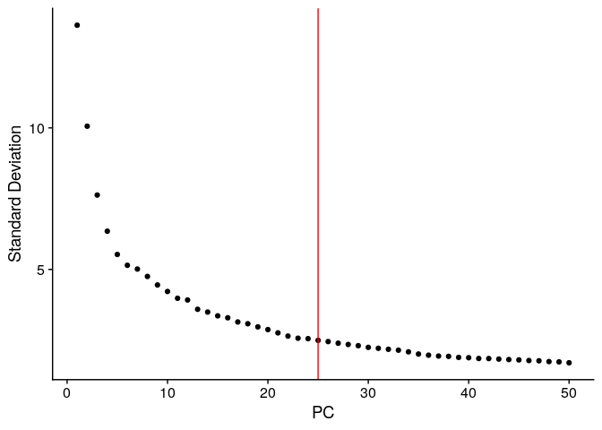<!-- -->

Perform SNN
    clustering

``` r
S <- FindNeighbors(S, reduction = "pca", dims = 1:NPC_CLUSTERING)
```

    ## Computing nearest neighbor graph

    ## Computing SNN

``` r
S <- FindClusters(S, resolution = seq(from=0.1, to=1.5, by=0.1))
```

    ## Modularity Optimizer version 1.3.0 by Ludo Waltman and Nees Jan van Eck
    ## 
    ## Number of nodes: 2770
    ## Number of edges: 84427
    ## 
    ## Running Louvain algorithm...
    ## Maximum modularity in 10 random starts: 0.9737
    ## Number of communities: 9
    ## Elapsed time: 0 seconds
    ## Modularity Optimizer version 1.3.0 by Ludo Waltman and Nees Jan van Eck
    ## 
    ## Number of nodes: 2770
    ## Number of edges: 84427
    ## 
    ## Running Louvain algorithm...
    ## Maximum modularity in 10 random starts: 0.9575
    ## Number of communities: 12
    ## Elapsed time: 0 seconds
    ## Modularity Optimizer version 1.3.0 by Ludo Waltman and Nees Jan van Eck
    ## 
    ## Number of nodes: 2770
    ## Number of edges: 84427
    ## 
    ## Running Louvain algorithm...
    ## Maximum modularity in 10 random starts: 0.9445
    ## Number of communities: 16
    ## Elapsed time: 0 seconds
    ## Modularity Optimizer version 1.3.0 by Ludo Waltman and Nees Jan van Eck
    ## 
    ## Number of nodes: 2770
    ## Number of edges: 84427
    ## 
    ## Running Louvain algorithm...
    ## Maximum modularity in 10 random starts: 0.9336
    ## Number of communities: 16
    ## Elapsed time: 0 seconds
    ## Modularity Optimizer version 1.3.0 by Ludo Waltman and Nees Jan van Eck
    ## 
    ## Number of nodes: 2770
    ## Number of edges: 84427
    ## 
    ## Running Louvain algorithm...
    ## Maximum modularity in 10 random starts: 0.9227
    ## Number of communities: 17
    ## Elapsed time: 0 seconds
    ## Modularity Optimizer version 1.3.0 by Ludo Waltman and Nees Jan van Eck
    ## 
    ## Number of nodes: 2770
    ## Number of edges: 84427
    ## 
    ## Running Louvain algorithm...
    ## Maximum modularity in 10 random starts: 0.9125
    ## Number of communities: 20
    ## Elapsed time: 0 seconds
    ## Modularity Optimizer version 1.3.0 by Ludo Waltman and Nees Jan van Eck
    ## 
    ## Number of nodes: 2770
    ## Number of edges: 84427
    ## 
    ## Running Louvain algorithm...
    ## Maximum modularity in 10 random starts: 0.9036
    ## Number of communities: 20
    ## Elapsed time: 0 seconds
    ## Modularity Optimizer version 1.3.0 by Ludo Waltman and Nees Jan van Eck
    ## 
    ## Number of nodes: 2770
    ## Number of edges: 84427
    ## 
    ## Running Louvain algorithm...
    ## Maximum modularity in 10 random starts: 0.8957
    ## Number of communities: 20
    ## Elapsed time: 0 seconds
    ## Modularity Optimizer version 1.3.0 by Ludo Waltman and Nees Jan van Eck
    ## 
    ## Number of nodes: 2770
    ## Number of edges: 84427
    ## 
    ## Running Louvain algorithm...
    ## Maximum modularity in 10 random starts: 0.8882
    ## Number of communities: 20
    ## Elapsed time: 0 seconds
    ## Modularity Optimizer version 1.3.0 by Ludo Waltman and Nees Jan van Eck
    ## 
    ## Number of nodes: 2770
    ## Number of edges: 84427
    ## 
    ## Running Louvain algorithm...
    ## Maximum modularity in 10 random starts: 0.8822
    ## Number of communities: 21
    ## Elapsed time: 0 seconds
    ## Modularity Optimizer version 1.3.0 by Ludo Waltman and Nees Jan van Eck
    ## 
    ## Number of nodes: 2770
    ## Number of edges: 84427
    ## 
    ## Running Louvain algorithm...
    ## Maximum modularity in 10 random starts: 0.8758
    ## Number of communities: 22
    ## Elapsed time: 0 seconds
    ## Modularity Optimizer version 1.3.0 by Ludo Waltman and Nees Jan van Eck
    ## 
    ## Number of nodes: 2770
    ## Number of edges: 84427
    ## 
    ## Running Louvain algorithm...
    ## Maximum modularity in 10 random starts: 0.8697
    ## Number of communities: 22
    ## Elapsed time: 0 seconds
    ## Modularity Optimizer version 1.3.0 by Ludo Waltman and Nees Jan van Eck
    ## 
    ## Number of nodes: 2770
    ## Number of edges: 84427
    ## 
    ## Running Louvain algorithm...
    ## Maximum modularity in 10 random starts: 0.8635
    ## Number of communities: 23
    ## Elapsed time: 0 seconds
    ## Modularity Optimizer version 1.3.0 by Ludo Waltman and Nees Jan van Eck
    ## 
    ## Number of nodes: 2770
    ## Number of edges: 84427
    ## 
    ## Running Louvain algorithm...
    ## Maximum modularity in 10 random starts: 0.8573
    ## Number of communities: 24
    ## Elapsed time: 0 seconds
    ## Modularity Optimizer version 1.3.0 by Ludo Waltman and Nees Jan van Eck
    ## 
    ## Number of nodes: 2770
    ## Number of edges: 84427
    ## 
    ## Running Louvain algorithm...
    ## Maximum modularity in 10 random starts: 0.8515
    ## Number of communities: 25
    ## Elapsed time: 0 seconds

``` r
clustree(S, prefix = "integrated_snn_res.")
```

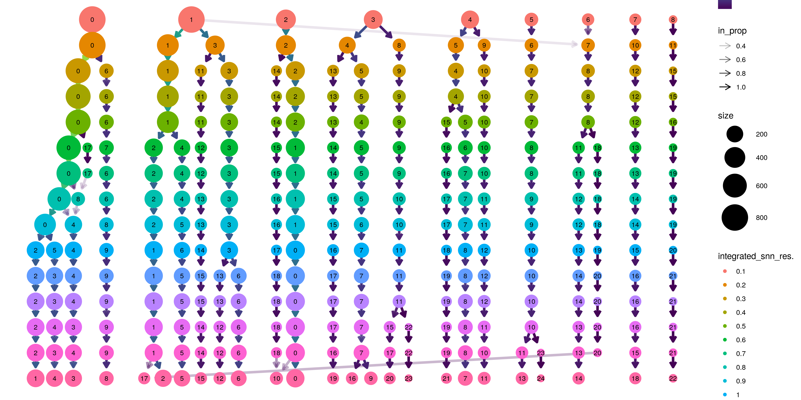<!-- -->

Decide the final resolution:
    0.1

``` r
S <- FindClusters(S, resolution = RES)
```

    ## Modularity Optimizer version 1.3.0 by Ludo Waltman and Nees Jan van Eck
    ## 
    ## Number of nodes: 2770
    ## Number of edges: 84427
    ## 
    ## Running Louvain algorithm...
    ## Maximum modularity in 10 random starts: 0.9737
    ## Number of communities: 9
    ## Elapsed time: 0 seconds

Finally, we use UMAP to get 2 reduced dimensions for visualization

``` r
S <- RunUMAP(S, reduction = "pca", dims = 1:NPC_CLUSTERING)
```

    ## 19:07:36 UMAP embedding parameters a = 0.9922 b = 1.112

    ## 19:07:36 Read 2770 rows and found 25 numeric columns

    ## 19:07:36 Using Annoy for neighbor search, n_neighbors = 30

    ## 19:07:36 Building Annoy index with metric = cosine, n_trees = 50

    ## 0%   10   20   30   40   50   60   70   80   90   100%

    ## [----|----|----|----|----|----|----|----|----|----|

    ## **************************************************|
    ## 19:07:37 Writing NN index file to temp file /tmp/RtmpWElyjd/file2b3b66010d5d
    ## 19:07:37 Searching Annoy index using 1 thread, search_k = 3000
    ## 19:07:37 Annoy recall = 100%
    ## 19:07:38 Commencing smooth kNN distance calibration using 1 thread
    ## 19:07:39 Initializing from normalized Laplacian + noise
    ## 19:07:39 Commencing optimization for 500 epochs, with 108134 positive edges
    ## 19:07:46 Optimization finished

``` r
DimPlot(S, reduction = "umap", group.by = "seurat_clusters", label = TRUE, label.size = 14)
```

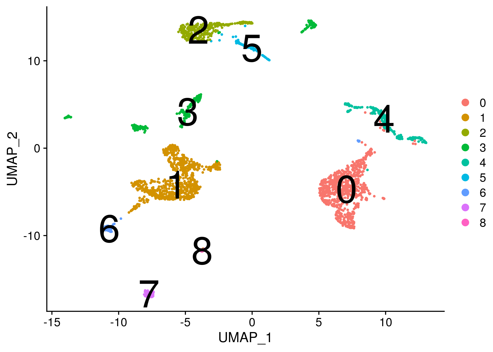<!-- -->

``` r
DimPlot(S, reduction = "umap", group.by = "stim",cols = c("grey","red"))
```

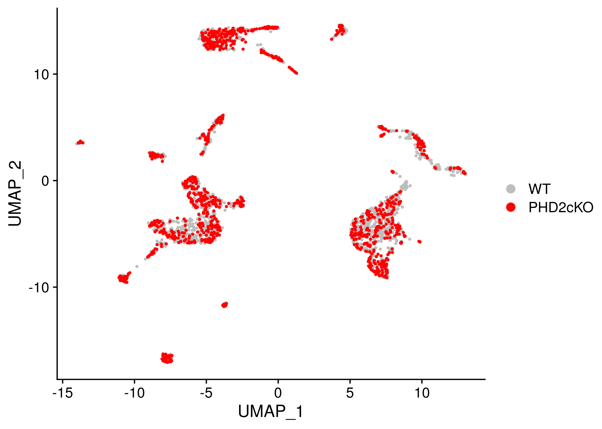<!-- -->

### Extract cluster markers

The assay is switched to RNA

``` r
DefaultAssay(S) <- "RNA"
# cl1.markers <- FindConservedMarkers(S, ident.1 = 1, grouping.var = "stim", verbose = FALSE)
# head(cl1.markers)
# S <- NormalizeData(S, verbose = FALSE) # I am not sure if I have to normalize again
S <- Seurat_scaledata(S)
```

    ## Centering and scaling data matrix

``` r
up <- setNames(vector("list",length=length(levels(S))), levels(S))
for(idx in names(up)) {
  up.idx <- FindConservedMarkers(S,ident.1 = idx,ident.2 = setdiff(levels(S), idx),
                 grouping.var = "stim",only.pos=T)
  cols_names <- colnames(up.idx)

  # Add two extra cols
  up.idx$cluster <- idx
  up.idx$gene <- rownames(up.idx)

  write.table(up.idx[,c("cluster", "gene", cols_names)],
              file = paste0(DATADIR,"/wilcox_cluster",idx,".tsv"),
              sep="\t",col.names = TRUE, row.names = FALSE, quote=FALSE
  )

  up[[idx]] <- up.idx
}
```

    ## Testing group PHD2cKO: (0) vs (1, 2, 3, 4, 5, 6, 7, 8)

    ## Testing group WT: (0) vs (1, 2, 3, 4, 5, 6, 7, 8)

    ## Testing group PHD2cKO: (1) vs (0, 2, 3, 4, 5, 6, 7, 8)

    ## Testing group WT: (1) vs (0, 2, 3, 4, 5, 6, 7, 8)

    ## Testing group PHD2cKO: (2) vs (0, 1, 3, 4, 5, 6, 7, 8)

    ## Testing group WT: (2) vs (0, 1, 3, 4, 5, 6, 7, 8)

    ## Testing group PHD2cKO: (3) vs (0, 1, 2, 4, 5, 6, 7, 8)

    ## Testing group WT: (3) vs (0, 1, 2, 4, 5, 6, 7, 8)

    ## Testing group PHD2cKO: (4) vs (0, 1, 2, 3, 5, 6, 7, 8)

    ## Testing group WT: (4) vs (0, 1, 2, 3, 5, 6, 7, 8)

    ## Testing group PHD2cKO: (5) vs (0, 1, 2, 3, 4, 6, 7, 8)

    ## Testing group WT: (5) vs (0, 1, 2, 3, 4, 6, 7, 8)

    ## Testing group PHD2cKO: (6) vs (0, 1, 2, 3, 4, 5, 7, 8)

    ## Testing group WT: (6) vs (0, 1, 2, 3, 4, 5, 7, 8)

    ## Testing group PHD2cKO: (7) vs (0, 1, 2, 3, 4, 5, 6, 8)

    ## Testing group WT: (7) vs (0, 1, 2, 3, 4, 5, 6, 8)

    ## Testing group PHD2cKO: (8) vs (0, 1, 2, 3, 4, 5, 6, 7)

    ## Testing group WT: (8) vs (0, 1, 2, 3, 4, 5, 6, 7)

``` r
sg <- sortGenes(S@assays$RNA@data, Idents(S))
```

    ## Warning in sortGenes(S@assays$RNA@data, Idents(S)): A Friendly Warning:
    ## Some genes were removed because they were zeros in all cells after
    ## binarization. You probably don't need to do anything but you might want to
    ## look into this. Maybe you forgot to pre-filter the genes? You can also use
    ## a different binarization method. Excluded genes are available in the output
    ## under '$removed'.

``` r
#define a small set of markers
mm = getMarkers(sg, quant = 0.975)

#cluster genes and make a heatmap
pp = plotMarkerHeat(sg$inputMat, sg$inputClass, mm$markers, clusterGenes=TRUE, outs = TRUE)
```

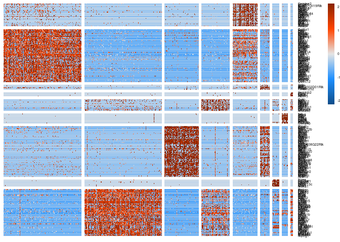<!-- -->

``` r
# #the top 25 genes for each cluster by specificity scores
# top_markers = apply(sg$specScore, 2, function(x) names(head(sort(x, decreasing = TRUE), n = 25)))
# write.table(top_markers, paste0(MARKERS.DATADIR,"/top25markers.tsv"),
#       sep="\t",row.names = FALSE,col.names = TRUE,quote=FALSE)
# 

# Save the tables of genesorteR stats
write.table(sg$condGeneProb, file=paste0(DATADIR,"/genesorter_condGeneProb.tsv"),sep="\t", row.names=TRUE, col.names = NA, quote=FALSE)
write.table(sg$specScore, file=paste0(DATADIR,"/genesorter_specScore.tsv"),sep="\t", row.names=TRUE, col.names = NA, quote=FALSE)
# Save the object
saveRDS(sg,file = paste0(DATADIR,"/sg.rds"))
```

## Align clustering with previous studies in atherosclerosis and cell type markers

### Internal

``` r
GSC_markers <- GeneSetCollection(sapply(colnames(sg$specScore),function(idx) GeneSet(names(head(sort(sg$specScore[,idx], decreasing = TRUE), n = 10)),
                                                                                     setName=idx, shortDescription="genesorteR")))

DoHeatmap3(SeuratObject = S, GSC = GSC_markers,
       fontfamily=fontTXT,
           assay = "RNA", res=NULL, show_hr = FALSE)
```

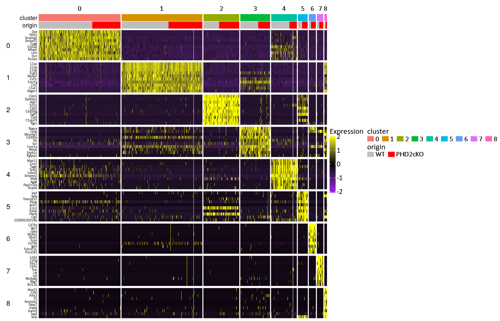<!-- -->

### External (literature)

``` r
DoHeatmap3(SeuratObject = S, GSC = getGmt("../data/markers/Wirka_etal2019.gmt"), 
       fontfamily=fontTXT,
       assay = "RNA", res=NULL, show_hr=FALSE)
```

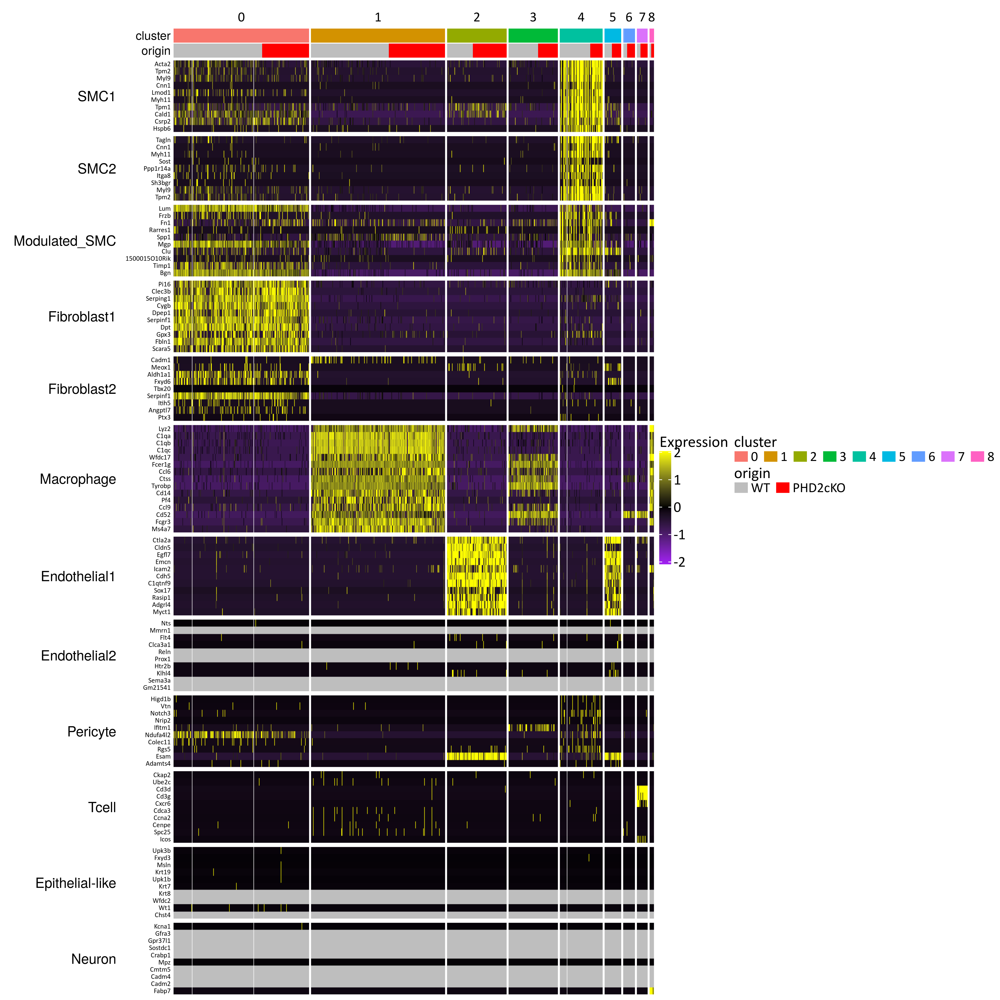<!-- -->

``` r
DoHeatmap3(SeuratObject = S, GSC = getGmt("../data/markers/markers.gmt"), 
       fontfamily=fontTXT,
       assay = "RNA", res=NULL, show_hr=FALSE)
```

<!-- -->

``` r
DoHeatmap3(SeuratObject = S, GSC = getGmt("../data/markers/Cochain_etal2019.gmt"), 
       fontfamily=fontTXT,
       assay = "RNA", res=NULL, show_hr=FALSE)
```

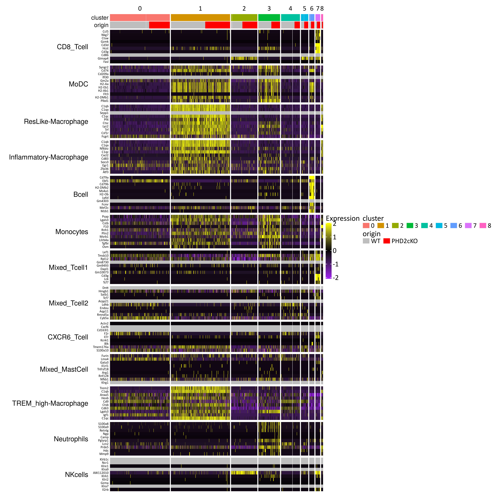<!-- -->

``` r
DoHeatmap3(SeuratObject = S, GSC = getGmt("../data/markers/Gu_etal2019.gmt"), 
       fontfamily=fontTXT,
       assay = "RNA", res=NULL, show_hr=FALSE)
```

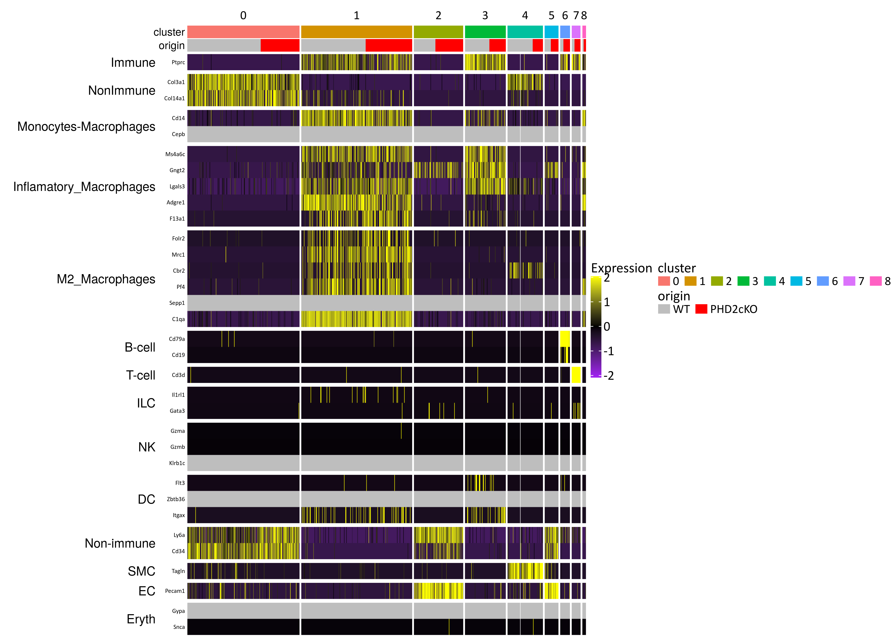<!-- -->

## Density of clusters per conditions

``` r
cl.cnt<-tapply(S$seurat_clusters,S@meta.data$stim,table)
# sapply(names(cl.cnt), function(idx) sum(S$stim==idx))
cl.prop <- cl.cnt

for(idx in names(cl.prop)) {
  cl.prop[[idx]] <- (cl.prop[[idx]]/sum(S$stim==idx)*100)
}

DATA <- data.frame(cluster=factor(levels(S), levels(S)),
                   S1=as.numeric(cl.prop[[1]]),
                   S2=as.numeric(cl.prop[[2]]))
```

``` r
# Source: https://stackoverflow.com/questions/18265941/two-horizontal-bar-charts-with-shared-axis-in-ggplot2-similar-to-population-pyr
library(grid)
g.mid<-ggplot(DATA,aes(x=1,y=cluster))+geom_text(aes(label=as.character(DATA$cluster)), size=14)+
  geom_segment(aes(x=0.94,xend=0.96,yend=cluster))+
  geom_segment(aes(x=1.04,xend=1.065,yend=cluster))+
  ggtitle("Cluster")+
  ylab(NULL)+
  scale_x_continuous(expand=c(0,0),limits=c(0.94,1.065))+
  theme(plot.title = element_text(size=14),
        panel.background = element_rect(fill="white"),
        axis.title=element_blank(),
        panel.grid=element_blank(),
        axis.text.y=element_blank(),
        axis.ticks.y=element_blank(),
        axis.text.x=element_text(color=NA, size=14),
        axis.ticks.x=element_line(color=NA),
        plot.margin = unit(c(1,-1,1,-1), "mm"))

g1 <- ggplot(data = DATA, aes(x = cluster, y = S1, fill=cluster)) +
  geom_bar(stat = "identity") + ggtitle(names(cl.cnt)[1]) +
  annotate("segment", x = 0.5, xend = nrow(DATA)+0.5, y = -0.5, yend = -0.5) +
  annotate("segment", y = 0, yend = 100, x = 0.5, xend = 0.5) +
  theme(plot.title = element_text(size=14, hjust = 0.5),
        panel.background = element_rect(fill="white"),
        legend.position = "none",
        axis.text.x = element_text(size=14),
        axis.title.x = element_blank(), 
        axis.title.y = element_blank(), 
        axis.text.y = element_blank(), 
        axis.ticks.y = element_blank(),
        axis.line.y = element_blank(),
        plot.margin = unit(c(1,-1,1,0), "mm")) +
  scale_y_reverse() + coord_flip(ylim=c(0,round(max(apply(DATA[,-1],2,max)),-1)))

g2 <- ggplot(data = DATA, aes(x = cluster, y = S2, fill=cluster)) +xlab(NULL)+
  geom_bar(stat = "identity") + ggtitle(names(cl.prop)[2]) +
  annotate("segment", x = 0.5, xend = nrow(DATA)+0.5, y = -0.5, yend = -0.5) +
  annotate("segment", y = 0, yend = 100, x = 0.5, xend = 0.5) +
  coord_cartesian(xlim = c(0, round(max(apply(DATA[,-1],2,max))))) +
  theme(plot.title = element_text(size=14, hjust = 0.5),
        panel.background = element_rect(fill="white"),
        legend.position = "none",
        axis.text.x = element_text(size=14),
        axis.title.x = element_blank(), axis.title.y = element_blank(), 
        axis.text.y = element_blank(), axis.ticks.y = element_blank(),
        plot.margin = unit(c(1,0,1,-1), "mm")) +
  coord_flip(ylim=c(0,round(max(apply(DATA[,-1],2,max)),-1)))
```

    ## Coordinate system already present. Adding new coordinate system, which will replace the existing one.

``` r
library(gridExtra)
gg1 <- ggplot_gtable(ggplot_build(g1))
gg2 <- ggplot_gtable(ggplot_build(g2))
gg.mid <- ggplot_gtable(ggplot_build(g.mid))

grid.arrange(gg1,gg.mid,gg2,ncol=3,widths=c(4/9,1/9,4/9),
             bottom = textGrob("Percentage of cells within-sample (%)",
                               gp=gpar(fontsize=16,font=2)))
```

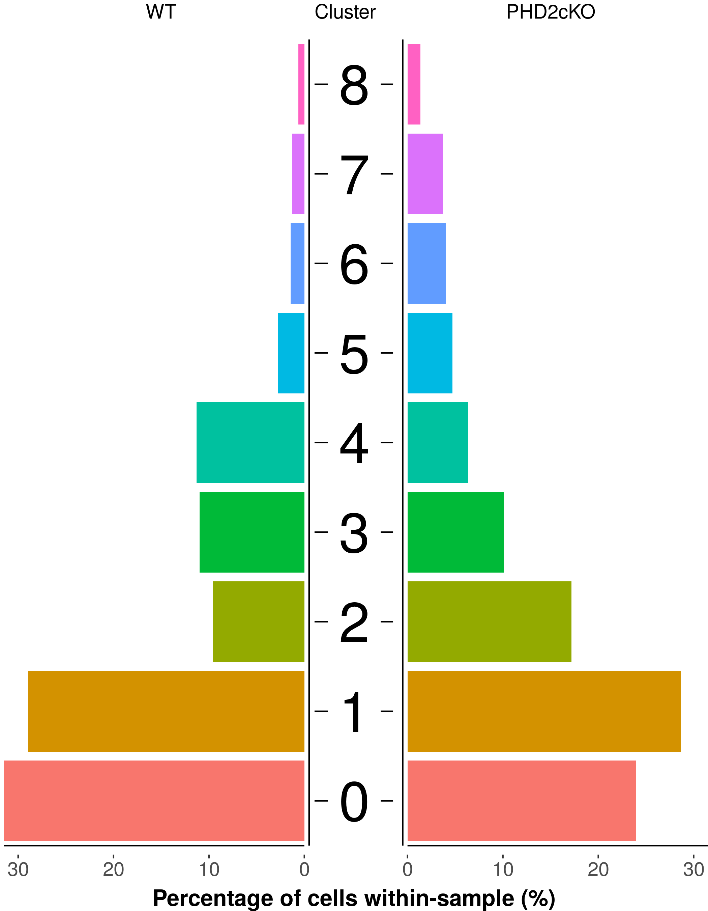<!-- -->

``` r
write.table(DATA,paste0(DATADIR,"/cluster_density.tsv"),sep="\t",col.names=TRUE, row.names=FALSE, quote=FALSE)
```

## Additional diagnostics

Whether clustering is driven by mt

``` r
# Add mitocondrial genes
S[["percent.mt"]] <- PercentageFeatureSet(S, pattern = "^mt-")
d1 <- FeaturePlot(S, reduction = "umap", features = "percent.mt")
d2 <- FeaturePlot(S, reduction = "umap", features = "nCount_RNA")
plot_grid(d1, d2)
```

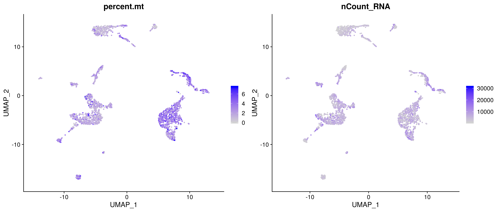<!-- -->

## Save the Seurat Object

``` r
saveRDS(S, paste0(DATADIR,"/S.rds"));
```

## SessionInfo

``` r
sessionInfo()
```

    ## R version 3.6.1 (2019-07-05)
    ## Platform: x86_64-pc-linux-gnu (64-bit)
    ## Running under: Ubuntu 18.04.3 LTS
    ## 
    ## Matrix products: default
    ## BLAS:   /usr/lib/x86_64-linux-gnu/blas/libblas.so.3.7.1
    ## LAPACK: /usr/lib/x86_64-linux-gnu/lapack/liblapack.so.3.7.1
    ## 
    ## locale:
    ##  [1] LC_CTYPE=en_US.UTF-8       LC_NUMERIC=C              
    ##  [3] LC_TIME=en_GB.UTF-8        LC_COLLATE=en_US.UTF-8    
    ##  [5] LC_MONETARY=en_GB.UTF-8    LC_MESSAGES=en_US.UTF-8   
    ##  [7] LC_PAPER=en_GB.UTF-8       LC_NAME=C                 
    ##  [9] LC_ADDRESS=C               LC_TELEPHONE=C            
    ## [11] LC_MEASUREMENT=en_GB.UTF-8 LC_IDENTIFICATION=C       
    ## 
    ## attached base packages:
    ##  [1] grid      stats4    parallel  stats     graphics  grDevices utils    
    ##  [8] datasets  methods   base     
    ## 
    ## other attached packages:
    ##  [1] extrafont_0.17       gridExtra_2.3        ComplexHeatmap_2.0.0
    ##  [4] optparse_1.6.2       genesorteR_0.3.1     Matrix_1.2-17       
    ##  [7] cowplot_1.0.0        clustree_0.4.1       ggraph_2.0.0.9000   
    ## [10] ggplot2_3.2.1        dplyr_0.8.3          GSEABase_1.46.0     
    ## [13] graph_1.62.0         annotate_1.62.0      XML_3.98-1.20       
    ## [16] AnnotationDbi_1.46.1 IRanges_2.18.2       S4Vectors_0.22.1    
    ## [19] Biobase_2.44.0       BiocGenerics_0.30.0  Seurat_3.1.0        
    ## [22] rmarkdown_1.15       nvimcom_0.9-82      
    ## 
    ## loaded via a namespace (and not attached):
    ##   [1] circlize_0.4.7      backports_1.1.4     plyr_1.8.4         
    ##   [4] igraph_1.2.4.1      lazyeval_0.2.2      splines_3.6.1      
    ##   [7] listenv_0.7.0       digest_0.6.21       htmltools_0.3.6    
    ##  [10] viridis_0.5.1       gdata_2.18.0        magrittr_1.5       
    ##  [13] checkmate_1.9.4     memoise_1.1.0       cluster_2.1.0      
    ##  [16] ROCR_1.0-7          globals_0.12.4      graphlayouts_0.5.0 
    ##  [19] RcppParallel_4.4.3  R.utils_2.9.0       extrafontdb_1.0    
    ##  [22] colorspace_1.4-1    blob_1.2.0          ggrepel_0.8.1      
    ##  [25] xfun_0.9            crayon_1.3.4        RCurl_1.95-4.12    
    ##  [28] jsonlite_1.6        zeallot_0.1.0       survival_2.44-1.1  
    ##  [31] zoo_1.8-6           ape_5.3             glue_1.3.1         
    ##  [34] polyclip_1.10-0     gtable_0.3.0        leiden_0.3.1       
    ##  [37] GetoptLong_0.1.7    Rttf2pt1_1.3.8      shape_1.4.4        
    ##  [40] future.apply_1.3.0  scales_1.0.0        pheatmap_1.0.12    
    ##  [43] DBI_1.0.0           bibtex_0.4.2        Rcpp_1.0.2         
    ##  [46] metap_1.1           viridisLite_0.3.0   xtable_1.8-4       
    ##  [49] clue_0.3-57         reticulate_1.13     bit_1.1-14         
    ##  [52] rsvd_1.0.2          mclust_5.4.5        SDMTools_1.1-221.1 
    ##  [55] tsne_0.1-3          htmlwidgets_1.3     httr_1.4.1         
    ##  [58] getopt_1.20.3       gplots_3.0.1.1      RColorBrewer_1.1-2 
    ##  [61] ica_1.0-2           pkgconfig_2.0.3     R.methodsS3_1.7.1  
    ##  [64] farver_1.1.0        uwot_0.1.4          tidyselect_0.2.5   
    ##  [67] labeling_0.3        rlang_0.4.0         reshape2_1.4.3     
    ##  [70] munsell_0.5.0       tools_3.6.1         RSQLite_2.1.2      
    ##  [73] ggridges_0.5.1      evaluate_0.14       stringr_1.4.0      
    ##  [76] yaml_2.2.0          npsurv_0.4-0        knitr_1.24         
    ##  [79] bit64_0.9-7         fitdistrplus_1.0-14 tidygraph_1.1.2    
    ##  [82] caTools_1.17.1.2    purrr_0.3.2         RANN_2.6.1         
    ##  [85] pbapply_1.4-2       future_1.14.0       nlme_3.1-141       
    ##  [88] R.oo_1.22.0         compiler_3.6.1      plotly_4.9.0       
    ##  [91] png_0.1-7           lsei_1.2-0          tibble_2.1.3       
    ##  [94] tweenr_1.0.1        stringi_1.4.3       RSpectra_0.15-0    
    ##  [97] lattice_0.20-38     vctrs_0.2.0         pillar_1.4.2       
    ## [100] lifecycle_0.1.0     Rdpack_0.11-0       lmtest_0.9-37      
    ## [103] GlobalOptions_0.1.0 RcppAnnoy_0.0.13    data.table_1.12.8  
    ## [106] bitops_1.0-6        irlba_2.3.3         gbRd_0.4-11        
    ## [109] R6_2.4.0            KernSmooth_2.23-16  codetools_0.2-16   
    ## [112] MASS_7.3-51.4       gtools_3.8.1        assertthat_0.2.1   
    ## [115] rjson_0.2.20        withr_2.1.2         sctransform_0.2.0  
    ## [118] tidyr_1.0.0         Rtsne_0.15          ggforce_0.3.1

``` r
{                                                                                                                                                                                                           
sink(file=paste0(OUTDIR,"/sessionInfo.txt"))
print(sessionInfo())
sink()
}
```
